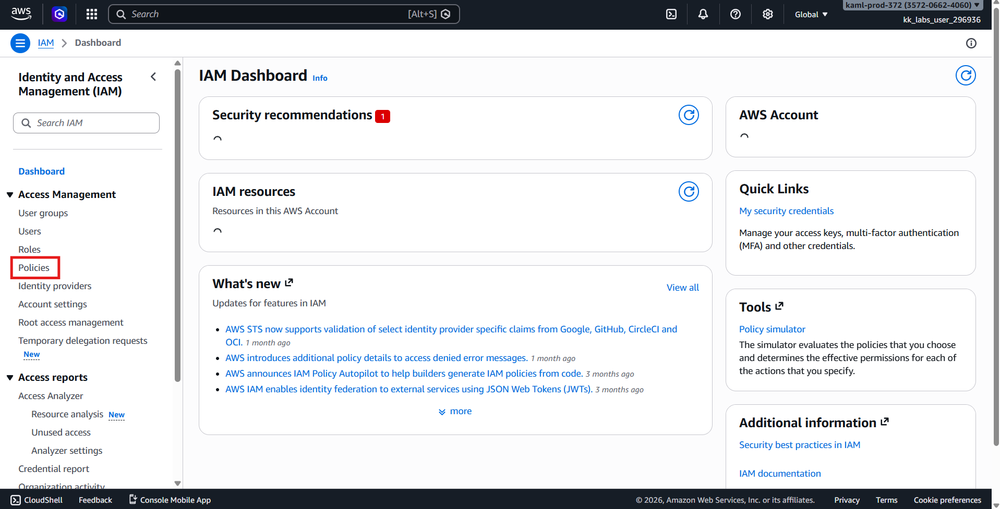
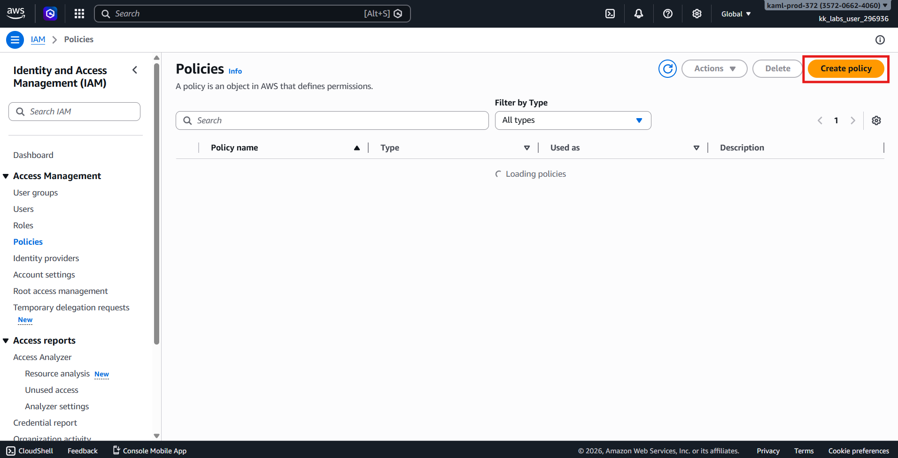
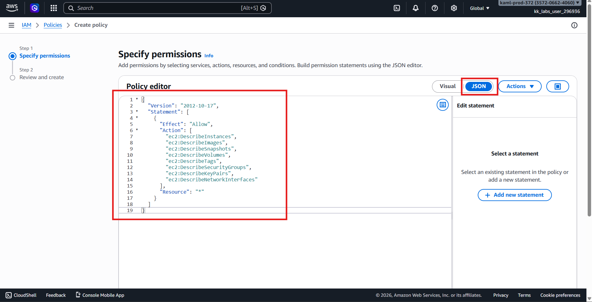
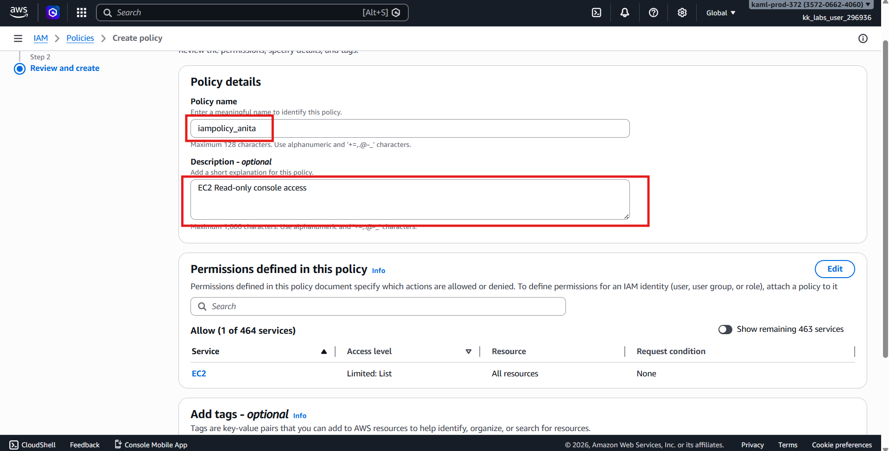
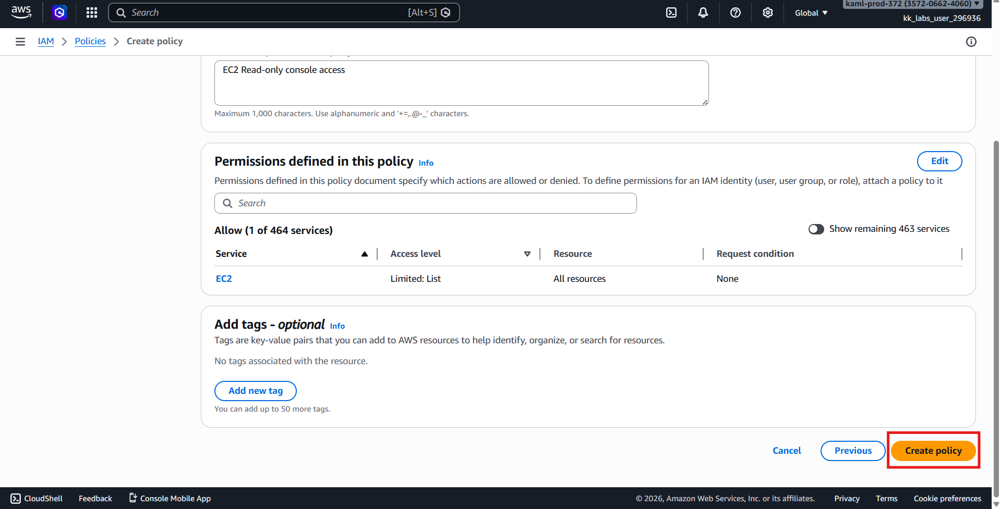
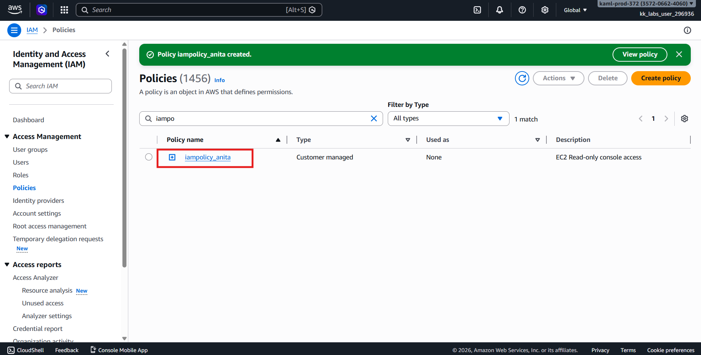
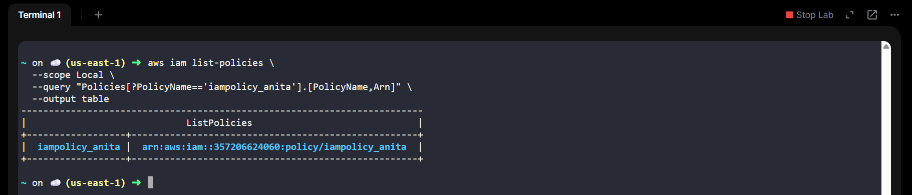

# 🚀 AWS Task: Create IAM Policy (EC2 Read-Only Access via Console)

## 🧩 Scenario

While setting up AWS infrastructure, the **Nautilus DevOps Team** is configuring Identity and Access Management (IAM) resources.  
They require a custom IAM policy that allows users to **view EC2 resources** without granting modification permissions.

This policy will provide **read-only access** to:

- EC2 Instances
- AMIs (Images)
- Snapshots

---

# 🎯 Objective

Create an IAM policy with the following configuration:

| Setting | Value |
|--------|------|
| Policy Name | `iampolicy_anita` |
| Access Level | Read-only |
| Service | Amazon EC2 |
| Permissions | View instances, AMIs, snapshots |
| Region | `us-east-1` *(IAM is global)* |

---

# 🧭 Step 1 — Login to AWS Console

1. Open the provided **Console URL**.
2. Login using the supplied credentials.
3. Confirm region:
```text
us-east-1 (N. Virginia)
```

> ✅ IAM policies are global but labs require operating in the specified region.

---

# 🔐 Step 2 — Open IAM Service

1. In the AWS search bar, type:
```text
IAM
```

2. Open **IAM** service.

---

# 📜 Step 3 — Navigate to Policies

1. From the left panel, click:
```text
Policies
```



2. Click:
```text
Create policy
```



---

# ⚙️ Step 4 — Choose Policy Creation Method

Select:
```text
JSON
```

Replace the existing content with the following policy.

---

## 🧾 Policy JSON (EC2 Read-Only Access)

```json
{
  "Version": "2012-10-17",
  "Statement": [
    {
      "Effect": "Allow",
      "Action": [
        "ec2:DescribeInstances",
        "ec2:DescribeImages",
        "ec2:DescribeSnapshots",
        "ec2:DescribeVolumes",
        "ec2:DescribeTags",
        "ec2:DescribeSecurityGroups",
        "ec2:DescribeKeyPairs",
        "ec2:DescribeNetworkInterfaces"
      ],
      "Resource": "*"
    }
  ]
}
```
> 👉 These permissions allow users to view EC2 resources in the console without making changes.



Click:
```text
Next
```

---

# 🏷️ Step 5 — Name the Policy

Enter:
| Field       | Value                        |
| ----------- | ---------------------------- |
| Policy name | `iampolicy_anita`            |
| Description | EC2 Read-only console access |

Click:
```text
Create policy
```




---

# ✅ Step 6 — Verify Policy Creation

1. You will return to the Policies list.
2. Search for:
```text
iampolicy_anita
```



3. Confirm the policy exists.

4. or check via CLI if iampolicy_anita exists:
```bash
aws iam list-policies \
  --scope Local \
  --query "Policies[?PolicyName=='iampolicy_anita'].[PolicyName,Arn]" \
  --output table
```



---

# ✔️ Validation Checklist
- Logged into AWS Console
- Opened IAM → Policies
- Created custom JSON policy
- Policy name is iampolicy_anita
- Allows EC2 read-only access
- Policy visible in IAM Policies list

---

# 🏁 Result

The IAM policy iampolicy_anita has been successfully created and now allows read-only access to EC2 resources including instances, AMIs, and snapshots.
