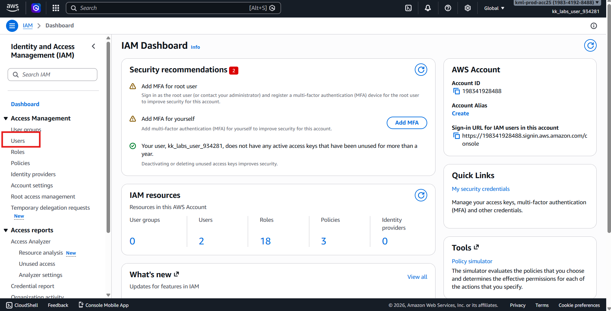
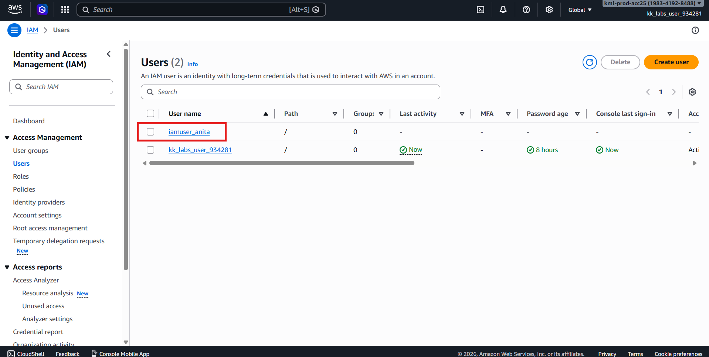
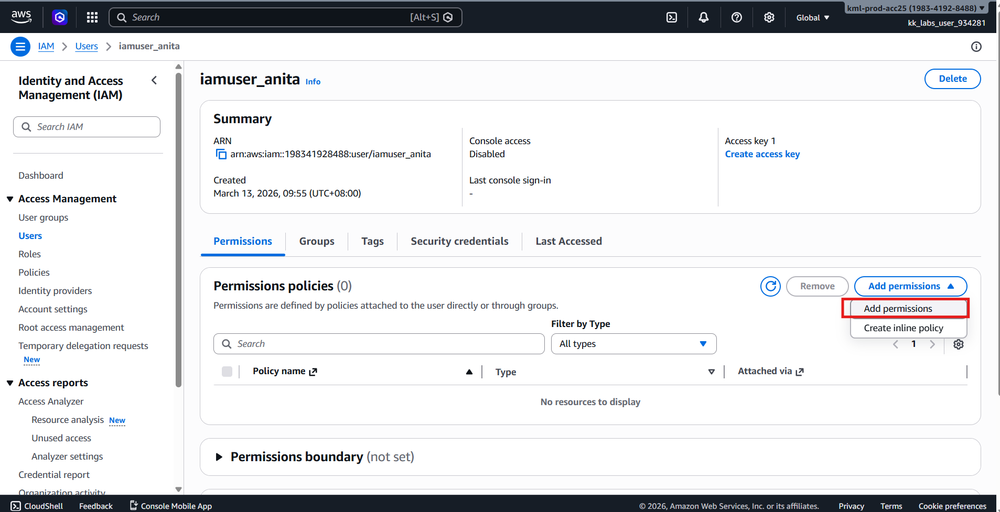
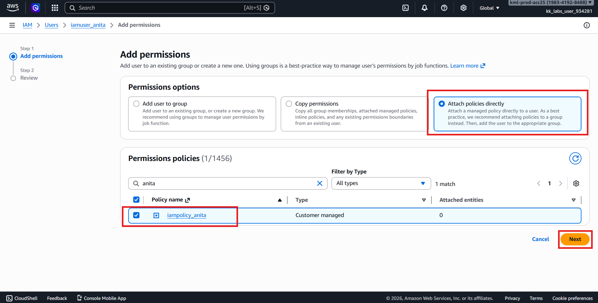
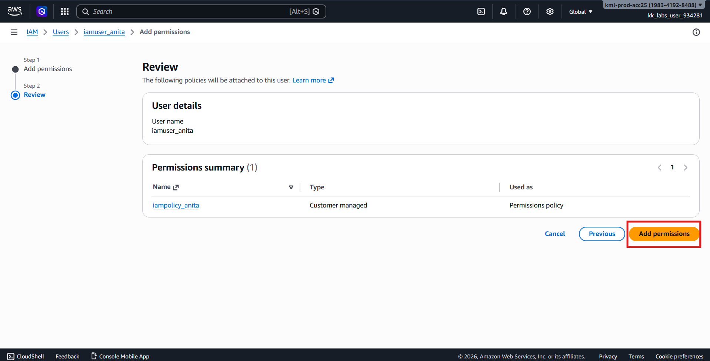
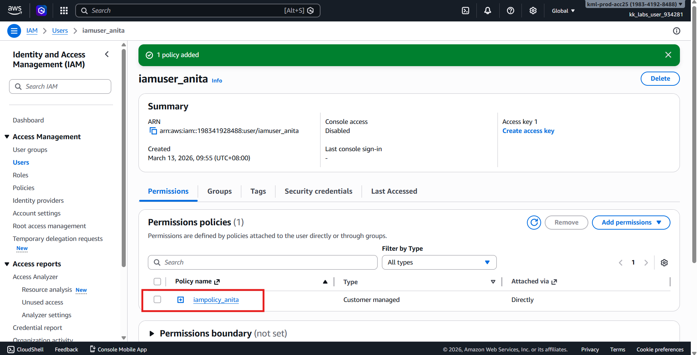
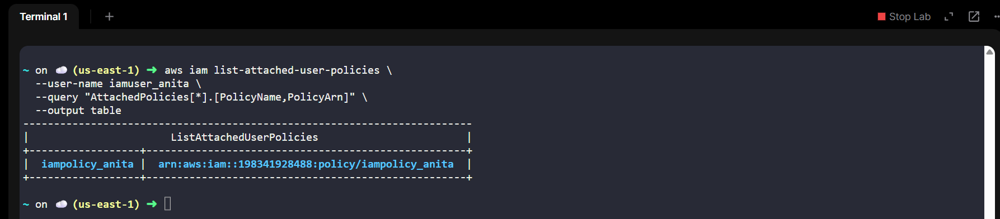

# 🚀 AWS Task: Attach IAM Policy to IAM User (Console Method)

## 🧩 Scenario

The **Nautilus DevOps Team** has already created:

- ✅ IAM User: `iamuser_anita`
- ✅ IAM Policy: `iampolicy_anita`

Your task is to **attach the existing policy** to the existing IAM user using the **AWS Management Console**.

---

# 🎯 Objective

Attach the IAM policy to the IAM user with the following configuration:

| Resource Type | Name |
|---------------|------|
| IAM User | `iamuser_anita` |
| IAM Policy | `iampolicy_anita` |
| Region | `us-east-1` *(IAM is global)* |

---

# 🧭 Step 1 — Login to AWS Console

1. Open the provided **Console URL**.
2. Login using the given credentials.
3. Confirm region:
```text
us-east-1 (N. Virginia)
```

> ✅ IAM resources are global, but follow lab region requirement.

---

# 🔐 Step 2 — Open IAM Service

1. In AWS search bar, type:
```text
IAM
```

2. Select **IAM** service.

---

# 👤 Step 3 — Open Users Section

1. From the left navigation panel, click:
```text
Users
```



2. Locate and click:
```text
iamuser_anita
```



---

# 📎 Step 4 — Attach Policy

1. Go to the **Permissions** tab.
2. Click:
```text
Add permissions
```



3. Select:
```text
Attach policies directly
```

---

# 🔎 Step 5 — Select Policy

1. In the policy search box, type:
```text
iampolicy_anita
```

2. Check the checkbox beside the policy.

---

# ✅ Step 6 — Review and Attach

1. Click:
```text
Next
```



2. Review permissions.
3. Click:
```text
Add permissions
```



---

# ✔️ Step 7 — Verify Attachment

You should now see:
```text
Permissions policies
└── iampolicy_anita
```

attached to:
```text
iamuser_anita
```



or verify the attached policy to the user using CLI:
```bash
aws iam list-attached-user-policies \
  --user-name iamuser_anita \
  --query "AttachedPolicies[*].[PolicyName,PolicyArn]" \
  --output table
```



---

# ✅ Validation Checklist

- [x] IAM user exists (`iamuser_anita`)
- [x] IAM policy exists (`iampolicy_anita`)
- [x] Policy attached successfully
- [x] Policy visible under user permissions

---

# 🏁 Result

The IAM user **`iamuser_anita`** now has the permissions defined in **`iampolicy_anita`**, allowing EC2 read-only access as configured.

---

# 💡 Concept Reminder

### IAM Permission Flow
```text
Policy → Attached to → User → Gains Permissions
```

IAM policies grant permissions **only after attachment** to a user, group, or role.

---

✅ **Task Completed**
