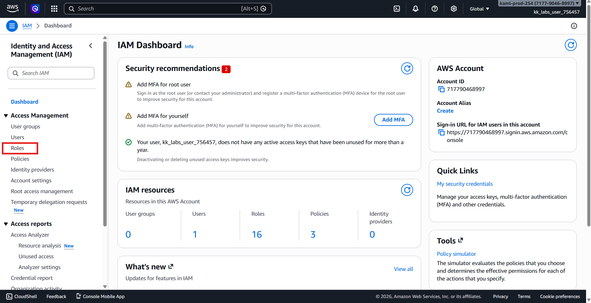
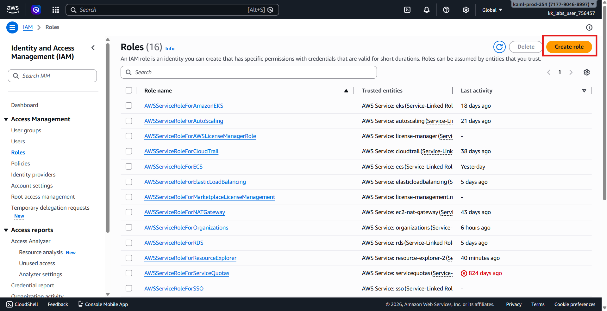
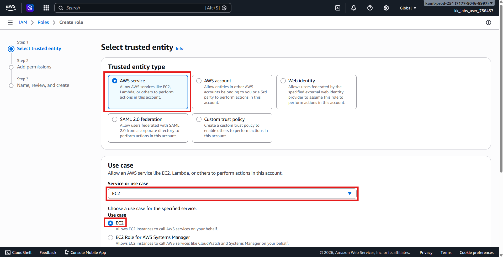
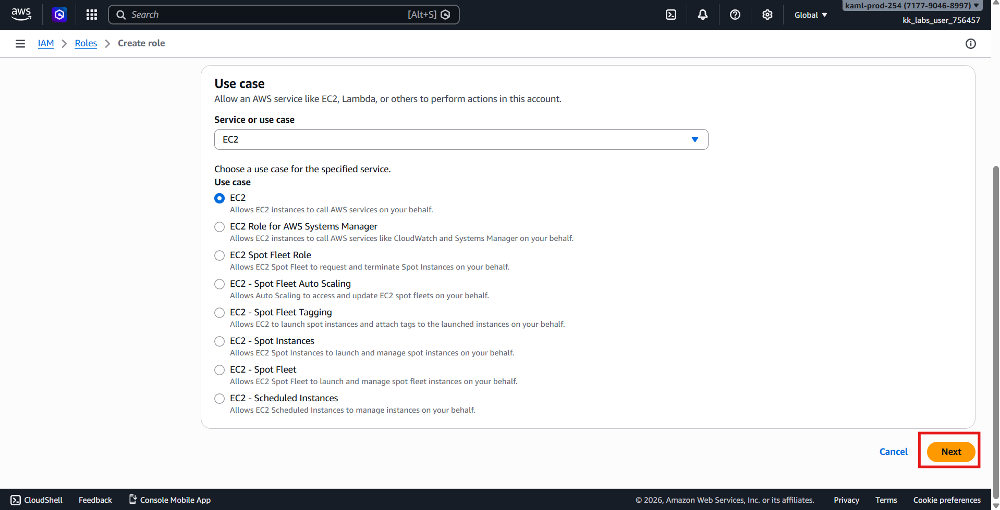
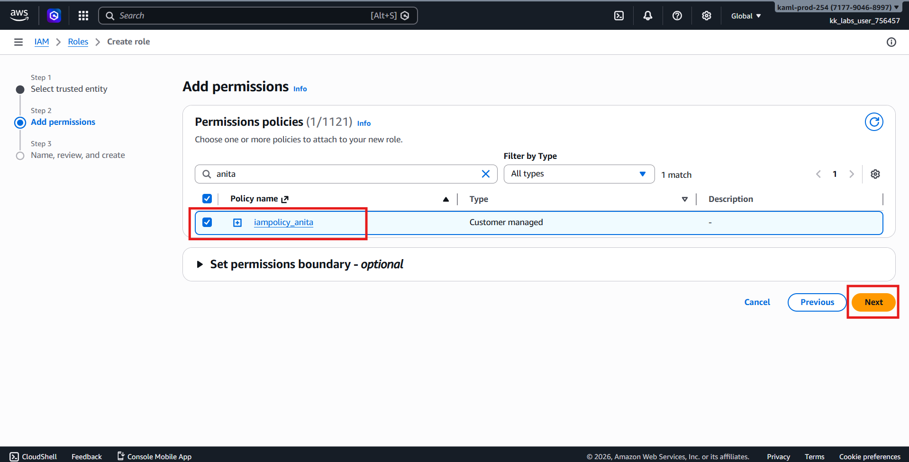
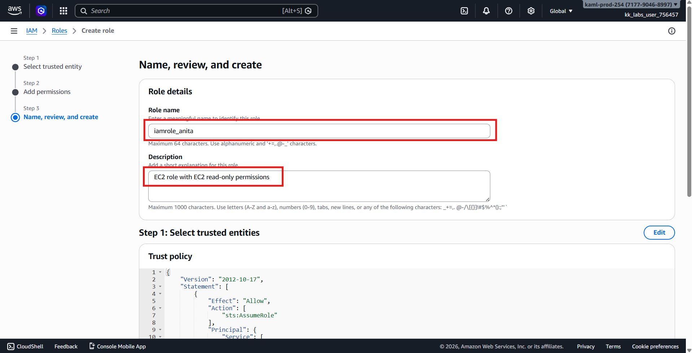
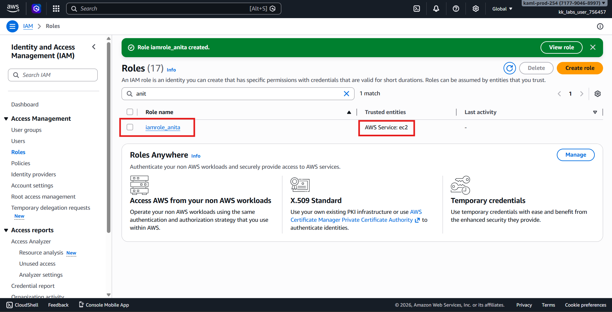

# 🚀 AWS Task: Create IAM Role for EC2 (Console Method)

## 🧩 Scenario

While configuring AWS infrastructure, the **Nautilus DevOps Team** is setting up IAM roles to allow AWS services to securely access other AWS resources.

IAM **Roles** are used when permissions must be granted to AWS services (like EC2) instead of individual users.

---

# 🎯 Objective

Create an IAM Role with the following configuration:

| Setting | Value |
|--------|------|
| Role Name | `iamrole_anita` |
| Trusted Entity | AWS Service |
| Use Case | EC2 |
| Attached Policy | `iampolicy_anita` |
| Region | `us-east-1` *(IAM is global)* |

---

# 🧭 Step 1 — Login to AWS Console

1. Open the provided **AWS Console URL**.
2. Sign in using the supplied credentials.
3. Verify the region (top-right corner):
```text
us-east-1 (N. Virginia)
```

> ✅ IAM is a global service, but always follow the required lab region.

---

# 🔐 Step 2 — Open IAM Service

1. In the AWS search bar, type:
```text
IAM
```

2. Select **IAM** from the Services list.

---

# 👔 Step 3 — Navigate to Roles

1. From the left navigation panel, click:
```text
Roles
```



2. Click:
```text
Create role
```



---

# ⚙️ Step 4 — Select Trusted Entity

Configure the role type:

| Option | Selection |
|-------|-----------|
| Trusted entity type | **AWS service** |
| Use case | **EC2** |

Select:
```text
EC2
```

Click:
```text
next
```




---

# 📎 Step 5 — Attach Permissions Policy

1. Search for the policy:
```text
iampolicy_anita
```

2. Check the box beside the policy.

Click:
```text
next
```



---

# 🏷️ Step 6 — Name the Role

Enter the following:

| Field | Value |
|------|------|
| Role name | `iamrole_anita` |
| Description | EC2 role with EC2 read-only permissions |

Click:
```text
Create role
```



---

# ✅ Step 7 — Verify Role Creation

1. You will return to the Roles list.
2. Search for:
```text
iamrole_anita
```

3. Open the role and confirm:

- Trusted entity = **EC2**
- Attached policy = **iampolicy_anita**



---

# ✔️ Validation Checklist

- [x] IAM role created
- [x] Role name `iamrole_anita`
- [x] Trusted entity set to AWS Service (EC2)
- [x] Policy `iampolicy_anita` attached
- [x] Role visible in IAM Roles list

---

# 🏁 Result

The IAM role **`iamrole_anita`** has been successfully created and configured for **EC2 service usage**, with permissions defined by **`iampolicy_anita`**.

---

# 💡 Key Concepts

## IAM Role vs IAM User

| IAM User | IAM Role |
|---------|----------|
| Represents a person/app | Represents a service |
| Long-term credentials | Temporary credentials |
| Manual login | Assumed automatically |

### How it works
EC2 Instance → Assumes Role → Gets Policy Permissions
```
