# 🚀 AWS Task: Create EC2 Instance and Associate Elastic IP (Console Method)

## 🧩 Scenario

The **Nautilus DevOps Team** needs a new EC2 instance that will host an application requiring a **stable public IP address**.

To achieve this, an **Elastic IP (EIP)** must be created and associated with the EC2 instance.

---

# 🎯 Objective

Create the following AWS resources:

| Resource | Requirement |
|----------|-------------|
| EC2 Instance Name | `devops-ec2` |
| AMI | Any Linux (Ubuntu recommended) |
| Instance Type | `t2.micro` |
| Elastic IP Name | `devops-eip` |
| Region | `us-east-1` |

---

# 🧭 Step 1 — Login to AWS Console

1. Open the provided **Console URL**.
2. Login using the given credentials.
3. Confirm region:
```text
us-east-1 (N. Virginia)
```

---

# 🖥️ Step 2 — Launch EC2 Instance

## Open EC2 Service

1. Search:
```text
EC2
```

2. Open **EC2 Dashboard**.

---

## Launch Instance

Click:
```text
Launch instances
```

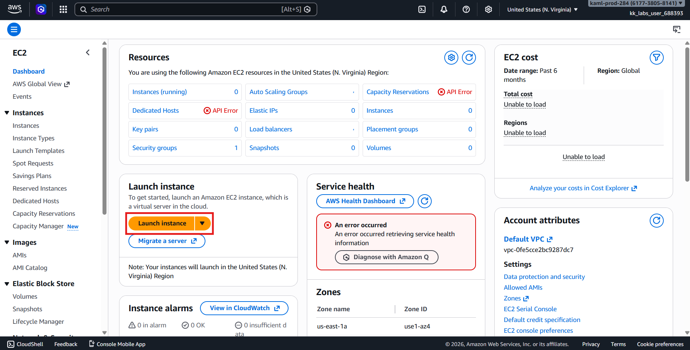

---

## Configure Instance Details

### 1️⃣ Name and Tags

| Field | Value |
|------|------|
| Name | `devops-ec2` |

---

### 2️⃣ Choose AMI

Select any Linux AMI:

✅ **Ubuntu Server** *(recommended)*  
(or Amazon Linux)

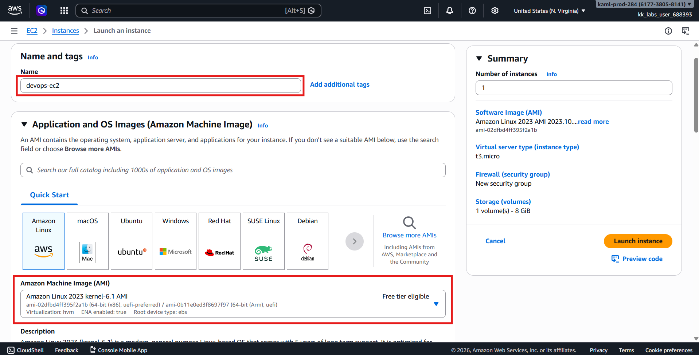

---

### 3️⃣ Instance Type

Select:
```text
t2.micro
```

---

### 4️⃣ Key Pair

- Choose existing key pair **or**
- Select **Proceed without key pair** *(allowed for lab unless specified)*

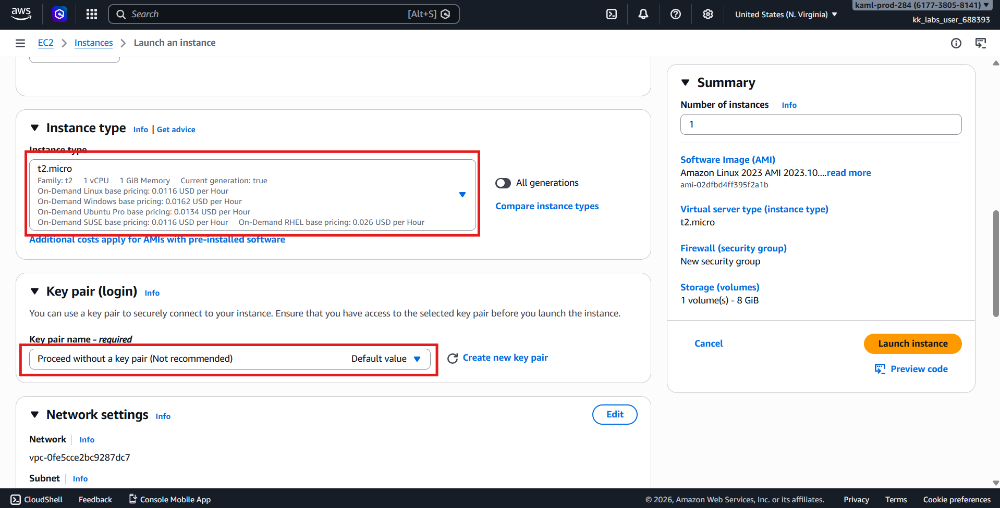

---

### 5️⃣ Network Settings

Keep defaults:

- Default VPC
- Auto-assign Public IP → **Enabled**
- Default Security Group

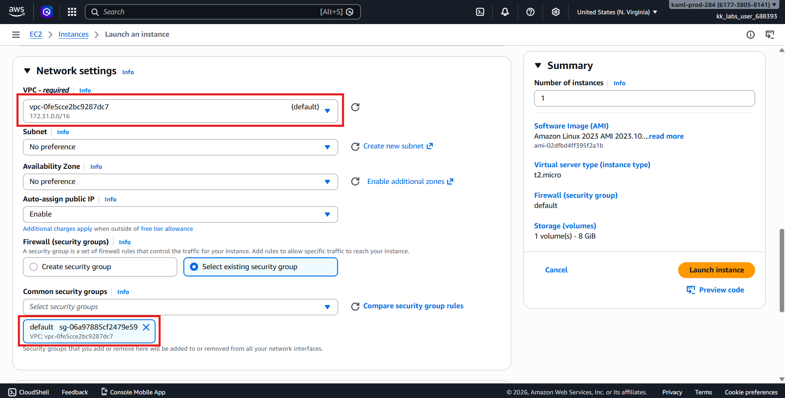

---

### 6️⃣ Storage

Keep default storage settings.

---

Click:
```text
Launch instance
```

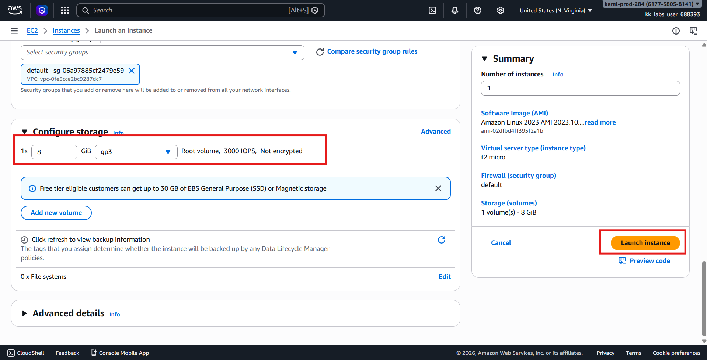

---

# ✅ Step 3 — Verify Instance Running

1. Go to:
```text
Elastic IPs
```

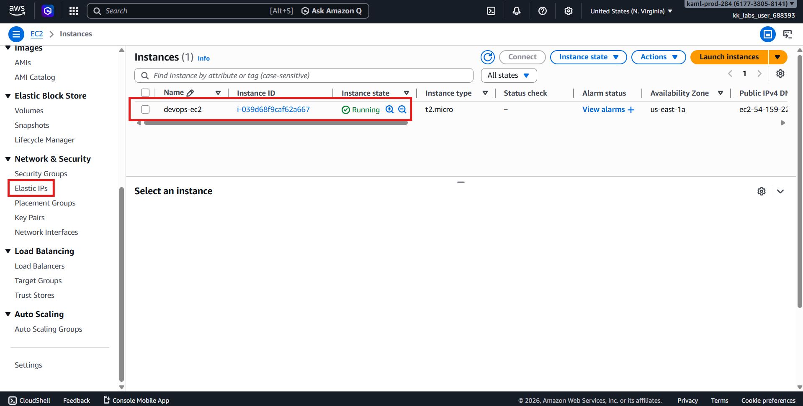

---

### Allocate Address

1. Click:
```text
Allocate Elastic IP address
```

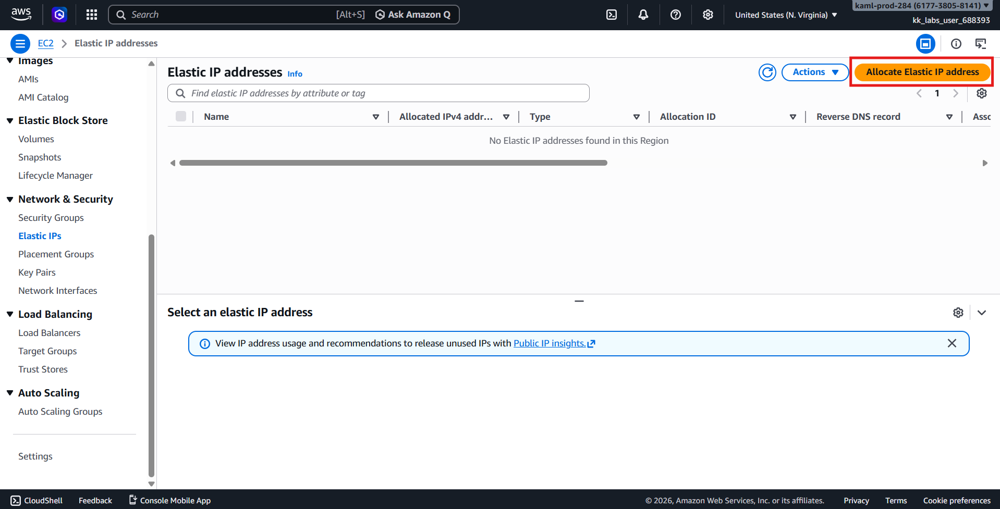

2. Keep defaults.
3. Click:
```text
Allocate
```

---

# 🏷️ Step 5 — Name the Elastic IP

1. Select the newly created Elastic IP.
2. Click:
```text
Tags → Manage Tags
```

Add tag:

| Key | Value |
|-----|------|
| Name | devops-eip |

Save changes.

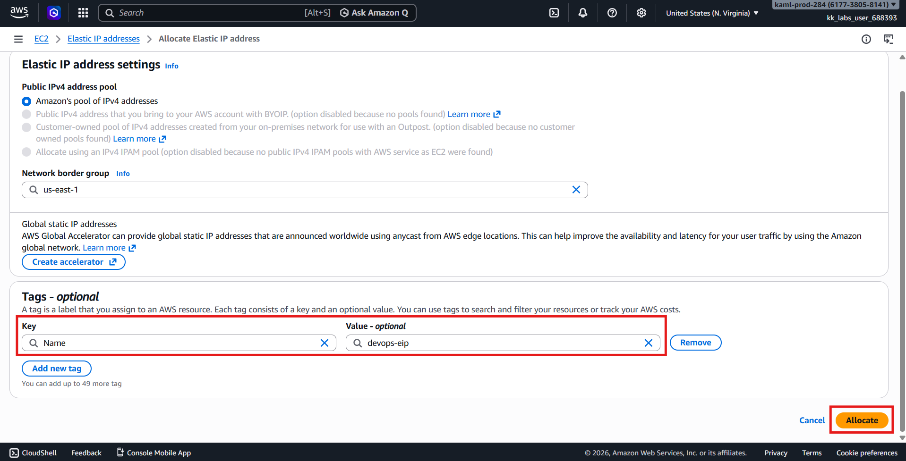

---

# 🔗 Step 6 — Associate Elastic IP to Instance

1. Select the Elastic IP.
2. Click:
```text
Actions → Associate Elastic IP address
```

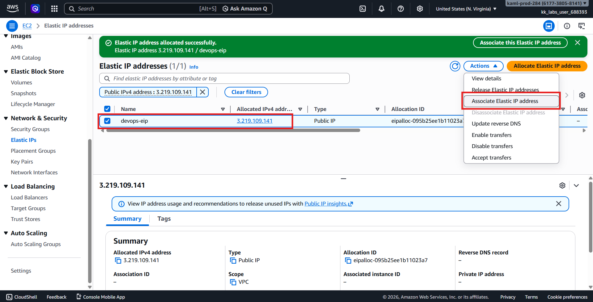

Configure:

| Setting | Value |
|---------|-------|
| Resource type | Instance |
| Instance | `devops-ec2` |
| Private IP | Auto-selected |

Click:
```text
Associate
```

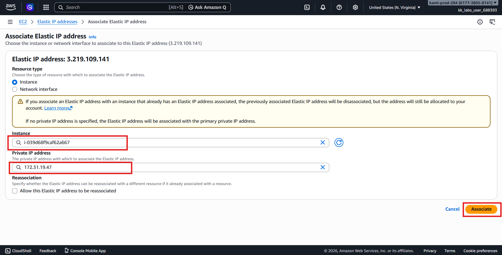

---

# ✅ Step 7 — Verify Association

Go back to **Instances**:

Check that:

- Public IPv4 address = Elastic IP
- Instance state = Running

Elastic IP page should show:
```text
Associated instance: devops-ec2
```

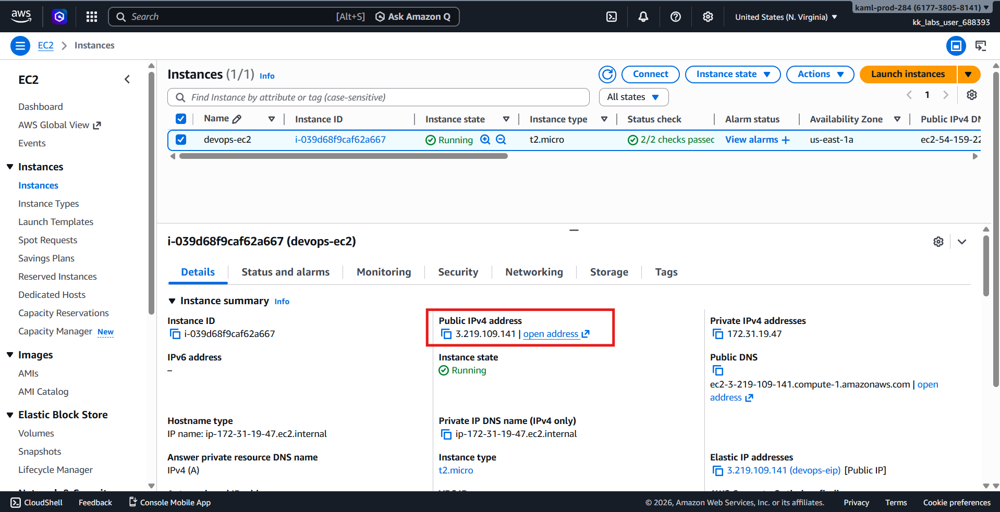

or check via CLI, given that the instance ID of devops-ec2 is i-030228a856221608d
```bash
aws ec2 describe-addresses \
  --filters "Name=instance-id,Values=i-030228a856221608d \
  --query "Addresses[*].[PublicIp,Tags[?Key=='Name'].Value|[0]]" \
  --output table
```

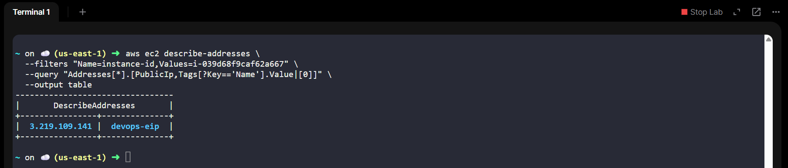

---

# ✔️ Validation Checklist

- [x] EC2 instance created
- [x] Name = `devops-ec2`
- [x] Instance type = `t2.micro`
- [x] Linux AMI used
- [x] Elastic IP allocated
- [x] Elastic IP tagged `devops-eip`
- [x] Elastic IP associated with instance
- [x] Instance running

---

# 🏁 Result

✅ EC2 instance **`devops-ec2`** is running with a **static public IP** via Elastic IP **`devops-eip`**, ensuring consistent external access for the application.

---

# 💡 Key Concepts

## Why Elastic IP?

| Public IP | Elastic IP |
|-----------|-----------|
| Changes on stop/start | Static |
| Temporary | Persistent |
| Auto-assigned | Manually controlled |

### Architecture Flow
```text
Internet
↓
Elastic IP (Static)
↓
EC2 Instance (nautilus-ec2)
```
