# ✅ AWS Task Guide — Passwordless SSH Access to EC2 (Console Method)

## 📌 Objective
The Nautilus DevOps team requires:

- Create an **EC2 instance**
  - Name: `nautilus-ec2`
  - Instance type: `t2.micro`
- Create an SSH key **id_rsa** on **aws-client**
- Configure **passwordless SSH access**
- Allow login from **aws-client → EC2 root user**
- Region: **us-east-1**

---

# 🧭 PART 1 — Login to AWS Console

1. Open the provided **Console URL**
2. Login using:
   - Username
   - Password
3. Confirm region (top-right):
```text
us-east-1 (N. Virginia)
```

---

# 🖥️ PART 2 — Create EC2 Instance

## Step 1: Open EC2
```text
AWS Console → Services → EC2
```

---

## Step 2: Launch Instance

Click:
```text
Launch Instance
```

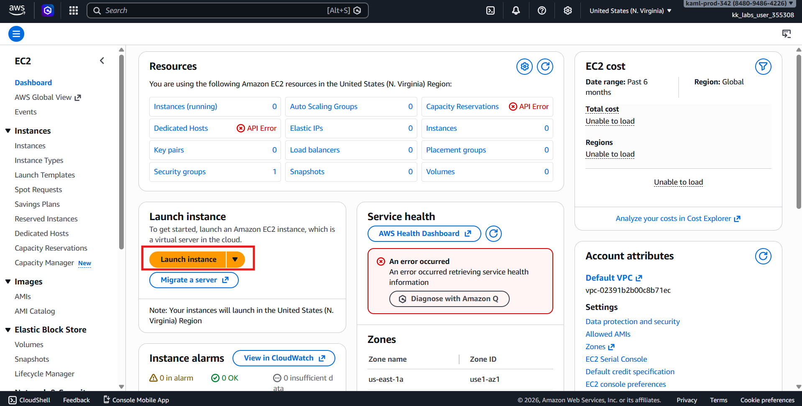

### Configure:

| Setting | Value |
|---|---|
| Name | `nautilus-ec2` |
| AMI | Ubuntu Server (any Linux AMI allowed) |
| Instance Type | `t2.micro` |
| Key Pair | Proceed without key pair (temporary) |

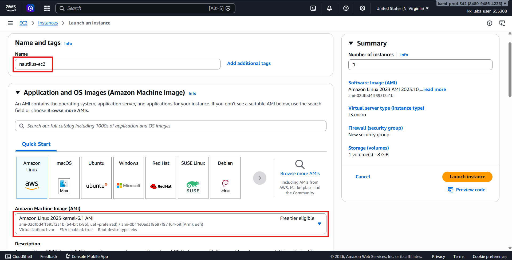
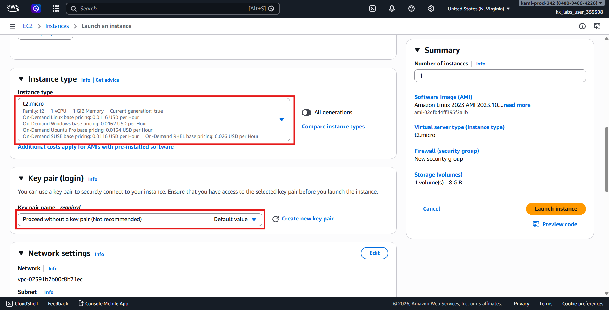

---

## Step 3: Network Settings

Allow SSH:
```text
✔ Allow SSH traffic from Anywhere (0.0.0.0/0)
```

---

## Step 4: Launch
Click:
```text
Launch Instance
```

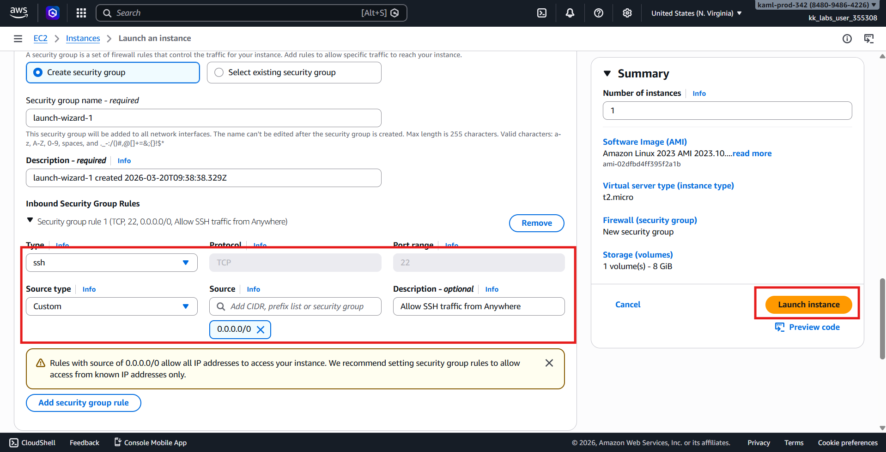

Wait until:
```text
Instance State → Running
Status Checks → 2/2 passed
```

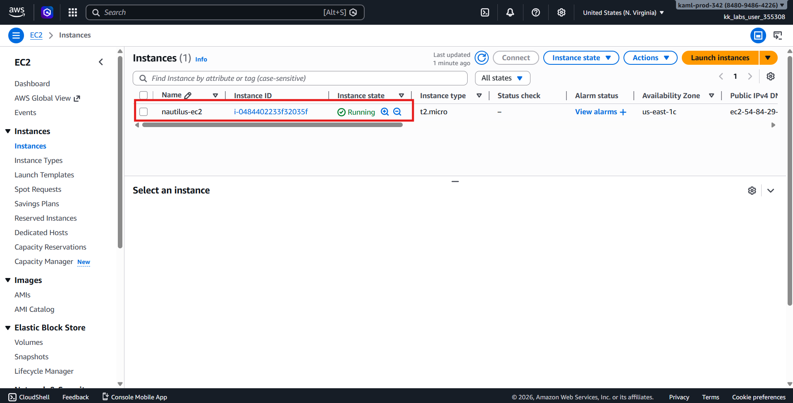

---

# 🔑 PART 3 — Create SSH Key on aws-client

Open terminal on **aws-client**.

---

## Check if key already exists

```bash
ls -l /root/.ssh/id_rsa
```

If NOT exists → Create it
```bash
ssh-keygen -t rsa -b 2048 -f /root/.ssh/id_rsa -N ""
```

This creates:
```text
/root/.ssh/id_rsa
/root/.ssh/id_rsa.pub
```

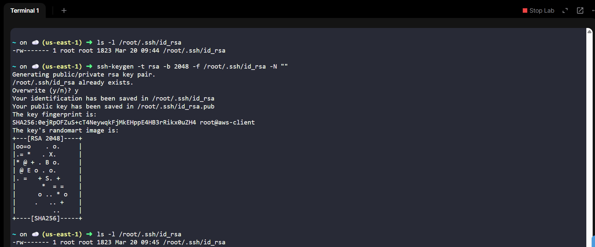

---

# 🌐 PART 4 — Connect to EC2 (Temporary Access)

From EC2 Console:
```text
Instance → Connect → EC2 Instance Connect
```

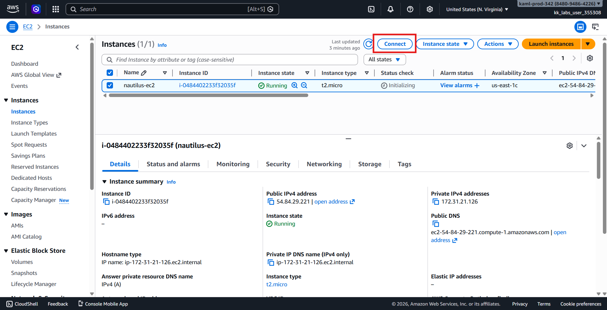
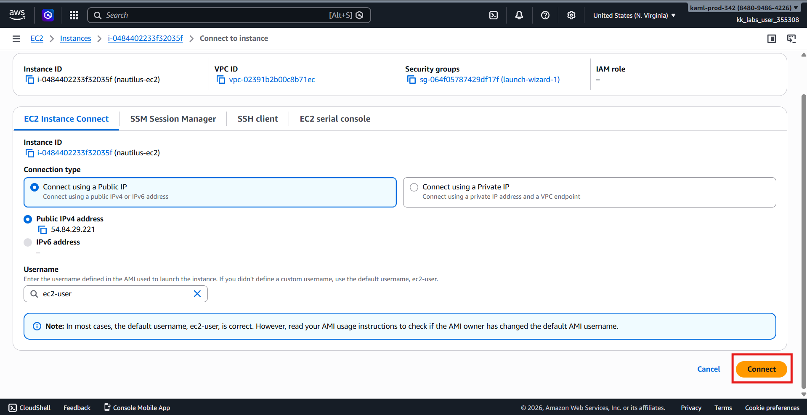

Login as:
```text
ubuntu
```
(or ec2-user depending on AMI)

---

# 👤 PART 5 — Enable Root Login (Inside EC2)

Switch to root:
```bash
sudo su -
```

Create SSH directory:
```bash
mkdir -p /root/.ssh
chmod 700 /root/.ssh
```

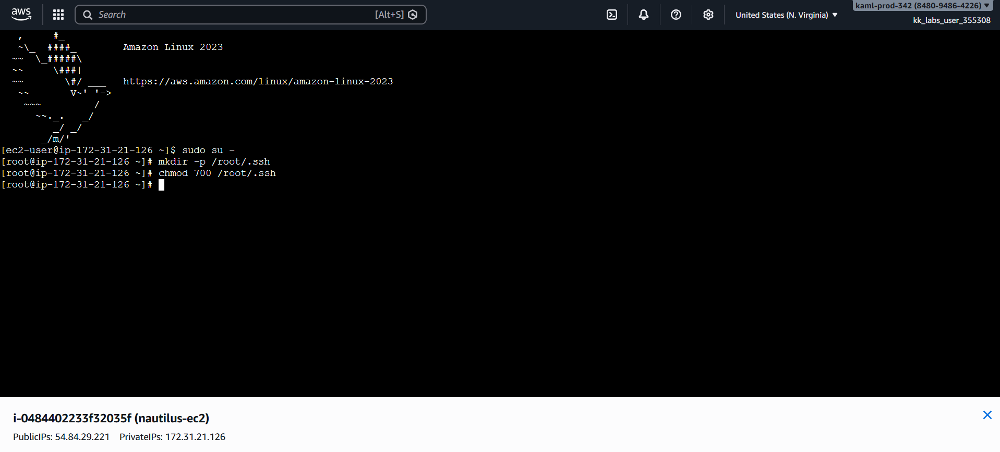

---

# 📋 PART 6 — Copy Public Key from aws-client

On aws-client:
```bash
cat /root/.ssh/id_rsa.pub
```
Copy the entire output.

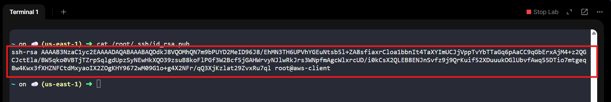

---

# 🔐 PART 7 — Add Key to EC2 Authorized Keys

On EC2 root shell:
```bash
nano /root/.ssh/authorized_keys
```

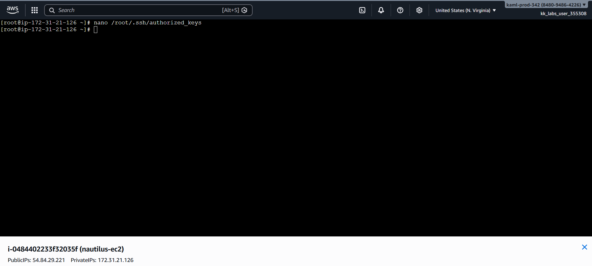

Paste the public key.

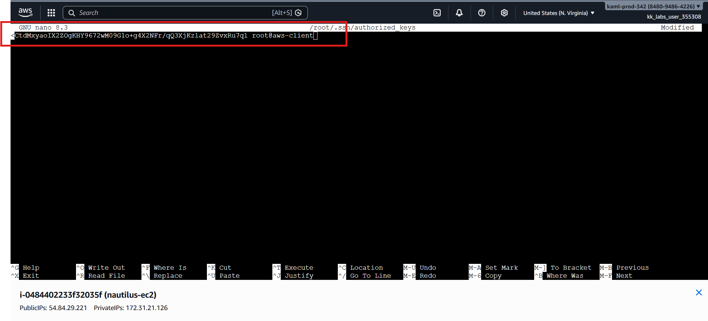

Save and exit.

## Fix Permissions
```bash
chmod 600 /root/.ssh/authorized_keys
```

---

# ⚙️ PART 8 — Enable Root SSH Access

Edit SSH config:
```bash
nano /etc/ssh/sshd_config
```

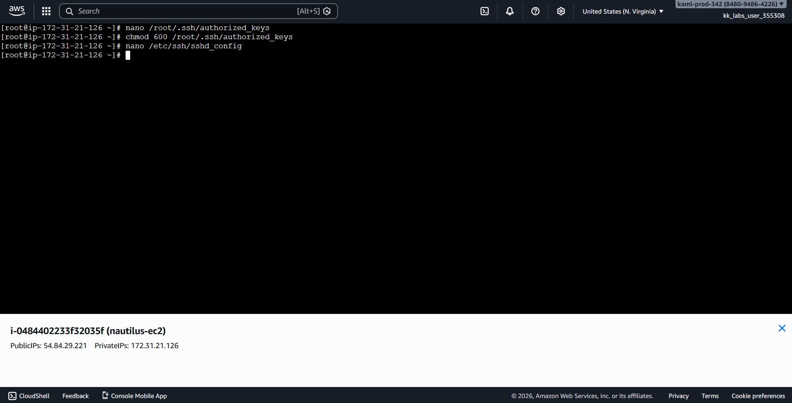

Find:
```text
PermitRootLogin
```

Change to:
```text
PermitRootLogin yes
```

(Optional but recommended)
```text
PubkeyAuthentication yes
```

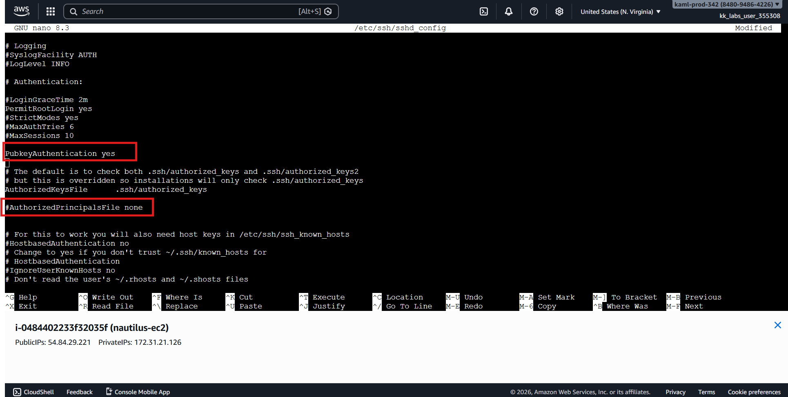

## Restart SSH:
```bash
systemctl restart sshd
```

(or)
```bash
service ssh restart
```

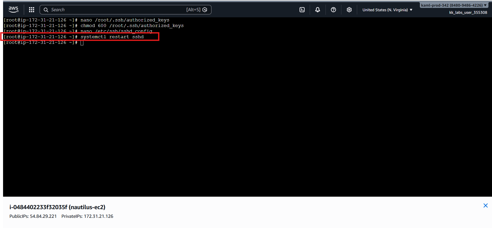

---

# 🧪 PART 9 — Test Passwordless SSH

From aws-client:
```bash
ssh root@<EC2-PUBLIC-IP>
```

✅ Expected result:
```text
Login WITHOUT password prompt
```

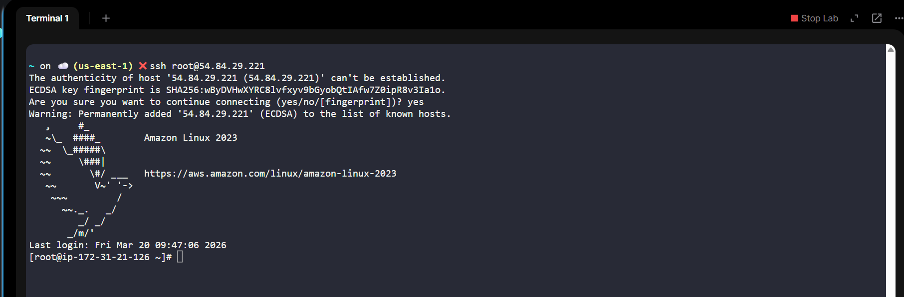

---

# ✅ Verification Checklist

| Requirement              | Status |
| ------------------------ | ------ |
| EC2 instance created     | ✅      |
| Name = nautilus-ec2      | ✅      |
| Instance type t2.micro   | ✅      |
| SSH key id_rsa created   | ✅      |
| Public key added to root | ✅      |
| Passwordless SSH working | ✅      |
| Region us-east-1         | ✅      |
