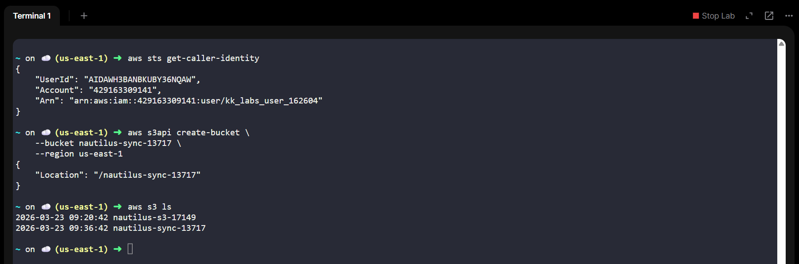
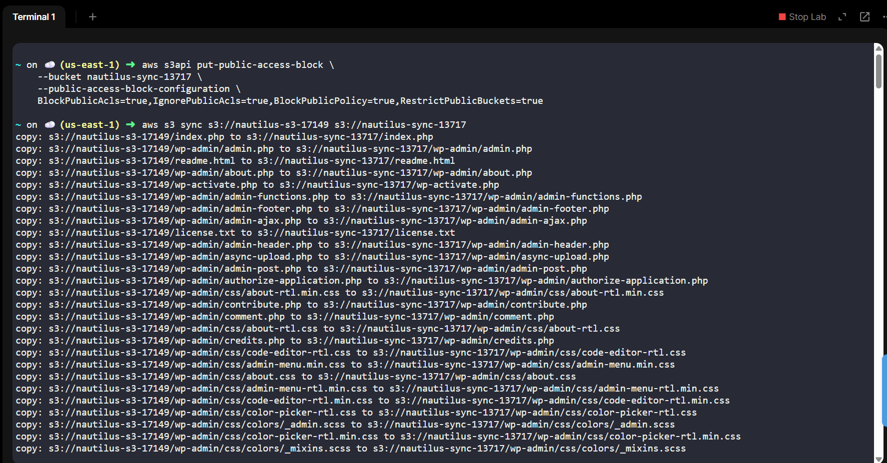
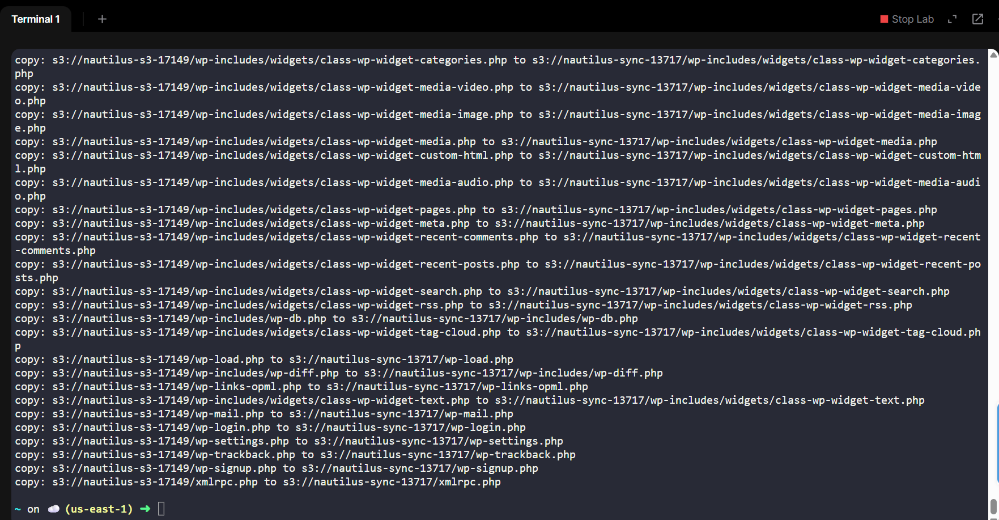
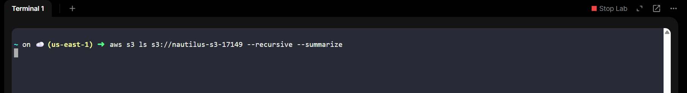
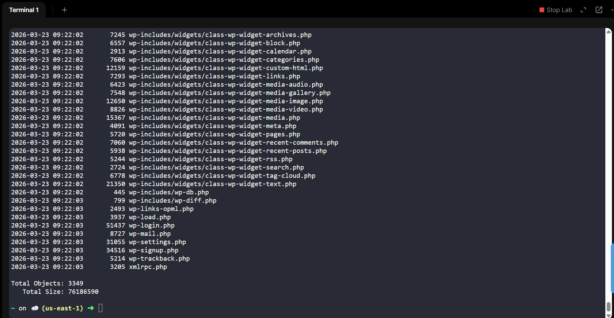
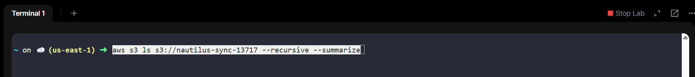
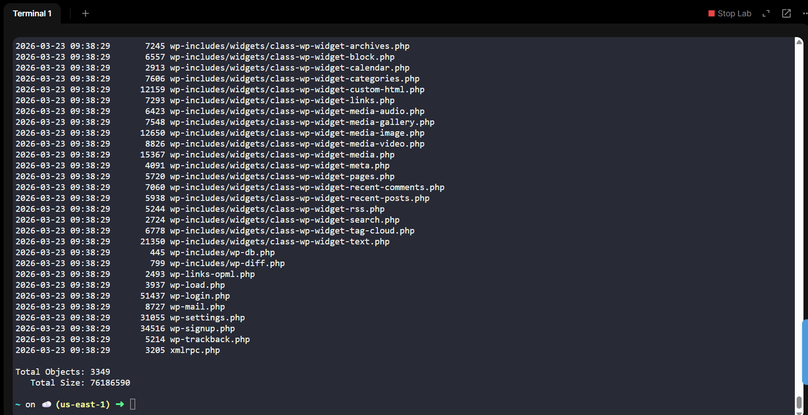
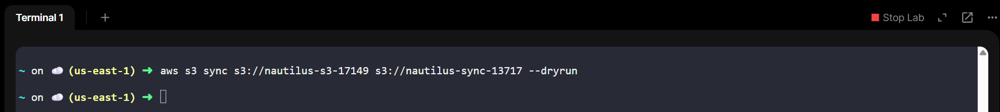

# ✅ AWS S3 Data Migration Using AWS CLI

## 📌 Objective

As part of the migration project, perform the following using **AWS CLI**:

1. Create a **private S3 bucket**
```bash
nautilus-sync-13717
```

2. Migrate **all data** from:
```bash
nautilus-s3-17149
```

➜ to the new bucket.
3. Verify **data consistency** between buckets.
4. Perform all actions in:
```bash
us-east-1
```

---

# 🧭 Step 1 — Verify AWS Credentials

On **aws-client**, confirm credentials:

```bash
aws sts get-caller-identity
```
If output returns account details ✅ CLI is configured.

---

# 🪣 Step 2 — Create New Private S3 Bucket

⚠️ For us-east-1, DO NOT specify LocationConstraint.
```bash
aws s3api create-bucket \
    --bucket nautilus-sync-13717 \
    --region us-east-1
```

## ✅ Verify Bucket Creation
```bash
aws s3 ls
```

Expected output includes:
```bash
nautilus-sync-13717
```



---

# 🔒 Step 3 — Ensure Bucket is Private (Default)

Block all public access:
```bash
aws s3api put-public-access-block \
    --bucket nautilus-sync-13717 \
    --public-access-block-configuration \
    BlockPublicAcls=true,IgnorePublicAcls=true,BlockPublicPolicy=true,RestrictPublicBuckets=true
```

---

# 🔄 Step 4 — Migrate Data (SYNC Buckets)

Use aws s3 sync (recommended for migrations).
```bash
aws s3 sync s3://nautilus-s3-17149 s3://nautilus-sync-13717
```

## What this does
- Copies all files
- Preserves structur
- Skips unchanged files
- Ensures efficient transfer




---

# 📊 Step 5 — Verify Data Consistency

## 5.1 Count Files in Source Bucket
```bash
aws s3 ls s3://nautilus-s3-17149 --recursive --summarize
```


Look for:
```bash
Total Objects:
Total Size:
```



## 5.2 Count Files in Destination Bucket
```bash
aws s3 ls s3://nautilus-sync-13717 --recursive --summarize
```



✅ Both must match:
```bash
Total Objects
Total Size
```



---

# 🔍 Step 6 — Deep Verification (Optional but Recommended)

Run sync in dry-run mode:
```bash
aws s3 sync s3://nautilus-s3-17149 s3://nautilus-sync-13717 --dryrun
```



✅ Expected result:
```bash
(no output)
```
> Meaning both buckets are identical.

---

# ✅ Verification Checklist
| Requirement            | Status |
| ---------------------- | ------ |
| Bucket created         | ✅      |
| Name correct           | ✅      |
| Private access enabled | ✅      |
| Data migrated          | ✅      |
| File counts match      | ✅      |
| Sizes match            | ✅      |
| Region us-east-1       | ✅      |
| Used AWS CLI           | ✅      |

