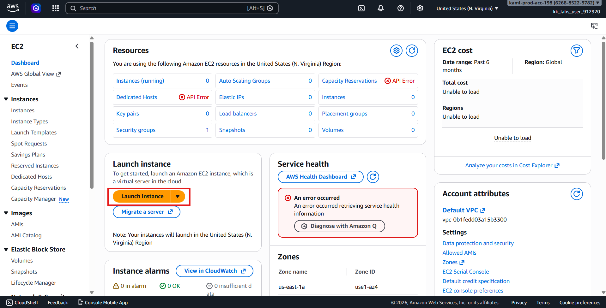
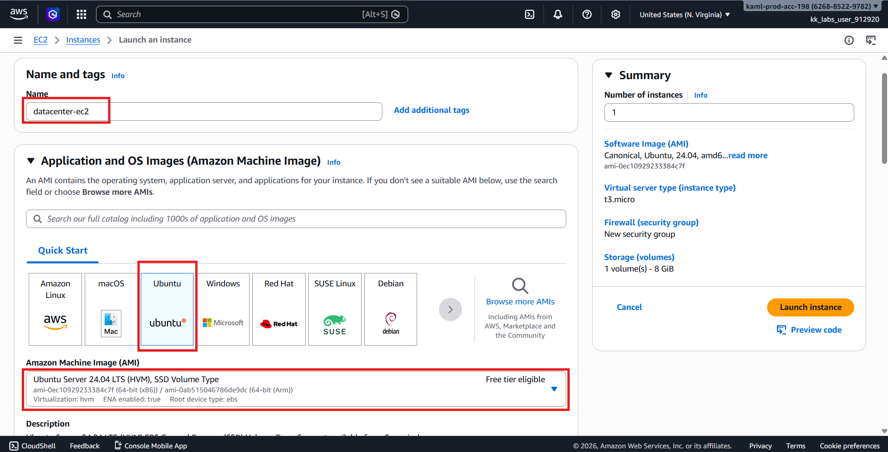
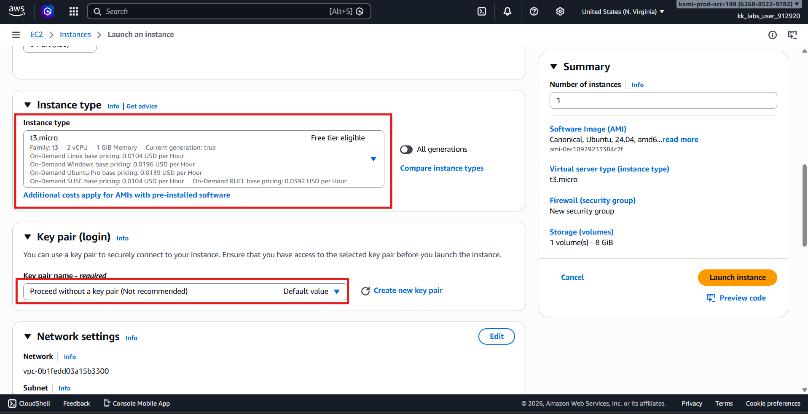
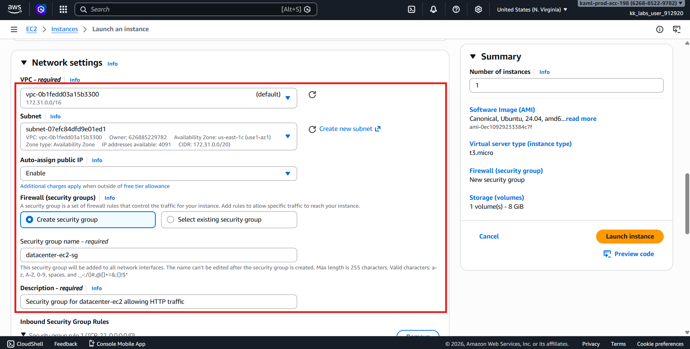
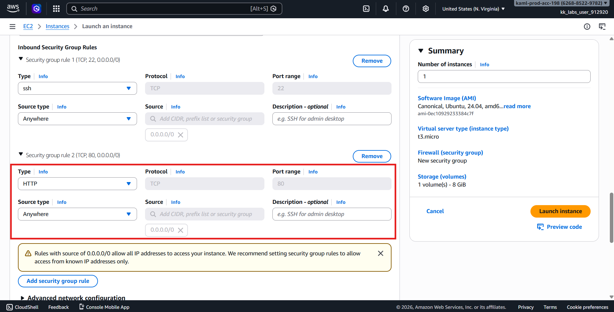
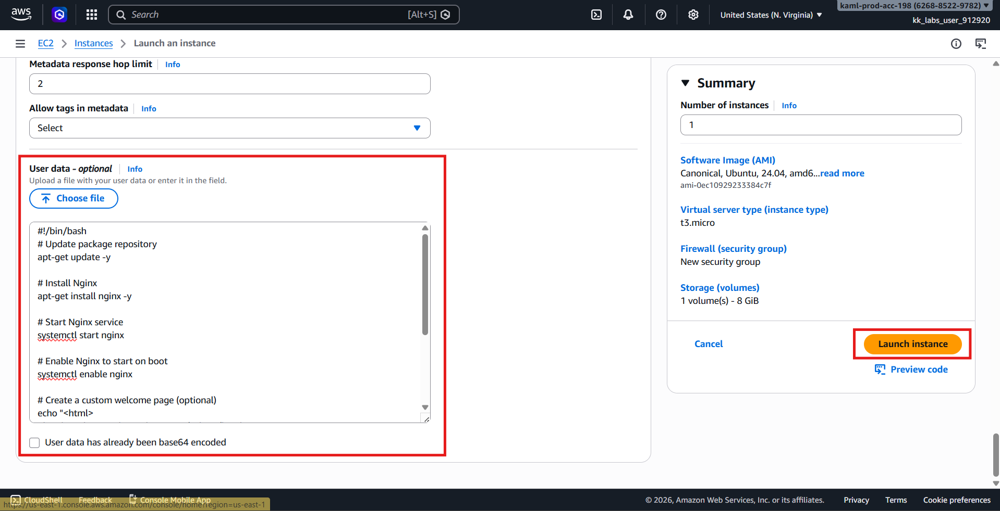
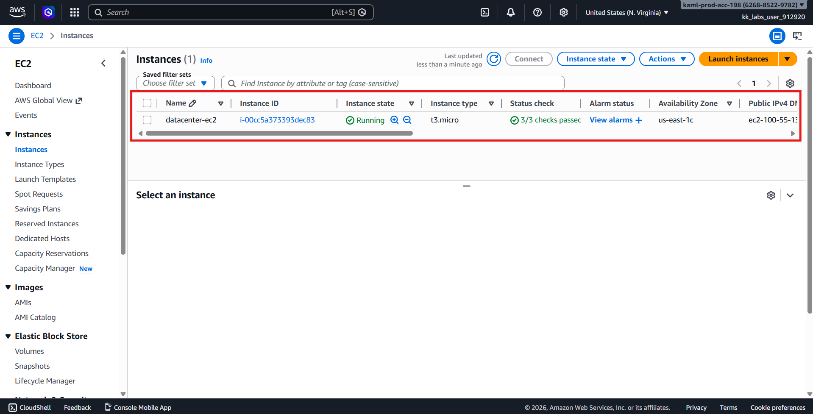
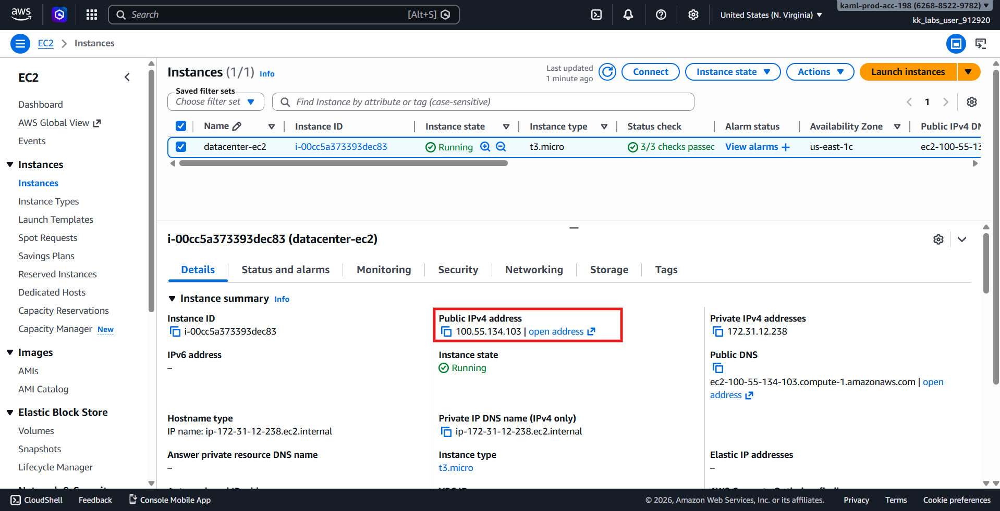
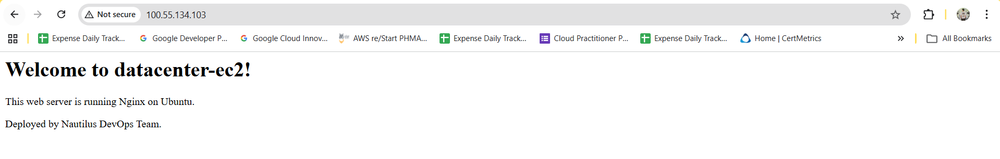
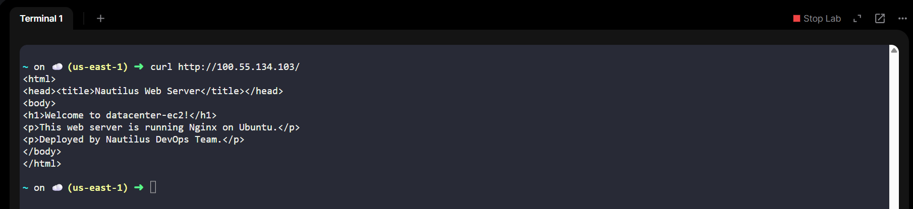

# 🚀 AWS Task: EC2 Web Server with Nginx (User Data Script)

## 📌 Objective

Create an EC2 instance configured as a **web server** using **Nginx**, with the following:

| Requirement | Value |
|------------|------|
| Instance Name | `datacenter-ec2` |
| AMI | Ubuntu |
| Instance Type | t2.micro (default/free tier) |
| Web Server | Nginx (via User Data) |
| Access | HTTP (Port 80 open to internet) |
| Region | us-east-1 |

---

# 🚀 Steps to Create EC2 Instance with Nginx Web Server

## 📋 Prerequisites
- ✅ Access to AWS Console with provided credentials
- 🌎 Region set to `us-east-1`
- 🔑 Basic knowledge of EC2 and security groups

---

## 🔐 Step 1: Login to AWS Console

1. 🌐 Navigate to: `https://626885229782.signin.aws.amazon.com/console?region=us-east-1`
2. 👤 Login with credentials:
   - **Username:** `kk_labs_user_912920`
   - **🔑 Password:** `A1eC!wpJ^uxO`

---

## 🖥️ Step 2: Launch EC2 Instance (datacenter-ec2)

### 2.1 Navigate to EC2 Dashboard
1. 🎯 From AWS Console home, search for **EC2** in the top search bar
2. Click on **EC2** to open the dashboard
3. ✅ Click **Launch Instance** button



### 2.2 Configure Instance Details

#### 📝 **Name and tags:**
- **🏷️ Name:** `datacenter-ec2`

#### 🖼️ **Application and OS Images (AMI):**
- Click on **Quick Start** tab
- Choose **Ubuntu** (Recommended: Ubuntu Server 22.04 LTS or 24.04 LTS)
- **Architecture:** 64-bit (x86)



#### 🔑 **Key pair (login):**
- Select **Proceed without a key pair** (for lab purposes)
- ⚠️ *Note: Not recommended for production environments*



#### 🌐 **Network settings:**
- Click **Edit**
- **VPC:** Select default VPC
- **Subnet:** Choose any availability zone (e.g., us-east-1a)
- **🛡️ Auto-assign public IP:** Enable
- **🔒 Firewall (security groups):**
  - Select **Create security group**
  - **Security group name:** `datacenter-ec2-sg`
  - **Description:** `Security group for datacenter-ec2 allowing HTTP traffic`



  **Inbound security group rules:**
  - Click **Add security group rule**
  - **Type:** HTTP
  - **Source:** Anywhere-IPv4 (0.0.0.0/0)
  - *Optional: Add SSH rule for debugging (Type: SSH, Source: My IP)*



#### 💾 **Configure storage:**
- **Root volume:** 
  - **Size:** 20 GB (default is fine)
  - **Volume type:** gp3 or gp2

### 2.3 Configure User Data Script 📝

Scroll down to **Advanced details** section:

1. 📋 Find **User data** field
2. 🔘 Select **As text** (not As file)
3. 📝 Enter the following user data script:

```bash
#!/bin/bash
# Update package repository
apt-get update -y

# Install Nginx
apt-get install nginx -y

# Start Nginx service
systemctl start nginx

# Enable Nginx to start on boot
systemctl enable nginx

# Create a custom welcome page (optional)
echo "<html>
<head><title>Nautilus Web Server</title></head>
<body>
<h1>Welcome to datacenter-ec2!</h1>
<p>This web server is running Nginx on Ubuntu.</p>
<p>Deployed by Nautilus DevOps Team.</p>
</body>
</html>" > /var/www/html/index.html

# Check Nginx status
systemctl status nginx --no-pager
```

Alternative minimal script:
```bash
#!/bin/bash
apt-get update -y
apt-get install nginx -y
systemctl start nginx
systemctl enable nginx
```



### 2.4 Review and Launch
1. 👁️ Review all configuration settings:
 - ✅ Instance name: datacenter-ec2
 - ✅ AMI: Ubuntu
 - ✅ Security group allows HTTP (port 80)
 - ✅ User data script included
2. ✅ Click Launch instance

---

## ⏳ Step 3: Wait for Instance to Provision
- 📊 Click View all instances button
- ⏱️ Wait for instance state to change from Pending to Running
- ✅ Check Status checks column - should show 2/2 checks passed



---

## 🌐 Step 4: Test the Nginx Web Server
### 4.1 Get the Public IP Address
1. 🖥️ Select the datacenter-ec2 instance
2. 📋 Copy the Public IPv4 address from the details tab
  - Example: 54.123.45.67
3. or Copy the public DNS
 - Example: ec2-100-55-134-103.compute-1.amazonaws.com



### 4.2 Test via Web Browser
1. 🌐 Open a new browser tab
2. 🔗 Enter: http://<public-ip-address>

🎉 You should see the Nginx welcome page or custom HTML page



---

### 4.3 Test via Command Line (Optional)
```bash
# Using curl command
curl http://<public-ip-address>

# Example:
curl http://54.123.45.67
```
> Expected output should show HTML content or Nginx welcome page.



---

## 🔍 Step 5: Verify User Data Execution
### 5.1 Check User Data Log (If you can SSH)
```bash
# SSH into instance (if key pair was configured)
ssh -i key.pem ubuntu@<public-ip>

# Check user data execution log
sudo cat /var/log/cloud-init-output.log

# Verify Nginx status
sudo systemctl status nginx

# Test Nginx locally
curl http://localhost
```

### 5.2 Verify from AWS Console
- 🖥️ Select the instance
- 📋 Click on Actions → Monitor and troubleshoot → Get system log
- 🔍 Search for Nginx installation messages

---

## 🔧 Step 6: Troubleshooting

1. Wait 1–2 minutes
(User data runs during boot)

2. Verify Nginx (via SSH)
```bash
sudo systemctl status nginx
```

---

## 🏁 Final Architecture
```bash
Internet
   │
   ▼
EC2 Instance (datacenter-ec2)
   │
   ├── Ubuntu OS
   ├── Nginx Installed (User Data)
   └── Port 80 Open
```

---

## ✔️ Verification Checklist

| Requirement           | Status |
| --------------------- | ------ |
| EC2 instance created  | ✅      |
| Name datacenter-ec2   | ✅      |
| Ubuntu AMI used       | ✅      |
| Nginx installed       | ✅      |
| Nginx running         | ✅      |
| Port 80 accessible    | ✅      |
| User data script used | ✅      |

