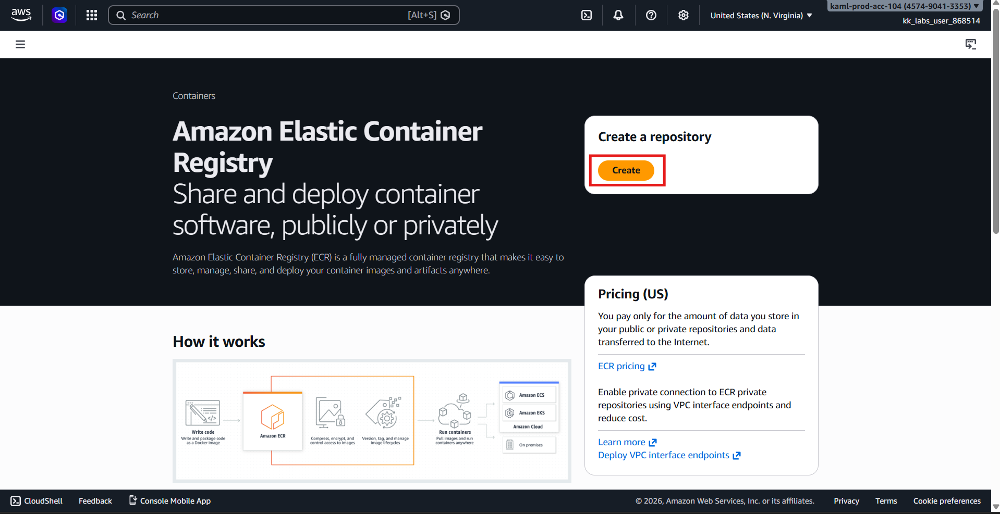
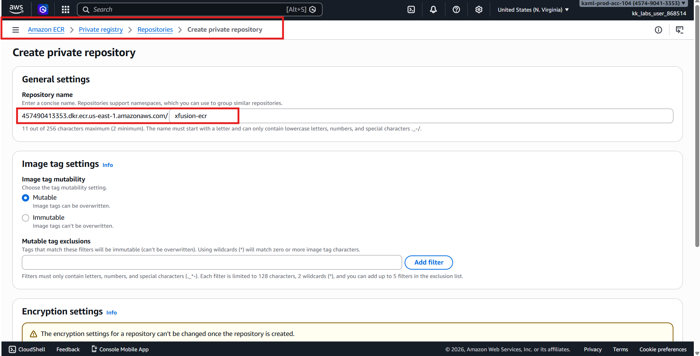
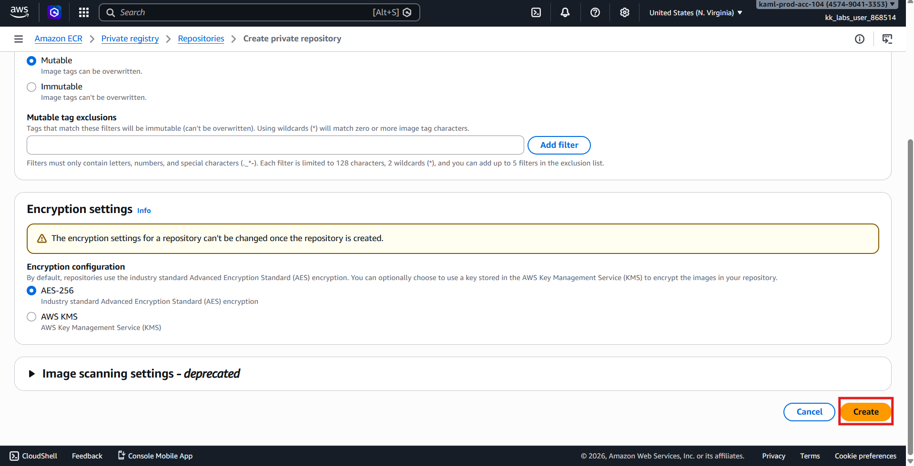
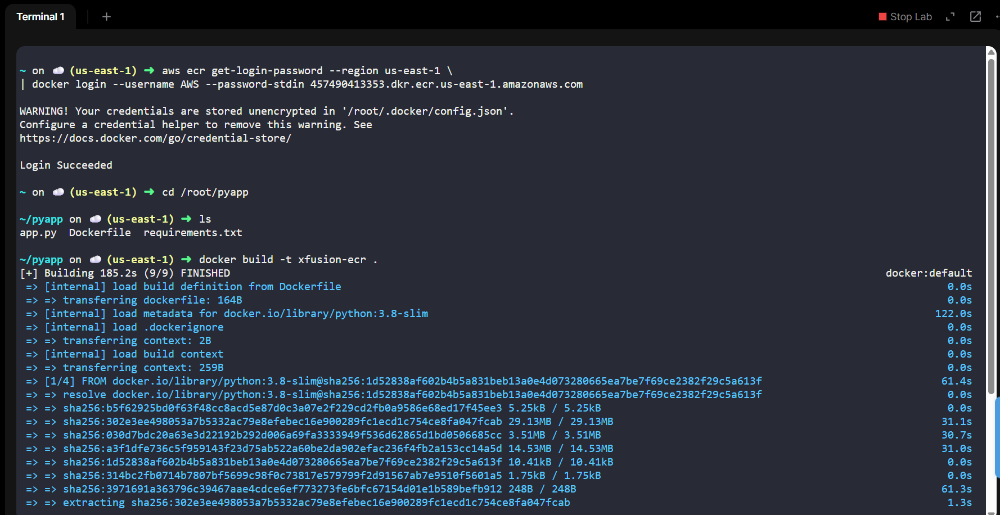
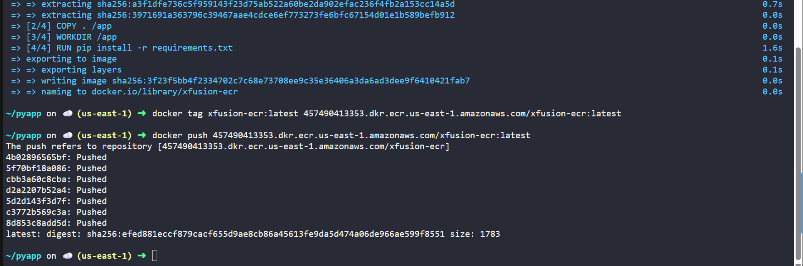
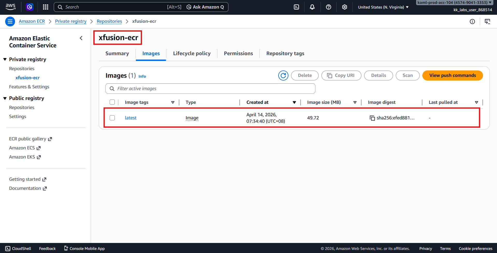

# 🚀 AWS Task: Create ECR Repo + Build & Push Docker Image (CLI + Console)

## 📌 Objective

Set up a container workflow:

| Task | Requirement |
|------|------------|
| ECR Repository | `xfusion-ecr` (Private) |
| Dockerfile Location | `/root/pyapp` (aws-client) |
| Image Tag | `latest` |
| Region | `us-east-1` |

---

# 🧭 PART 1 — Create ECR Repository (Console)

## Step 1: Login
- Open AWS Console
- Set region:
```text
us-east-1 (N. Virginia)
```

---

## Step 2: Navigate to ECR
```text
Services → Elastic Container Registry → Repositories
```

---

## Step 3: Create Repository

Click:
```text
Create repository
```



### Configure:

| Setting | Value |
|---|---|
| Visibility | Private |
| Repository name | xfusion-ecr |

Click:
```text
Create repository
```




---

## ✅ Step 4: Copy Repository URI

Example:

``` id="2jzqv8"
<ACCOUNT_ID>.dkr.ecr.us-east-1.amazonaws.com/xfusion-ecr
```
⚠️ Save this URI — needed for Docker push

---

# 🧭 PART 2 — Build & Push Image (AWS CLI)
## Step 1 — Login to ECR (Docker Authentication)
```bash
aws ecr get-login-password --region us-east-1 \
| docker login --username AWS --password-stdin <ACCOUNT_ID>.dkr.ecr.us-east-1.amazonaws.com
```

---

## Step 2 — Navigate to Dockerfile
```bash
cd /root/pyapp
```

verify
```bash
ls
```

Expected:
```bash
Dockerfile
```

---

## Step 3 — Build Docker Image
Verify:
```text
docker build -t xfusion-ecr .
```

---

## Step 4 — Tag Image for ECR
```text
docker tag xfusion-ecr:latest <ACCOUNT_ID>.dkr.ecr.us-east-1.amazonaws.com/xfusion-ecr:latest
```

---

## Step 5 — Push Image to ECR

```bash
docker push <ACCOUNT_ID>.dkr.ecr.us-east-1.amazonaws.com/xfusion-ecr:latest
```




---

# ✅ PART 3 — Verify in AWS Console
Navigate:

```text
ECR → Repositories → xfusion-ecr
```

Check:

- Image tag: `latest`
- Image successfully pushed



---

# ✔️ Verification Checklist

| Requirement | Status |
|---|---|
| ECR repo created | ✅ |
| Repo name correct | ✅ |
| Private repo | ✅ |
| Dockerfile used | ✅ |
| Image built | ✅ |
| Image tagged | ✅ |
| Image pushed | ✅ |
| Tag = latest | ✅ |
| Visible in ECR | ✅ |

---

# 🏁 Final Workflow

``` id="kwr0t9"
Dockerfile (/root/pyapp)
        │
        ▼
Docker Build
        │
        ▼
Local Image (latest)
        │
        ▼
Tag for ECR
        │
        ▼
Push to ECR
        │
        ▼
ECR Repository (xfusion-ecr)
```
