# 🚀 AWS Task: Create Private RDS MySQL Instance (Free Tier)

## 📌 Objective

Provision a **private Amazon RDS MySQL database** for development use.

---

## 🧩 Requirements

| Setting | Value |
|--------|------|
| DB Identifier | `devops-rds` |
| Engine | MySQL |
| Version | 8.4.x |
| Instance Class | `db.t3.micro` |
| Template | Free Tier |
| Deployment | Private RDS |
| Storage Autoscaling | Enabled |
| Max Storage Threshold | 50 GB |
| Status | Available |

---

# 🧭 STEP 1 — Open RDS Console

Navigate:
```text
AWS Console → RDS
```

Ensure region:
```text
us-east-1 (N. Virginia)
```


---

# 🗄️ STEP 2 — Create Database

Click:
```text
Create database
```

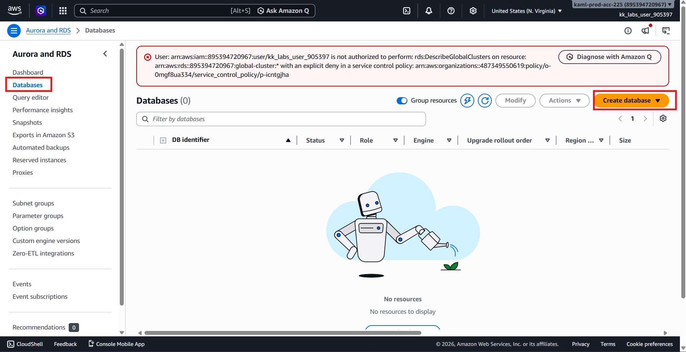

---

## ⚙️ Choose Creation Method

Select:
```text
Standard create (Full configuration)
```

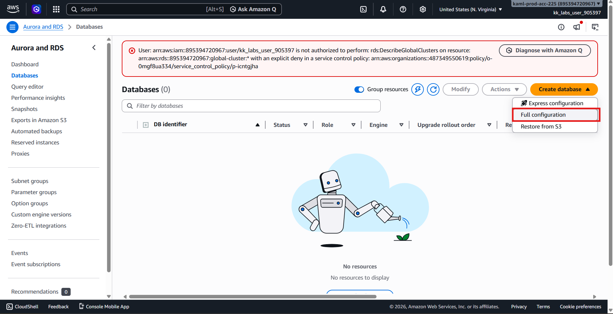
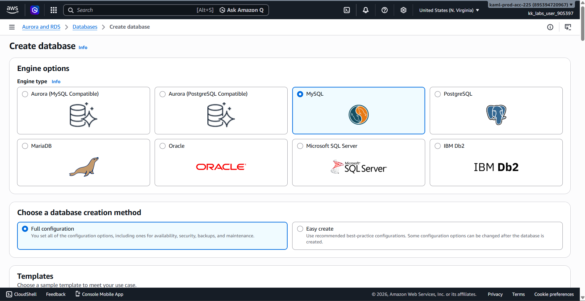

---

# 🐬 STEP 3 — Engine Selection

| Setting | Value |
|--------|------|
| Engine type | MySQL |
| Version | 8.4.x |

---

# 💰 STEP 4 — Templates

Select:
```text
Free tier
```

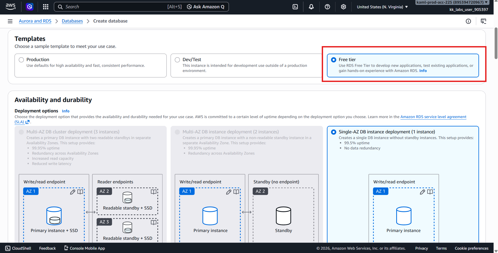
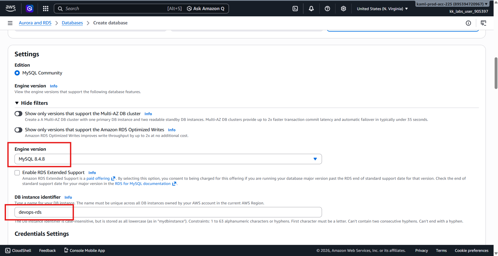

---

# 🧾 STEP 5 — DB Settings

| Setting | Value |
|--------|------|
| DB instance identifier | devops-rds |
| Master username | admin (default or keep provided) |
| Password | Set secure password |

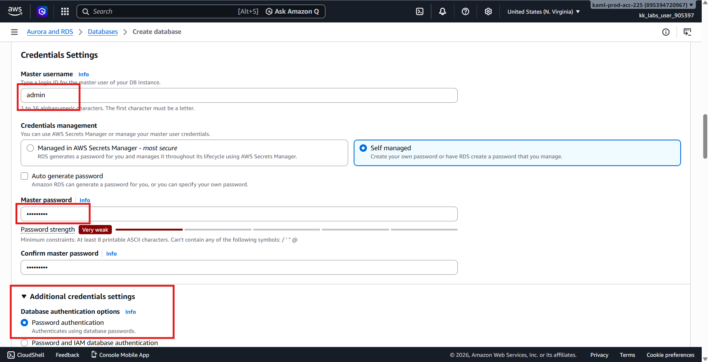

---

# 🖥️ STEP 6 — Instance Class

Select:
```text
db.t3.micro
```

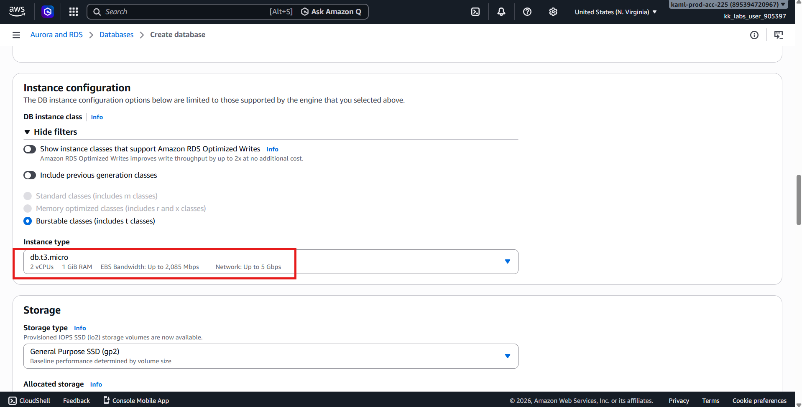

---

# 🌐 STEP 7 — Connectivity (IMPORTANT)

| Setting | Value |
|--------|------|
| Public access | ❌ No (Private DB) |
| VPC | Default or provided VPC |
| Subnet group | Default |
| Security group | default or create new |

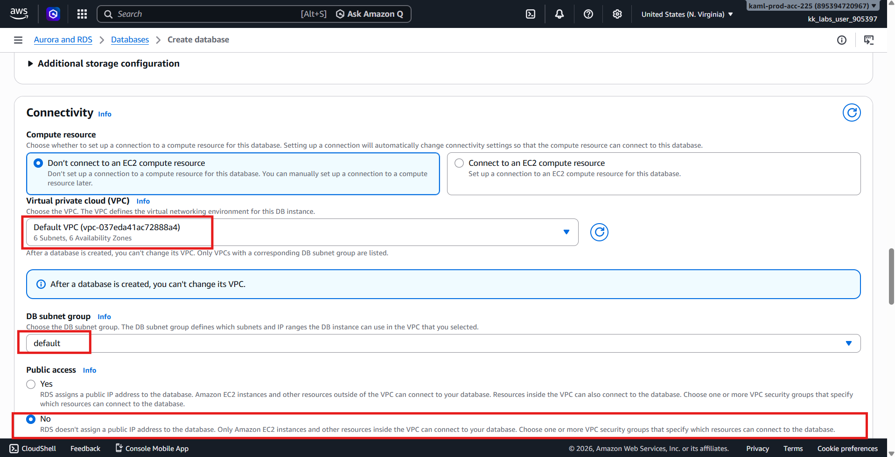
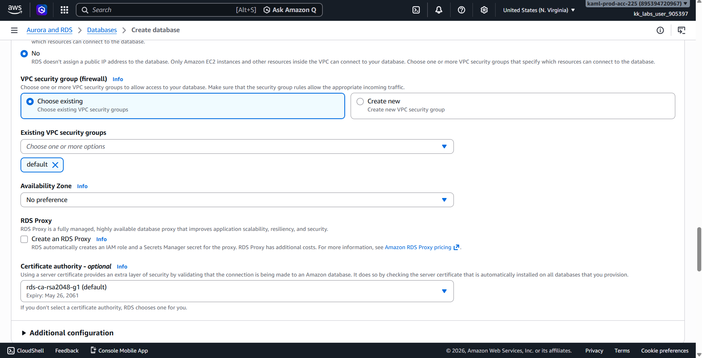

---

# 💾 STEP 8 — Storage Configuration

Enable:
```text
✔ Storage autoscaling
```

Set:
```text
Maximum threshold = 50 GB
```

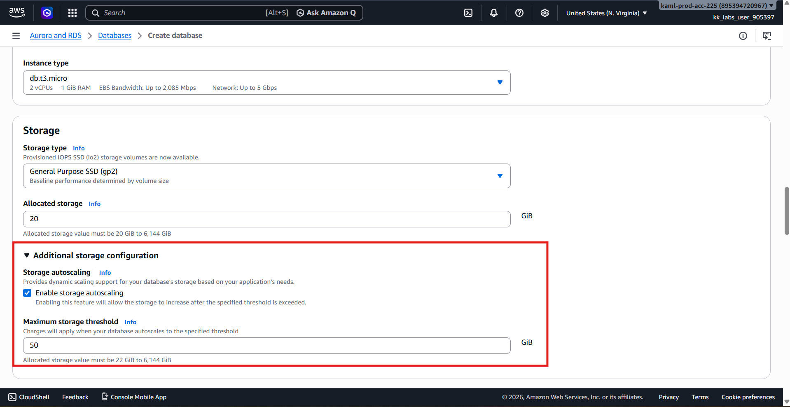

Leave everything else default.

---

# 🔐 STEP 9 — Additional Settings

Leave defaults unless required.

---

# 🚀 STEP 10 — Create Database

Click:
```text
Create database
```

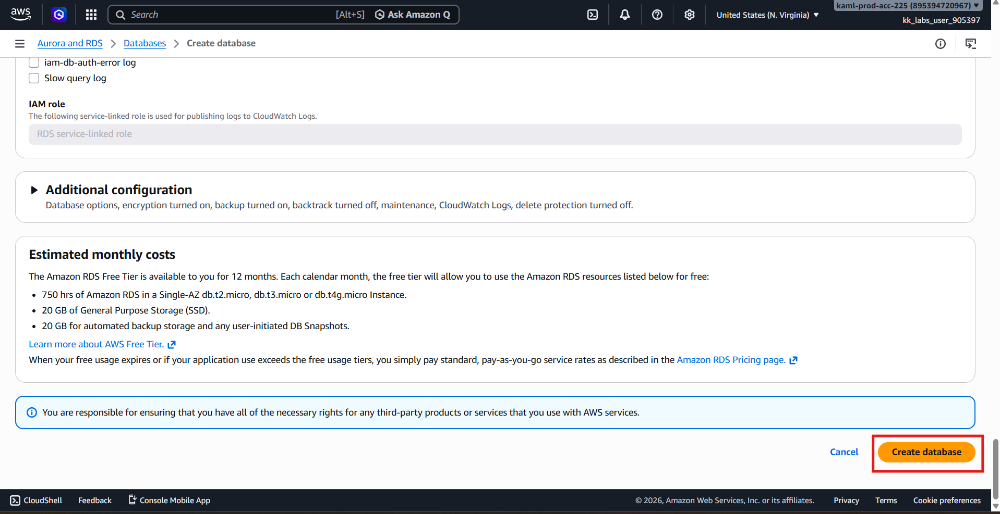

---

# ⏳ STEP 11 — Wait for Availability

Go to:
```text
RDS → Databases → devops-rds
```

Wait until status:
```text
Available
```

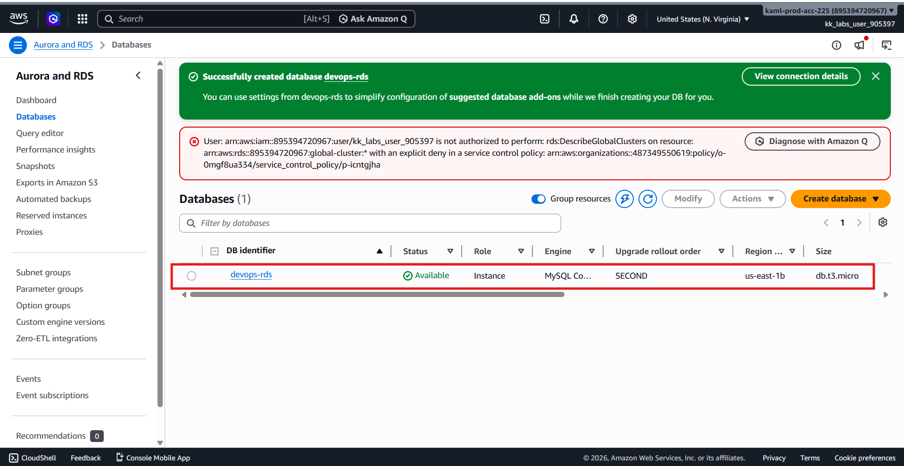

---

# 🧪 STEP 12 — Verification Checklist

| Requirement | Status |
|------------|--------|
| MySQL 8.4.x | ✅ |
| db.t3.micro | ✅ |
| Private DB | ✅ |
| Free tier template | ✅ |
| Storage autoscaling enabled | ✅ |
| Max 50 GB set | ✅ |
| Status = Available | ✅ |

---

# 🏁 Architecture Summary

``` id="rdsarch1"
Application Layer
        │
        ▼
Private RDS (devops-rds)
        │
   MySQL 8.4.x Engine
```

---

# 💡 Key Notes
Why Private RDS?
- No public internet exposure
- Secure internal DB access
- Best practice for production-like setups
