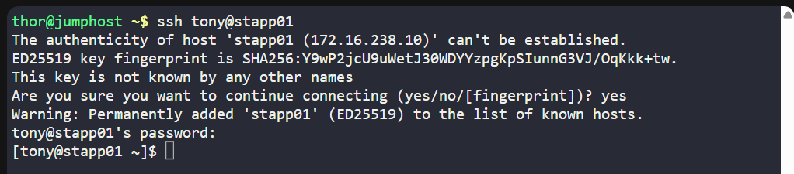
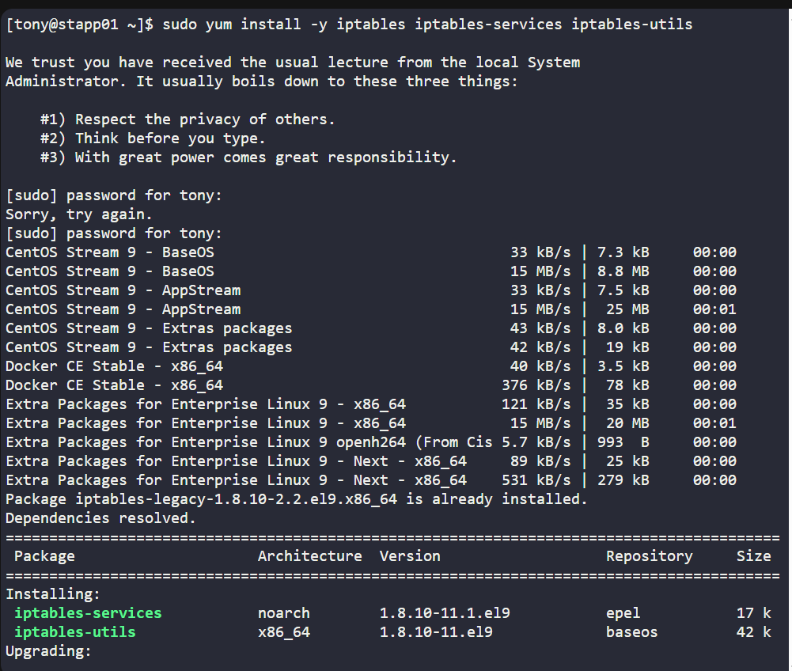
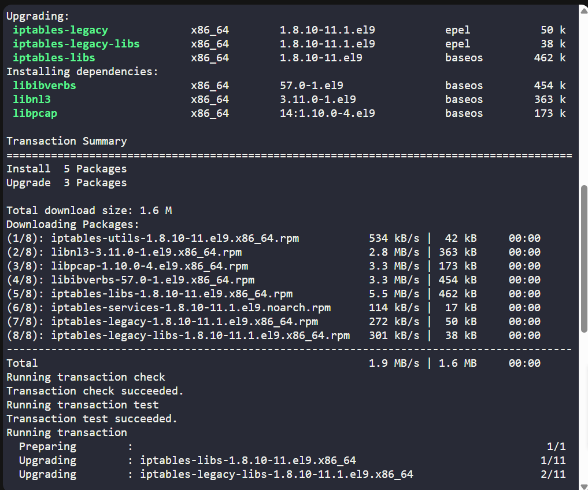
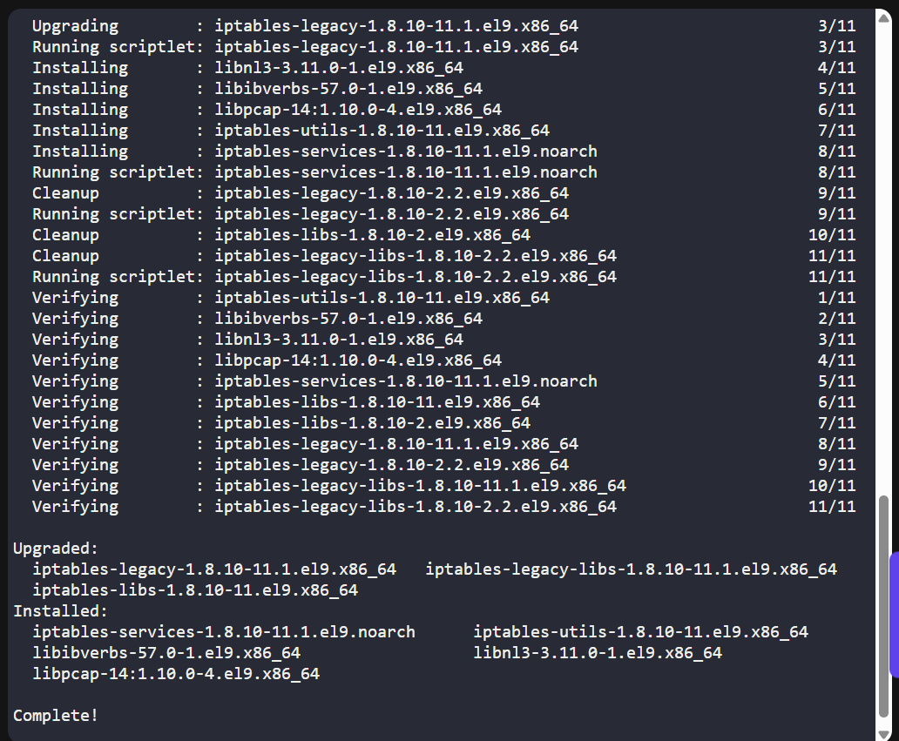
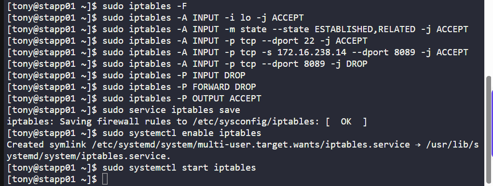
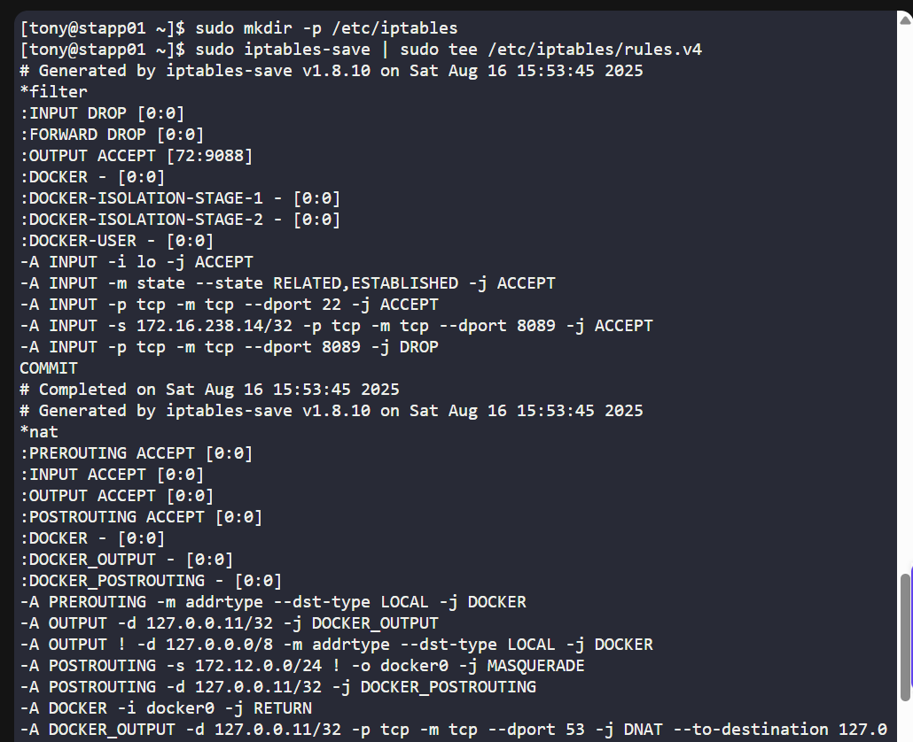
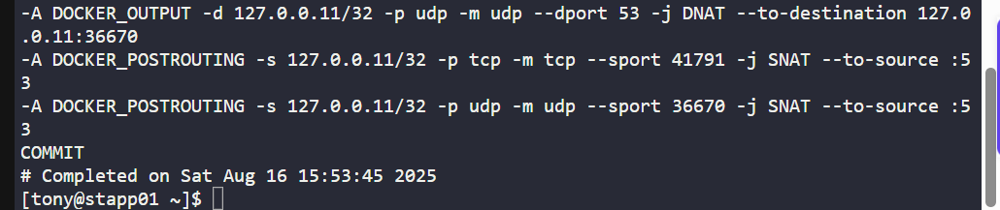
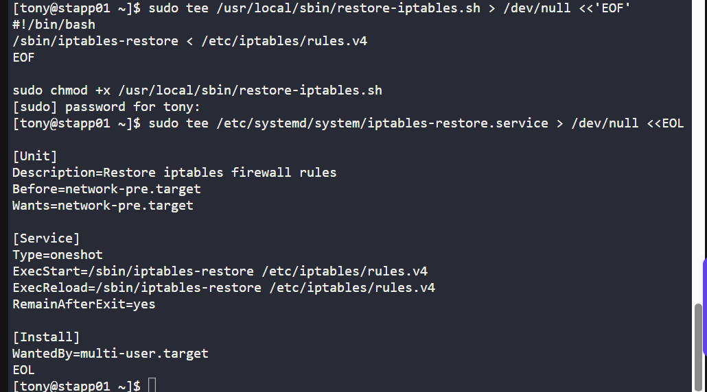
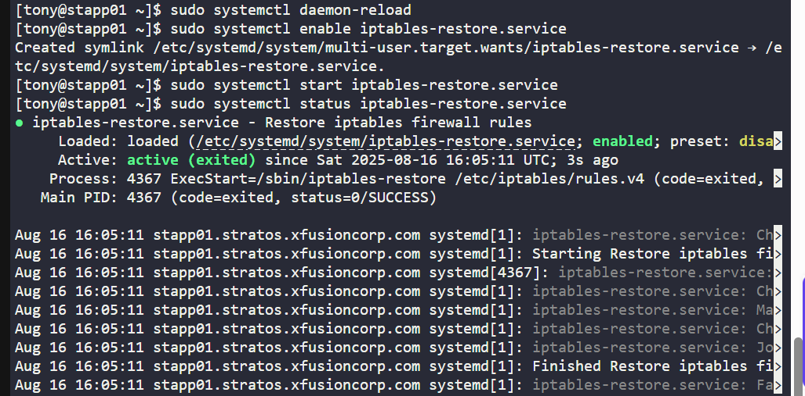

# 🧪 100 Days of DevOps – Day 13

## ✅ Task: IPtables Installation And Configuration

```text
We have one of our websites up and running on our Nautilus infrastructure in Stratos DC.
Our security team has raised a concern that right now Apache’s port
i.e 8089 is open for all since there is no firewall installed on these hosts.
So we have decided to add some security layer for these hosts and after discussions
and recommendations we have come up with the following requirements:

1. Install iptables and all its dependencies on each app host.
2. Block incoming port 8089 on all apps for everyone except for LBR host.
3. Make sure the rules remain, even after system reboot.
```

---

### ✅ Task Description
We have Apache running on port 8089. Security requirements:
- Install iptables on each App Host.
- Block incoming traffic to port 8089 for everyone except LBR host.
- Ensure rules persist after reboot.

### LBR Host Details
| Host   | IP            | FQDN                           | Username | Password | Role              |
| ------ | ------------- | ------------------------------ | -------- | -------- | ----------------- |
| stlb01 | 172.16.238.14 | stlb01.stratos.xfusioncorp.com | loki     | Mischi3f | Nautilus HTTP LBR |

---

### 🔁 Step 1: SSH into App Server 1
From the jump host, connect to App Server 1:
```bash
ssh tony@stapp01
```
- tony – username
- stapp01 – hostname of App Server 1

Enter the password when prompted:
```bash
Ir0nM@n
```



---

### 🔁 Step 2: Install iptables

```bash
sudo yum install -y iptables iptables-services iptables-utils
```





#### Description
| Part                | Description                                                                               |
| ------------------- | ----------------------------------------------------------------------------------------- |
| `sudo`              | Runs the command with superuser privileges, required to install packages system-wide.     |
| `yum`               | Package manager used in RHEL, CentOS, and Fedora to install, update, and manage software. |
| `install`           | The `yum` subcommand that installs the specified packages.                                |
| `-y`                | Automatically answers "yes" to any prompts during installation.                           |
| `iptables`          | Installs the core **iptables firewall** utility.                                          |
| `iptables-services` | Installs **service scripts** to manage iptables rules with systemd.                       |
| `iptables-utils`    | Installs additional **utilities** for managing and analyzing iptables rules.              |

> Purpose: Installs iptables and utilities to manage firewall rules.

---

### ⚙️ Step 3: Flush Existing Rules
Clear any existing rules to start fresh:

```bash
sudo iptables -F
```

#### Description
| Part       | Description                                                                                    |
| ---------- | ---------------------------------------------------------------------------------------------- |
| `sudo`     | Runs the command with superuser privileges, required to modify firewall rules.                 |
| `iptables` | The command-line tool to configure Linux kernel firewall rules.                                |
| `-F`       | **Flush**: Removes all existing rules from all chains (or from a specific chain if specified). |

> Purpose: Prevent conflicts from old firewall rules.

---

### 🔐 Step 4: Add Basic Rules

```bash
# Allow loopback
sudo iptables -A INPUT -i lo -j ACCEPT

# Allow established connections
sudo iptables -A INPUT -m state --state ESTABLISHED,RELATED -j ACCEPT

# Allow SSH
sudo iptables -A INPUT -p tcp --dport 22 -j ACCEPT

# Allow Apache port 8089 only from LBR host
sudo iptables -A INPUT -p tcp -s 172.16.238.14 --dport 8089 -j ACCEPT

# Drop all other traffic to 8089
sudo iptables -A INPUT -p tcp --dport 8089 -j DROP

# Default policies
sudo iptables -P INPUT DROP
sudo iptables -P FORWARD DROP
sudo iptables -P OUTPUT ACCEPT

# Save the rules so they persist after reboot
sudo service iptables save
sudo systemctl enable iptables
sudo systemctl start iptables
```


#### Description

| Command | Option/Flag | Description |
|---------|------------|-------------|
| `sudo iptables -A INPUT -i lo -j ACCEPT` | `-A INPUT` | Appends a rule to the INPUT chain (incoming traffic). |
| | `-i lo` | Matches the **loopback interface**. |
| | `-j ACCEPT` | Accepts all packets matching this rule. |
| **Purpose** | | Allows all **loopback traffic** within the system. |
| `sudo iptables -A INPUT -m state --state ESTABLISHED,RELATED -j ACCEPT` | `-m state` | Enables **connection state matching**. |
| | `--state ESTABLISHED,RELATED` | Matches packets that are part of **existing or related connections**. |
| | `-j ACCEPT` | Accepts these packets. |
| **Purpose** | | Ensures responses to outgoing connections are allowed. |
| `sudo iptables -A INPUT -p tcp --dport 22 -j ACCEPT` | `-p tcp` | Matches TCP packets. |
| | `--dport 22` | Destination port 22 (SSH). |
| | `-j ACCEPT` | Accepts these packets. |
| **Purpose** | | Allows **SSH access** to the server. |
| `sudo iptables -A INPUT -p tcp -s 172.16.238.14 --dport 8089 -j ACCEPT` | `-p tcp` | Matches TCP packets. |
| | `-s 172.16.238.14` | Source IP address filter (LBR host). |
| | `--dport 8089` | Destination port 8089 (Apache service). |
| | `-j ACCEPT` | Accepts these packets. |
| **Purpose** | | Only allows access to **port 8089** from the specific LBR host. |
| `sudo iptables -A INPUT -p tcp --dport 8089 -j DROP` | `-p tcp` | Matches TCP packets. |
| | `--dport 8089` | Destination port 8089. |
| | `-j DROP` | Drops all other packets. |
| **Purpose** | | Blocks **all other incoming traffic** to port 8089. |
| `sudo iptables -P INPUT DROP` | `-P INPUT` | Sets default policy for INPUT chain. |
| | `DROP` | Drops any incoming traffic that does not match previous rules. |
| **Purpose** | | Default deny all incoming traffic. |
| `sudo iptables -P FORWARD DROP` | `-P FORWARD` | Sets default policy for FORWARD chain. |
| | `DROP` | Drops all forwarded packets. |
| **Purpose** | | Prevents packet forwarding through the server. |
| `sudo iptables -P OUTPUT ACCEPT` | `-P OUTPUT` | Sets default policy for OUTPUT chain. |
| | `ACCEPT` | Allows all outgoing packets. |
| **Purpose** | | Lets the server send traffic freely. |


**Purpose:**
- Loopback and SSH are essential for system management.
- Only the LBR host can reach Apache on port 8089.
- All other incoming connections are blocked.

---

### 💾 Step 5: Save iptables Rules
Ensure rules persist after reboot:

```bash
sudo mkdir -p /etc/iptables
sudo iptables-save | sudo tee /etc/iptables/rules.v4
```




#### Description

| Part            | Description                                                                                 |
| --------------- | ------------------------------------------------------------------------------------------- |
| `sudo`          | Runs the command with superuser privileges, required to create directories in system paths. |
| `mkdir`         | Command to **create a new directory**.                                                      |
| `-p`            | Creates parent directories as needed; prevents errors if `/etc/iptables` doesn’t exist.     |
| `/etc/iptables` | Target directory to store iptables rules.                                                   |

| Part                         | Description                                                                                |                                                                         |
| ---------------------------- | ------------------------------------------------------------------------------------------ | ----------------------------------------------------------------------- |
| `sudo`                       | Runs the command with superuser privileges, required to read and write firewall rules.     |                                                                         |
| `iptables-save`              | Outputs the **current iptables configuration** in a format suitable for restoration.       |                                                                         |
| \`                           | \`                                                                                         | Pipe operator: sends the output of `iptables-save` to the next command. |
| `tee /etc/iptables/rules.v4` | Writes the output to the file `/etc/iptables/rules.v4` and also prints it to the terminal. |                                                                         |
| `sudo tee`                   | Ensures the `tee` command has permission to write to a system directory.                   |                                                                         |


**Purpose:**
- The first command ensures a directory exists to store iptables rules.
- The second command saves the current firewall configuration to a file so it can be restored after reboot.

---

### ✅ Step 6: Create a wrapper script for systemd
Systemd fails because input redirection < /etc/iptables/rules.v4 is a shell feature. Use a small script:
```bash
sudo tee /usr/local/sbin/restore-iptables.sh > /dev/null <<'EOF'
#!/bin/bash
/sbin/iptables-restore < /etc/iptables/rules.v4
EOF

sudo chmod +x /usr/local/sbin/restore-iptables.sh
```

### 🛠️ Step 7: Create systemd service pointing to the script
Create a systemd service to restore rules on boot:

```bash
sudo tee /etc/systemd/system/iptables-restore.service > /dev/null <<EOL
[Unit]
Description=Restore iptables firewall rules
Before=network-pre.target
Wants=network-pre.target

[Service]
Type=oneshot
ExecStart=/sbin/iptables-restore /etc/iptables/rules.v4
ExecReload=/sbin/iptables-restore /etc/iptables/rules.v4
RemainAfterExit=yes

[Install]
WantedBy=multi-user.target
EOL
```



#### Description

| Part                                                            | Description                                                                                        |
| --------------------------------------------------------------- | -------------------------------------------------------------------------------------------------- |
| `sudo`                                                          | Runs the command with **superuser privileges**, required to create files in `/etc/systemd/system`. |
| `tee /etc/systemd/system/iptables-restore.service > /dev/null`  | Writes the input to the service file. `> /dev/null` hides terminal output.                         |
| `<<EOF ... EOF`                                                 | **Here-document**: multi-line input redirected to the service file.                                |
| `[Unit]`                                                        | Section for service metadata and dependencies.                                                     |
| `Description`                                                   | Provides a short description of the service.                                                       |
| `Before=network.target`                                         | Ensures the service runs **before the network is fully up**.                                       |
| `[Service]`                                                     | Defines how the service runs.                                                                      |
| `Type=oneshot`                                                  | Service runs **once and exits**.                                                                   |
| `ExecStart=/usr/sbin/iptables-restore < /etc/iptables/rules.v4` | Command executed by the service: restores iptables rules from the saved file.                      |
| `RemainAfterExit=yes`                                           | Marks the service as active even after the command completes.                                      |
| `[Install]`                                                     | Section defining how the service is installed/enabled.                                             |
| `WantedBy=multi-user.target`                                    | Starts the service automatically during **multi-user mode** (system boot).                         |

> Purpose: Systemd service ensures rules from /etc/iptables/rules.v4 are applied at boot.

---

### 🔁 Step 8: Enable and Start Service

```bash
sudo systemctl daemon-reload
sudo systemctl enable iptables-restore.service
sudo systemctl start iptables-restore.service
sudo systemctl status iptables-restore.service
```



#### Description
| Part | Description |
|------|-------------|
| `sudo` | Runs the command with superuser privileges. |
| `systemctl daemon-reload` | Reloads systemd to recognize **new or changed service files**. |
| `systemctl enable iptables-restore.service` | Ensures the service **automatically starts on system boot**. |
| `systemctl start iptables-restore.service` | Starts the service immediately, restoring iptables rules. |
| `systemctl status iptables-restore.service` | Displays **current status** of the service, including whether it ran successfully or has errors. |

**Summary**
- Reload systemd to recognize the new service.
- Enable the service to run at boot.
- Start it immediately to restore firewall rules.
- Check the service status to ensure it is active and functioning.
  
---

### 4️⃣ Step 9: Test connectivity
From jump host:
```bash
curl http://stapp01:8089
```
- Only LBR host IP (e.g., 172.16.238.14) should reach Apache.
- All other hosts should be blocked.

---

### Connect to Each Server then Repeat Steps 2-9

---

## ✅ Task Complete!
