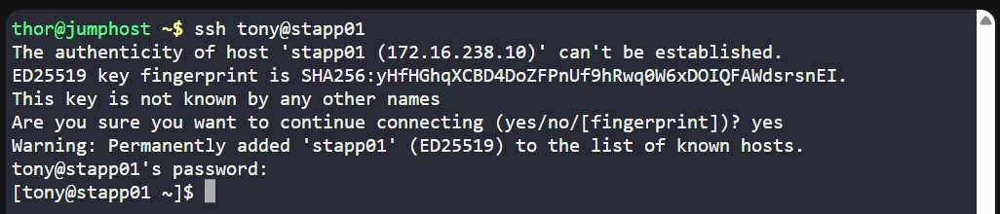
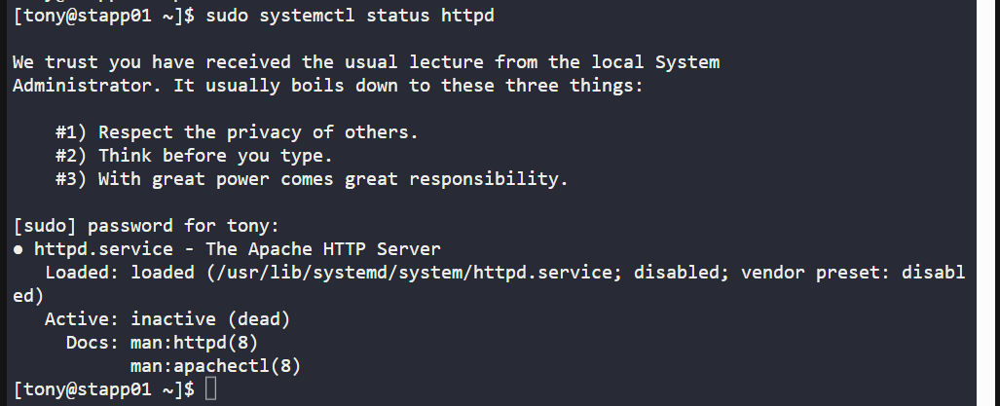
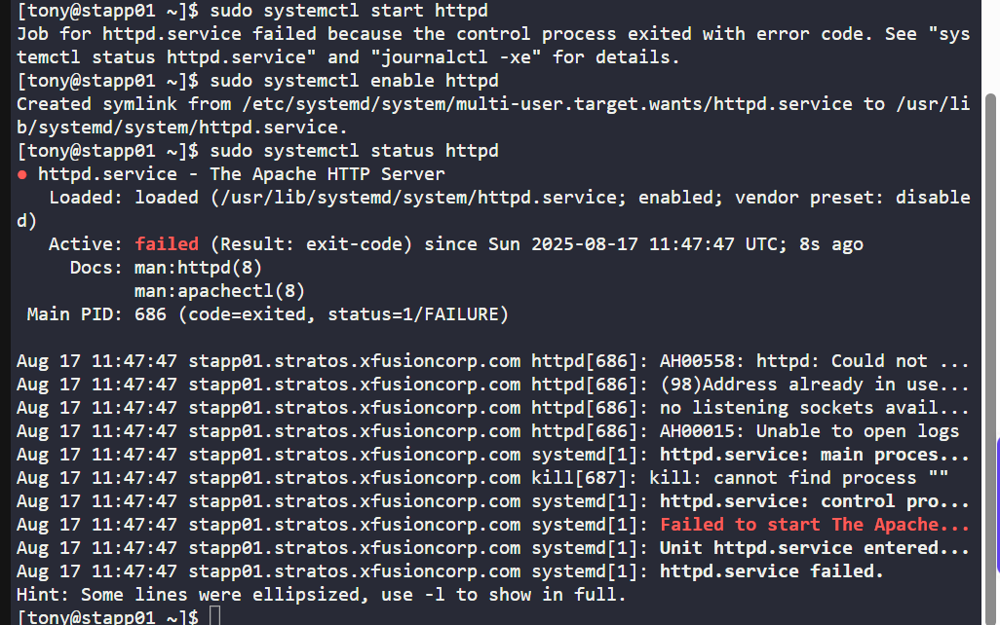
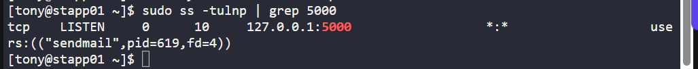
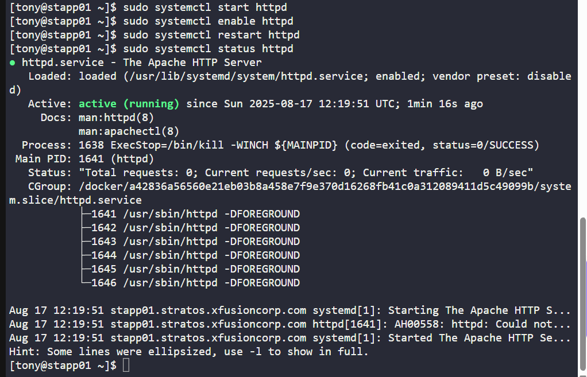
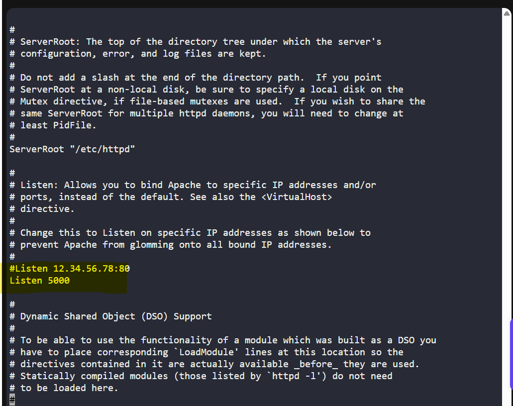
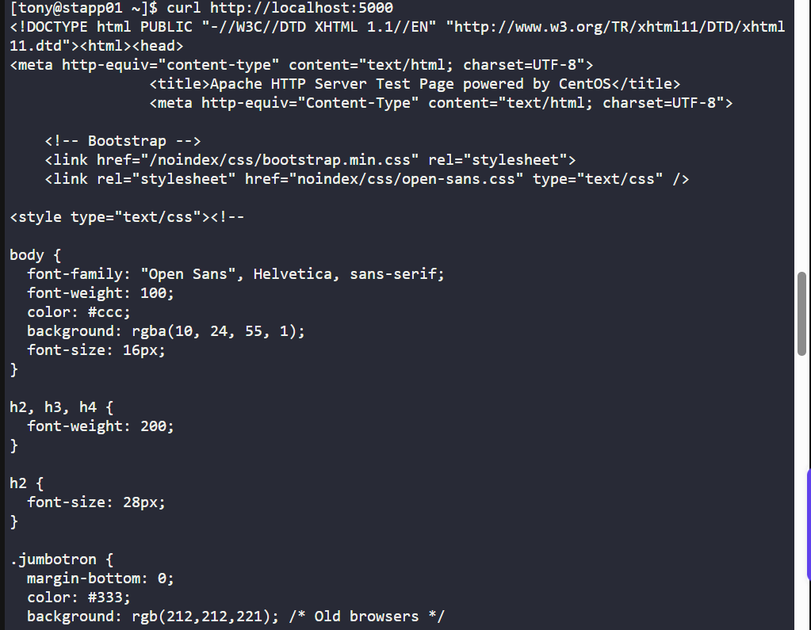

# 🧪 100 Days of DevOps – Day 14 

## ✅ Task: Linux Process Troubleshooting

```text
The production support team of xFusionCorp Industries has deployed
some of the latest monitoring tools to keep an eye on every service,
application, etc. running on the systems. One of the monitoring systems
reported about Apache service unavailability on one of the app servers in Stratos DC.

Identify the faulty app host and fix the issue. Make sure Apache service is 
\up and running on all app hosts. They might not have hosted any code yet 
on these servers, so you don’t need to worry if Apache isn’t serving any pages.
Just make sure the service is up and running. Also, make sure Apache is running
on port 5000 on all app servers.
```

---

tasks:  
1. Identify the faulty app host.  
2. Ensure Apache service is running on all app servers.  
3. Make sure Apache listens on port 5000 on each app server.  
(No need to host code — just ensure Apache is active and configured correctly.)

---

### 🔁 Step 1: SSH into Each App Server
From the jump host, connect to each server and check status:
Let's start at Server 1

```bash
ssh tony@stapp01
```

Password
```bash
Ir0nM@n
```



---

### 🔁 Step 2: Start & Enable Apache if Down
Check Apache service status:

```bash
sudo systemctl status httpd
```



since the service is inactive/failed, run:

```bash
sudo systemctl start httpd
sudo systemctl enable httpd
```

verify the status

```bash
sudo systemctl status httpd
```



since the status is failed to start, then lets move to next step

### Description

| Part              | Description                                                                 |
| ----------------- | --------------------------------------------------------------------------- |
| `sudo`            | Runs the command with **superuser privileges** (administrative rights).     |
| `systemctl`       | The tool used to **control and manage systemd services**.                   |
| `start`           | Subcommand to **start a service immediately**.                              |
| `enable`          | Subcommand to **enable a service at boot time** (start automatically).      |
| `status`          | Subcommand to **check the current state** of a service (running, stopped).  |
| `httpd`           | The **Apache HTTP Server service** being managed.                           |


---

### ⚙️ Step 3: See what process is using port 5000

```bash
sudo ss -tulnp | grep 5000
```



based on output
```bash
tcp    LISTEN     0      10     127.0.0.1:5000                  *:*                   users:(("sendmail",pid=619,fd=4))
```
That means port 5000 is already being used by sendmail, so Apache (httpd) cannot bind to it.


### Description

| Part           | Description                                                                 |
| -------------- | --------------------------------------------------------------------------- |
| `sudo`         | Runs the command with **superuser privileges**.                             |
| `ss`           | Displays **socket statistics** (replacement for the older `netstat`).       |
| `-t`           | Shows **TCP sockets**.                                                      |
| `-u`           | Shows **UDP sockets**.                                                      |
| `-l`           | Displays only **listening sockets**.                                        |
| `-n`           | Shows addresses and ports as **numbers** instead of resolving names.        |
| `-p`           | Displays the **process (PID and name)** using the socket.                   |
| `|`            | Pipe operator: sends the output of `ss -tulnp` as input to the next command.|
| `grep 5000`    | Filters the output to show only lines containing **port 5000**.             |
| **Purpose**    | Check if any process is listening on **port 5000**, and display its details.|

---

### ⚙️ Step 4: Stop Sendmail
stop sendmail and set port 5000 for Apache
```bash
sudo systemctl stop sendmail
sudo systemctl disable sendmail   # optional, prevents it from starting at boot
```


### Description

| Command     | Breakdown      | Meaning                                                           | Status/Effect                                                   |
| ----------- | -------------- | ----------------------------------------------------------------- | --------------------------------------------------------------- |
| `sudo`      | Super User DO  | Run the command with administrative/root privileges               | Needed because stopping/disabling services requires root access |
| `systemctl` | System Control | Manages systemd services (start/stop/enable/disable/status, etc.) | Used to control `sendmail` service                              |
| `stop`      | Action         | Immediately stops the service                                     | `sendmail` is stopped (no longer running)                       |
| `disable`   | Action         | Disables service from starting automatically at boot              | `sendmail` won’t start again on system reboot                   |
| `sendmail`  | Service Name   | The mail transfer agent (MTA) service                             | Target service being stopped/disabled                           |


---

### 🔁 Step 5: Start & Enable Apache Again

```bash
sudo systemctl start httpd
sudo systemctl enable httpd
```

then restart

```bash
sudo systemctl restart httpd
```

then verify
```bash
sudo systemctl status httpd
```




---

### ⚙️ Step 6: Configure Apache to Listen on Port 5000
Open Apache configuration file:

```bash
sudo vi /etc/httpd/conf/httpd.conf
```



check if Apache config listen to port 5000

> Upon checking, Apache listen to port 5000

### Description

| **Command**                  | **Meaning**   | **Details**                                                               |
| ---------------------------- | ------------- | ------------------------------------------------------------------------- |
| `sudo`                       | Superuser Do  | Runs the command with administrator/root privileges.                      |
| `vi`                         | Visual Editor | Opens the **Vi editor** (a text-based editor available in Linux).         |
| `/etc/httpd/conf/httpd.conf` | File Path     | This is the **main configuration file** for Apache HTTP Server (`httpd`). |

---

### 🔁 Step 7: Update SELinux/Firewall Rules (if enabled)

Add port 5000 to Apache in SELinux
```bash
sudo semanage port -a -t http_port_t -p tcp 5000 || \
sudo semanage port -m -t http_port_t -p tcp 5000
```

Allow port 5000 through firewall (if running)
```bash
sudo firewall-cmd --permanent --add-port=5000/tcp
sudo firewall-cmd --reload
```


> Output: Firewall is not enabled, therefore skip this part.

---

### 🔁 Step 8: Restart and Check Apache

Restart Apache:
```bash
sudo systemctl restart httpd
```

Check if Apache is listening on port 5000:
```bash
sudo ss -tulnp | grep httpd
```

### Description

| **Command**      | **Breakdown**     | **Explanation**                                                                                                                                                                                |                                                             |
| ---------------- | ----------------- | ---------------------------------------------------------------------------------------------------------------------------------------------------------------------------------------------- | ----------------------------------------------------------- |
| `sudo`           | Superuser Do      | Runs the command with root (administrator) privileges.                                                                                                                                         |                                                             |
| `ss`             | Socket Statistics | Utility to investigate sockets (replacement for `netstat`).                                                                                                                                    |                                                             |
| `-tulnp`         | Options           | `-t`: show TCP sockets <br> `-u`: show UDP sockets <br> `-l`: show only listening sockets <br> `-n`: show addresses/ports as numbers instead of names <br> `-p`: show process using the socket |                                                             |
| \`               | \`                | Pipe                                                                                                                                                                                           | Sends the output of the `ss` command into the next command. |
| `grep httpd`     | Search            | Filters the output to only show lines that contain `httpd` (Apache web server process).                                                                                                        |                                                             |
| `\` (at the end) | Escape            | Prevents the shell from interpreting special characters after `httpd`. In this case, it’s optional — `grep httpd` works fine without it.                                                       |                                                             |


---

### ✅ Repeat Steps 1-8 for Server 2 and Server 3

---

### ✅ Step 9: Verify on All App Servers
test locally:
```bash
curl http://localhost:5000
```


> Got the default web response. Task now is completed.

