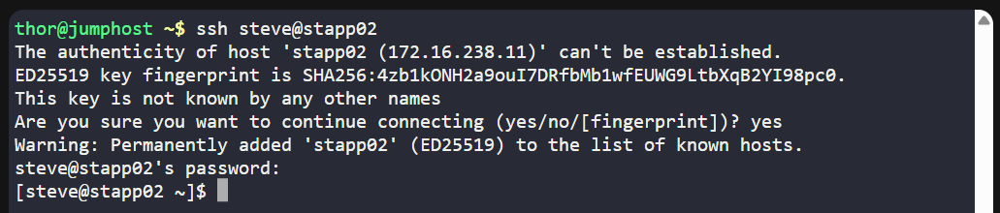
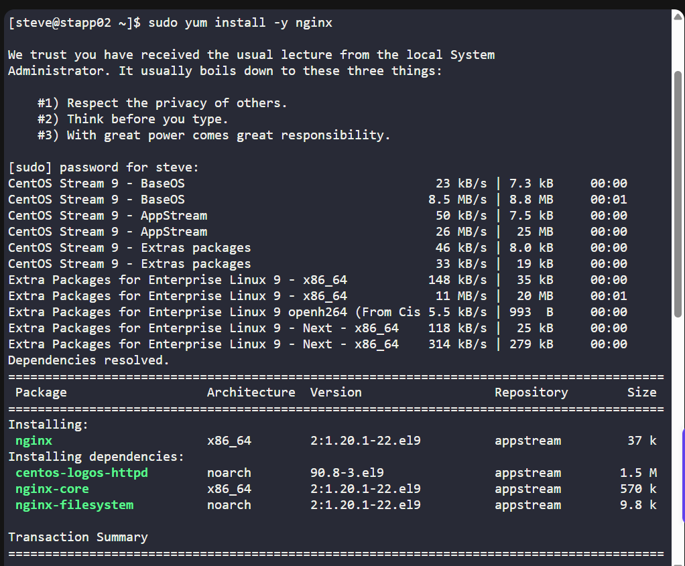
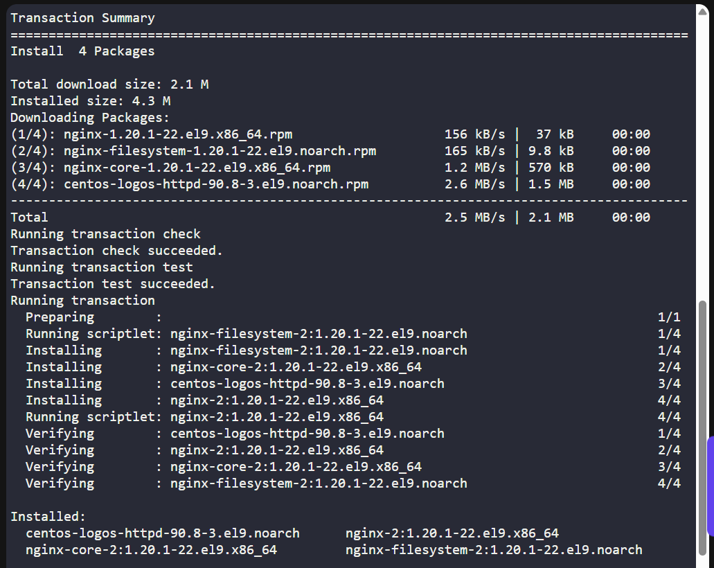
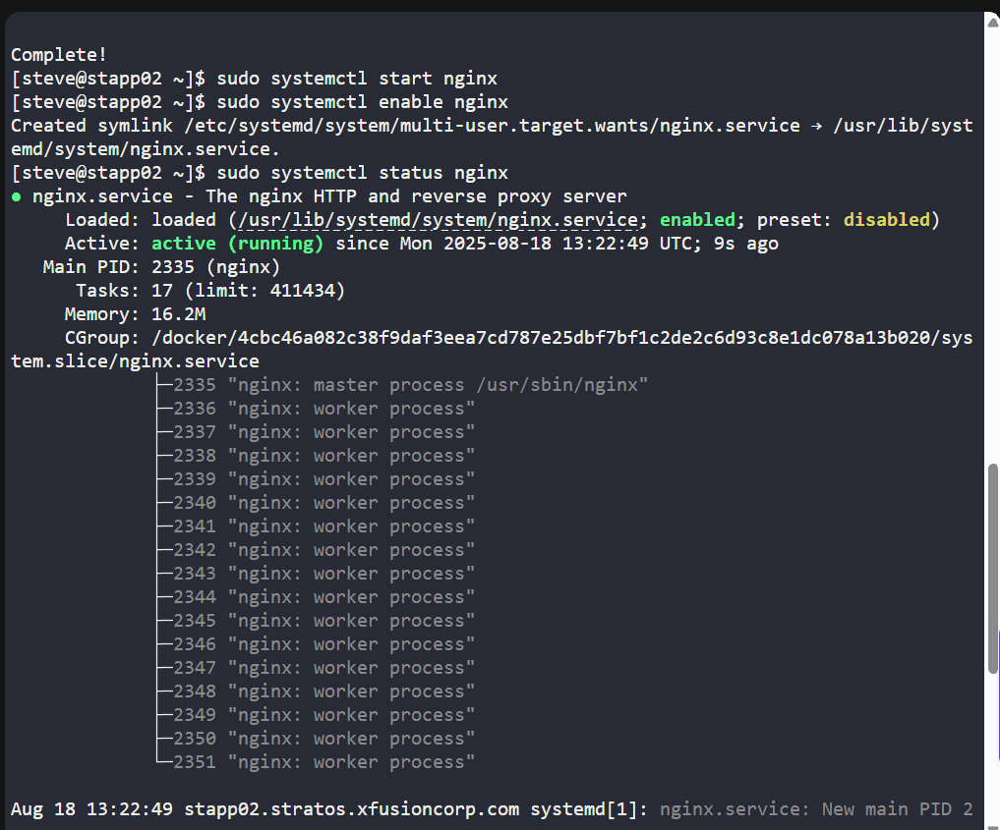
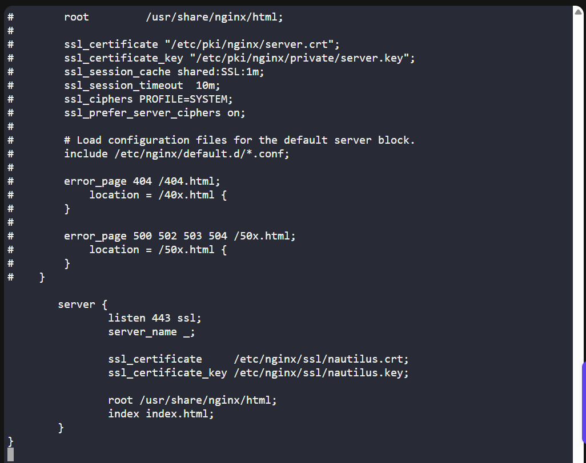
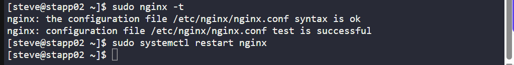
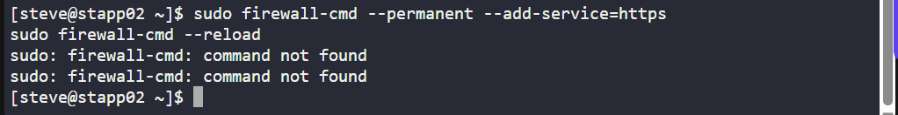
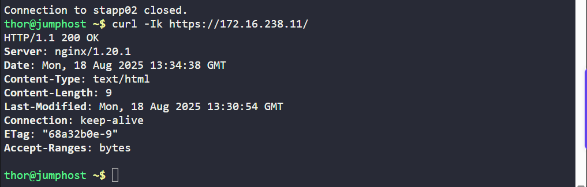

# 🧪 100 Days of DevOps – Day 15 

## ✅ Setup SSL for Nginx

```text
The system admins team of xFusionCorp Industries needs to deploy a
new application on App Server 2 in Stratos Datacenter.
They have some pre-requites to get ready that server for application deployment.
Prepare the server as per requirements shared below:

1. Install and configure nginx on App Server 2.
2. On App Server 2 there is a self signed SSL certificate and
key present at location /tmp/nautilus.crt and /tmp/nautilus.key.
Move them to some appropriate location and deploy the same in Nginx.
3. Create an index.html file with content Welcome! under Nginx document root.
4. For final testing try to access the App Server 2 link (either hostname or IP)
from jump host using curl command. For example curl -Ik https://<app-server-ip>/.
```

---

### Tasks

1. Install and configure Nginx.
2. Deploy the provided SSL certificate and key.
3. Create index.html with Welcome!.
4. Verify access with curl -Ik https://<app-server-2-ip>/.

---

### 🔁 Step 1: SSH into App Server 2
From the jump host:
```bash
ssh steve@stapp02
```

Password:
```bash
Am3ric@  
```



---

### 🔁 Step 2: Install & Enable Nginx

```bash
sudo yum install -y nginx
sudo systemctl start nginx
sudo systemctl enable nginx
```





Verify

```bash
sudo systemctl status nginx
```



> The nginx service is now active(running).

#### Description

| Command                       | Breakdown                                                                                                                   | Explanation                                                                                                             | Status/Effect                                 |
| ----------------------------- | --------------------------------------------------------------------------------------------------------------------------- | ----------------------------------------------------------------------------------------------------------------------- | --------------------------------------------- |
| `sudo yum install -y nginx`   | `sudo` (run as root) + `yum` (package manager) + `install` (install package) + `-y` (auto confirm) + `nginx` (package name) | Installs **nginx** web server without asking for confirmation.                                                          | Installs nginx package successfully.          |
| `sudo systemctl start nginx`  | `sudo` (root) + `systemctl` (systemd tool) + `start` (start service) + `nginx` (service name)                               | Starts the **nginx** service immediately.                                                                               | nginx is running.                             |
| `sudo systemctl enable nginx` | `sudo` (root) + `systemctl` (systemd tool) + `enable` (enable on boot) + `nginx` (service name)                             | Ensures nginx will automatically start on system boot.                                                                  | nginx set to auto-start.                      |
| `sudo systemctl status nginx` | `sudo` (root) + `systemctl` (systemd tool) + `status` (show status) + `nginx` (service name)                                | Displays the current status of the **nginx** service, including whether it is **active (running)**, stopped, or failed. | Shows nginx state (running, dead, or failed). |

---

### ⚙️ Step 3: Deploy SSL Certificate

Move SSL files to a secure location:
```bash
sudo mkdir -p /etc/nginx/ssl
sudo mv /tmp/nautilus.crt /etc/nginx/ssl/
sudo mv /tmp/nautilus.key /etc/nginx/ssl/
sudo chmod 600 /etc/nginx/ssl/nautilus.*
```


#### Description: 

| Command                                     | Word/Flag Breakdown                                                                                                                                                     | Purpose                                                              | Status/Effect                                                   |
| ------------------------------------------- | ----------------------------------------------------------------------------------------------------------------------------------------------------------------------- | -------------------------------------------------------------------- | --------------------------------------------------------------- |
| `sudo mkdir -p /etc/nginx/ssl`              | `sudo` = run as superuser<br>`mkdir` = make directory<br>`-p` = create parent dirs if not exist<br>`/etc/nginx/ssl` = target path                                       | Creates the `/etc/nginx/ssl` directory (and parent dirs if missing). | Directory is created (idempotent – no error if already exists). |
| `sudo mv /tmp/nautilus.crt /etc/nginx/ssl/` | `sudo` = superuser<br>`mv` = move file<br>`/tmp/nautilus.crt` = source file<br>`/etc/nginx/ssl/` = destination dir                                                      | Moves the SSL certificate `nautilus.crt` into `/etc/nginx/ssl/`.     | Cert is relocated to Nginx SSL directory.                       |
| `sudo mv /tmp/nautilus.key /etc/nginx/ssl/` | `sudo` = superuser<br>`mv` = move file<br>`/tmp/nautilus.key` = source file<br>`/etc/nginx/ssl/` = destination dir                                                      | Moves the SSL private key `nautilus.key` into `/etc/nginx/ssl/`.     | Key is relocated to Nginx SSL directory.                        |
| `sudo chmod 600 /etc/nginx/ssl/nautilus.*`  | `sudo` = superuser<br>`chmod` = change permissions<br>`600` = owner can read/write, others no access<br>`/etc/nginx/ssl/nautilus.*` = applies to both `.crt` and `.key` | Restricts access to SSL cert and key so only root can read/write.    | Files become secure with permissions: `-rw-------`.             |


then Update Nginx config:
```bash
sudo vi /etc/nginx/nginx.conf
```

Add a server block:
```nginx
server {
    listen 443 ssl;
    server_name _;

    ssl_certificate     /etc/nginx/ssl/nautilus.crt;
    ssl_certificate_key /etc/nginx/ssl/nautilus.key;

    root /usr/share/nginx/html;
    index index.html;
}
```



#### Description

| **Configuration**                                  | **Explanation**                                                                                                                                   |
| -------------------------------------------------- | ------------------------------------------------------------------------------------------------------------------------------------------------- |
| `server { ... }`                                   | Defines a **server block** in Nginx. Each server block handles requests for a specific domain, IP, or port.                                       |
| `listen 443 ssl;`                                  | Tells Nginx to listen on **port 443** (default port for HTTPS) and enable **SSL/TLS encryption**.                                                 |
| `server_name _;`                                   | The **server\_name** directive specifies which domain names this block should handle. `_` is a **catch-all** (default) if no other block matches. |
| `ssl_certificate /etc/nginx/ssl/nautilus.crt;`     | Path to the **SSL certificate file** (public certificate) that authenticates the server.                                                          |
| `ssl_certificate_key /etc/nginx/ssl/nautilus.key;` | Path to the **private key** file used with the certificate for encryption/decryption.                                                             |
| `root /usr/share/nginx/html;`                      | Specifies the **root directory** where the website files are located (default Nginx web root).                                                    |
| `index index.html;`                                | Sets the **default index file** to serve when a client requests `/`. In this case, `index.html`.                                                  |


Test config and restart:
```bash
sudo nginx -t
sudo systemctl restart nginx
```



#### Description

| Command                        | Explanation                                                                                                                                                                     |
| ------------------------------ | ------------------------------------------------------------------------------------------------------------------------------------------------------------------------------- |
| `sudo nginx -t`                | Tests the **Nginx configuration file** for syntax errors and validity without restarting the service. If there are no issues, it shows `syntax is ok` and `test is successful`. |
| `sudo systemctl restart nginx` | Restarts the **Nginx service** so that any configuration changes take effect. This stops the service and starts it again.                                                       |

---

### 🔁 Step 4: Create index.html
```bash
echo "Welcome!" | sudo tee /usr/share/nginx/html/index.html
```


#### Description

| Command                                     | Explanation                                                                                                                                                                     |
| ------------------------------------------- | ------------------------------------------------------------------------------------------------------------------------------------------------------------------------------- |
| `echo "Welcome!"`                           | Prints the text **"Welcome!"** to standard output.                                                  |               
| `I` (Pipe)                                  |  Sends the output of the left command (`echo`) as input to the right command (`tee`).               |
| `sudo tee /usr/share/nginx/html/index.html` | Runs `tee` with elevated privileges to **write the text into the file** `/usr/share/nginx/html/index.html`. If the file already exists, it will be overwritten with `Welcome!`. |                                                                                      |

---

### 🔁 Step 5: Adjust Firewall (if enabled)
```bash
sudo firewall-cmd --permanent --add-service=https
sudo firewall-cmd --reload
```
> firewall is disabled, disregard this part.



---

### 🔁 Step 6: Verify SSL with curl
From the jump host:
```bash
curl -Ik https://172.16.238.11/
```

expected:
```bash
HTTP/1.1 200 OK
Server: nginx/1.x.x
Content-Type: text/html
```



#### Description

| Command                  | Explanation                                                                                      |
| ------------------------ | ------------------------------------------------------------------------------------------------ |
| `curl`                   | A command-line tool to transfer data to/from a server, often used to test endpoints.             |
| `-I`                     | Fetches only the HTTP response **headers** (no body/content). Equivalent to a `HEAD` request.    |
| `-k`                     | Allows `curl` to ignore SSL certificate validation errors (useful for self-signed certificates). |
| `https://172.16.238.11/` | The target URL (here it’s the HTTPS IP address of the Nginx server).                             |

---

## ✅ Task Completed
- Nginx installed & running
- SSL deployed with provided cert/key
- Index page created (`Welcome!`)
- Verified via `curl` over `HTTPS`
