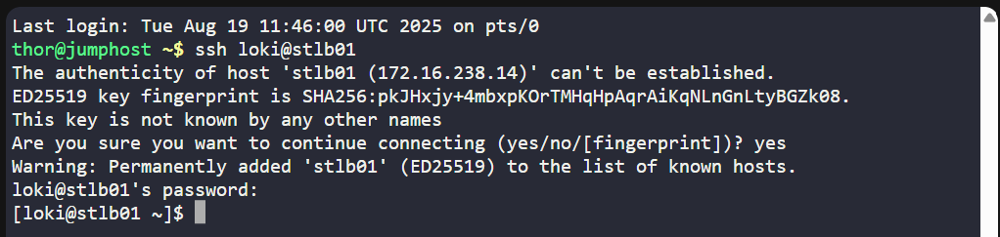
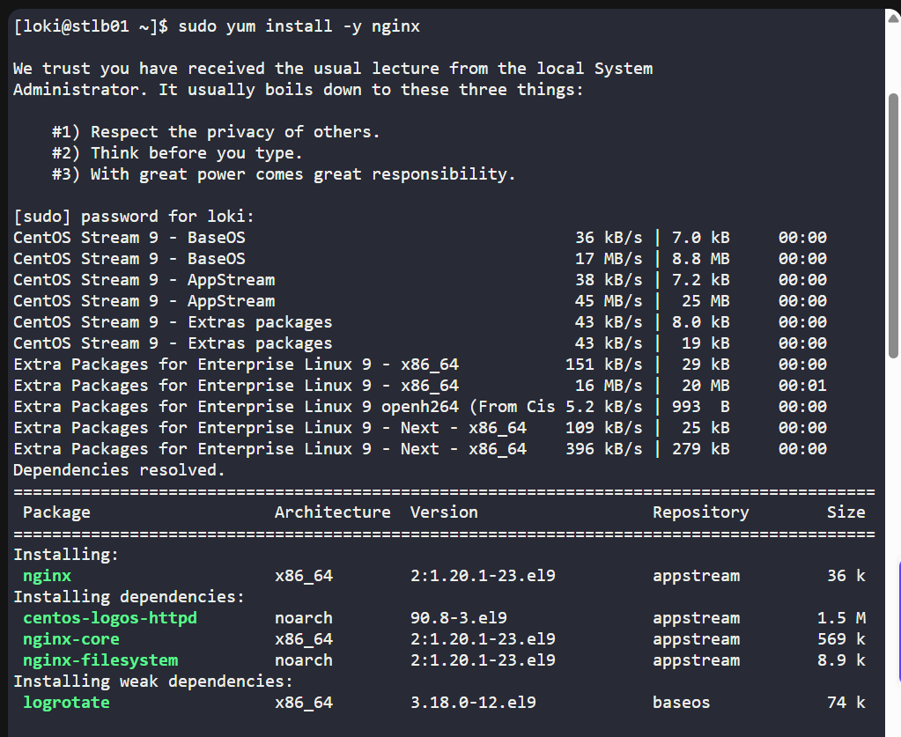
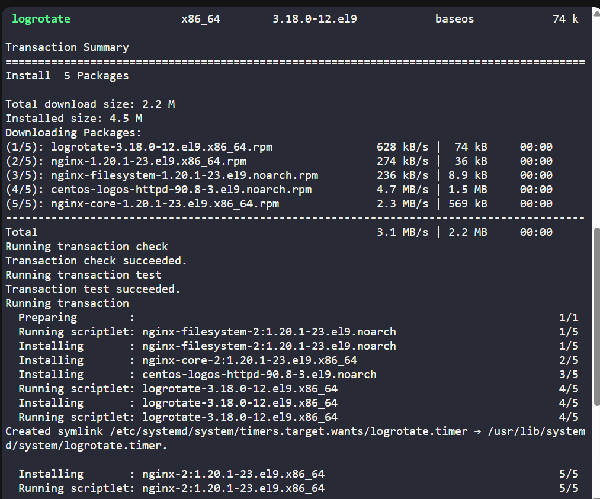
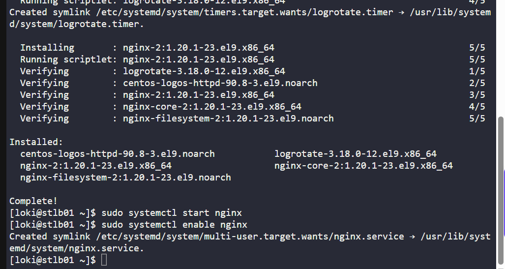
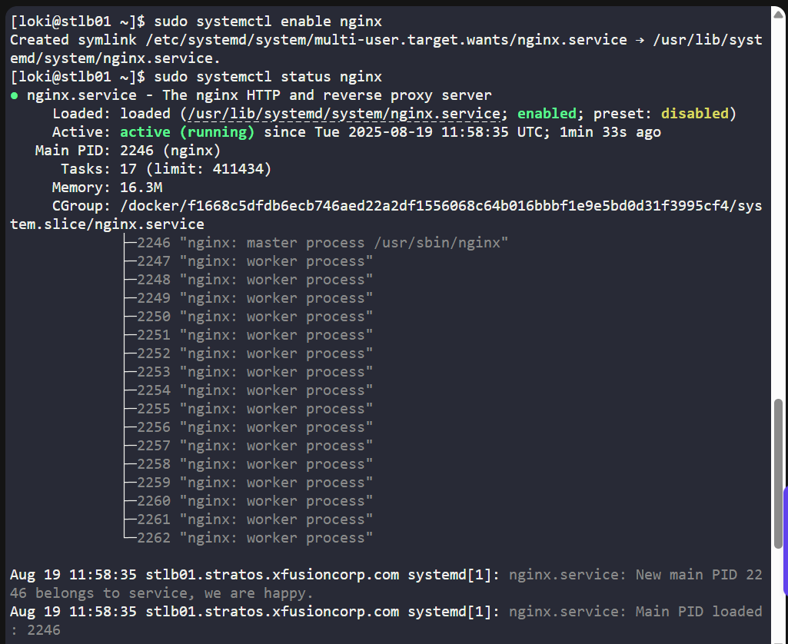
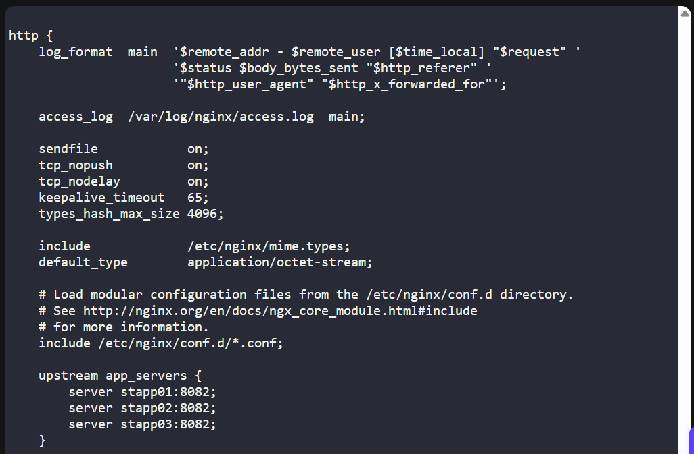
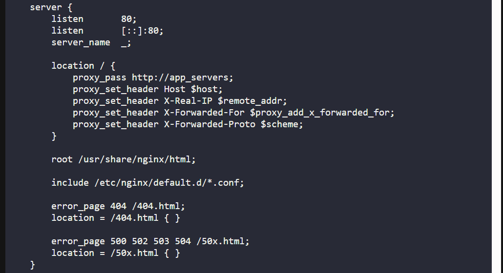
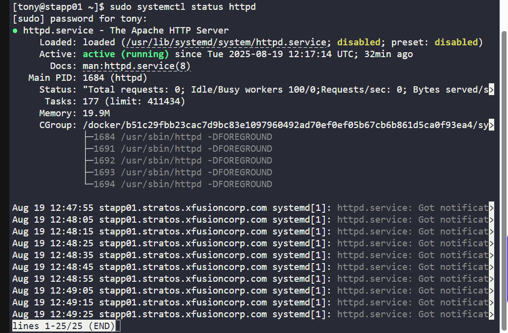
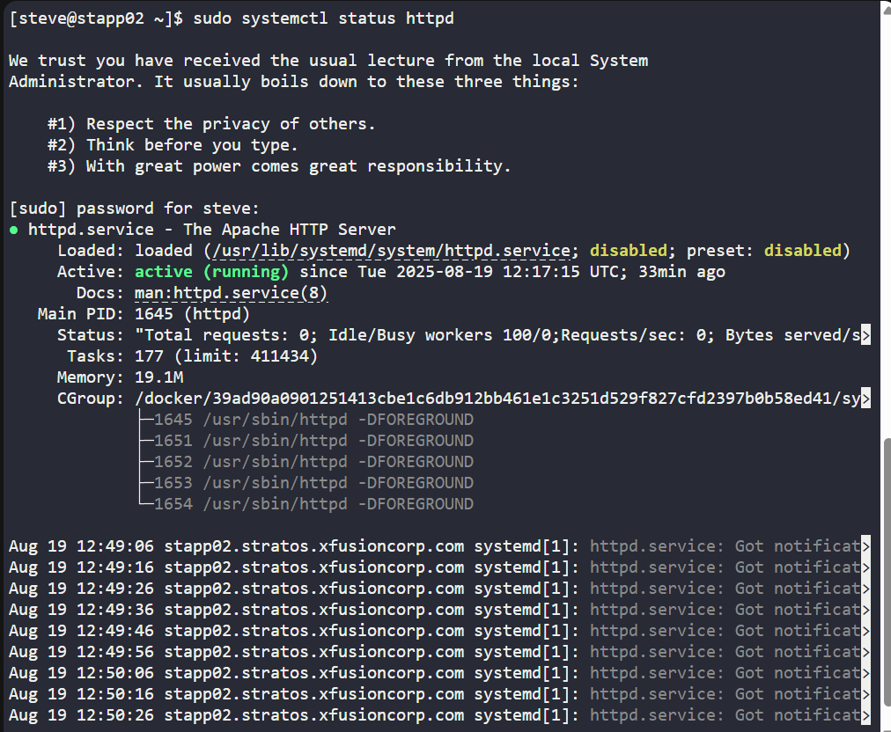
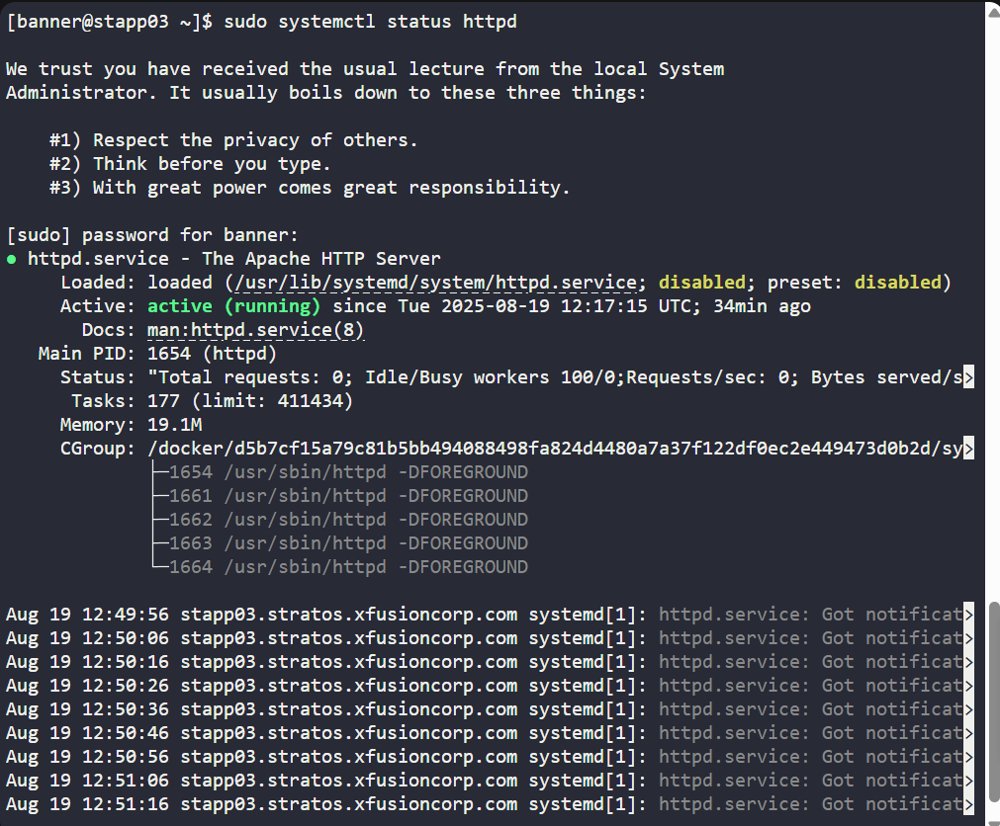

# 🧪 100 Days of DevOps – Day 16 

## ✅ Task: Install and Configure Nginx as an LBR

```text
Day by day traffic is increasing on one of the websites managed by the Nautilus production support team.
Therefore, the team has observed a degradation in website performance. Following discussions about this issue,
the team has decided to deploy this application on a high availability stack i.e on Nautilus infra in Stratos DC.
They started the migration last month and it is almost done, as only the LBR server configuration is pending.
Configure LBR server as per the information given below:

a. Install nginx on LBR (load balancer) server.
b. Configure load-balancing with the an http context making use of all App Servers. Ensure that you update only the main Nginx configuration file located at /etc/nginx/nginx.conf.
c. Make sure you do not update the apache port that is already defined in the apache configuration on all app servers, also make sure apache service is up and running on all app servers.
d. Once done, you can access the website using StaticApp button on the top bar.
```

---

tasks:  
1. Install Nginx on LBR server.
2. Configure Nginx load balancing for all app servers.
3. Ensure Apache is running on all app servers.
4. Verify the website from jump host or StaticApp button.

---

### 🔁 Step 1: SSH into LBR Server

```bash
ssh loki@stlb01
```

password
```bash
Mischi3f
```



---

### 🔁 Step 2: Install & Enable Nginx

```bash
sudo yum install -y nginx
sudo systemctl start nginx
sudo systemctl enable nginx
```





then verify
```bash
sudo systemctl status nginx
```
> now, we can see that nginx is active



---

### ⚙️ Step 3: Configure Nginx as Load Balancer

Edit the main configuration file:
```bash
sudo vi /etc/nginx/nginx.conf
```

Inside the http { ... } block, add upstream and server configuration:
```nginx
http {
    log_format  main  '$remote_addr - $remote_user [$time_local] "$request" '
                      '$status $body_bytes_sent "$http_referer" '
                      '"$http_user_agent" "$http_x_forwarded_for"';

    access_log  /var/log/nginx/access.log  main;

    sendfile            on;
    tcp_nopush          on;
    tcp_nodelay         on;
    keepalive_timeout   65;
    types_hash_max_size 4096;

    include             /etc/nginx/mime.types;
    default_type        application/octet-stream;

    # Load modular configuration files
    include /etc/nginx/conf.d/*.conf;

    # ✅ Upstream block for Apache backends (port 8082)
    upstream app_servers {
        server stapp01:8082;
        server stapp02:8082;
        server stapp03:8082;
    }

    # ✅ Server block for load balancing
    server {
        listen       80;
        listen       [::]:80;
        server_name  _;

        location / {
            proxy_pass http://app_servers;
            proxy_set_header Host $host;
            proxy_set_header X-Real-IP $remote_addr;
            proxy_set_header X-Forwarded-For $proxy_add_x_forwarded_for;
            proxy_set_header X-Forwarded-Proto $scheme;
        }

        root /usr/share/nginx/html;

        include /etc/nginx/default.d/*.conf;

        error_page 404 /404.html;
        location = /404.html { }

        error_page 500 502 503 504 /50x.html;
        location = /50x.html { }
    }
}
```

> but before that, check first the port of the Apache, login first with each server, then type this

```bash
sudo grep -i listen /etc/httpd/conf/httpd.conf
```

> since the output is: `Listen 8082`, then the Apache port to use is 8082.




---

### 🔁 Step 4: Test & Restart Nginx

```bash
sudo nginx -t
sudo systemctl restart nginx
```


---

### 🔁 Step 5: Ensure Apache is Running on App Servers
SSH into each app server (`stapp01`, `stapp02`, `stapp03`) and check:
```bash
sudo systemctl status httpd
```
> All are `active (running)`
> incase it is not active, enter this:

```bash
sudo systemctl start httpd
sudo systemctl enable httpd
```
For Server 1 (Tony@Stapp01:


For Server 2 (Steve@Stapp02)


For Server 3 (Banner@Stapp03)


---

### 🔁 Step 6: Verify Load Balancer
From jump host or LBR server itself:

```bash
curl http://stlb01
```

or by IP:

```bash
curl http://<LBR-IP-Adress>
```


Static App Webpage:


---

## ✅ Task Completed
- Nginx installed & configured as load balancer.
- Apache verified running on all app servers.
- Load balancing confirmed with curl & StaticApp button.


---

