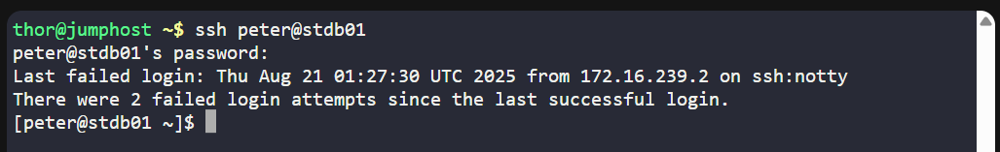
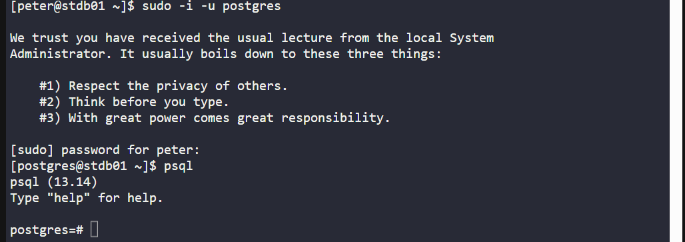
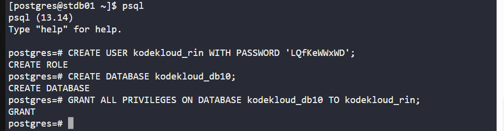
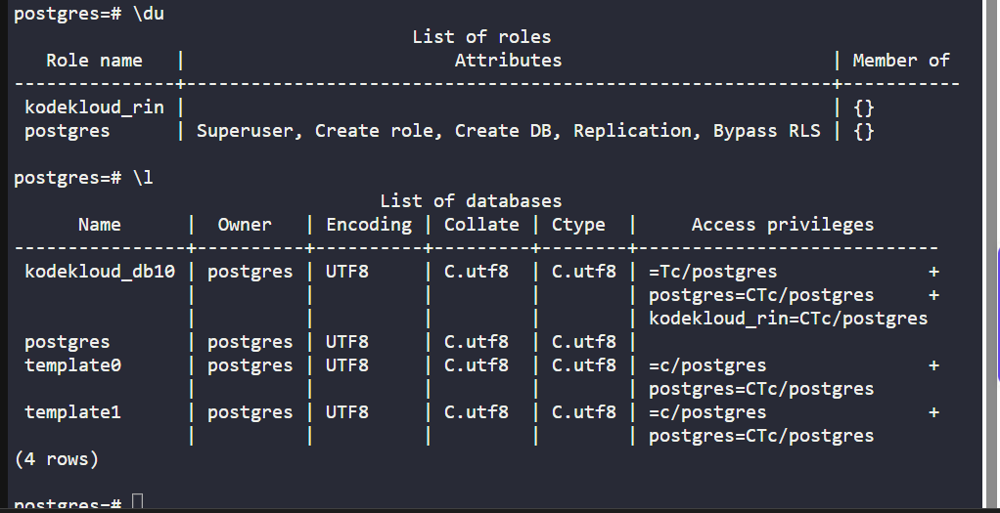
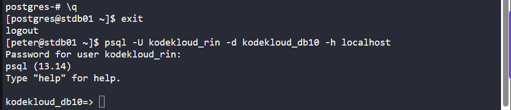

🧪 100 Days of DevOps – Day 17
✅ Task: Install and Configure PostgreSQL

```text
The Nautilus application development team has shared that they are planning to
deploy one newly developed application on Nautilus infra in Stratos DC.
The application uses PostgreSQL database, so as a pre-requisite we need to set up
PostgreSQL database server as per requirements shared below:

PostgreSQL database server is already installed on the Nautilus database server.
a. Create a database user kodekloud_rin and set its password to LQfKeWWxWD.
b. Create a database kodekloud_db10 and grant full permissions to user kodekloud_rin on this database.
Note: Please do not try to restart PostgreSQL server service.
```

---


tasks:
- SSH into the DB server.
- Create PostgreSQL user kodekloud_rin with password.
- Create database kodekloud_db10.
- Grant all privileges on database to the user.
- Verify user/database creation.

---

### 🔁 Step 1: SSH into DB Server

```bash
ssh peter@stdb01
```

password:
```bash
sp!dy
```



---

### 🔁 Step 2: Switch to postgres user
```bash
sudo -i -u postgres
```

Then enter PostgreSQL shell:
```bash
psql
```



#### Description:
| Part          | Explanation                                                                                                                 |
| ------------- | --------------------------------------------------------------------------------------------------------------------------- |
| `sudo`        | Runs the command with **superuser (root) privileges**.                                                                      |
| `-i`          | Simulates a **login shell**, meaning it loads the user’s environment (like PATH, profile, etc.).                            |
| `-u postgres` | Specifies the **target user** to switch to — here, the `postgres` system user (default administrative user for PostgreSQL). |

> You are switching from your current user to the PostgreSQL superuser account (postgres) with a login shell. This is required for tasks like creating databases, users, or accessing psql.


---

### ⚙️ Step 3: Create User & Database
Inside `psql` run:
```sql
-- Create user with password
CREATE USER kodekloud_rin WITH PASSWORD 'LQfKeWWxWD';

-- Create database
CREATE DATABASE kodekloud_db10;

-- Grant privileges
GRANT ALL PRIVILEGES ON DATABASE kodekloud_db10 TO kodekloud_rin;
```
> ✅ Output should confirm `CREATE ROLE`, `CREATE DATABASE`, `GRANT`.



#### Description

| Command                                                             | Explanation                                                                                                   |
| ------------------------------------------------------------------- | ------------------------------------------------------------------------------------------------------------- |
| `CREATE USER kodekloud_rin WITH PASSWORD 'LQfKeWWxWD';`             | Creates a new PostgreSQL user (role) named **`kodekloud_rin`** with the specified password.                   |
| `CREATE DATABASE kodekloud_db10;`                                   | Creates a new database named **`kodekloud_db10`**.                                                            |
| `GRANT ALL PRIVILEGES ON DATABASE kodekloud_db10 TO kodekloud_rin;` | Gives the new user **full control** (create, connect, modify, drop, etc.) over the `kodekloud_db10` database. |

---

### 🔁 Step 4: Verify User & Database
Still inside `psql`:

```sql
\du
```
> This lists all roles; check for `kodekloud_rin`.

```sql
\l
```
> This lists all databases; check for `kodekloud_db10`.



---

### 🔁 Log-in as the new user

exit from the psql
```sql
\q
```

then
```bash
exit
```

then login as the new user
```bash
psql -U kodekloud_rin -d kodekloud_db10 -h localhost
```

password
Enter password: `LQfKeWWxWD`

> since connected, then the task is good 👍



---

## ✅ Task Completed

- User kodekloud_rin created with password.
- Database kodekloud_db10 created.
- Privileges granted.
- Verified with psql login.
