# 🧪 100 Days of DevOps – Day 18
## ✅ Task: Configure LAMP server

```text
xFusionCorp Industries is planning to host a WordPress website on their infra in Stratos Datacenter.
They have already done infrastructure configuration—for example, on the storage server they already
have a shared directory /vaw/www/html that is mounted on each app host under /var/www/html directory.
Please perform the following steps to accomplish the task:

a. Install httpd, php and its dependencies on all app hosts.
b. Apache should serve on port 8082 within the apps.
c. Install/Configure MariaDB server on DB Server.
d. Create a database named kodekloud_db1 and create a database user named kodekloud_pop identified as
password TmPcZjtRQx. Further make sure this newly created user is able to perform all operation on the
database you created.
e. Finally you should be able to access the website on LBR link, by clicking on the App button on the
top bar. You should see a message like App is able to connect to the database using user kodekloud_pop
```

---

Tasks
- Install Apache, PHP on all App servers.
- Configure Apache to listen on port 8082.
- Install & configure MariaDB on DB server.
- Create kodekloud_db1 and user kodekloud_pop with privileges.
- Verify the application via LBR link.

---

### 🔁 Step 1: Install Apache & PHP on App Server 1 (Same steps for other App Server)

```bash
ssh tony@stapp01
```

password
```bash
Ir0nM@n
```

---

then Install packages:
```bash
sudo yum install -y httpd php php-mysqlnd php-cli php-common
```

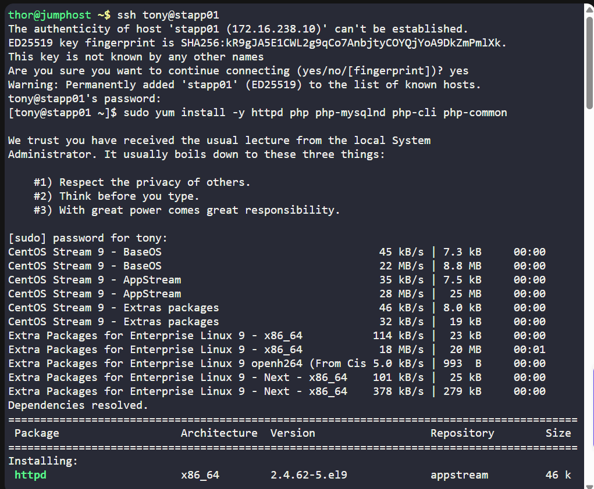
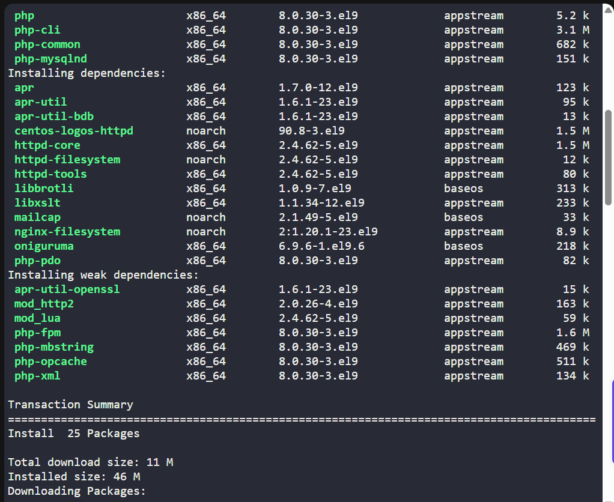
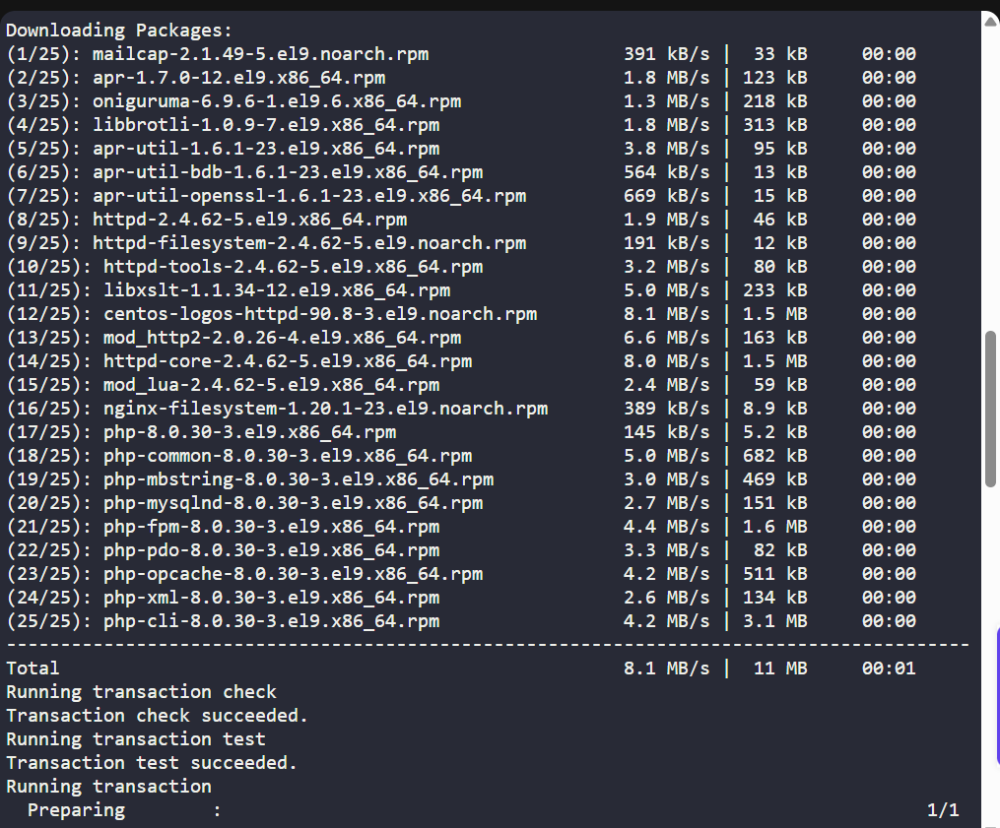
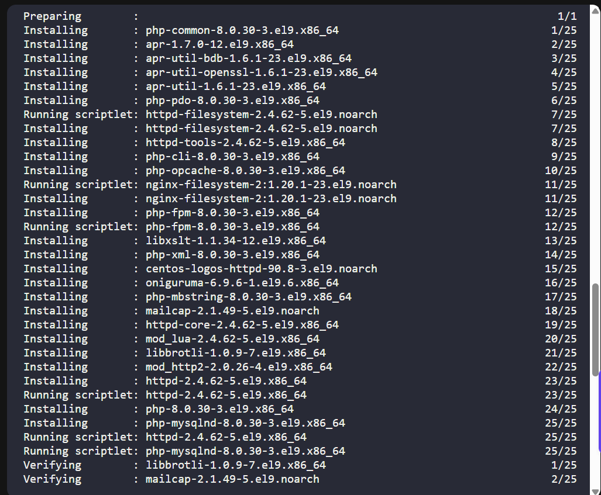
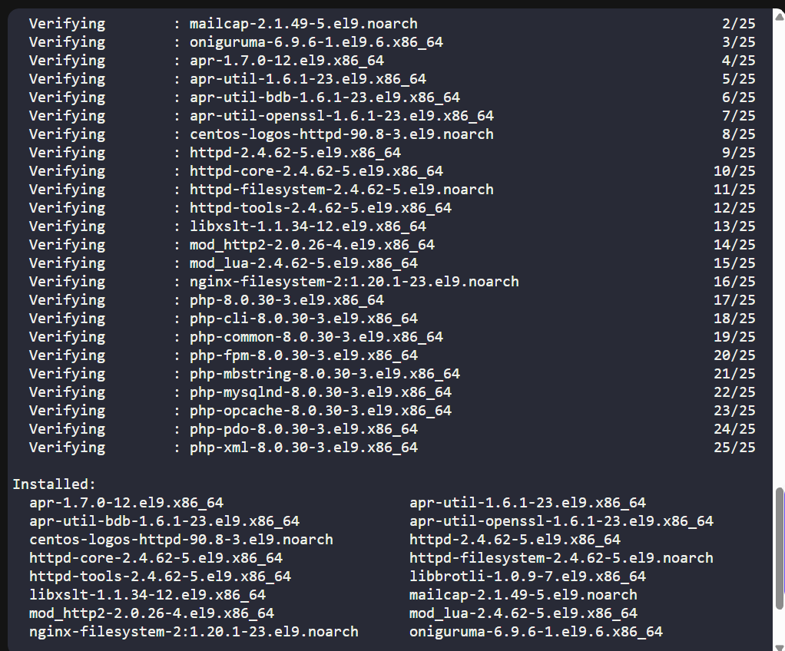
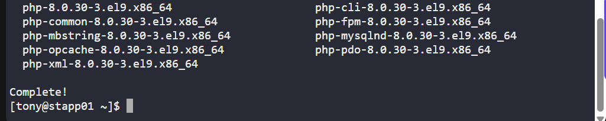

#### Description

| **Command**   | **Description**                                                                         |
| ------------- | --------------------------------------------------------------------------------------- |
| `sudo`        | Runs the command with superuser (root) privileges.                                      |
| `yum`         | Package manager used in RHEL/CentOS to install, update, and manage software.            |
| `install`     | Subcommand that tells `yum` to install the specified packages.                          |
| `-y`          | Automatically answers “yes” to prompts during installation (non-interactive).           |
| `httpd`       | Apache HTTP Server package (used to serve web content).                                 |
| `php`         | Main PHP package to enable PHP scripting language.                                      |
| `php-mysqlnd` | PHP extension that allows PHP to interact with MySQL databases using the native driver. |
| `php-cli`     | PHP Command-Line Interface package to run PHP scripts from the terminal.                |
| `php-common`  | Common PHP files required by multiple PHP modules (provides shared functionality).      |

---

### 🔁 Step 2: Configure Apache Port
Edit Apache config:
```bash
sudo vi /etc/httpd/conf/httpd.conf
```

change:
```bash
Listen 8082
```

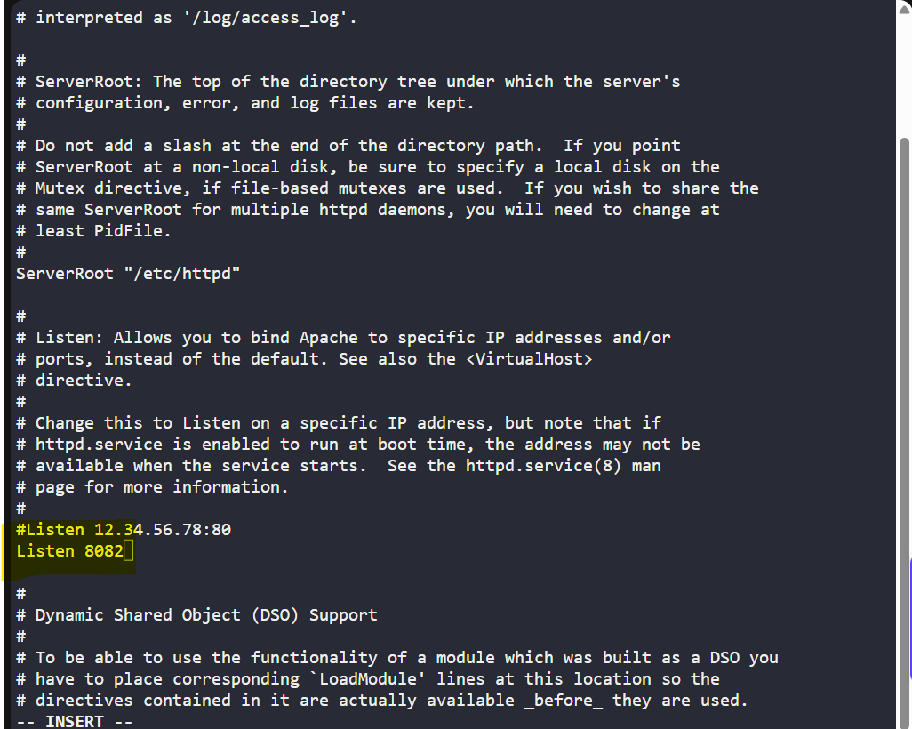

then restart Apache:
```bash
sudo systemctl enable httpd
sudo systemctl restart httpd
```

Check status:
```bash
sudo systemctl status httpd
```

> Now, the Apacher server is running.

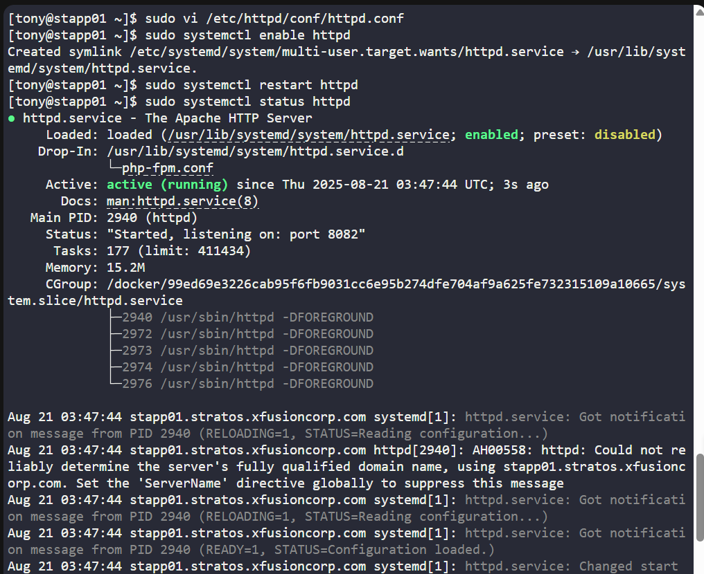

---

### 🔁 Step 3: Repeat Steps 1 and 2 for Server 2 and 3

---

### 🔁 Step 4: Install & Configure MariaDB on DB Server
login in the Database Server
```bash
ssh peter@stdb01
```

password
```bash
sp!dy
```

Install MariaDB:
```bash
sudo yum install -y mariadb-server
sudo systemctl enable mariadb
sudo systemctl start mariadb
```

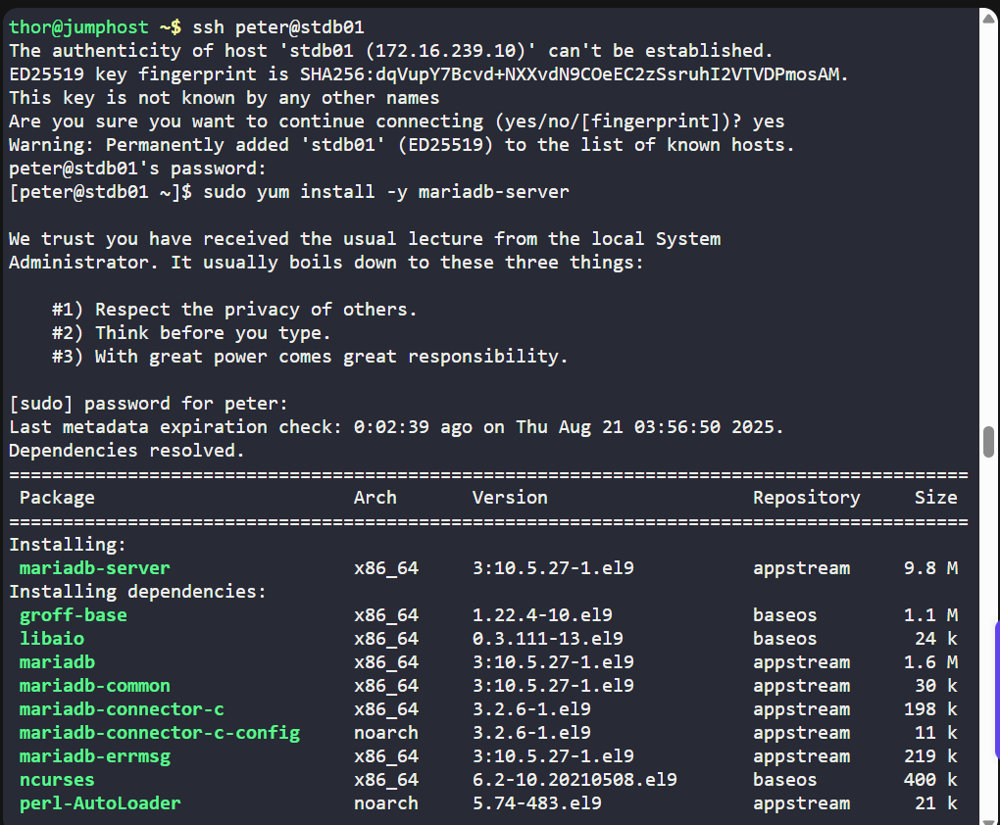
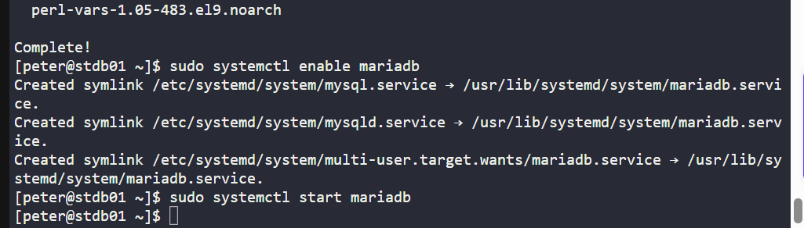
---

### 🔁 Step 5: Create Database & User
Switch to root (if not already)
```bash
sudo -i
```

Login using the socket plugin
```bash
mysql -u root
```
#### Description

| **Command** | **Description**                                                                                                                      |
| ----------- | ------------------------------------------------------------------------------------------------------------------------------------ |
| `sudo`      | Runs a command with superuser (root) privileges.                                                                                     |
| `-i`        | Starts a login shell as the root user, simulating a direct root login (loads root’s environment variables, PATH, and shell profile). |


SQL commands:
```SQL
CREATE DATABASE kodekloud_db1;
CREATE USER 'kodekloud_pop'@'%' IDENTIFIED BY 'TmPcZjtRQx';
GRANT ALL PRIVILEGES ON kodekloud_db1.* TO 'kodekloud_pop'@'%';
FLUSH PRIVILEGES;
```

#### Description

| **Command**                                                       | **Description**                                                                                                                     |
| ----------------------------------------------------------------- | ----------------------------------------------------------------------------------------------------------------------------------- |
| `CREATE DATABASE kodekloud_db1;`                                  | Creates a new database named **`kodekloud_db1`**.                                                                                   |
| `CREATE USER 'kodekloud_pop'@'%' IDENTIFIED BY 'TmPcZjtRQx';`     | Creates a new MySQL user **`kodekloud_pop`** with password **`TmPcZjtRQx`**, accessible from **any host** (`%`).                    |
| `GRANT ALL PRIVILEGES ON kodekloud_db1.* TO 'kodekloud_pop'@'%';` | Grants the user **`kodekloud_pop`** all privileges (SELECT, INSERT, UPDATE, DELETE, etc.) on all tables inside **`kodekloud_db1`**. |
| `FLUSH PRIVILEGES;`                                               | Reloads the grant tables so that the new privileges take effect immediately.                                                        |


then exit from the SQL
type:
```SQL
\q
```

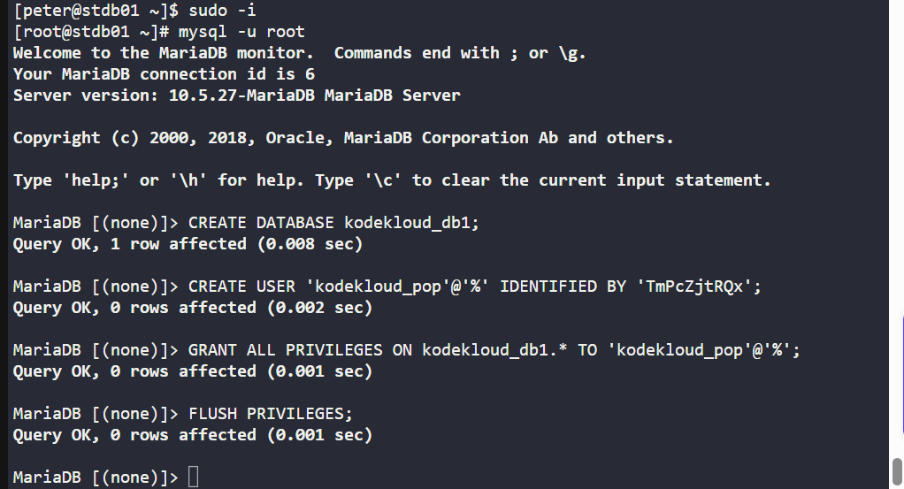

login to database, and enter this to configure remote connections:
```bash
sudo vi /etc/my.cnf.d/mariadb-server.cnf
```

check:
```ini
bind-address=0.0.0.0
```
> if not change the bind address to `0.0.0.0`

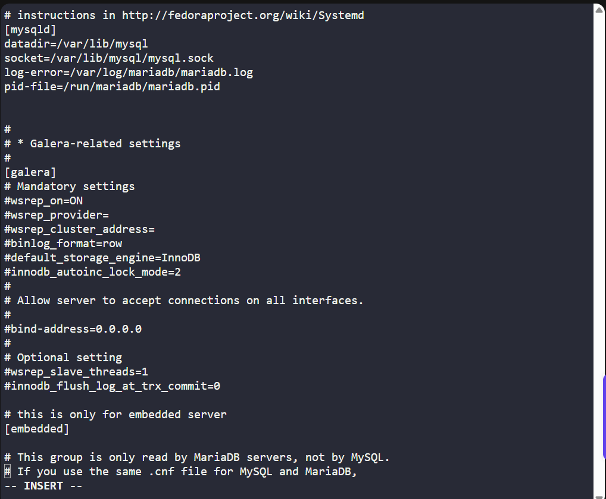

restart the database:
```bash
sudo systemctl restart mariadb
```

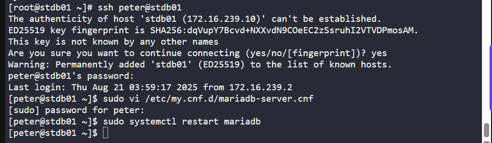

---

### 🔁 Step 6: Verify
From LBR (nginx) server or jump host:
```bash
curl http://stlb01
```


or

Open StaticApp in browser → you should see:
```psql
App is able to connect to the database using user kodekloud_pop
```


---

## ✅ Task Completed
- Apache & PHP installed on all App servers.
- Apache configured to serve on port 8082.
- MariaDB installed & configured on DB server.
- Database kodekloud_db1 created with user kodekloud_pop.
- Application verified from LBR link.


