# 🧪 100 Days of DevOps – Day 19
## ✅ Task: Install and Configure Web Application

```text
xFusionCorp Industries is planning to host two static websites on their infra in Stratos Datacenter.
The development of these websites is still in-progress, but we want to get the servers ready.
Please perform the following steps to accomplish the task:

a. Install httpd package and dependencies on app server 3.
b. Apache should serve on port 6300.
c. There are two website's backups /home/thor/blog and /home/thor/games on jump_host.
Set them up on Apache in a way that blog should work on the link http://localhost:6300/blog/
and games should work on link http://localhost:6300/games/ on the mentioned app server.
d. Once configured you should be able to access the website using curl command on the respective app server, i.e curl http://localhost:6300/blog/ and curl http://localhost:6300/games/
```

---

tasks:
- SSH into App Server 3.
- Install httpd package and its dependencies.
- Update Apache configuration to listen on port 6300.
- Copy website backups from /home/thor/blog and /home/thor/games on jump_host to App Server 3.
- Configure Apache to serve:
    - /blog → accessible at http://localhost:6300/blog/
    - /games → accessible at http://localhost:6300/games/
- Restart Apache service to apply changes.
- Verify configuration using:
    - curl http://localhost:6300/blog/
    - curl http://localhost:6300/games/

---

### 🔁 Step 1: SSH into App Server 3
```bash
ssh banner@stapp03
```

password:
```bash
BigGr33n
```

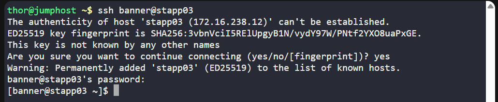

---

### 🔁 Step 2: Install Apache (httpd)
```bash
sudo yum install -y httpd
sudo systemctl enable httpd
```

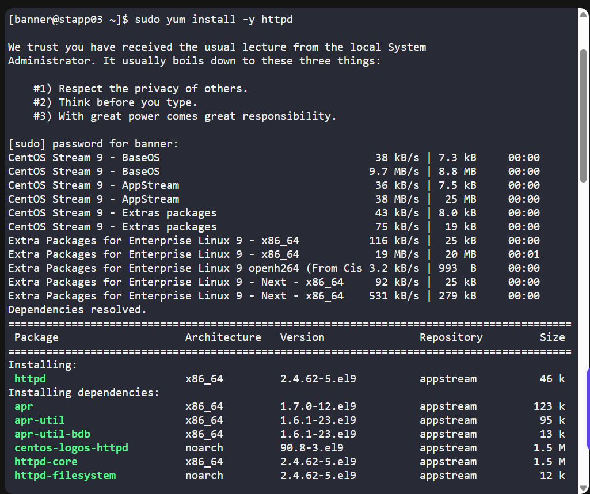
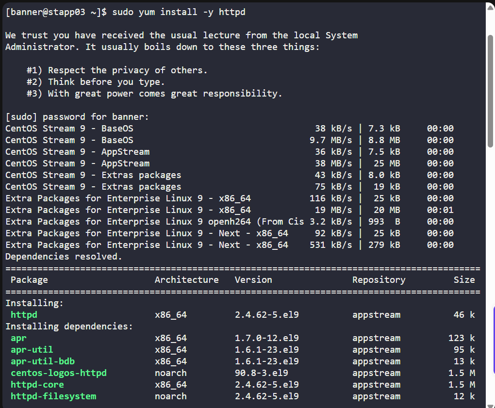
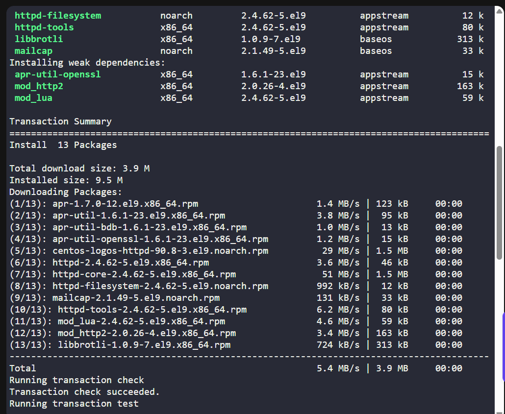
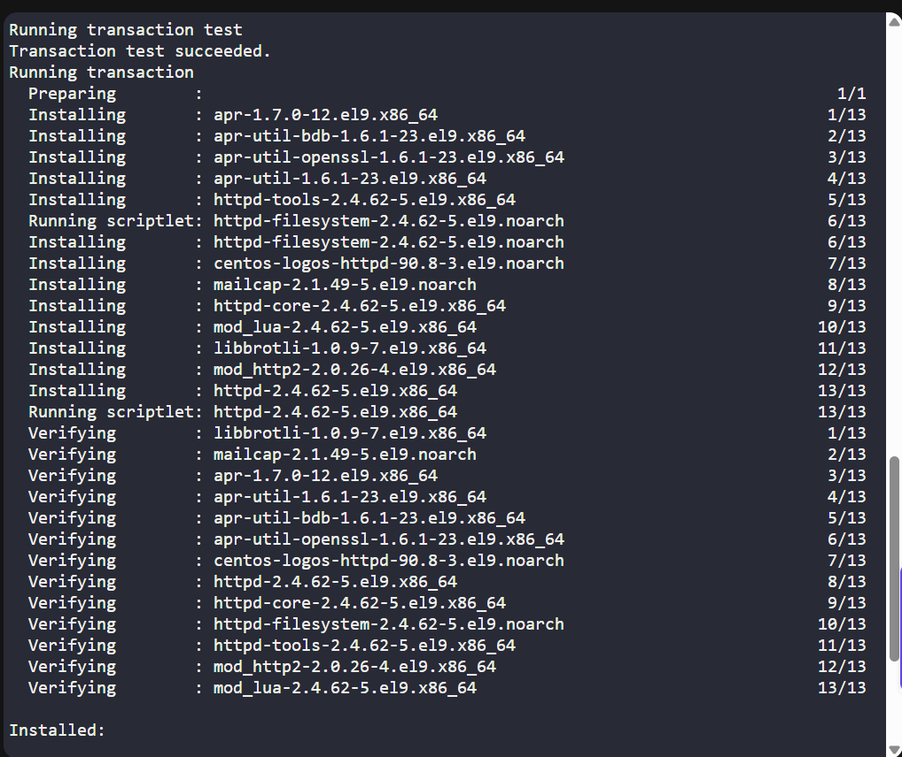
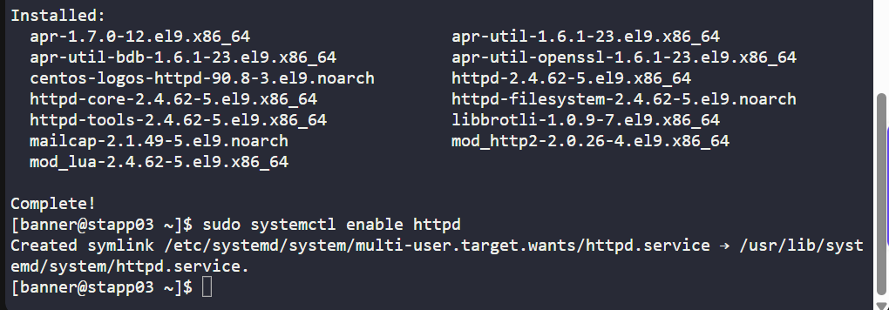

and verify the status:
```bash
sudo systemctl status httpd
```

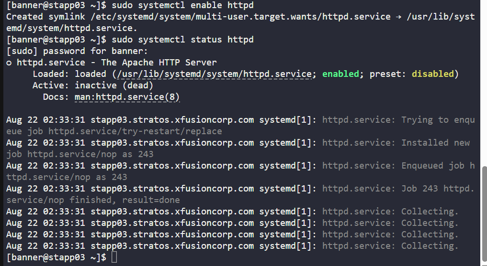

> The Apache is not enabled but not yet active

#### Code Description

| **Command**                   | **Description**                                                                                                                                                |
| ----------------------------- | -------------------------------------------------------------------------------------------------------------------------------------------------------------- |
| `sudo yum install -y httpd`   | Installs the **Apache HTTP Server (httpd)** package on a RHEL/CentOS/Amazon Linux system. The `-y` flag automatically confirms installation without prompting. |
| `sudo systemctl enable httpd` | Enables **httpd** service to start automatically on system boot.                                                                                               |
| `sudo systemctl status httpd` | Shows the current status of the **httpd** service (whether it’s active, inactive, failed, etc.).                                                               |

---

### ⚙️ Step 3: Configure Apache to Run on Port 6300
Edit Apache main config:
```bash
sudo vi /etc/httpd/conf/httpd.conf
```

Find:
```bash
Listen 80
```

change to:
```bash
Listen 6300
```

Save and exit (esc, then type `:wq` to save and exit)

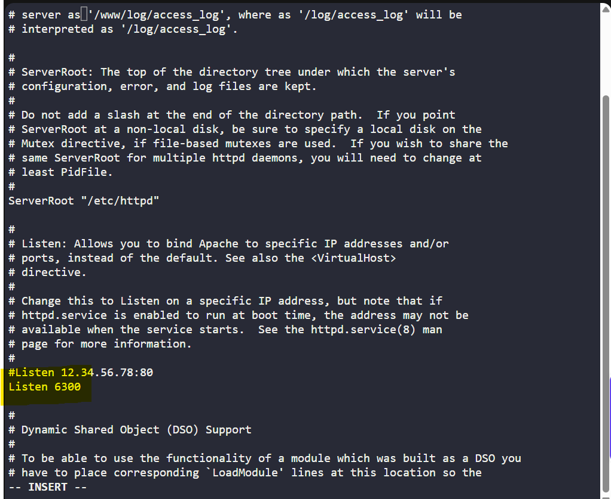

#### Code Description
**sudo vi /etc/httpd/conf/httpd.conf**
- Opens the main Apache configuration file (httpd.conf) with vi text editor in superuser mode.
- This file controls global Apache settings like server root, listening port (default 80), modules, document root, virtual hosts, and logging.

**Common things inside the httpd.conf
| **Directive**  | **Purpose**                          | **Example**                                    |
| -------------- | ------------------------------------ | ---------------------------------------------- |
| `Listen`       | Defines the port Apache listens on   | `Listen 80`                                    |
| `ServerName`   | Sets the server’s hostname or domain | `ServerName mysite.local:80`                   |
| `DocumentRoot` | Path to your website files           | `/var/www/html`                                |
| `<Directory>`  | Directory-specific access control    | `<Directory "/var/www/html"> ... </Directory>` |
| `ErrorLog`     | Location of error log file           | `/var/log/httpd/error_log`                     |
| `CustomLog`    | Access log location                  | `/var/log/httpd/access_log combined`           |

---

restart Apache
```bash
sudo systemctl restart httpd
```

Verify
```bash
sudo ss -tulnp | grep httpd
```
> now it Apache listen to `6300`

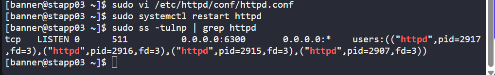

#### Code Description

| **Command** | **Explanation**                                                                                                                                                                                                                                                     |           |                                                                                                                                    |
| ----------- | ------------------------------------------------------------------------------------------------------------------------------------------------------------------------------------------------------------------------------------------------------------------- | --------- | ---------------------------------------------------------------------------------------------------------------------------------- |
| `sudo`      | Runs the command as the **superuser** (root).                                                                                                                                                                                                                       |           |                                                                                                                                    |
| `ss`        | Utility to display socket statistics, showing details of network connections, ports, and processes (modern replacement for `netstat`).                                                                                                                              |           |                                                                                                                                    |
| `-tulnp`    | Set of options passed to `ss`: <br> • **-t** → Show TCP sockets <br> • **-u** → Show UDP sockets <br> • **-l** → Show listening sockets <br> • **-n** → Show numerical addresses/ports instead of resolving names <br> • **-p** → Show the process using the socket |           |                                                                                                                                    |
| \`          | grep httpd\`                                                                                                                                                                                                                                                        | Pipes (\` | `) the output of `ss\` and searches for lines containing **httpd** (the Apache web server process), effectively filtering results. |

---

### 🔁 Step 4: Copy Website Backups
From jump host transfer backups to App Server 3:
```bash
scp -r /home/thor/blog /home/thor/games banner@stapp03:/tmp/
```

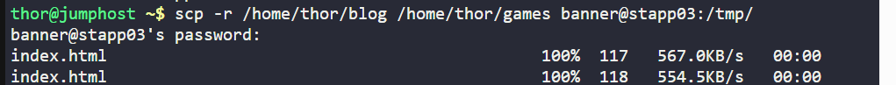

Then move into Apache document root:
```bash
sudo cp -r /tmp/blog /var/www/html/
sudo cp -r /tmp/games /var/www/html/
```


#### Code Description

| **Command**                                                    | **Explanation**                                                                                                                                                                                                                             |
| -------------------------------------------------------------- | ------------------------------------------------------------------------------------------------------------------------------------------------------------------------------------------------------------------------------------------- |
| `scp -r /home/thor/blog /home/thor/games banner@stapp03:/tmp/` | Securely copies the directories `blog` and `games` from the local machine (`/home/thor/`) to the remote server `stapp03` under user `banner`, placing them in the `/tmp/` directory. The `-r` flag means copy recursively (entire folders). |
| `sudo cp -r /tmp/blog /var/www/html/`                          | Copies the `blog` folder from `/tmp/` to the Apache web root directory `/var/www/html/` on the remote server. `-r` ensures all contents (subfolders/files) are copied.                                                                      |
| `sudo cp -r /tmp/games /var/www/html/`                         | Copies the `games` folder from `/tmp/` to `/var/www/html/`, so both directories are available to serve via the Apache web server.                                                                                                           |

---

### ⚙️ Step 5: Configure Aliases in Apache
Edit configuration:
```bash
sudo vi /etc/httpd/conf/httpd.conf
```

Add at the bottom:
```apache
Alias /blog "/var/www/html/blog"
<Directory "/var/www/html/blog">
    Options Indexes FollowSymLinks
    AllowOverride None
    Require all granted
</Directory>

Alias /games "/var/www/html/games"
<Directory "/var/www/html/games">
    Options Indexes FollowSymLinks
    AllowOverride None
    Require all granted
</Directory>
```

Restart Apache:
```bash
sudo systemctl restart httpd
```

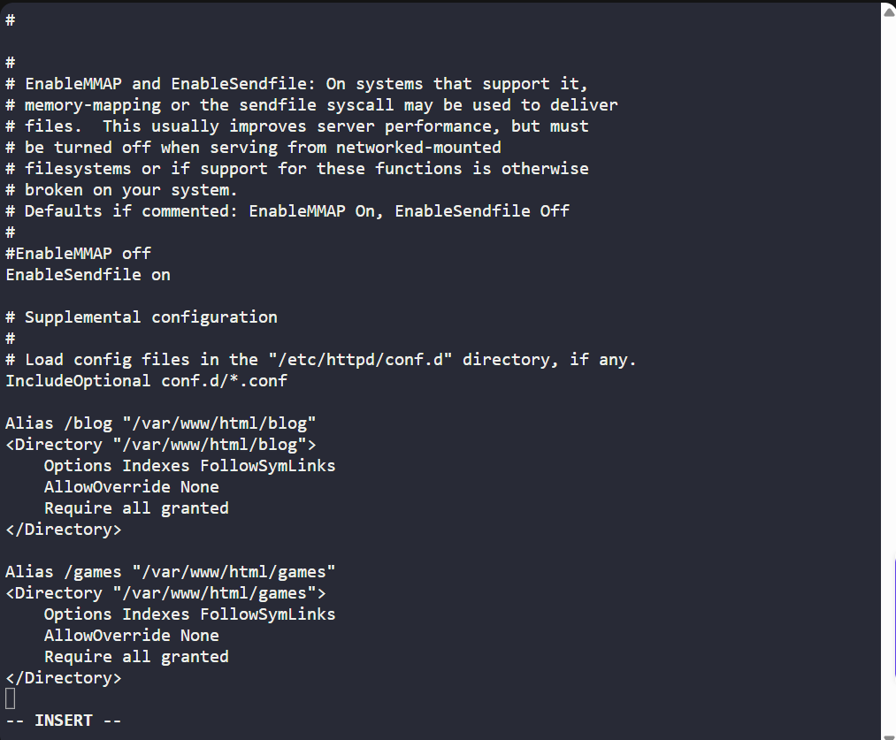

---

### 🔁 Step 6: Verify with curl
```bash
curl http://localhost:6300/blog/
curl http://localhost:6300/games/
```
> Both return the HTML content of the respective static sites ✅

**curl http://localhost:6300/blog/**
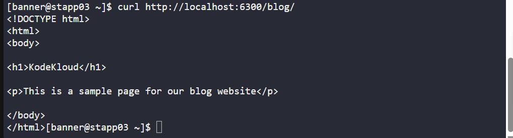

**curl http://localhost:6300/games/**
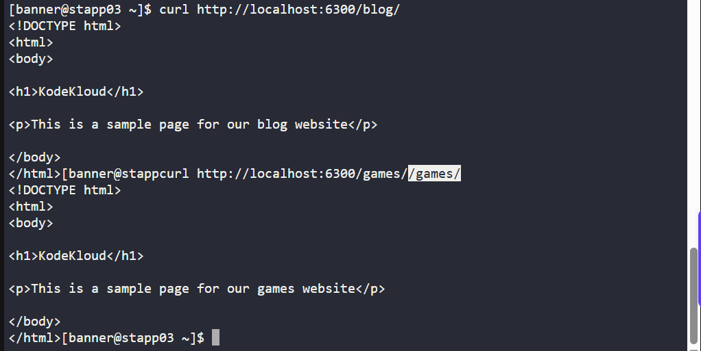

---

## ✅ Task Completed
- Apache installed on App Server 3.
- Port changed to 6300.
- Blog & Games sites deployed under /var/www/html/.
- Aliases configured for /blog and /games.
- Verified successfully with curl.
