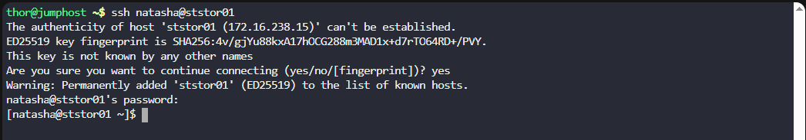
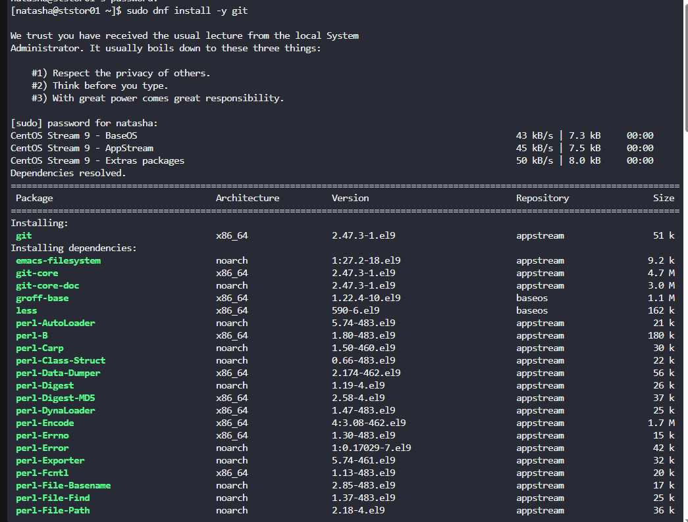
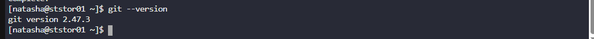
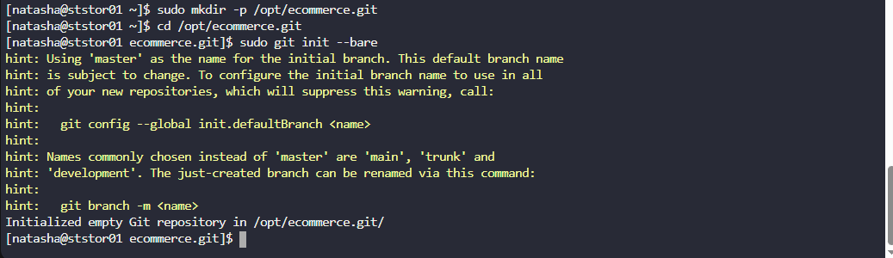
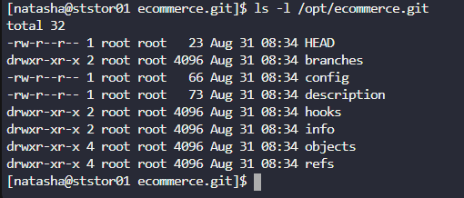

# 🧪 100 Days of DevOps – Day 21
## ✅ Task: Set Up Git Repository on Storage Server

```text
The Nautilus development team has provided requirements to the DevOps team for a new application 
development project, specifically requesting the establishment of a Git repository. 
Follow the instructions below to create the Git repository on the Storage server in the Stratos DC:

a. Utilize yum to install the git package on the Storage Server.
b. Create a bare repository named /opt/ecommerce.git (ensure exact name usage).
```

---

tasks:

- SSH into the Storage Server.
- Install Git using yum/dnf.
- Create a bare Git repository named /opt/ecommerce.git.
- Verify repository creation.

---

### 🔁 Step 1: SSH into Storage Server
```bash
ssh natasha@ststor01
```

password
```bash
Bl@kW
```



---

### 🔁 Step 2: Install Git
```bash
sudo dnf install -y git
```



#### Explanation of `sudo dnf install -y git`

| Part      | Meaning                                                                 |
|-----------|-------------------------------------------------------------------------|
| `sudo`    | Runs the command with **superuser (root) privileges**, allowing system-level changes. |
| `dnf`     | The **package manager** used in Fedora, RHEL, and CentOS for installing, updating, and managing software packages. |
| `install` | Subcommand telling `dnf` to **install a package**. |
| `-y`      | Automatically answers **"yes"** to any prompts during installation, so it runs without asking for confirmation. |
| `git`     | The name of the **package to install**, in this case, the Git version control system. |

Verify installation:
```bash
git --version
```



#### Explanation of `git --version`

| Part         | Meaning                                                                 |
|--------------|-------------------------------------------------------------------------|
| `git`        | The **Git command-line tool**, a distributed version control system.    |
| `--version`  | An **option/flag** that tells Git to display its installed version.     |

---

### ⚙️ Step 3: Create Bare Repository
```bash
sudo mkdir -p /opt/ecommerce.git
cd /opt/ecommerce.git
sudo git init --bare
```



#### Command 1: `sudo mkdir -p /opt/ecommerce.git`

| Part             | Meaning                                                                 |
|------------------|-------------------------------------------------------------------------|
| `sudo`           | Runs the command with **superuser (root) privileges**.                  |
| `mkdir`          | Command to **create a new directory**.                                  |
| `-p`             | Ensures that parent directories are created as needed, and avoids errors if the directory already exists. |
| `/opt/ecommerce.git` | The **path** of the directory to create, usually under `/opt` for optional software or repositories. The `.git` extension is a convention for bare repositories. |

---

#### Command 2: `cd /opt/ecommerce.git`

| Part                | Meaning                                                                 |
|---------------------|-------------------------------------------------------------------------|
| `cd`                | Stands for **change directory**. Moves you into another folder.        |
| `/opt/ecommerce.git`| The **target directory** you want to move into (the one just created). |

---

#### Command 3: `sudo git init --bare`

| Part        | Meaning                                                                 |
|-------------|-------------------------------------------------------------------------|
| `sudo`      | Runs the command with **superuser privileges** (needed since directory is under `/opt`). |
| `git`       | The **Git command-line tool**.                                          |
| `init`      | Initializes a **new Git repository**.                                   |
| `--bare`    | Creates a **bare repository**, which has no working directory. It stores only Git data (commits, branches, etc.) and is typically used as a central remote repo for collaboration. |

---

### 🔁 Step 4: Verify Repository (Optional)
Check structure:
```bash
ls -l /opt/ecommerce.git
```



#### Explanation of `ls -l /opt/ecommerce.git`

| Part                  | Meaning                                                                 |
|-----------------------|-------------------------------------------------------------------------|
| `ls`                  | Lists the contents of a directory.                                      |
| `-l`                  | Long listing format. Shows details such as file type, permissions, owner, group, size, and last modification time. |
| `/opt/ecommerce.git`  | The target **directory** to list (the bare Git repository created earlier). |

---

## What You’ll See
Since `/opt/ecommerce.git` was initialized as a **bare Git repository**, the contents will look different from a normal project repo.  
Instead of source code files, you’ll see Git’s internal data structures, something like this:

```nginx
rw-r--r-- 1 root root 66 Aug 31 16:00 config
rw-r--r-- 1 root root 73 Aug 31 16:00 description
drwxr-xr-x 2 root root 4096 Aug 31 16:00 hooks
drwxr-xr-x 2 root root 4096 Aug 31 16:00 info
drwxr-xr-x 4 root root 4096 Aug 31 16:00 objects
drwxr-xr-x 4 root root 4096 Aug 31 16:00 refs
```

Confirm type:
```bash
git --git-dir=/opt/ecommerce.git status
```


#### Explanation of `git --git-dir=/opt/ecommerce.git status`

| Part                         | Meaning                                                                 |
|------------------------------|-------------------------------------------------------------------------|
| `git`                        | The **Git command-line tool**.                                          |
| `--git-dir=/opt/ecommerce.git` | Tells Git to use the specified directory (`/opt/ecommerce.git`) as the **repository location**, instead of looking for a `.git` folder in the current path. |
| `status`                     | Shows the **working tree status** — which files are staged, modified, or untracked. |

---

## What Happens Here
- Since `/opt/ecommerce.git` is a **bare repository**, it has **no working tree**.  
- That means there are no source code files to check, only Git’s internal objects (commits, refs, etc.).  
- If you run this, Git will respond with something like:


Output:
```bash
fatal: this operation must be run in a work tree
```
> ✅ That’s expected — it confirms it’s a bare repository.

---

## ✅ Task Completed
- Installed Git on Storage Server.
- Created bare repo at /opt/ecommerce.git.
- Verified successful initialization.

