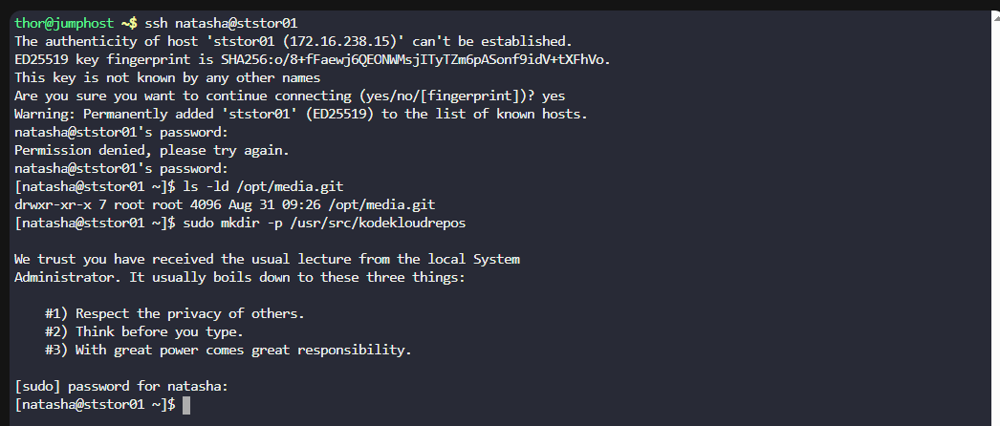
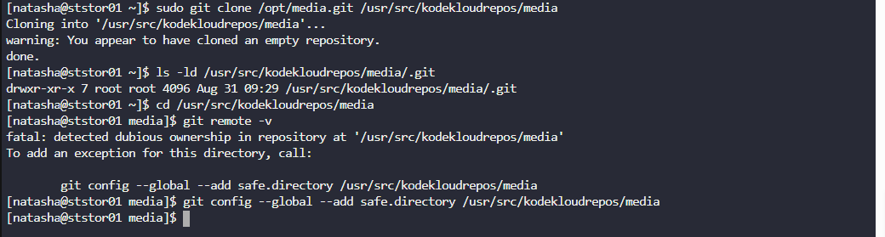
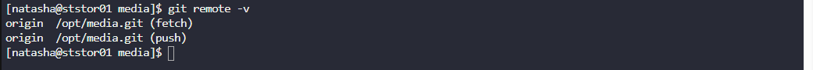

# 🧪 100 Days of DevOps – Day 22
## ✅ Task: Clone Git Repository on Storage Server

```text
The DevOps team established a new Git repository last week, which remains unused at present. 
However, the Nautilus application development team now requires a copy of this repository 
on the Storage Server in the Stratos DC. Follow the provided details to clone the repository:

a. The repository to be cloned is located at /opt/media.git
b. Clone this Git repository to the /usr/src/kodekloudrepos directory. 
Ensure no modifications are made to the repository during the cloning process.
```

---

task
- SSH into the Storage Server
- Verify that /opt/media.git exists (bare repo).
- Clone the repo into /usr/src/kodekloudrepos.
- Verify clone operation (structure & .git presence).
- Ensure no modifications are made.

---

### 🔁 Step 1: SSH into Storage Server
```bash
ssh natasha@ststor01
```

password:
```bash
Bl@kW
```

---

### 🔁 Step 2: Verify the source repo exists
```bash
ls -ld /opt/media.git
```

#### Explanation of `ls -ld /opt/media.git`

| Part                  | Meaning                                                                 |
|-----------------------|-------------------------------------------------------------------------|
| `ls`                  | Lists information about files and directories.                         |
| `-l`                  | Uses **long listing format** (shows permissions, ownership, size, date, etc.). |
| `-d`                  | Lists details about the **directory itself**, not its contents.         |
| `/opt/media.git`      | The **target directory** to inspect (likely another Git bare repository). |

---

What You’ll See
Instead of listing the **contents inside** `/opt/media.git`, the `-d` option makes `ls` show information only about the directory itself, for example:

Expected to see Git repo structure:
```nginx
drwxr-xr-x 7 root root 4096 Aug 31 08:53 /opt/media.git
```


Ensure target directory exists:
```bash
sudo mkdir -p /usr/src/kodekloudrepos
```



#### Explanation of `sudo mkdir -p /usr/src/kodekloudrepos`

| Part                         | Meaning                                                                 |
|------------------------------|-------------------------------------------------------------------------|
| `sudo`                       | Runs the command with **superuser (root) privileges**, required because `/usr/src` is a system directory. |
| `mkdir`                      | Command to **create a directory**.                                      |
| `-p`                         | Ensures that parent directories are created if they don’t already exist, and prevents errors if the target directory already exists. |
| `/usr/src/kodekloudrepos`    | The **full path** of the directory to be created. `usr/src` is commonly used for source code, so this path will hold repositories named `kodekloudrepos`. |

---

What Happens
- If `/usr/src` already exists (which it normally does), the command creates a new folder inside it called `kodekloudrepos`.  
- If the path already exists, no error is shown because of `-p`.  
- Ownership will default to `root` since you used `sudo`.  

---

### 🔁 Step 3: Clone Repository
```bash
sudo git clone /opt/media.git /usr/src/kodekloudrepos/media
```

#### Explanation of `sudo git clone /opt/media.git /usr/src/kodekloudrepos/media`

| Part                                | Meaning                                                                 |
|-------------------------------------|-------------------------------------------------------------------------|
| `sudo`                              | Runs the command with **superuser privileges**, required because the target directory is under `/usr/src`. |
| `git`                               | The **Git command-line tool**.                                          |
| `clone`                             | Creates a **copy of a repository** into a new directory.                |
| `/opt/media.git`                    | The **source repository** to clone. In this case, a **bare repository** located in `/opt`. |
| `/usr/src/kodekloudrepos/media`     | The **destination path** where the working copy of the repository will be created. |

---

What Happens
1. Git reads the bare repo at `/opt/media.git`.  
2. It creates a new directory at `/usr/src/kodekloudrepos/media`.  
3. Inside that new directory, Git initializes a **working repository** with:  
   - `.git/` folder → contains metadata & commit history.  
   - Files checked out from the latest commit (the working tree).  

Why This is Important
- A **bare repo** (`/opt/media.git`) has no working files — it only stores commit history.  
- By cloning, you create a **working copy** where you can edit, stage, and commit files.  
- You’ll typically **push changes back** to `/opt/media.git` so others can fetch or pull from it.  

---

## Example Directory Structure After Clone


---

### 🔁 Step 4: Verify Cloned Repo
Check the directory:
```bash
ls -ld /usr/src/kodekloudrepos/media/.git
```

#### Explanation of `ls -ld /usr/src/kodekloudrepos/media/.git`

| Part                                     | Meaning                                                                 |
|------------------------------------------|-------------------------------------------------------------------------|
| `ls`                                     | Lists information about files and directories.                         |
| `-l`                                     | Long listing format (shows permissions, ownership, size, date, etc.).  |
| `-d`                                     | Lists details about the **directory itself**, not its contents.         |
| `/usr/src/kodekloudrepos/media/.git`     | The target path — the **hidden `.git` folder** inside your working repo. |


Check remote origin:
```bash
cd /usr/src/kodekloudrepos/media
git remote -v
```


> Warning: fatal: detected dubious ownership in repository at '/usr/src/kodekloudrepo
> To add an exception for this directory, call: `git config --global --add safe.directory /usr/src/kodekloudrepos`

#### Command 1: `cd /usr/src/kodekloudrepos/media`

| Part                          | Meaning                                                                 |
|-------------------------------|-------------------------------------------------------------------------|
| `cd`                          | Stands for **change directory**. Moves you into another folder.         |
| `/usr/src/kodekloudrepos/media` | The **working repository directory** you cloned earlier.              |

#### Command 2: `git remote -v`

| Part          | Meaning                                                                 |
|---------------|-------------------------------------------------------------------------|
| `git`         | The **Git command-line tool**.                                          |
| `remote`      | A Git subcommand to manage **remote repositories** linked to this repo. |
| `-v`          | Verbose mode. Shows the **URLs** for fetch and push operations.         |

Then retry:
```bash
git remote -v
```

Expected Output:
```bash
origin  /opt/media.git (fetch)
origin  /opt/media.git (push)
```



#### Explanation
| Column        | Meaning                                                                 |
|---------------|-------------------------------------------------------------------------|
| `origin`      | Default name Git gives to the remote you cloned from.                   |
| `/opt/media.git` | The **URL/path** of the remote repository (the bare repo).          |
| `(fetch)`     | URL used when pulling/fetching updates.                                 |
| `(push)`      | URL used when pushing your commits.                                     |

---

## ✅ Task Completed
- Verified /opt/media.git bare repository exists.
- Cloned repository into /usr/src/kodekloudrepos.
- Confirmed .git directory and remote origin configuration.
- No modifications were made to the repository.
