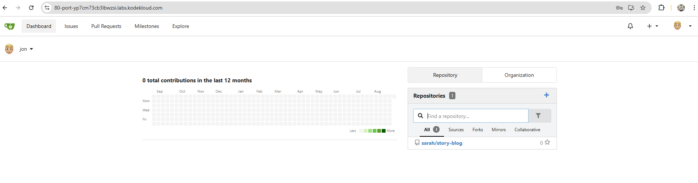
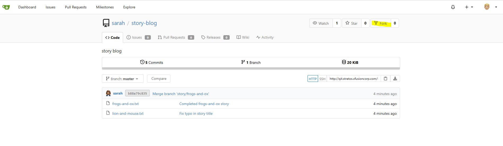
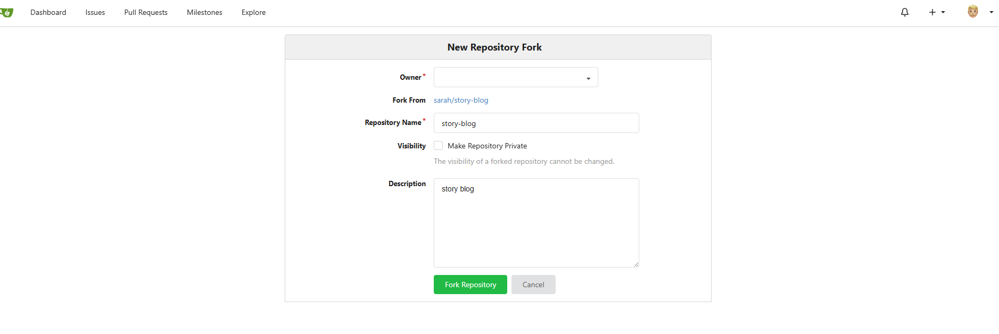
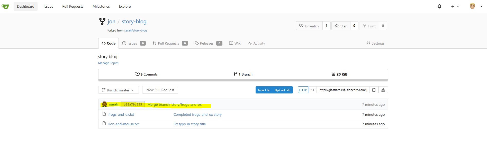

# 🧪 100 Days of DevOps – Day 23
## ✅ Task: Fork a Git Repository

```text
There is a Git server utilized by the Nautilus project teams. Recently, a new developer named Jon joined the team 
and needs to begin working on a project. To begin, he must fork an existing Git repository. Follow the steps below:

a. Click on the Gitea UI button located on the top bar to access the Gitea page.
b. Login to Gitea server using username jon and password Jon_pass123.
c. Once logged in, locate the Git repository named sarah/story-blog and fork it under the jon user.
```
> 📌 Note: For tasks requiring web UI changes, screenshots are necessary for review. Consider using screen recording software such as loom.com to capture and share the process.

---

🛠️ Task
- Access Gitea via UI
- Login as jon
- Locate repo sarah/story-blog
- Fork it under jon
- Verify forked repository exists under Jon’s account

---

### 🔁 Step 1: Access Gitea UI
- Click the Gitea UI button in the top navigation bar of the lab environment.
- This will open the Gitea web interface in a new tab.

---

### 🔁 Step 2: Login as Jon
Enter credentials:
- Username: `jon`
- Password: `Jon_pass123`
Click `Sign In`.



---

### 🔁 Step 3: Locate Repository
1. After login, click on the Explore menu in Gitea.
2. In the Repositories section, search for sarah/story-blog.
> ✅ You should see the repository owned by sarah.



---

### 🔁 Step 4: Fork Repository
1. Open the repository sarah/story-blog.
2. On the top right, click the Fork button.
3. Choose the jon user as the destination for the fork.



---

### 🔁 Step 5: Verify Fork
- Go to jon’s profile → Repositories.
- You should now see a forked repository:
```bash
jon/story-blog
```
- The fork will have a small fork icon indicating its origin.



---

## ✅ Task Completed
- Accessed Gitea UI successfully
- Logged in with jon account
- Located sarah/story-blog repo
- Forked it into jon namespace
- Verified forked repo exists as jon/story-blog
