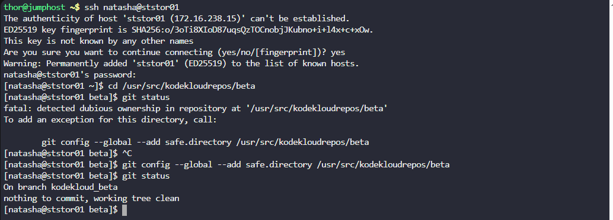
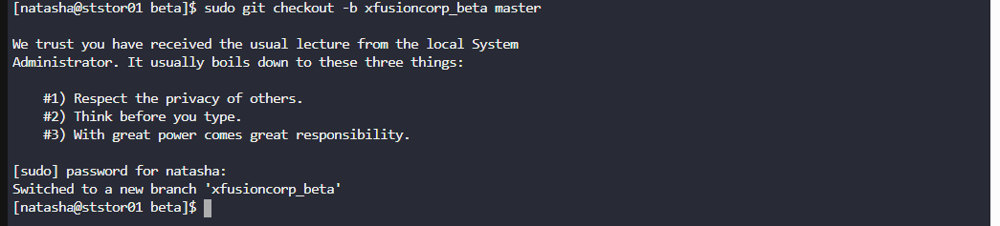
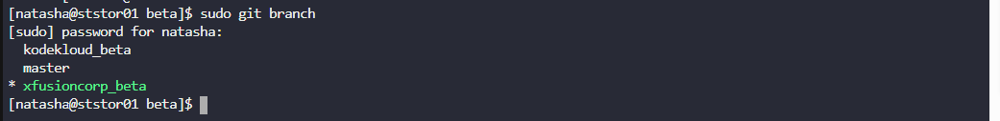

# 🧪 100 Days of DevOps – Day 24
## ✅ Task: Git Create Branches

```text
Nautilus developers are actively working on one of the project repositories, /usr/src/kodekloudrepos/beta.
Recently, they decided to implement some new features in the application, and they want to maintain those
new changes in a separate branch. Below are the requirements that have been shared with the DevOps team:

1. On Storage server in Stratos DC create a new branch xfusioncorp_beta from master branch in /usr/src/kodekloudrepos/beta git repo.
2. Please do not try to make any changes in the code.
```

---

Task
- SSH into the Storage Server.
- Navigate to the repository directory.
- Verify the current branch (should be master).
- Create a new branch xfusioncorp_beta from master.
- Verify the branch exists.

---

### 🔁 Step 1: SSH into Storage Server
```bash
ssh natasha@ststor01
```

password
```bash
Bl@kW
```

---

### 🔁 Step 2: Navigate to Repository
```bash
cd /usr/src/kodekloudrepos/beta
```

Check repo status:
```bash
git status
```
> Expected: You are on branch `kodekloud_beta`.



---

### 🔁 Step 3: Create New Branch
```bash
sudo git checkout -b xfusioncorp_beta master
```



#### Explanation of `sudo git checkout -b xfusioncorp_beta master`

| Part                  | Meaning                                                                 |
|-----------------------|-------------------------------------------------------------------------|
| `sudo`                | Runs the command with **superuser privileges** (since the repo is under `/usr/src`). |
| `git`                 | The **Git command-line tool**.                                          |
| `checkout`            | Git subcommand used to **switch branches** or restore files.            |
| `-b`                  | Creates a **new branch** before switching to it.                       |
| `xfusioncorp_beta`    | The **name of the new branch** being created.                          |
| `master`              | The **starting point** (branch) from which the new branch will be created. |

---

### 🔁 Step 4: Verify Branch Creation
```bash
sudo git branch
```

output:
```nginx
  kodekloud_beta
  master
* xfusioncorp_beta
```



#### Explanation of `sudo git branch`

| Part        | Meaning                                                                 |
|-------------|-------------------------------------------------------------------------|
| `sudo`      | Runs the command with **superuser privileges** (repo is under `/usr/src`). |
| `git`       | The **Git command-line tool**.                                          |
| `branch`    | Lists, creates, or deletes branches depending on usage. Without extra options, it **lists all local br

---

## ✅ Task Completed

- New branch xfusioncorp_beta created successfully from master.
- Verified branch existence using git branch.
- No modifications were made to the repository code.


