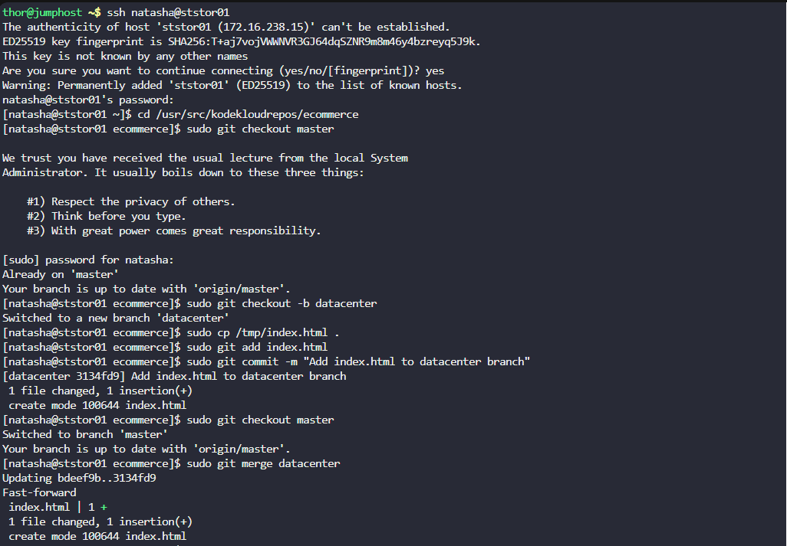

# 🧪 100 Days of DevOps – Day 25
## ✅ Task: Git Merge Branches

```text
The Nautilus application development team has been working on a project repository /opt/ecommerce.git.
This repo is cloned at /usr/src/kodekloudrepos on storage server in Stratos DC.
They recently shared the following requirements with DevOps team:

Create a new branch datacenter in /usr/src/kodekloudrepos/ecommerce repo from master
and copy the /tmp/index.html file (present on storage server itself) into the repo.
Further, add/commit this file in the new branch and merge back that branch into master branch.
Finally, push the changes to the origin for both of the branches.
```

---

Task
- Create a new branch `datacenter` from `master` in /usr/src/kodekloudrepos/ecommerce.
- Copy /tmp/index.html into the repo.
- Add & commit this file in `datacenter` branch.
- Merge `datacenter` branch into `master`.
- Push changes to origin for both branches.


---

### 🔁 Step 1: SSH into Storage Server
```bash
ssh natasha@ststor01
```

password
```bash
Bl@kW
```

---

### 🔁 Step 2: Go to Repo
```bash
cd /usr/src/kodekloudrepos/ecommerce
```

#### Explanation of `cd /usr/src/kodekloudrepos/ecommerce`

| Part                               | Meaning                                                                 |
|------------------------------------|-------------------------------------------------------------------------|
| `cd`                               | Stands for **change directory**. Moves you into another folder.         |
| `/usr/src/kodekloudrepos/ecommerce`| The **target directory** (in this case, the `ecommerce` working repository under `kodekloudrepos`). |


Ensure you are on master
```bash
sudo git checkout master
```
> Output: `Already on 'master`

#### Explanation of `sudo git checkout master`

| Part      | Meaning                                                                 |
|-----------|-------------------------------------------------------------------------|
| `sudo`    | Runs the command with **superuser privileges** (needed since the repo is under `/usr/src`). |
| `git`     | The **Git command-line tool**.                                          |
| `checkout`| Switches branches or restores working tree files.                       |
| `master`  | The name of the branch you want to switch to (the default branch in many repos). |

---

### 🔁 Step 3: Create and switch to new branch datacenter
```bash
sudo git checkout -b datacenter
```

#### Explanation of `sudo git checkout -b datacenter`

| Part        | Meaning                                                                 |
|-------------|-------------------------------------------------------------------------|
| `sudo`      | Runs the command with **superuser privileges** (repo is under `/usr/src`). |
| `git`       | The **Git command-line tool**.                                          |
| `checkout`  | Used to **switch branches** or restore files.                           |
| `-b`        | Creates a **new branch** before switching to it.                        |
| `datacenter`| The **name of the new branch** being created.                           |

---

### 🔁 Step 4: Copy file into repo
```bash
sudo cp /tmp/index.html .
```

#### Explanation of `sudo cp /tmp/index.html .`

| Part              | Meaning                                                                 |
|-------------------|-------------------------------------------------------------------------|
| `sudo`            | Runs the command with **superuser privileges** (needed if `/usr/src/...` requires root access). |
| `cp`              | The **copy command** in Linux. Copies files or directories.             |
| `/tmp/index.html` | The **source file** to be copied. Located in the temporary directory `/tmp`. |
| `.`               | The **destination directory** — here it means "the current directory".  |

---

### 🔁 Step 5: Stage & commit file
```
sudo git add index.html
sudo git commit -m "Add index.html to datacenter branch"
```

#### Command 1: `sudo git add index.html`

| Part           | Meaning                                                                 |
|----------------|-------------------------------------------------------------------------|
| `sudo`         | Runs with **superuser privileges** (since repo is under `/usr/src`).    |
| `git`          | The **Git command-line tool**.                                          |
| `add`          | Stages files, preparing them to be included in the next commit.         |
| `index.html`   | The specific file being staged.                                         |


#### Command 2: `sudo git commit -m "Add index.html to datacenter branch"`

| Part                              | Meaning                                                                 |
|-----------------------------------|-------------------------------------------------------------------------|
| `sudo`                            | Runs with **superuser privileges**.                                     |
| `git`                             | The Git command-line tool.                                              |
| `commit`                          | Records staged changes to the repository’s history.                     |
| `-m "Add index.html to datacenter branch"` | Inline **commit message** describing the change.                   |

---

### 🔁 Step 6: Switch back to master and merge
```bash
sudo git checkout master
sudo git merge datacenter
```

#### Command 1: `sudo git checkout master`

| Part     | Meaning                                                                 |
|----------|-------------------------------------------------------------------------|
| `sudo`   | Runs the command with **superuser privileges** (repo is under `/usr/src`). |
| `git`    | The **Git command-line tool**.                                          |
| `checkout master` | Switches the working directory to the `master` branch.         |


#### Command 2: `sudo git merge datacenter`

| Part       | Meaning                                                                 |
|------------|-------------------------------------------------------------------------|
| `sudo`     | Runs with superuser privileges.                                         |
| `git`      | Git tool.                                                               |
| `merge`    | Integrates changes from another branch into the current branch.         |
| `datacenter` | The branch you want to merge into `master`.                          |

---

### 🔁 Step 7: Push both branches to origin
```bash
sudo git push origin master
sudo git push origin datacenter
```

#### Command 1: `sudo git push origin master`

| Part          | Meaning                                                                 |
|---------------|-------------------------------------------------------------------------|
| `sudo`        | Runs the command with **superuser privileges** (repo is under `/usr/src`). |
| `git`         | The **Git command-line tool**.                                          |
| `push`        | Uploads local commits/branches to a remote repository.                  |
| `origin`      | The default **remote name** (points to `/opt/media.git`).               |
| `master`      | The **branch being pushed** to the remote repo.                         |

👉 This updates the `master` branch on `origin` to include the merge you just did.  


#### Command 2: `sudo git push origin datacenter`

| Part          | Meaning                                                                 |
|---------------|-------------------------------------------------------------------------|
| `sudo`        | Superuser privileges (repo is under `/usr/src`).                        |
| `git push`    | Pushes commits/branches to remote.                                      |
| `origin`      | Remote repository (`/opt/media.git`).                                   |
| `datacenter`  | Pushes the `datacenter` branch so it also exists on the remote.         |

👉 This ensures that `datacenter` is also available in the central bare repo.  

---

### 🔁 Step 8: Verification
Check branch list:
```bash
git branch -a
```

#### Explanation of `git branch -a`

| Part       | Meaning                                                                 |
|------------|-------------------------------------------------------------------------|
| `git`      | The **Git command-line tool**.                                          |
| `branch`   | Lists, creates, or deletes branches.                                    |
| `-a`       | Shows **all branches** (both local and remote).                         |


Check commit log:
```bash
git log --oneline --graph --all
```

# Explanation of `git log --oneline --graph --all`

| Part          | Meaning                                                                 |
|---------------|-------------------------------------------------------------------------|
| `git`         | The **Git command-line tool**.                                          |
| `log`         | Shows the commit history.                                               |
| `--oneline`   | Displays each commit in a **condensed, single-line format** (commit hash + message). |
| `--graph`     | Adds an **ASCII graph** in the left margin, showing branches and merges. |
| `--all`       | Shows commits from **all branches** (not just the current branch).       |


Check remote branches:
```bash
git ls-remote --heads origin
```

#### Explanation of `git ls-remote --heads origin`

| Part        | Meaning                                                                 |
|-------------|-------------------------------------------------------------------------|
| `git`       | The **Git command-line tool**.                                          |
| `ls-remote` | Lists references (branches, tags, HEADs) available in a remote repo.    |
| `--heads`   | Restricts output to **branch heads** only (ignores tags, etc.).          |
| `origin`    | The name of the **remote repository** (in your case, `/opt/media.git`). |

Expected:
- Both master and datacenter exist on remote.
- index.html appears in repo and is tracked in master.




---


## ✅ Task Completed
- New branch datacenter created successfully from master.
- File index.html copied, staged, and committed in datacenter.
- Branch datacenter merged back into master without conflicts.
- Both branches (master and datacenter) pushed to origin.
- Verified with git branch -a, git log --oneline --graph --all, and git ls-remote --heads origin.
