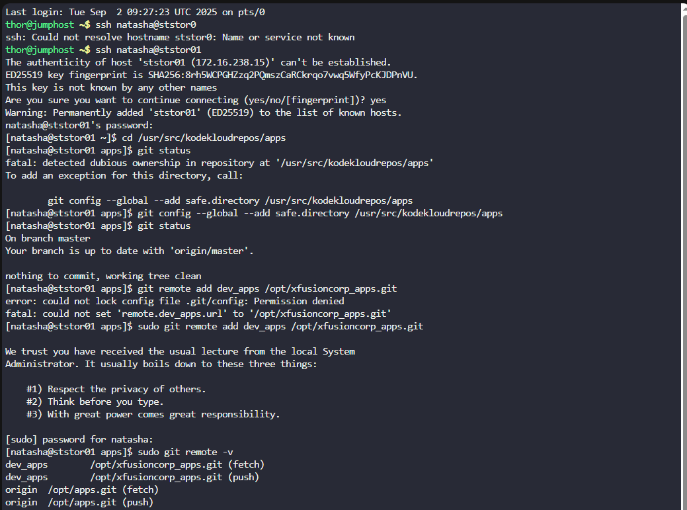
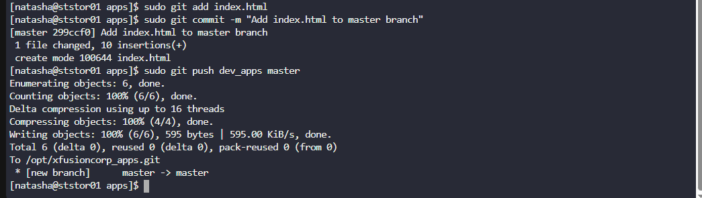

# 🧪 100 Days of DevOps – Day 25
## ✅ Task: Git Manage Remotes

```text
The xFusionCorp development team added updates to the project that is maintained under /opt/apps.git
repo and cloned under /usr/src/kodekloudrepos/apps.
Recently some changes were made on Git server that is hosted on Storage server in Stratos DC.
The DevOps team added some new Git remotes, so we need to update remote on /usr/src/kodekloudrepos/apps
repository as per details mentioned below:

Your tasks:
a. In /usr/src/kodekloudrepos/apps repo add a new remote dev_apps and point it to 
   /opt/xfusioncorp_apps.git.
b. There is a file /tmp/index.html on same server; copy this file to the repo and add/commit to master branch.
c. Finally push master branch to this new remote origin.
```

---

Task
- SSH into Storage Server
- Navigate to `/usr/src/kodekloudrepos/apps`
- Add a new Git remote `dev_apps` pointing to `/opt/xfusioncorp_apps.git`
- Copy `/tmp/index.html` into repo
- Stage and commit the file into master branch
- Push changes to new remote

---

### 🔁 Step 1: SSH into Storage Server

```bash
ssh natasha@ststor01
```

password
```
Bl@kW
```

---

### 🔁 Step 2: Navigate to Repo
```bash
cd /usr/src/kodekloudrepos/apps
```

Check current branch:
```
sudo git status
```

Expected:
```nginx
On branch master
nothing to commit, working tree clean
```

---

### 🔁 Step 3: Add New Remote
```bash
sudo git remote add dev_apps /opt/xfusioncorp_apps.git
```

#### Explanation of `sudo git remote add dev_apps /opt/xfusioncorp_apps.git`

| Part                  | Meaning                                                                 |
|-----------------------|-------------------------------------------------------------------------|
| `sudo`                | Runs with **superuser privileges** (repo is under `/usr/src`).          |
| `git`                 | The **Git command-line tool**.                                          |
| `remote`              | Manages remote repositories linked to the current repo.                 |
| `add`                 | Adds a new remote connection.                                           |
| `dev_apps`            | The **name (alias)** for the new remote. You can choose any label.      |
| `/opt/xfusioncorp_apps.git` | The **path/URL** to the remote repo (a local bare Git repo here). |


Verify:
```bash
sudo git remote -v
```

Expected Output:
```nginx
origin    /opt/apps.git (fetch)
origin    /opt/apps.git (push)
dev_apps  /opt/xfusioncorp_apps.git (fetch)
dev_apps  /opt/xfusioncorp_apps.git (push)
```

#### Explanation of `sudo git remote -v`

| Part     | Meaning                                                                 |
|----------|-------------------------------------------------------------------------|
| `sudo`   | Runs the command with **superuser privileges** (repo is under `/usr/src`). |
| `git`    | The **Git command-line tool**.                                          |
| `remote` | Manages remote repositories linked to the current repo.                 |
| `-v`     | Stands for **verbose** → shows the full URL/path for each remote.       |

---

### 🔁 Step 4: Copy File into Repo
```bash
sudo cp /tmp/index.html .
```

---

### 🔁 Step 5: Stage & Commit File
```bash
sudo git add index.html
sudo git commit -m "Add index.html to master branch"
```

Explanation:
- `git add` stages changes for commit.
- `git commit -m` records changes with a descriptive message.

---

### 🔁 Step 6: Push to New Remote
```bash
sudo git push dev_apps master
```
> This pushes the master branch from local repo → `dev_apps` remote (/opt/xfusioncorp_apps.git).

#### Explanation of `sudo git push dev_apps master`

| Part       | Meaning                                                                 |
|------------|-------------------------------------------------------------------------|
| `sudo`     | Runs with **superuser privileges** (repo is under `/usr/src`).          |
| `git`      | The **Git command-line tool**.                                          |
| `push`     | Sends local commits/branches to a remote repository.                    |
| `dev_apps` | The **remote name** (points to `/opt/xfusioncorp_apps.git`).            |
| `master`   | The **branch being pushed**.                                            |





---

## ✅ Task Completed
- Added new Git remote `dev_apps` pointing to `/opt/xfusioncorp_apps.git`.
- Copied `/tmp/index.html` into repo and committed changes on master branch.
- Successfully pushed master branch to `dev_apps` remote.
- Verified with `git remote -v` and `git log --oneline`.
