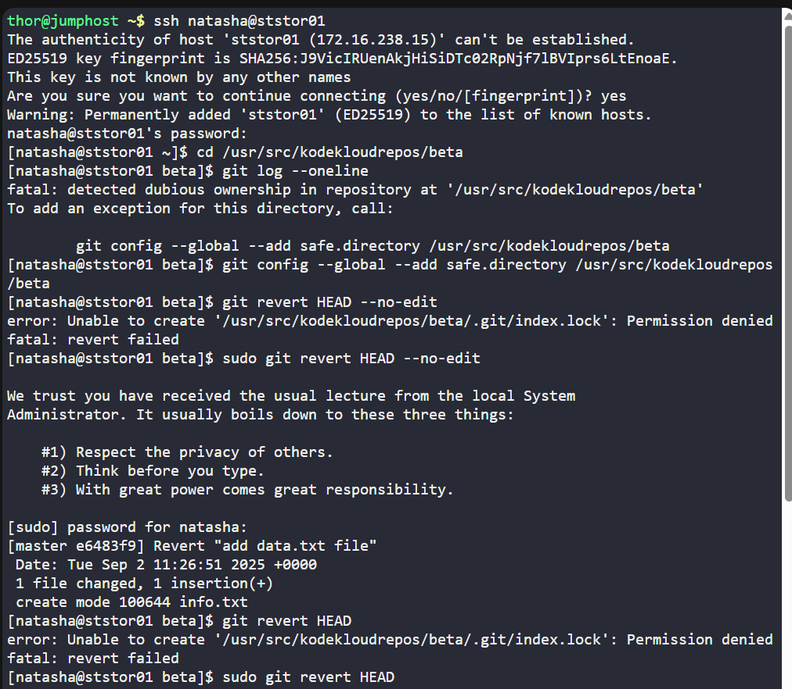
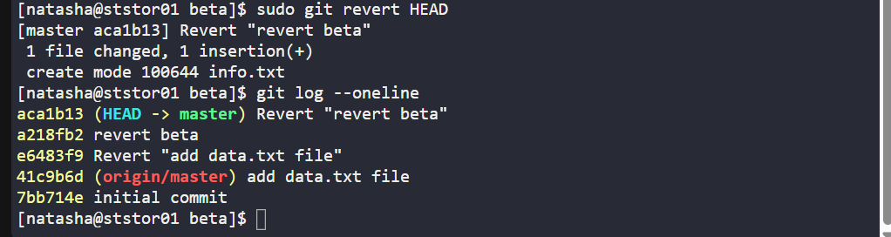
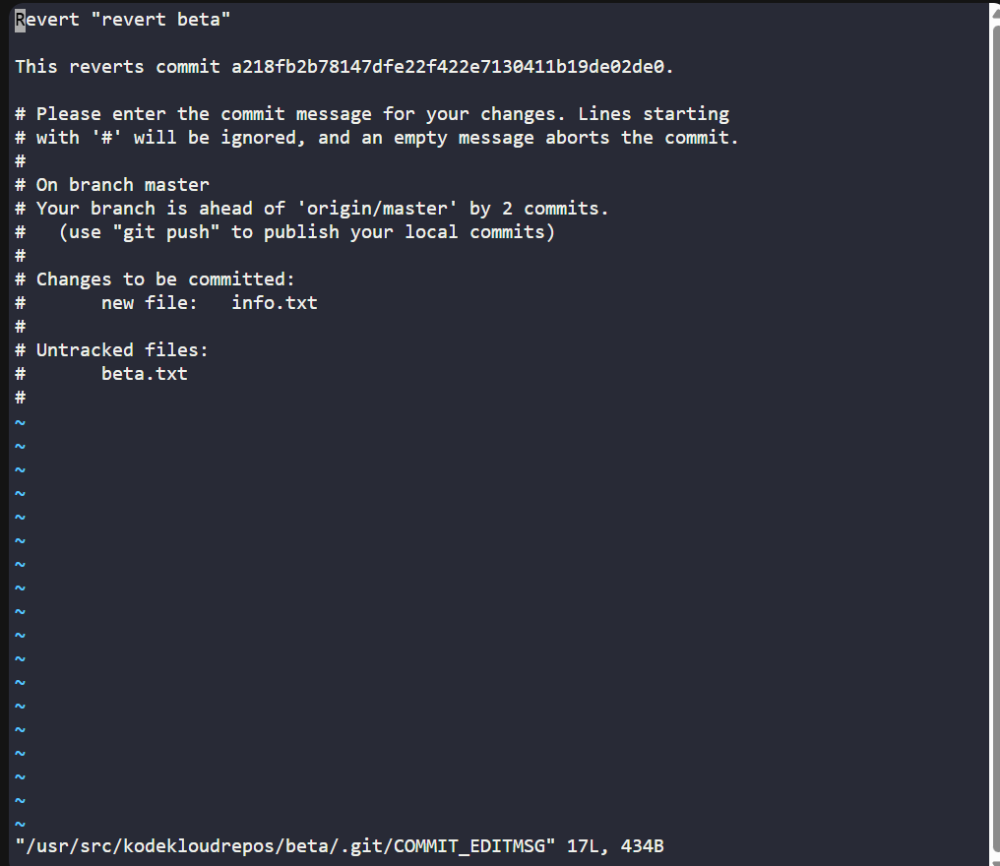

# 🧪 100 Days of DevOps – Day 27
## ✅ Task: Git Revert Some Changes

```text
The Nautilus application development team was working on a git repository /usr/src/kodekloudrepos/beta
present on Storage server in Stratos DC. However, they reported an issue with the recent commits being pushed to this repo.
They have asked the DevOps team to revert repo HEAD to last commit. Below are more details about the task:

1. In /usr/src/kodekloudrepos/beta git repository, revert the latest commit ( HEAD ) to the previous commit (JFYI the previous commit hash should be with initial commit message ).
2. Use revert beta message (please use all small letters for commit message) for the new revert commit.
```

---

Task
- Navigate to `/usr/src/kodekloudrepos/beta`
- Check commit history to confirm the last and initial commit
- Revert the latest commit (HEAD) back to previous
- Ensure commit message is exactly revert beta
- Verify repo state

---

### 🔁 Step 1: SSH into Storage Server
```bash
ssh natasha@ststor01
```

password
```bash
Bl@kW
```

---

### 🔁 Step 2: Go to Repo
```bash
cd /usr/src/kodekloudrepos/beta
```

Check you’re inside a Git repo:
```bash
sudo git status
```

#### Explanation of `sudo git status`

| Part     | Meaning                                                                 |
|----------|-------------------------------------------------------------------------|
| `sudo`   | Runs with **superuser privileges** (repo is under `/usr/src`).          |
| `git`    | The **Git command-line tool**.                                          |
| `status` | Shows the status of the working directory and staging area.             |

---

### 🔁 Step 3: Check Commit History
```bash
sudo git log --oneline
```

Expected Output:
```sql
a1b2c3d Latest feature commit
9f8e7d6 initial commit
```

Here:
- `a1b2c3d` → HEAD (latest commit we need to revert)
- `9f8e7d6` → Previous commit (initial commit)

#### Explanation of `sudo git log --oneline`

| Part        | Meaning                                                                 |
|-------------|-------------------------------------------------------------------------|
| `log`       | Displays the commit history.                                            |
| `--oneline` | Condenses each commit to **1 line** (short hash + commit message).       |

---

### 🔁 Step 4: Revert Latest Commit
```bash
git revert HEAD --no-edit
```

> ⚠️ By default, git revert opens an editor for commit message. To override and set a custom message:

| Part        | Meaning                                                                 |
|-------------|-------------------------------------------------------------------------|
| `revert`    | Creates a **new commit** that undoes the changes introduced by a previous commit. |
| `HEAD`      | Refers to the **latest commit** on the current branch.                  |
| `--no-edit` | Uses the default commit message automatically (no editor opens).        |

```bash
git revert HEAD -m "revert beta"
```

(Some Git versions don’t support -m for message, so instead do this:)

```bash
git revert HEAD
```

When editor opens → replace the message with:
```vi
revert beta
```
Save & exit.

---

### 🔁 Step 5: Verify
```bash
sudo git log --oneline
```

Expected latest entry:
```sql
1a2b3c4 (HEAD -> master) revert beta
a1b2c3d Added new feature
e4f5g6h initial commit
```





---

## ✅ Task Completed
- Navigated to `/usr/src/kodekloudrepos/beta`.
- Verified commit history with `git log`.
- Reverted the latest commit (HEAD) to previous commit.
- Added new commit with message "revert beta".
- Confirmed with `git log --oneline`.
