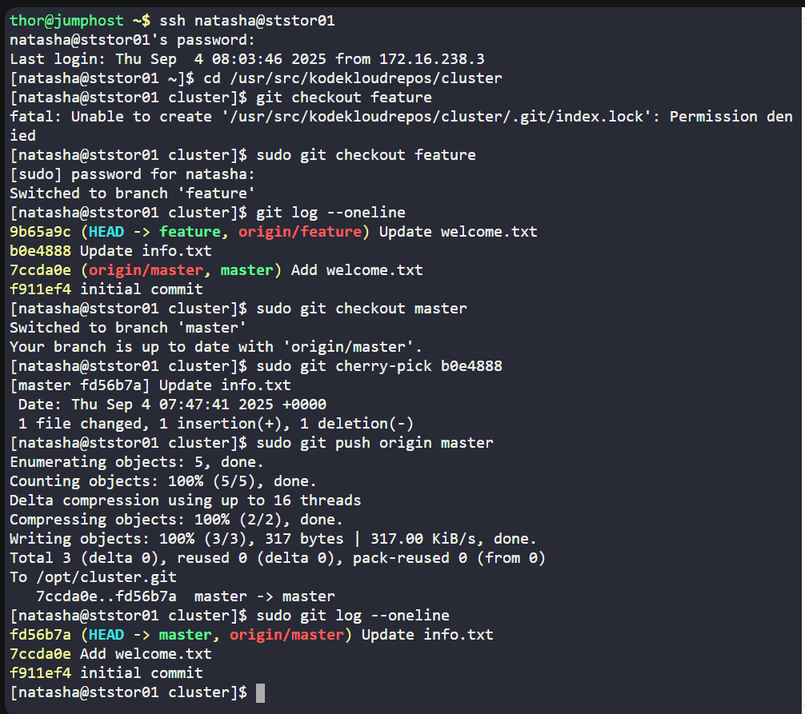

# 🧪 100 Days of DevOps – Day 28
## ✅ Task: Git Cherry Pick

```text
The Nautilus application development team has been working on a project repository /opt/cluster.git.
This repo is cloned at /usr/src/kodekloudrepos on storage server in Stratos DC.
They recently shared the following requirements with the DevOps team:

There are two branches in this repository, master and feature.
One of the developers is working on the feature branch and their work is still in progress,
however they want to merge one of the commits from the feature branch to the master branch,
the message for the commit that needs to be merged into master is Update info.txt.
Accomplish this task for them, also remember to push your changes eventually.
```

---

Task
- SSH into Storage Server
- Navigate to /usr/src/kodekloudrepos/cluster (the cloned repo)
- Identify the commit with message "Update info.txt" in the feature branch
- Cherry-pick that commit into master branch
- Push changes to remote (/opt/cluster.git)

---

### 🔁 Step 1: SSH into Storage Server
```bash
ssh natasha@ststor01
```

password
```bash
Bl@kW
```

---


### 🔁 Step 2: Navigate to Repo
```bash
cd /usr/src/kodekloudrepos/cluster
```

---

### 🔁 Step 3: Find Commit in Feature Branch
```bash
git checkout feature
git log --oneline
```

Look for the commit with message:
```nginx
####### Update info.txt
```

in my case
```nginx
9b65a9c (HEAD -> feature, origin/feature) Update welcome.txt
b0e4888 Update info.txt
7ccda0e (origin/master, master) Add welcome.txt
f911ef4 initial commit
```
> get the hash `b0e4888`

---

### 🔁 Step 4: Switch back to master branch:

```bash
sudo git checkout master
```

---

### 🔁 Step 5: Cherry-pick With the Real Hash:
```bash
sudo git cherry-pick b0e4888
```
> 👉 That will bring only the Update info.txt commit into master.


---

🔁 Step 6: Push to Remote
```bash
sudo git push origin master
```

🔎 Verify
```bash
sudo git log --oneline
```

Expected:
```nginx
xxxxxxx Update info.txt
yyyyyyy Previous master commit
```
> ✅ Commit Update `info.txt` is now in `master`.



---

## ✅ Task Completed

- Located commit with message Update info.txt in feature branch.
- Successfully cherry-picked that commit into master.
- Pushed changes back to central repo /opt/cluster.git.
- Verified using git log --oneline.
