# 🧪 100 Days of DevOps – Day 29
## ✅ Task: Manage Git Pull Requests

```text
Max want to push some new changes to one of the repositories but we don't want people to push directly to master branch,
since that would be the final version of the code. It should always only have content that has been reviewed and approved.
We cannot just allow everyone to directly push to the master branch. So, let's do it the right way as discussed below:

- SSH into storage server using user max, password Max_pass123 . There you can find an already cloned repo under Max user's home.
- Max has written his story about The 🦊 Fox and Grapes 🍇
- Max has already pushed his story to remote git repository hosted on Gitea branch story/fox-and-grapes
- Check the contents of the cloned repository. Confirm that you can see Sarah's story and history of commits
by running git log and validate author info, commit message etc.
- Max has pushed his story, but his story is still not in the master branch. Let's create a Pull Request(PR)
to merge Max's story/fox-and-grapes branch into the master branch
- Click on the Gitea UI button on the top bar. You should be able to access the Gitea page.
- UI login info:
    Username: max
    Password: Max_pass123
    PR title : Added fox-and-grapes story
    PR pull from branch: story/fox-and-grapes (source)
    PR merge into branch: master (destination)
- Before we can add our story to the master branch, it has to be reviewed. So, let's ask tom to review our PR by assigning him as a reviewer
- Add tom as reviewer through the Git Portal UI
    Go to the newly created PR
    Click on Reviewers on the right
    Add tom as a reviewer to the PR
  Now let's review and approve the PR as user Tom
- Login to the portal with the user tom
- Logout of Git Portal UI if logged in as max
- UI login info:
    Username: tom
    Password: Tom_pass123
    PR title : Added fox-and-grapes story
- Review and merge it.
- Great stuff!! The story has been merged! 👏

Note: For these kind of scenarios requiring changes to be done in a web UI,
please take screenshots so that you can share it with us for review in case
your task is marked incomplete. You may also consider using a screen recording
software such as loom.com to record and share your work.
```

---

Task
- SSH into storage server as Max (credentials: max / Max_pass123)
- Navigate to Max’s cloned repo under /home/max/
- Verify commit history and author info using git log
- Confirm Max’s story is on branch story/fox-and-grapes
- Open Gitea Web UI (click the top bar button in portal)
- Login with Max → Create a PR from story/fox-and-grapes → master
- PR title: Added fox-and-grapes story
- Assign Tom as reviewer
- Logout → Login as Tom → Approve & Merge PR
- Confirm that the story is now merged into master branch

---

### 🔁 Step 1: SSH into Storage Server
```bash
ssh max@ststor01
```

Password
```bash
Max_pass123
```

---

### 🔁 Step 2: Navigate to Repo
```bash
cd ~
ls -la
cd ~/story-blog
```

Check Git status:
```bash
git status
```

---

### 🔁 Step 3: Verify Commits
```bash
git log --oneline --decorate --graph
```

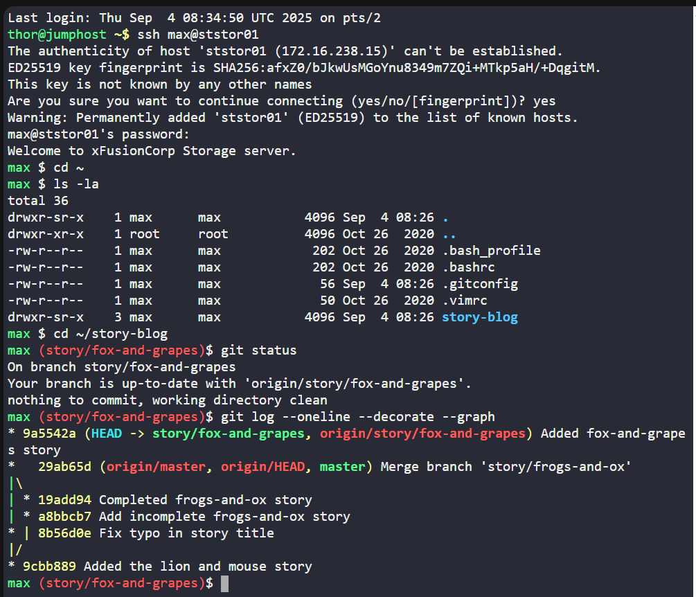

check details:
```bash
git log --pretty=full
```

Output:
```nginx
commit 9a5542a9a1c595874233190216073d4cc0207508
Author: max <max@stratos.xfusioncorp.com>
Commit: max <max@stratos.xfusioncorp.com>

    Added fox-and-grapes story
```

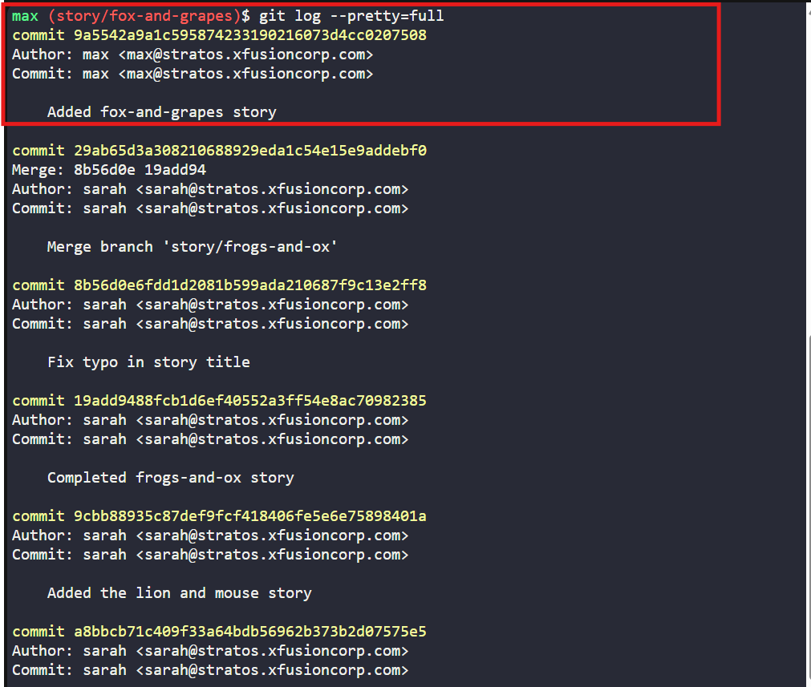

--- 

### 🔁 Step 4: Open Gitea Portal
- Click on Gitea button in top bar of the training portal
- Login as Max:
  - Username: max
  - Password: Max_pass123

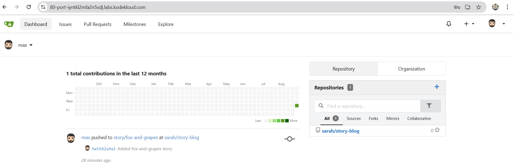
 
---

### 🔁 Step 5: Create Pull Request
- Navigate to repository
- Choose Pull Requests → New Pull Request
- Source branch: `story/fox-and-grapes`
- Target branch: `master`
- PR Title: `Added fox-and-grapes story`
- Click Create Pull Request

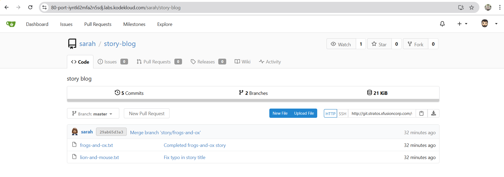
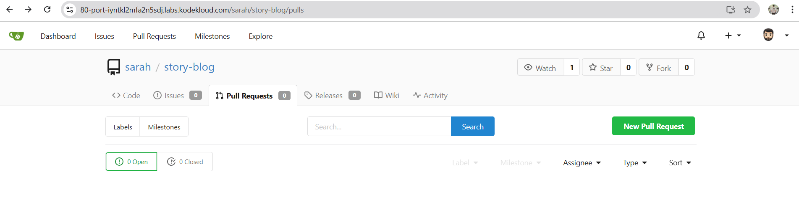
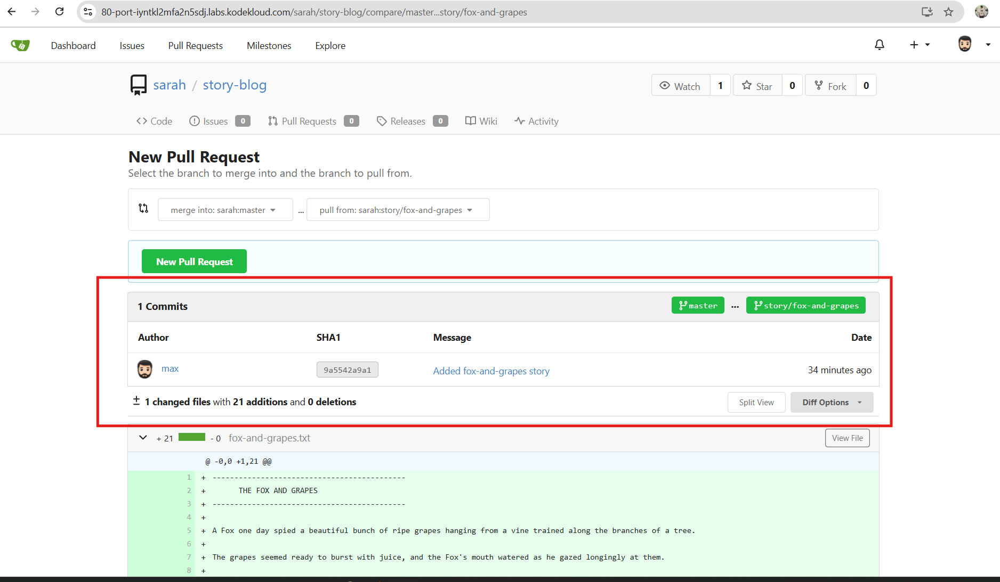

---

### 🔁 Step 6: Assign Reviewer
- In the PR page → Right panel → Reviewers
- Add tom as reviewer

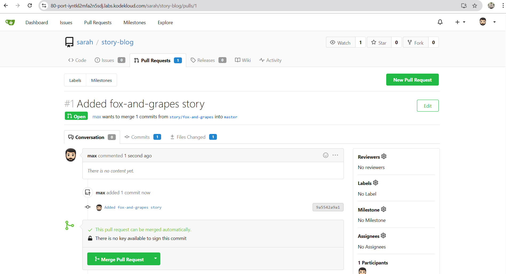
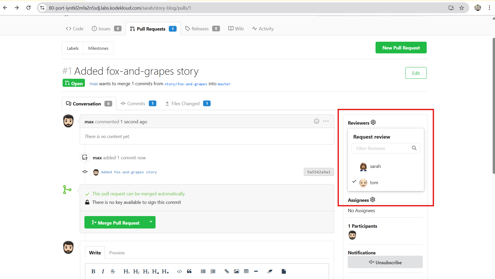

---

### 🔁 Step 7: Reviewer Approval
- Logout of UI (Max)
- Login as Tom:
  Username: tom
  Password: Tom_pass123
- Open the PR: Added fox-and-grapes story
- Review → Approve → Merge

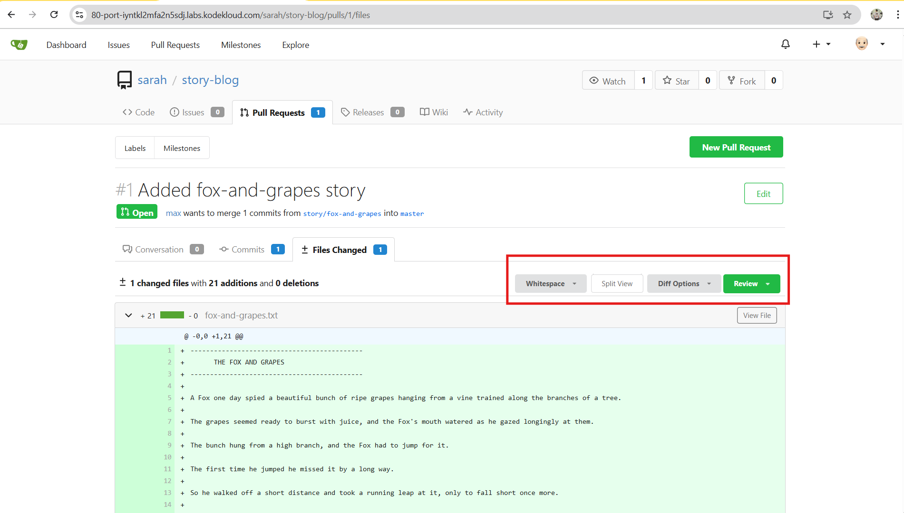
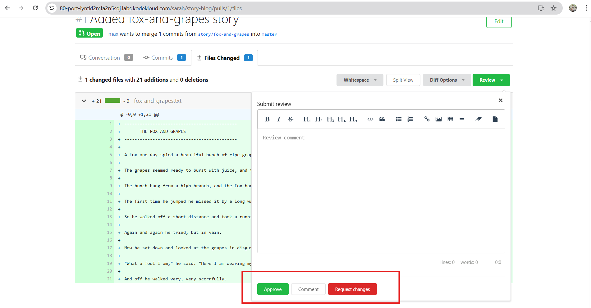
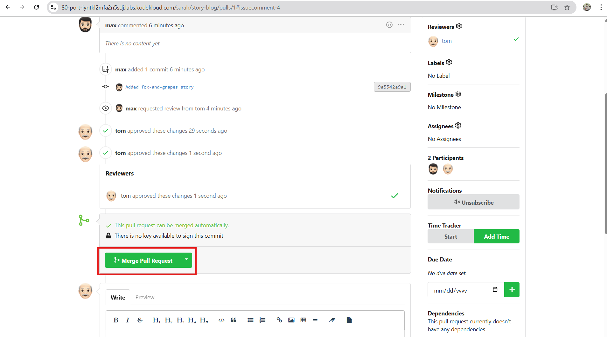
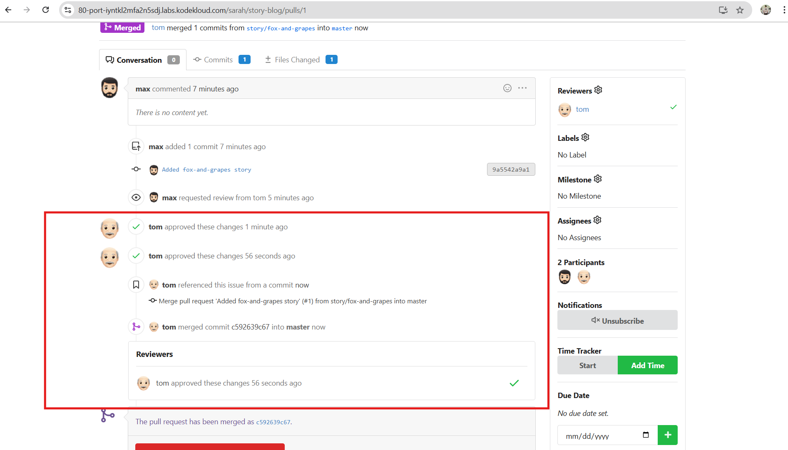


---

### 🔎 Verify Merge
- Check master branch in repo:
  - Either in Gitea UI: Go to repo → Branch: master → confirm new file/story exists

    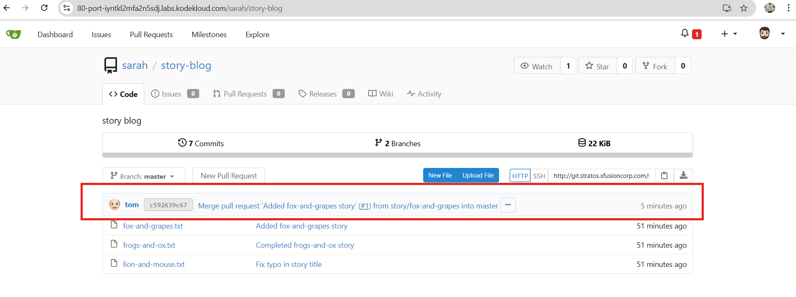
    
  - Or from terminal as Max:
    ```bash
    git checkout master
    git pull origin master
    ls -l
    ```

     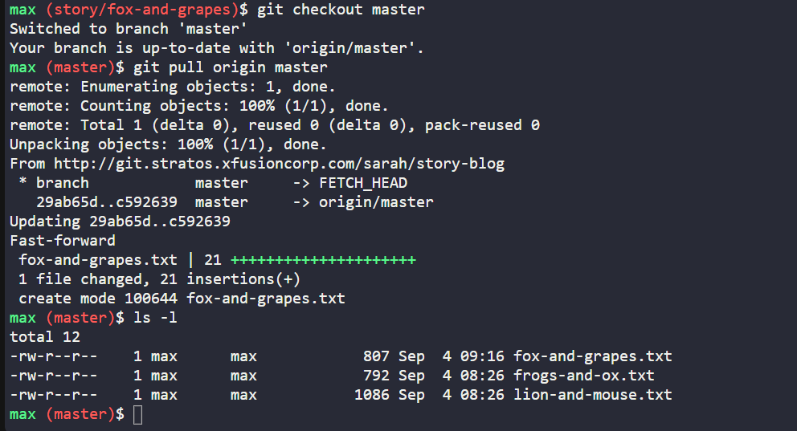

---

## ✅ Task Completed
- Max’s story (story/fox-and-grapes) committed and confirmed in repo.
- PR created from story/fox-and-grapes → master with title Added fox-and-grapes story.
- Reviewer Tom assigned → reviewed → approved.
- PR merged successfully
- Master branch now contains the fox-and-grapes story.
