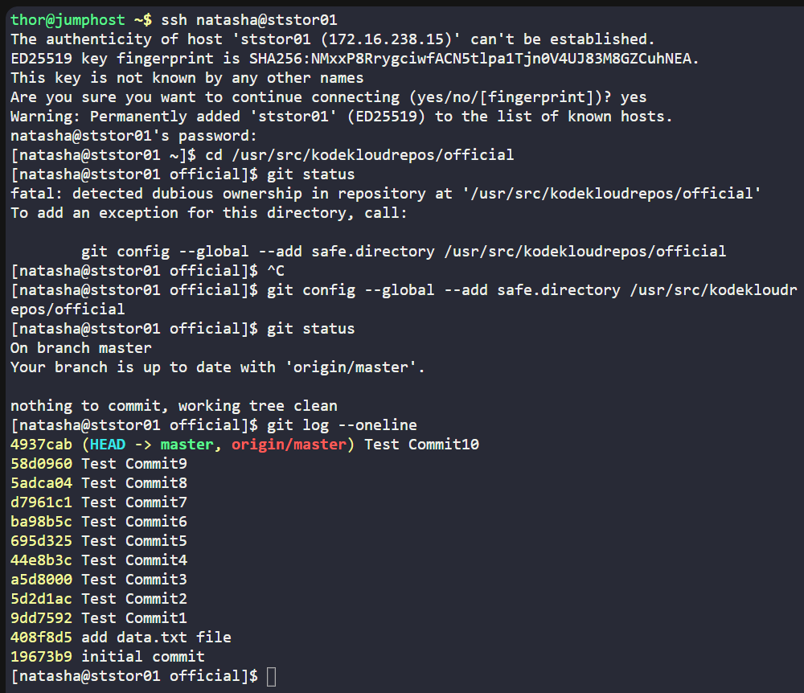
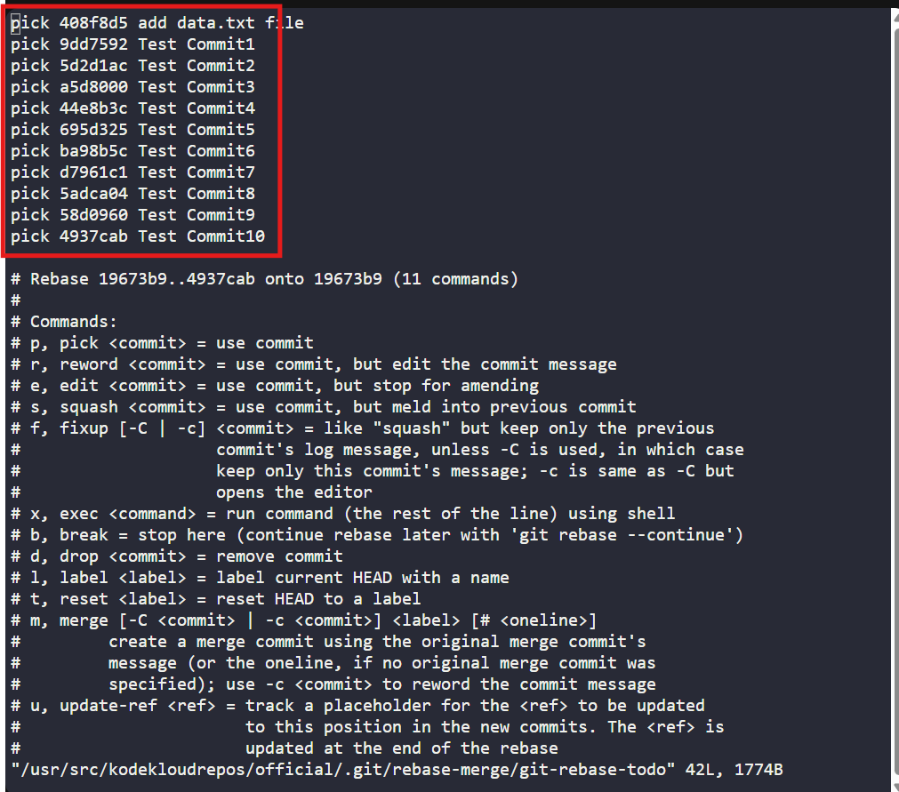
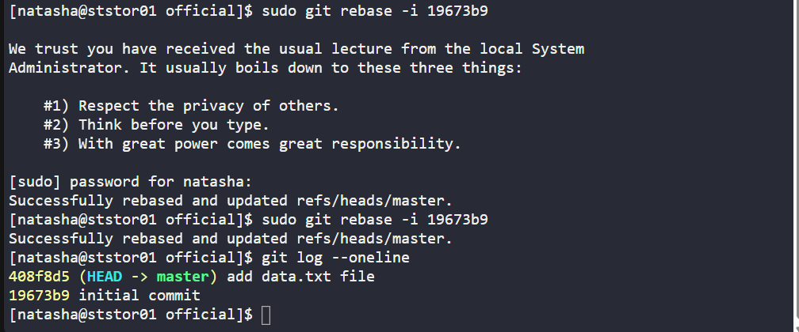
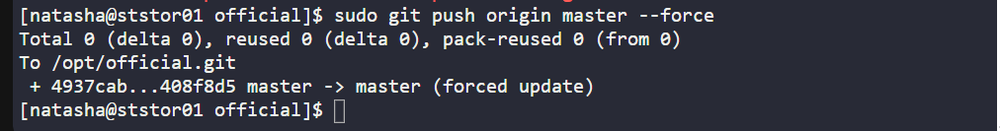

# 🧪 100 Days of DevOps – Day 30
## ✅ Task: Git hard reset

```text
The Nautilus application development team was working on a git repository /usr/src/kodekloudrepos/official
present on Storage server in Stratos DC. This was just a test repository and one of the developers just pushed
a couple of changes for testing, but now they want to clean this repository along with the commit history/work tree,
so they want to point back the HEAD and the branch itself to a commit with message add data.txt file. Find below more details:

a. In /usr/src/kodekloudrepos/official git repository, reset the git commit history so that there are only two commits in the commit history i.e initial commit and add data.txt file.
b. Also make sure to push your changes.
```

---

Task
- SSH into Storage Server
- Navigate to `/usr/src/kodekloudrepos/official`
- Identify the commit with message add `data.txt` file
- Reset the repository so that only initial commit and add data.txt file remain in history
- Push changes back to remote

---

### 🔁 Step 1: SSH into Storage Server
```bash
ssh natasha@ststor01
```

password
```bash
Bl@kW
```

---

### 🔁 Step 2: Navigate to Repo
```bash
cd /usr/src/kodekloudrepos/official
```

verify the status
```bash
git status
```
> On branch 'master'

---

### 🔁 Step 3: Inspect Commit History
```bash
git log --oneline
```

output:
```nginx
4937cab (HEAD -> master, origin/master) Test Commit10
58d0960 Test Commit9
5adca04 Test Commit8
d7961c1 Test Commit7
ba98b5c Test Commit6
695d325 Test Commit5
44e8b3c Test Commit4
a5d8000 Test Commit3
5d2d1ac Test Commit2
9dd7592 Test Commit1
408f8d5 add data.txt file
19673b9 initial commit
```

We want to keep only:
- 408f8d5 add data.txt file
- 19673b9 initial commit



---

### 🔁 Step 4: Reset History
Start an interactive rebase from the initial commit:
```bash
sudo git rebase -i 19673b9
```

Editor shows (mine):
```sql
pick 408f8d5 add data.txt file
pick 9dd7592 Test Commit1
pick 5d2d1ac Test Commit2
pick a5d8000 Test Commit3
pick 44e8b3c Test Commit4
pick 695d325 Test Commit5
pick ba98b5c Test Commit6
pick d7961c1 Test Commit7
pick 5adca04 Test Commit8
pick 58d0960 Test Commit9
pick 4937cab Test Commit10
```
> Keep the line for add data.txt file
> Delete the line for extra commits (Test commit for debugging)

Save & exit.



---

### 🔁 Step 5: Verify History
```bash
git log --oneline
```

Expected Output:
```nginx
408f8d5 (HEAD -> master) add data.txt file
19673b9 initial commit
```



---

### 🔁 Step 6: Push Changes
Since history was rewritten, force-push to remote:
```bash
sudo git push origin master --force
```



---

#### Explanation of Key Commands

| Command                          | Meaning                                                                                               |
| -------------------------------- | ----------------------------------------------------------------------------------------------------- |
| `git log --oneline`              | Shows commit history in short form (hash + message).                                                  |
| `git rebase -i <hash>`           | Opens interactive rebase starting from given commit. Lets you edit, squash, or remove commits.        |
| `git push origin master --force` | Pushes local branch to remote, overwriting its history. Required after rebasing or resetting history. |

---

## ✅ Task Completed
- Reset commit history in `/usr/src/kodekloudrepos/official`.
- Only initial commit and add data.txt file remain.
- Force-pushed to remote to sync changes.
