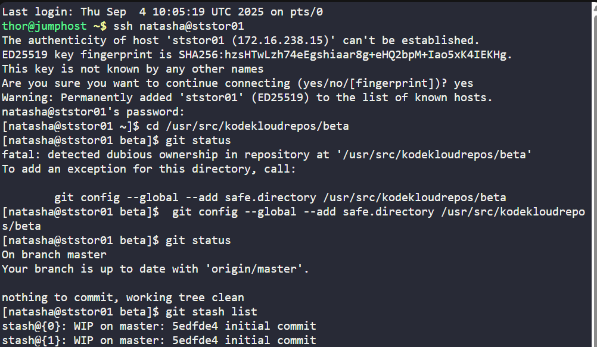
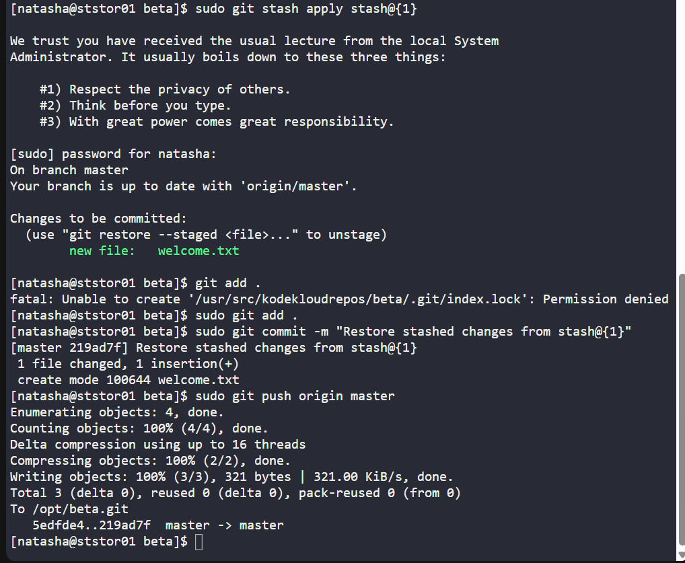

# 🧪 100 Days of DevOps – Day XX
## ✅ Task: Git Stash

```text
The Nautilus application development team was working on a git repository /usr/src/kodekloudrepos/beta
present on Storage server in Stratos DC. One of the developers stashed some in-progress changes in this repository,
but now they want to restore some of the stashed changes. Find below more details to accomplish this task:

Look for the stashed changes under /usr/src/kodekloudrepos/beta git repository, 
and restore the stash with stash@{1} identifier. 
Further, commit and push your changes to the origin.
```

---
Task
- SSH into Storage Server
- Navigate to `/usr/src/kodekloudrepos/beta`
- List stashed changes
- Apply stash with identifier `stash@{1}`
- Stage & commit the restored changes
- Push to remote `origin`

---

### 🔁 Step 1: SSH into Storage Server
```bash
ssh natasha@ststor01
```

password
```bash
Bl@kW
```

---

### 🔁 Step 2: Navigate to Repo
```bash
cd /usr/src/kodekloudrepos/beta
```

then check the status
```bash
git status
```
Output:
```text
On branch master
Your branch is up to date with 'origin/master'.

nothing to commit, working tree clean
```

---

### 🔁 Step 3: List Stashed Changes
```bash
git stash list
```

Output:
```text
stash@{0}: WIP on master: 5edfde4 initial commit
stash@{1}: WIP on master: 5edfde4 initial commit
```
> We need stash@{1}.

---

🔁 Step 4: Apply the Stash
```bash
sudo git stash apply stash@{1}
```
> This restores the changes from stash@{1} into the working directory but keeps them in the stash list.
If you want to drop it immediately after applying, use git stash pop stash@{1} instead.


Output:
```txt
On branch master
Your branch is up to date with 'origin/master'.

Changes to be committed:
  (use "git restore --staged <file>..." to unstage)
        new file:   welcome.txt
```

---

### 🔁 Step 5: Stage and Commit Restored Changes
```bash
sudo git add .
sudo git commit -m "Restore stashed changes from stash@{1}"
```

---

### 🔁 Step 6: Push to Remote
```bash
sudo git push origin master
```

#### Explanation of Key Commands

| Command                     | Meaning                                                                   |
| --------------------------- | ------------------------------------------------------------------------- |
| `git stash list`            | Shows all stashed work with identifiers like `stash@{0}`, `stash@{1}`.    |
| `git stash apply stash@{1}` | Restores changes from stash slot `{1}` without removing it from the list. |
| `git add .`                 | Stages all modified/new files for commit.                                 |
| `git commit -m "message"`   | Creates a commit with the staged changes.                                 |
| `git push origin master`    | Pushes commits from the local `master` branch to the remote `origin`.     |





---

✅ Task Completed
- Restored stashed changes from `stash@{1}` in `/usr/src/kodekloudrepos/beta`.
- Committed the restored changes with message `"Restore stashed changes from stash@{1}".`
- Pushed changes successfully to remote origin.
