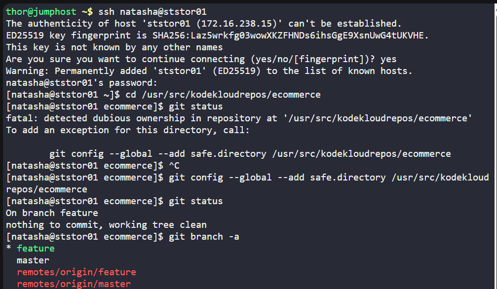
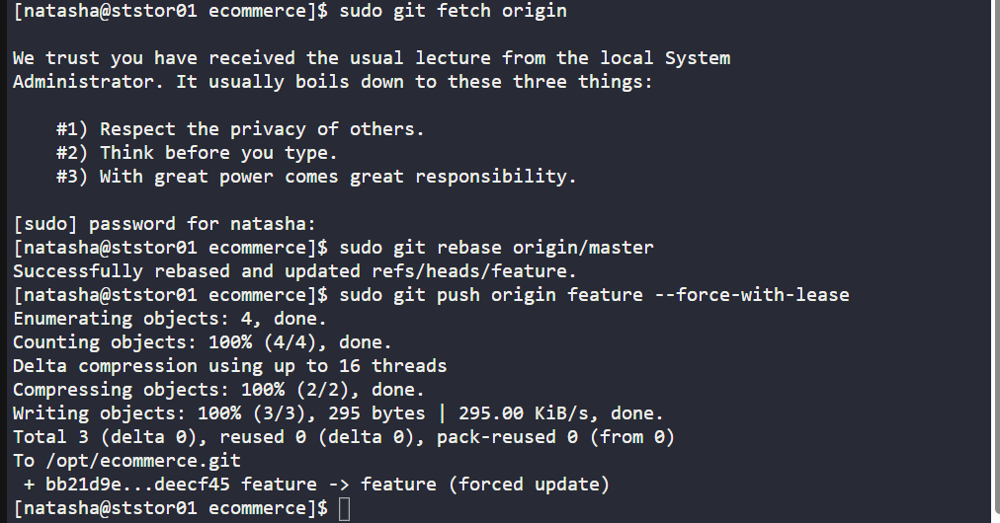

# 🧪 100 Days of DevOps – Day 32
## ✅ Task: Git Rebase

```task
The Nautilus application development team has been working on a project repository /opt/ecommerce.git.
This repo is cloned at /usr/src/kodekloudrepos on storage server in Stratos DC.
They recently shared the following requirements with DevOps team:

One of the developers is working on feature branch and their work is still in progress,
however there are some changes which have been pushed into the master branch,
the developer now wants to rebase the feature branch with the master branch without loosing any data from the feature branch,
also they don't want to add any merge commit by simply merging the master branch into the feature branch.
Accomplish this task as per requirements mentioned.

Also remember to push your changes once done.
```

---

Task

- SSH into Storage Server
- Navigate to `/usr/src/kodekloudrepos/ecommerce`
- Checkout the feature branch
- Rebase feature onto the latest master
- Resolve conflicts if any and continue rebase
- Push rebased branch to remote

---

### 🔁 Step 1: SSH into Storage Server
```bash
ssh natasha@ststor01
```

password
```bash
Bl@kW
```

---

### 🔁 Step 2: Navigate to Repo

```bash
cd /usr/src/kodekloudrepos/ecommerce
```

Check repo status:
```bash
git status
```

Output:
  ```nginxx
  On branch feature
  nothing to commit, working tree clean
  ```

```bash
git branch -a
```

Output:
  ```nginx
  * feature
  master
  remotes/origin/feature
  remotes/origin/master
  ```
> it means that I am in the feature branch already

---

### 🔁 Step 3: Rebase Feature with Master

```bash
sudo git fetch origin
sudo git rebase origin/master
```

> Output: `Successfully rebased and updated refs/heads/feature.`

If there will be conflict
```bash
git add <file>
git rebase --continue
```

If you need to abort:
```bash
git rebase --abort
```

---

### 🔁 Step 4: Push Rebased Feature Branch
```bash
sudo git push origin feature --force-with-lease
```



---

### Explanation of Key Commands

| Command                                      | Meaning                                                          |
| -------------------------------------------- | ---------------------------------------------------------------- |
| `git branch -a`                              | Lists all local and remote branches.                             |
| `git rebase origin/master`                   | Moves feature commits to sit on top of master commits.           |
| `git rebase --continue`                      | Continues rebase after resolving conflicts.                      |
| `git rebase --abort`                         | Cancels rebase if you want to roll back.                         |
| `git push origin feature --force-with-lease` | Pushes rebased branch to remote, safely overwriting old history. |

---

## ✅ Task Completed

- Feature branch successfully rebased onto master.
- No merge commits created.
- Feature branch updated and pushed to origin.

