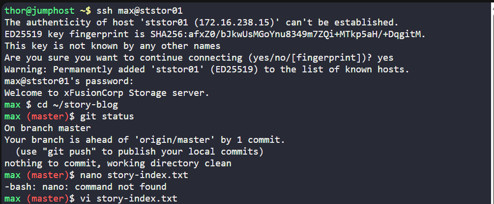
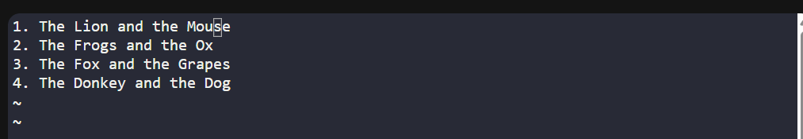
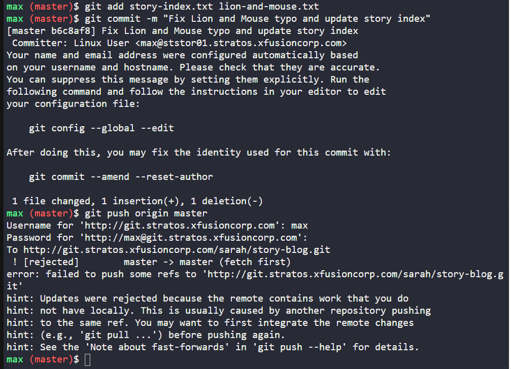
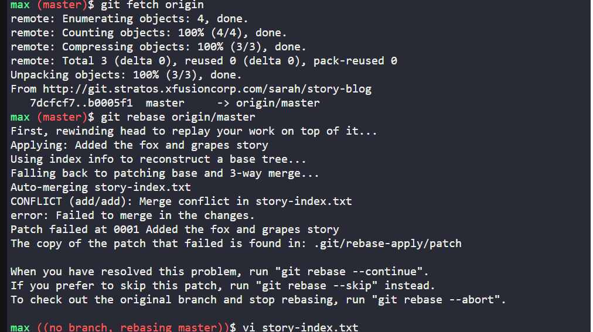
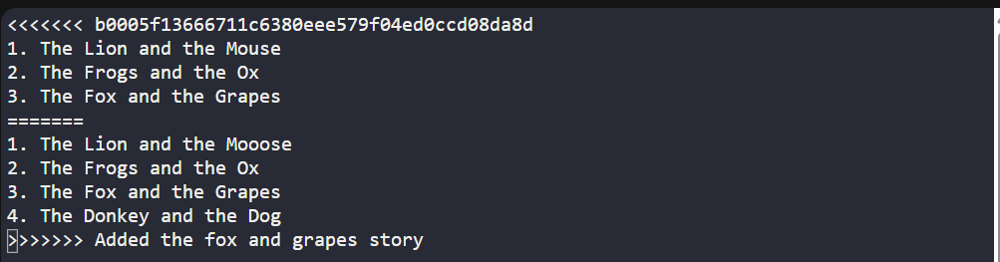
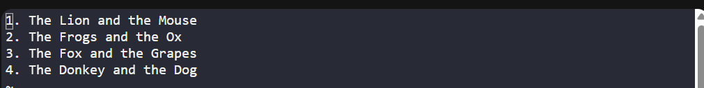
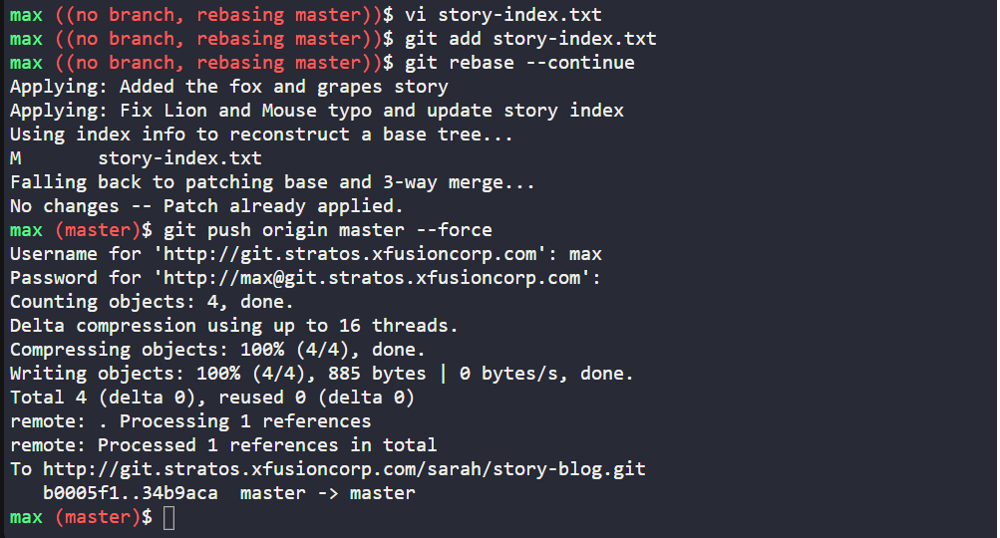
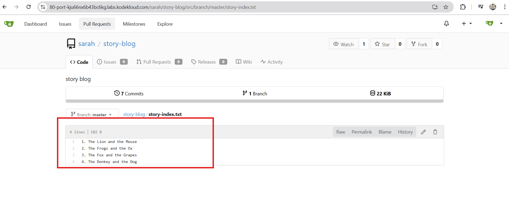

# 🧪 100 Days of DevOps – Day 32
## ✅ Task: Resolve Git Merge Conflicts

```text
Sarah and Max were working on writting some stories which they have pushed to the repository.
Max has recently added some new changes and is trying to push them to the repository but he is facing some issues.
Below you can find more details:

SSH into storage server using user max and password Max_pass123.
Under /home/max you will find the story-blog repository.
Try to push the changes to the origin repo and fix the issues.
The story-index.txt must have titles for all 4 stories.
Additionally, there is a typo in The Lion and the Mooose line where Mooose should be Mouse.

Click on the Gitea UI button on the top bar. You should be able to access the Gitea page.
You can login to Gitea server from UI using username sarah and password Sarah_pass123 or
username max and password Max_pass123.


Note: For these kind of scenarios requiring changes to be done in a web UI,
please take screenshots so that you can share it with us for review in case your task is marked incomplete.
You may also consider using a screen recording software such as loom.com to record and share your work.
```

---

### 🔁 Step 1: SSH into Storage Server
sign as max
```bash
ssh max@ststor01
```

password:
```bash
Max_pass123
```

---

### 🔁 Step 2: Navigate to Repo

```bash
cd ~/story-blog
git status
```

> Status: Branch is on `Master`

If push fails due to divergence or non-fast-forward, pull with rebase:
```bash
git pull --rebase origin master
```



---

### 🔁 Step 3: Fix Files

Open story-index.txt:
```bash
vi story-index.txt
```

it contains all 4 story titles:
```text
1. The Lion and the Mooose
2. The Frogs and the Ox
3. The Fox and the Grapes
4. The Donkey and the Dog
```

Fix typo inside story file:
Change `"The Lion and the Mooose"` → `"The Lion and the Mouse"`.



then check status:
```bash
git status
```

---

### 🔁 Step 4: Stage & Commit

```bash
git add story-index.txt lion-and-mouse.txt
git commit -m "Fix Lion and Mouse typo and update story index"
```

---

### 🔁 Step 5: Push to Remote

```bash
git push origin master
```



>There's an error in merging, we need to fix it first:

  #### Fix Step 1: Fetch the latest changes from origin
  ```bash
  git fetch origin
  ```
  > This downloads the latest refs/commits but doesn’t merge yet.
  
  #### Fix Step 2: Rebase local master onto origin/master
  ```bash
  git rebase origin/master
  ```
  - This replays your commits on top of Sarah’s commits.
  - It avoids unnecessary merge commits, keeping history clean.
  > 👉 If there are conflicts (very likely in story-index.txt), Git will stop and let you fix them manually.
  
  #### Fix Step 3: Resolve Conflicts
  Git show something like this:
  ```text
  CONFLICT (content): Merge conflict in story-index.txt
  ```


  
  Open the file:
  ```bash
  vi story-index.txt
  ```
  
  inside:
  ```text
  <<<<<<< b0005f13666711c6380eee579f04ed0ccd08da8d
  1. The Lion and the Mouse
  2. The Frogs and the Ox
  3. The Fox and the Grapes
  =======
  1. The Lion and the Mooose
  2. The Frogs and the Ox
  3. The Fox and the Grapes
  4. The Donkey and the Dog
  >>>>>>> Added the fox and grapes story
  ```


  
  > The conflict markers:
  - `<<<<<<<` = start of your changes
  - `=======` = separator between conflicting sections
  - `>>>>>>>` = end of the other branch’s changes
  
  manual edit the file, remove other markers and text into this:
  ```text
  1. The Lion and the Mouse
  2. The Frogs and the Ox
  3. The Fox and the Grapes
  4. The Donkey and the Dog
  ```

  
  Stage the resolved file:
  ```bash
  git add story-index.txt
  ```
  
  Continue the rebase (since you’re in the middle of one):
  ```bash
  git rebase --continue
  ```
  
  When rebase finishes, push your changes:
  ```bash
  git push origin master --force
  ```



---

### 🔁 Step 6: Verify on Gitea

- Open Gitea UI (top bar button in KodeKloud lab)
- Login as:
  - max / Max_pass123 OR
  - sarah / Sarah_pass123
- Go to story-blog repo
- Verify:
  - `story-index.txt` lists all 4 titles
  - "Mooose" typo is fixed → "Mouse"
  - Commit history includes your fix



---

### Explanation of Key Commands
| Command                           | Purpose                                                                                                    |
| --------------------------------- | ---------------------------------------------------------------------------------------------------------- |
| `git pull --rebase origin master` | Updates your branch by replaying your commits on top of the latest remote commits, avoiding merge commits. |
| `git fetch origin`                | Downloads remote refs/commits without merging. Safe way to update before rebasing.                         |
| `git rebase origin/master`        | Replays your commits after the remote’s commits → keeps linear history.                                    |
| `vi story-index.txt`              | Opens the file in the editor to resolve conflicts.                                                         |
| `<<<<<<< / ======= / >>>>>>>`     | Conflict markers showing where Git couldn’t auto-merge.                                                    |
| `git add <file>`                  | Marks conflict as resolved after editing.                                                                  |
| `git rebase --continue`           | Continues the rebase process after conflicts are fixed.                                                    |
| `git push origin master --force`  | Pushes rewritten history to remote (needed after rebase).                                                  |


---

## ✅ Task Completed
- Fixed push issue by rebasing with origin/master.
- Corrected typo "Mooose" → "Mouse".
- Added all 4 story titles to story-index.txt.
- Successfully pushed changes to remote and verified in Gitea UI.
