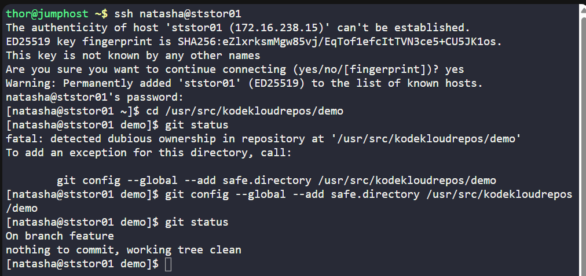
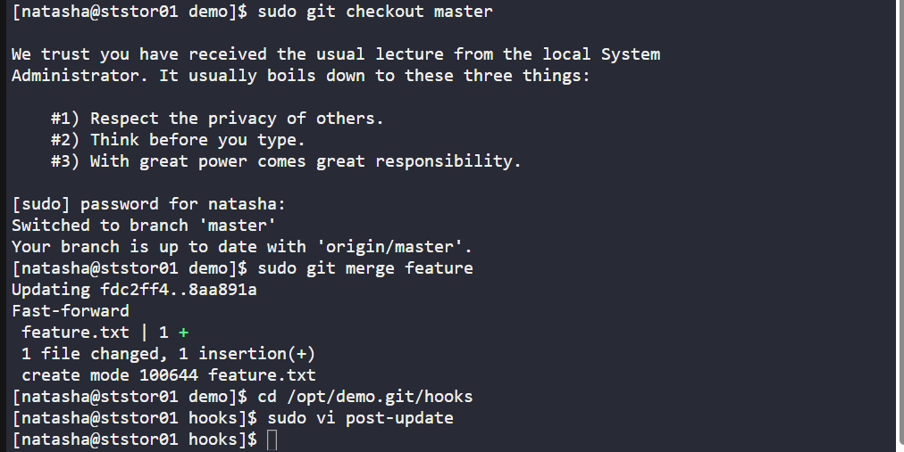
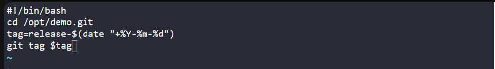
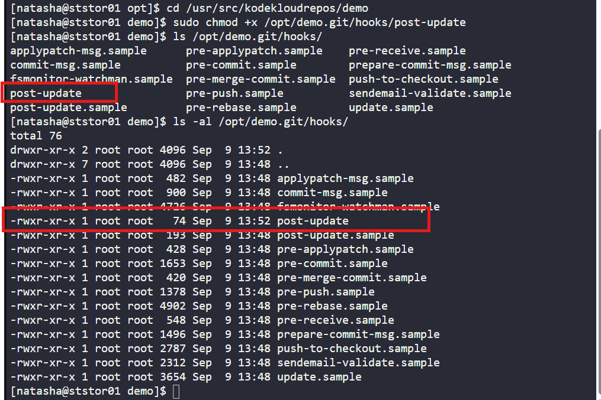
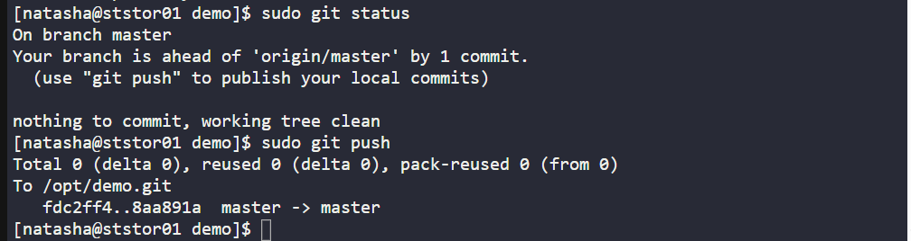
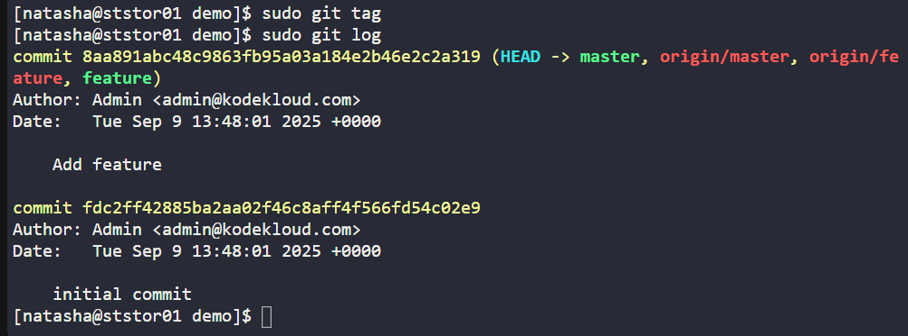

# 🧪 100 Days of DevOps – Day 34
## ✅ Task: Git Hooks

```text
The Nautilus application development team was working on a git repository /opt/demo.git which is cloned under /usr/src/kodekloudrepos
directory present on Storage server in Stratos DC. The team want to setup a hook on this repository, please find below more details:

1. Merge the feature branch into the master branch`, but before pushing your changes complete below point.
2. Create a post-update hook in this git repository so that whenever any changes are pushed to the master branch,
it creates a release tag with name release-2023-06-15, where 2023-06-15 is supposed to be the current date.
For example if today is 20th June, 2023 then the release tag must be release-2023-06-20.
Make sure you test the hook at least once and create a release tag for today's release.
3. Finally remember to push your changes.
```

---

Task
- SSH into Storage Server
- Navigate to /opt/demo.git (bare repo)
- Create hook that tags master commits with current date
- Merge feature → master in clone repo (/usr/src/kodekloudrepos/apps)
- Push master branch → triggers hook
- Verify release tag is created
---

### 🔁 Step 1: SSH into Storage Server

```bash
ssh natasha@ststor01
```

password:
```bash
Bl@kW
```

---

### 🔁 Step 2: Navigate to Repo

Go to bare repo
```bash
cd /usr/src/kodekloudrepos/demo
```

check status
```bash
git status
```

Output:
```nginx
On branch feature
nothing to commit, working tree clean
```



---

### 🔁 Step 3: Merge feature → master

```bash
sudo git checkout master
sudo git merge feature
```
> Output should confirm merge success (fast-forward or merge commit depending on changes).

---

### 🔁 Step 4: Create the post-update hook in /opt/demo.git

Navigate to the hooks directory:
```bash
cd /opt/demo.git/hooks
```



Open the post-update file:
```bash
sudo vi post-update
```

Enter this:
```bash
#!/bin/bash
cd /opt/demo.git
tag=release-$(date "+%Y-%m-%d")
git tag $tag
```


Go back to demo repo:
```bash
cd /usr/src/kodekloudrepos/demo
```

then make vi file executable:
```bash
sudo chmod +x /opt/demo.git/hooks/post-update
```

check the file:
```bash
ls /opt/demo.git/hooks/
```

then the permission
ls -al /opt/demo.git/hooks/




---

### 🔁 Step 5: Check the status and Push the merged branch to the bare repo

Check Status
```bash
sudo git status
```

then push 
```bash
sudo git push
```



---

### 🔁 Step 6: Verify the tag was created

```bash
sudo git tag
sudo git log
```



---


## 🗝️ Explanation of Key Commands

| Command                                | Description                                                                                     |
| -------------------------------------- | ----------------------------------------------------------------------------------------------- |
| `ssh user@host`                        | Connects to a remote server over SSH.                                                           |
| `cd <path>`                            | Navigates to a directory.                                                                       |
| `git status`                           | Shows the current branch, staged changes, and working directory status.                         |
| `git checkout master`                  | Switches to the `master` branch.                                                                |
| `git merge feature`                    | Merges changes from the `feature` branch into the current branch (`master`).                     |
| `vi <file>`                            | Opens file in the `vi` text editor for editing.                                                 |
| `chmod +x <file>`                      | Makes a file executable (needed for hooks to run).                                              |
| `post-update` hook                     | Git server-side hook that runs after a push is received; used here to auto-create release tags. |
| `git tag release-$(date "+%Y-%m-%d")`  | Creates a tag with today’s date in the format `release-YYYY-MM-DD`.                             |
| `git push`                             | Uploads commits from the local repository to the remote bare repository.                        |
| `git tag`                              | Lists tags in the current repository.                                                           |
| `git log`                              | Shows commit history for the current branch.                                                    |
| `ls -al`                               | Lists files in a directory with detailed permissions.                                           |

---

## ✅ Task Completed

- Created an update hook in /opt/apps.git/hooks.
- Hook automatically creates a release tag with today’s date when master branch is updated.
- Successfully merged feature → master, pushed, and confirmed tag was created.
