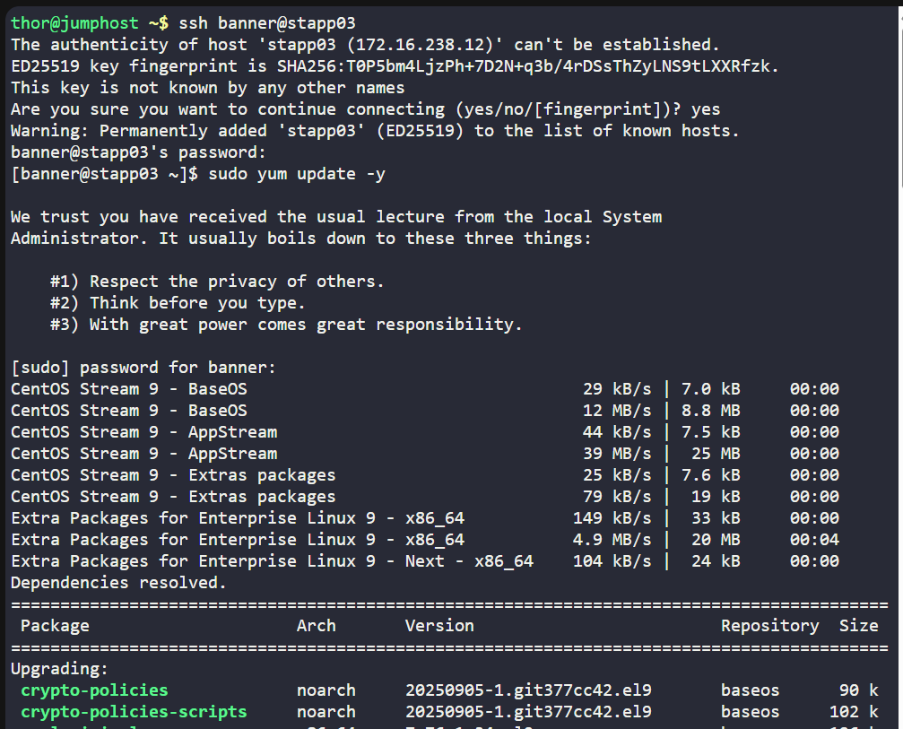
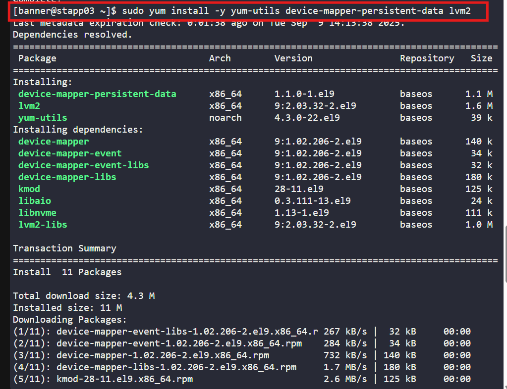
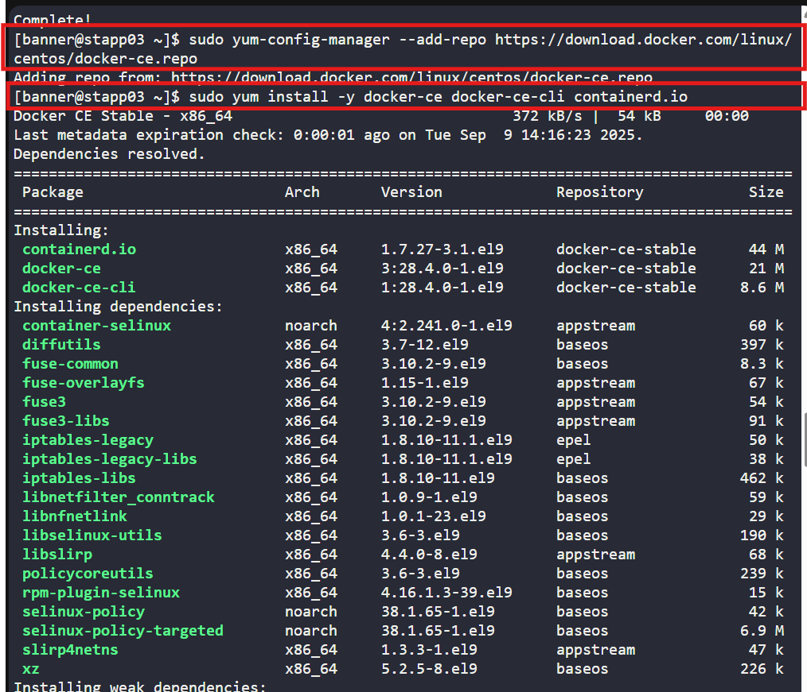
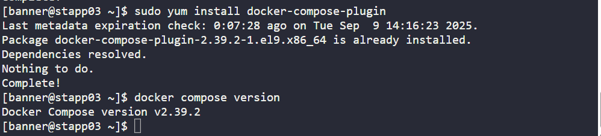
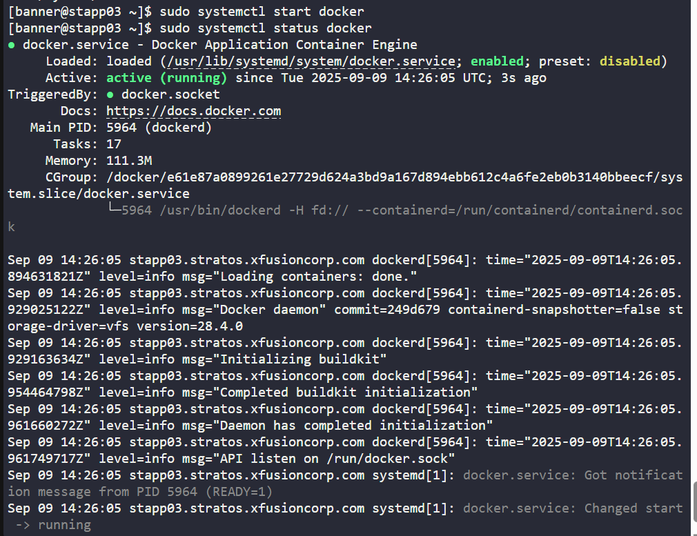

# 🐳 100 Days of DevOps – Day 35
## ✅ Task: Install Docker Packages and Start Docker Service

```text
The Nautilus DevOps team aims to containerize various applications following a recent meeting with the application development team.
They intend to conduct testing with the following steps:

1. Install docker-ce and docker compose packages on App Server 3.
2. Initiate the docker service.
```

---

Tasks
-  SSH into App Server 3
-  Update system packages and prerequisites
-   Install Docker CE
-   Install Docker Compose
-   Enable and start Docker service

---

### 🔁 Step 1: SSH into App Server 3

```bash
ssh banner@stapp03
```

password:
```bash
BigGr33n
```

---

### 🔁 Step 2: Update Packages
```bash
sudo yum update -y
sudo yum install -y yum-utils device-mapper-persistent-data lvm2
```




---

### 🔁 Step 3: Install Docker CE

```bash
sudo yum-config-manager --add-repo https://download.docker.com/linux/centos/docker-ce.repo
sudo yum install -y docker-ce docker-ce-cli containerd.io
```



---

### 🔁 Step 4: Install Docker Compose

```bash
sudo yum update
sudo yum install docker-compose-plugin
```

Verify:
```bash
docker compose version
```



---

### 🔁 Step 5: Enable & Start Docker Service

```bash
sudo systemctl enable docker
sudo systemctl start docker
sudo systemctl status docker
```




---

## 🗝️ Explanation of Key Commands

| Command                                                                 | Description                                                                                       |
| ----------------------------------------------------------------------- | ------------------------------------------------------------------------------------------------- |
| `ssh user@host`                                                         | Connects to a remote server over SSH.                                                             |
| `sudo yum update -y`                                                    | Updates all system packages to the latest available versions.                                      |
| `sudo yum install -y <packages>`                                        | Installs the listed packages with `-y` to auto-confirm.                                           |
| `yum-config-manager --add-repo <url>`                                   | Adds an external repository (here, Docker CE official repo).                                       |
| `sudo yum install -y docker-ce docker-ce-cli containerd.io`             | Installs Docker Community Edition and its dependencies.                                           |
| `sudo yum install docker-compose-plugin`                                | Installs the Docker Compose plugin for Docker CLI v2.                                             |
| `docker compose version`                                                | Verifies installed Docker Compose version.                                                        |
| `sudo systemctl enable docker`                                          | Enables Docker service to start automatically on boot.                                            |
| `sudo systemctl start docker`                                           | Starts the Docker service immediately.                                                            |
| `sudo systemctl status docker`                                          | Displays the current status (running, stopped, errors) of the Docker service.                     |

---

✅ Task Completed
- Installed docker-ce and docker-compose on App Server 3.
- Enabled and started the docker service.
