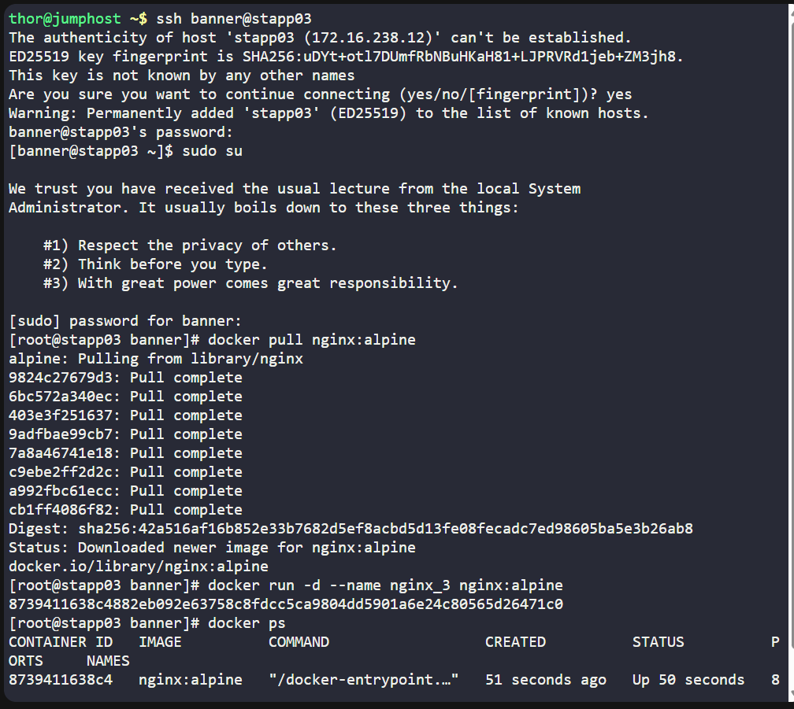

# 🐳 100 Days of DevOps – Day 36
## ✅ Task: Deploy Nginx Container on Application Server

```text
The Nautilus DevOps team is conducting application deployment tests on selected application servers.
They require a nginx container deployment on Application Server 3.
Complete the task with the following instructions:

1. On Application Server 3 create a container named nginx_3 using the nginx image with the alpine tag.
Ensure container is in a running state.
```

---

Task
- SSH into Application Server 3
- Pull the nginx:alpine image
- Create a container named nginx_3 from this image
- Ensure the container is running
- Verify with docker ps

---

### 🔁 Step 1: SSH into App Server 3
```bash
ssh banner@stapp03
```

password
```bash
BigGr33n
```

then login as super user
```bash
sudo su
```

---

### 🔁 Step 2: Pull nginx:alpine image
```bash
docker pull nginx:alpine
```
> This ensures the required image is available locally.

---

### 🔁 Step 3: Run the container
```bash
docker run -d --name nginx_3 nginx:alpine
```

- `-d` → run in detached mode (background)
- `--name nginx_3` → sets container name
- `nginx:alpine` → lightweight nginx image


### 🔁 Step 4: Verify container is running
```bash
docker ps
```

Output
```nginx
CONTAINER ID   IMAGE          COMMAND                  CREATED          STATUS          PORTS     NAMES
8739411638c4   nginx:alpine   "/docker-entrypoint.…"   51 seconds ago   Up 50 seconds   80/tcp    nginx_3
```



---

## ✅ Task Completed
- Container nginx_3 created successfully.
- Based on nginx:alpine image.
- Verified in running state.

