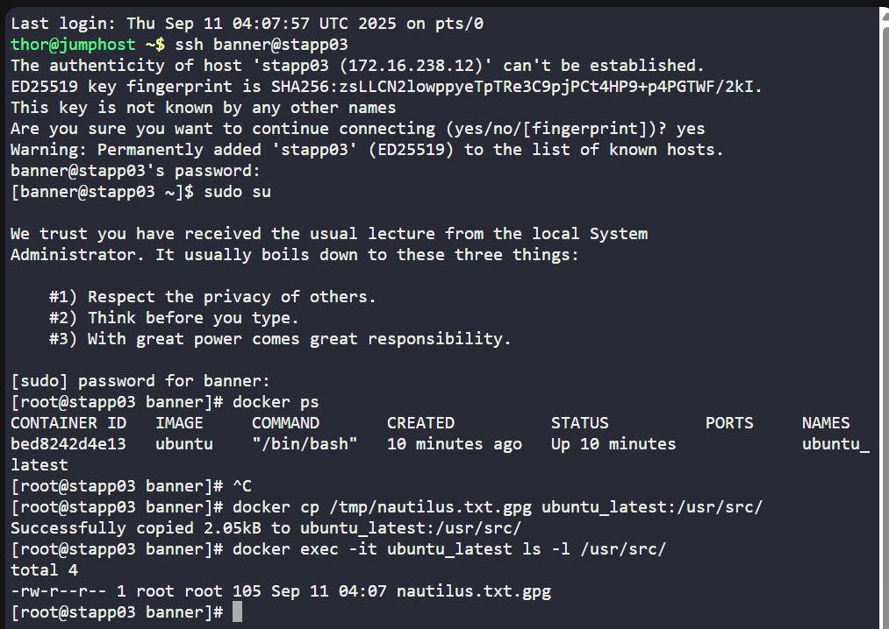

# 🐳 100 Days of DevOps – Day 37
## ✅ Task: Copy File to Docker Container

```text
The Nautilus DevOps team possesses confidential data on App Server 3 in the Stratos Datacenter.
A container named ubuntu_latest is running on the same server.

Copy an encrypted file /tmp/nautilus.txt.gpg from the docker host to the ubuntu_latest container located at /usr/src/.
Ensure the file is not modified during this operation.
```

📝 Task List
- SSH into App Server 3
- Confirm the container ubuntu_latest is running
- Use docker cp to copy /tmp/nautilus.txt.gpg into container at /usr/src/
- Verify the file inside the container

---

### 🔁 Step 1: SSH into App Server 3
```bash
ssh banner@stapp03
```

password
```bash
BigGr33n
```

then login as super user
```bash
sudo su
```

---

### 🔁 Step 2: Check running containers
```bash
docker ps
```

output:
```nginx
CONTAINER ID   IMAGE     COMMAND       CREATED          STATUS          PORTS     NAMES
bed8242d4e13   ubuntu    "/bin/bash"   10 minutes ago   Up 10 minutes             ubuntu_latest
```

---

### 🔁 Step 3: Copy file into container
```bash
docker cp /tmp/nautilus.txt.gpg ubuntu_latest:/usr/src/
```

- docker cp works like scp but between host ↔ container.
- This ensures the encrypted file is copied as-is (no modification).

---

### 🔁 Step 4: Verify inside container
Enter container:
```bash
docker exec -it ubuntu_latest ls -l /usr/src/
```

output:
```nginx
-rw-r--r-- 1 root root 105 Sep 11 04:07 nautilus.txt.gpg
```
> successfully copied nautilus.txt.gpg from docker to host (Ubuntu)



---

## ✅ Task Completed
- File /tmp/nautilus.txt.gpg securely copied into container ubuntu_latest.
- Location inside container: /usr/src/
- Verified integrity (unchanged).
