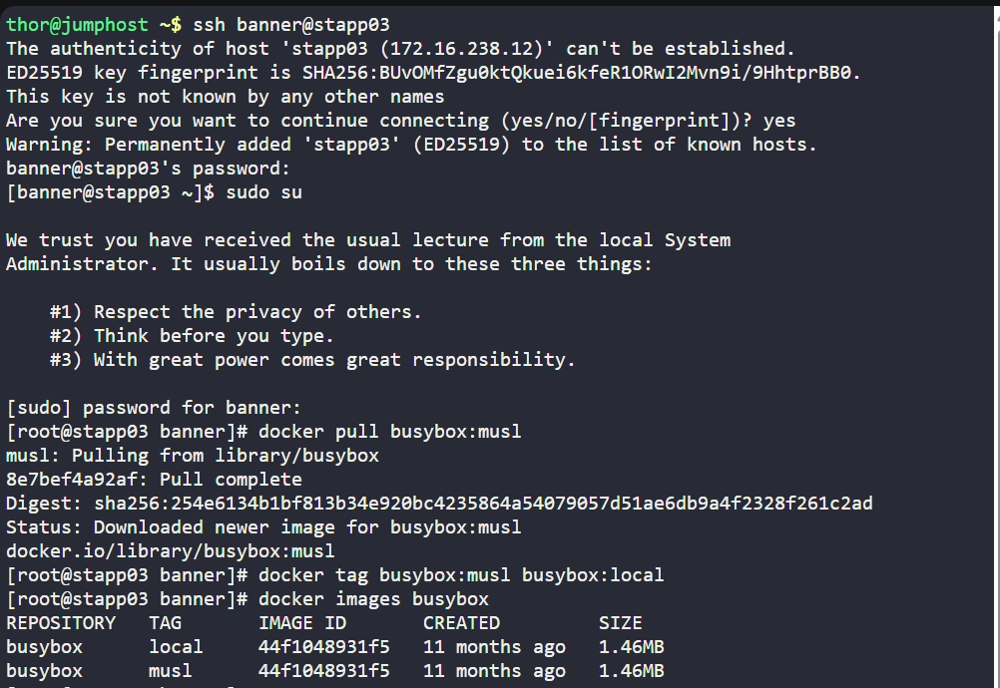

# 🐳 100 Days of DevOps – Day 38
## ✅ Task: Pull Docker Image

```text
Nautilus project developers are planning to start testing on a new project.
As per their meeting with the DevOps team, they want to test containerized environment application features.
As per details shared with DevOps team, we need to accomplish the following task:

a. Pull busybox:musl image on App Server 3 in Stratos DC and re-tag (create new tag) this image as busybox:local.
```

---

📝 Task List
- SSH into App Server 3
- Pull the Docker image busybox:musl
- Re-tag image as busybox:local
- Verify both tags exist

---

### 🔁 Step 1: SSH into App Server 3
```bash
ssh banner@stapp03
```

password
```bash
BigGr33n
```

then login as super user
```bash
sudo su
```

---

### 🔁 Step 2: Pull BusyBox musl image
```bash
docker pull busybox:musl
```
> This downloads the lightweight BusyBox image with musl libc.


---

### 🔁 Step 3: Re-tag the image
```bash
docker tag busybox:musl busybox:local
```
> This creates a new local alias (busybox:local) pointing to the same image ID.

---

### 🔁 Step 4: Verify images
```bash
docker images busybox
```

output:
```text
REPOSITORY   TAG       IMAGE ID       CREATED         SIZE
busybox      local     44f1048931f5   11 months ago   1.46MB
busybox      musl      44f1048931f5   11 months ago   1.46MB
```



---

✅ Task Completed

- Pulled busybox:musl image on App Server 3.
- Tagged same image as busybox:local.
- Verified both tags exist and point to the same image ID.
