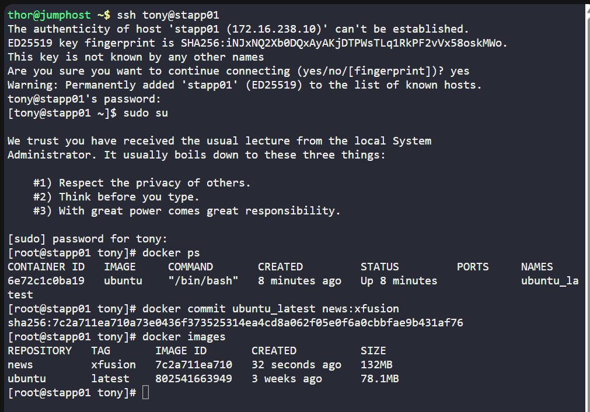

# 🐳 100 Days of DevOps – Day 39
## ✅ Task: Create a Docker Image From Container

```text
One of the Nautilus developer was working to test new changes on a container.
He wants to keep a backup of his changes to the container. A new request has been raised
for the DevOps team to create a new image from this container. Below are more details about it:

a. Create an image news:xfusion on Application Server 1 from a container ubuntu_latest that is running on same server.
```

---
📝 Task List
- SSH into Application Server 1
- Identify running container ubuntu_latest
- Commit container into a new image news:xfusion
- Verify new image exists

---

### 🔁 Step 1: SSH into App Server 1
```bash
ssh tony@stapp01
```

password
```bash
Ir0nM@n
```

then login as super user
```bash
sudo su
```

---

### 🔁 Step 2: Check for the container
```bash
docker ps
```

output:
```nginx
CONTAINER ID   IMAGE     COMMAND       CREATED         STATUS         PORTS     NAMES
6e72c1c0ba19   ubuntu    "/bin/bash"   8 minutes ago   Up 8 minutes             ubuntu_latest
```

---

### 🔁 Step 3: Commit container to new image

```bash
docker commit ubuntu_latest news:xfusion
```
> This takes a snapshot of the container filesystem and creates a new image tagged news:xfusion.

---

### 🔁 Step 4: Verify the new image
```bash
docker images
```
output:
```nginx
REPOSITORY   TAG       IMAGE ID       CREATED          SIZE
news         xfusion   7c2a711ea710   32 seconds ago   132MB
ubuntu       latest    802541663949   3 weeks ago      78.1MB
```
> Successfully created Docker image news:fusion



---

## ✅ Task Completed
- Created a new Docker image news:xfusion from the running container ubuntu_latest.
- Verified the image exists in the local repository.
