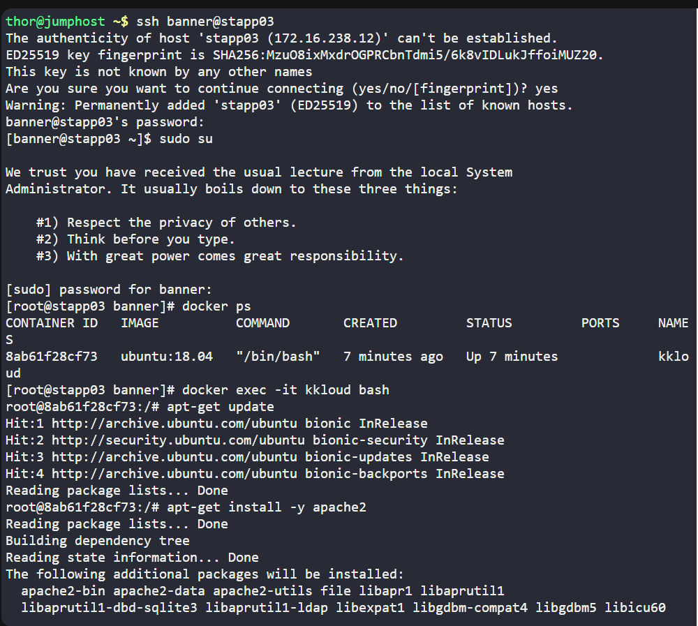
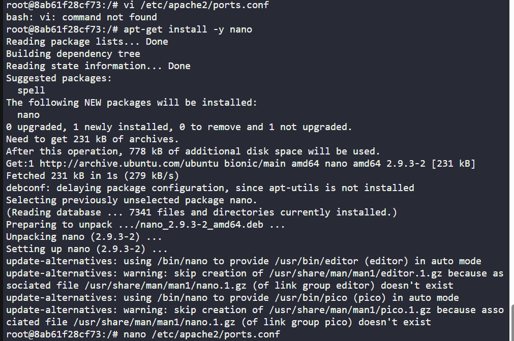
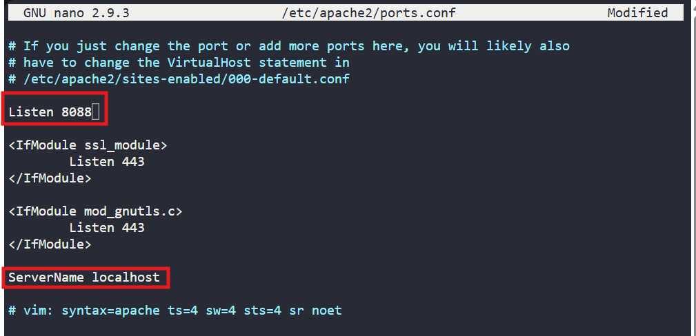
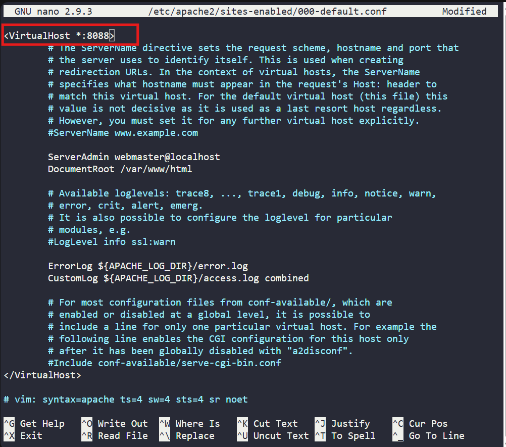
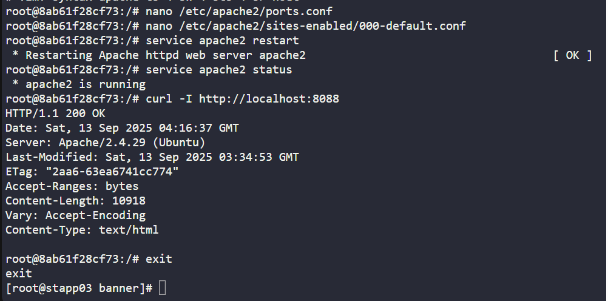

# 🐳 100 Days of DevOps – Day XX
## ✅ Task: Docker EXEC Operations

```text
One of the Nautilus DevOps team members was working to configure services on a kkloud container that is running on
App Server 3 in Stratos Datacenter. Due to some personal work he is on PTO for the rest of the week,
but we need to finish his pending work ASAP. Please complete the remaining work as per details given below:

a. Install apache2 in kkloud container using apt that is running on App Server 3 in Stratos Datacenter.
b. Configure Apache to listen on port 8088 instead of default http port. Do not bind it to listen on specific IP or hostname only,
i.e it should listen on localhost, 127.0.0.1, container ip, etc.
c. Make sure Apache service is up and running inside the container. Keep the container in running state at the end.
```

---

📝 Task List
- SSH into App Server 3
- Access the running container `kkloud`
- Install apache2 inside the container
- Reconfigure Apache to listen on port `8088`
- Restart Apache and verify it is running
- Leave container in running state

---

### 🔁 Step 1: SSH into App Server 3
```bash
ssh banner@stapp03
```

password
```bash
BigGr33n
```

then login as super user
```bash
sudo su
```

---

### 🔁 Step 2: Access Container

List running containers:
```bash
docker ps
```

Output: 
```nginx
CONTAINER ID   IMAGE          COMMAND       CREATED         STATUS         PORTS     NAMES
8ab61f28cf73   ubuntu:18.04   "/bin/bash"   7 minutes ago   Up 7 minutes             kkloud
```
> Kkloud container is present

Enter the container:
```bash
docker exec -it kkloud bash
```

> You will see `root@CONTAINERID` if you're already in the target container

---

### 🔁 Step 3: Install Apache2

Inside container:
```bash
apt-get update
apt-get install -y apache2
```



---

### 🔁 Step 4: Configure Apache to Listen on Port 8088

Edit ports config:
```bash
vi /etc/apache2/ports.conf
```

> Output: `vi: command not found`

Instead use nano.
  Install nano:
  ```bash
  apt-get install -y nano
  ```

  

  Then edit:
  ```bash
  nano /etc/apache2/ports.conf
  ```

Change:
```apache
Listen 80
```

to:
```apache
Listen 8088
```

and add this at the end
```bash
ServerName localhost
```



Also check default site config:
```bash
nano /etc/apache2/sites-enabled/000-default.conf
```

Update:
```apache
<VirtualHost *:80>
```

to:
```apache
<VirtualHost *:8088>
```



---

### 🔁 Step 5: Restart Apache
```bash
service apache2 restart
```

Verify status:
```bash
service apache2 status
```

Output:
```nginx
 * apache2 is running
```

Check listening ports:
```bash
curl -I http://localhost:8088
```

Output:
```nginx
HTTP/1.1 200 OK
Date: Sat, 13 Sep 2025 04:16:37 GMT
Server: Apache/2.4.29 (Ubuntu)
Last-Modified: Sat, 13 Sep 2025 03:34:53 GMT
ETag: "2aa6-63ea6741cc774"
Accept-Ranges: bytes
Content-Length: 10918
Vary: Accept-Encoding
Content-Type: text/html
```



---

### 🔁 Step 6: Exit but Keep Container Running
Simply exit from container shell.
Container kkloud will remain up since it’s already running under Docker

---

## 🗝️ Explanation of Key Commands – Docker EXEC Operations

| Command                                            | Description                                                                                    |
| -------------------------------------------------- | ---------------------------------------------------------------------------------------------- |
| `ssh banner@stapp03`                               | Connects to **App Server 3** in Stratos Datacenter using SSH with the user `banner`.           |
| `sudo su`                                          | Switches to the **superuser (root)** account for elevated privileges.                          |
| `docker ps`                                        | Lists all **running containers**, including their IDs, names, status, and ports.               |
| `docker exec -it kkloud bash`                      | Opens an **interactive bash shell** inside the running container `kkloud`.                     |
| `apt-get update`                                   | Updates the package list inside the container so the latest package versions can be installed. |
| `apt-get install -y apache2`                       | Installs the **Apache2 web server** with auto-confirmation (`-y`).                             |
| `apt-get install -y nano`                          | Installs **Nano editor**, since `vi` was unavailable in the container.                         |
| `nano /etc/apache2/ports.conf`                     | Opens Apache’s port configuration file to edit the **listening port**.                         |
| `nano /etc/apache2/sites-enabled/000-default.conf` | Opens the default site config to update its **virtual host port** from 80 to 8088.             |
| `service apache2 restart`                          | Restarts Apache service to apply the new configuration changes.                                |
| `service apache2 status`                           | Shows the **current running status** of Apache inside the container.                           |
| `curl -I http://localhost:8088`                    | Sends an **HTTP HEAD request** to verify that Apache is responding on port `8088`.             |
| `exit`                                             | Leaves the container shell, while keeping the container itself running.                        |


---

## ✅ Task Completed
- Installed apache2 inside kkloud container.
- Reconfigured Apache to listen on port 8088.
- Verified Apache is running and listening on correct port.
- Container remains running.
