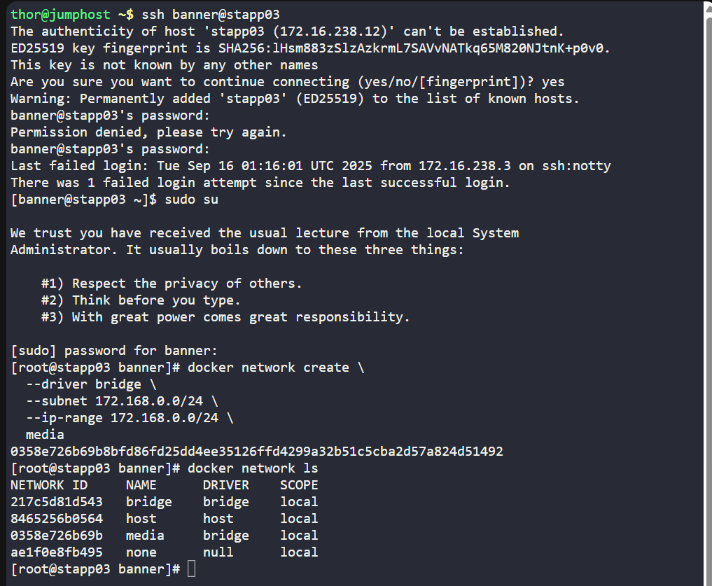
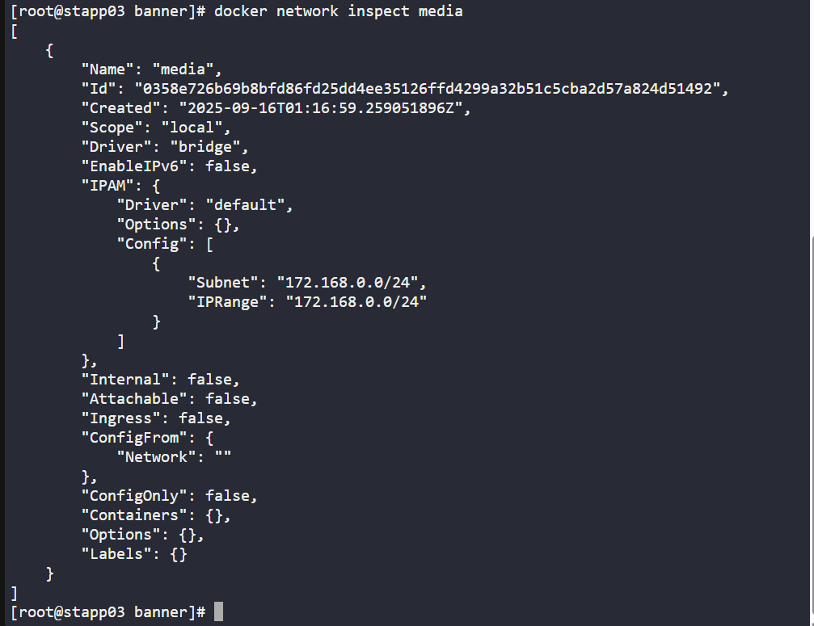

# 🧪 100 Days of DevOps – Day 42
## ✅ Task: Create a Docker Network

```text
The Nautilus DevOps team needs to set up several docker environments for different applications.
One of the team members has been assigned a ticket where he has been asked to create some docker networks to be used later.
Complete the task based on the following ticket description:

a. Create a docker network named as media on App Server 3 in Stratos DC.
b. Configure it to use bridge drivers.
c. Set it to use subnet 172.168.0.0/24 and iprange 172.168.0.0/24.
```

---

Task List

- SSH into App Server 3
- Create docker network media with bridge driver
- Assign subnet 172.168.0.0/24 and ip-range 172.168.0.0/24
- Verify network creation


---

### 🔁 Step 1: SSH into App Server 3
```bash
ssh banner@stapp03
```

password
```bash
BigGr33n
```

then login as super user
```bash
sudo su
```

---

### 🔁 Step 2: Create Docker Network

```bash
docker network create \
  --driver bridge \
  --subnet 172.168.0.0/24 \
  --ip-range 172.168.0.0/24 \
  media
```

---

### 🔁 Step 3: Verify Network

List Networks:
```bash
docker network ls
```

Output:

```nginx
NETWORK ID     NAME      DRIVER    SCOPE
217c5d81d543   bridge    bridge    local
8465256b0564   host      host      local
0358e726b69b   media     bridge    local
ae1f0e8fb495   none      null      local
```

> Successfully create `media` network that uses `bridge` driver


Check details:
```bash
docker network inspect media
```

output:
```nginx
        "Name": "media",
        "Id": "0358e726b69b8bfd86fd25dd4ee35126ffd4299a32b51c5cba2d57a824d51492",
        "Created": "2025-09-16T01:16:59.259051896Z",
        "Scope": "local",
        "Driver": "bridge",
        "EnableIPv6": false,
        "IPAM": {
            "Driver": "default",
            "Options": {},
            "Config": [
                {
                    "Subnet": "172.168.0.0/24",
                    "IPRange": "172.168.0.0/24"
                }
            ]
```




---

## 🗝️ Explanation of Key Commands – Docker Network Creation
| Command                                                                                                 | Description                                                                                                                      |
| ------------------------------------------------------------------------------------------------------- | -------------------------------------------------------------------------------------------------------------------------------- |
| `ssh banner@stapp03`                                                                                    | Connects to **App Server 3** in Stratos Datacenter using SSH with the user `banner`.                                             |
| `sudo su`                                                                                               | Switches to the **superuser (root)** account for elevated privileges.                                                            |
| `docker network create \ --driver bridge \ --subnet 172.168.0.0/24 \ --ip-range 172.168.0.0/24 \ media` | Creates a new Docker network named **media** using the **bridge driver**, assigning it the subnet and IP range `172.168.0.0/24`. |
| `docker network ls`                                                                                     | Lists all Docker networks along with their names, drivers, and scopes to confirm that the **media** network was created.         |
| `docker network inspect media`                                                                          | Displays detailed configuration of the **media** network, including subnet, IP range, and driver.                                |

---

## ✅ Task Completed
- Docker network media created successfully on App Server 3.
- Configured with bridge driver, subnet 172.168.0.0/24, ip-range 172.168.0.0/24.

