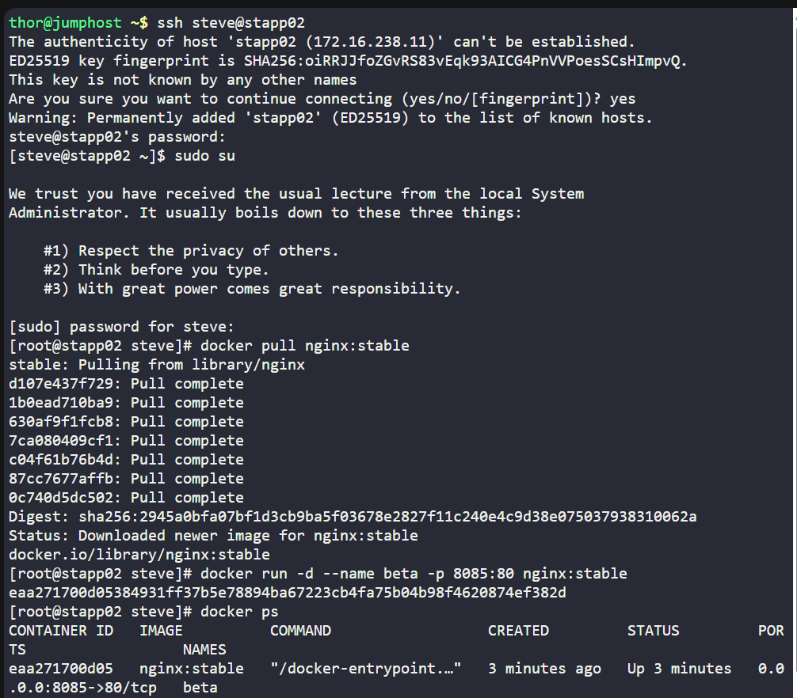
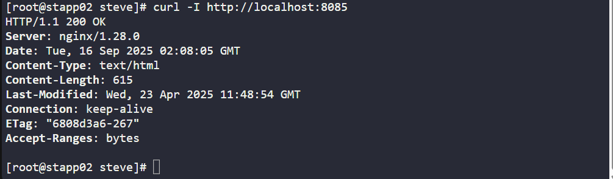

# 🧪 100 Days of DevOps – Day 43
## ✅ Task: Docker Ports Mapping

```text
The Nautilus DevOps team is planning to host an application on a nginx-based container.
There are number of tickets already been created for similar tasks. One of the tickets
has been assigned to set up a nginx container on Application Server 2 in Stratos Datacenter.
Please perform the task as per details mentioned below:

a. Pull nginx:stable docker image on Application Server 2.
b. Create a container named beta using the image you pulled.
c. Map host port 8085 to container port 80. Please keep the container in running state.
```

---

Task
- Pull `nginx:stable` docker image on App Server 2.  
- Create a container named `beta` using the image.
- Map host port `8085` → container port `80`.
- Keep the container running.

---

### 🔁 Step 1: SSH into App Server 2
```bash
ssh steve@stapp02
```

password
```bash
Am3ric@
```

then login as super user
```bash
sudo su
```

---

### 🔁 Step 2: Pull the Nginx Stable Image
```bash
docker pull nginx:stable
```

---

### 🔁 Step 3: Run Container Named beta
```bash
docker run -d --name beta -p 8085:80 nginx:stable
```
- `-d` → detached mode
- `--name beta` → container name
- `-p 8085:80` → port mapping (host 8085 → container 80)

---

### 🔁 Step 4: Verify Container
Check if container is running:
```bash
docker ps
```

Output:
```nginx
CONTAINER ID   IMAGE          COMMAND                  CREATED         STATUS         PORTS                  NAMES
eaa271700d05   nginx:stable   "/docker-entrypoint.…"   3 minutes ago   Up 3 minutes   0.0.0.0:8085->80/tcp   beta
```
> successfully created `beta` container using `nginx:stable` image and with host and port `8085:80`

---

### 🔁 Step 5: Test Nginx
From App Server 2:
```bash
curl -I http://localhost:8085
```

Output:
```nginx
HTTP/1.1 200 OK
Server: nginx/1.28.0
Date: Tue, 16 Sep 2025 02:08:05 GMT
Content-Type: text/html
Content-Length: 615
Last-Modified: Wed, 23 Apr 2025 11:48:54 GMT
Connection: keep-alive
ETag: "6808d3a6-267"
Accept-Ranges: bytes
```

---




---

## 🗝️ Explanation of Key Commands – Nginx Container Setup

| Command                                             | Description                                                                                                         |
| --------------------------------------------------- | ------------------------------------------------------------------------------------------------------------------- |
| `ssh banner@stapp02`                                | Connects to **App Server 2** in Stratos Datacenter.                                                                 |
| `sudo su`                                           | Switches to **root user** for elevated privileges.                                                                  |
| `docker pull nginx:stable`                          | Pulls the **stable version of Nginx** image from Docker Hub.                                                        |
| `docker run -d --name beta -p 8085:80 nginx:stable` | Creates and runs a new container named **beta** in background, mapping **host port 8085** to **container port 80**. |
| `docker ps`                                         | Lists all running containers, confirming the **beta** container is active.                                          |
| `curl -I http://localhost:8085`                     | Sends an HTTP request to test if **Nginx is serving traffic** on port 8085.                                         |

---

## ✅ Task Completed
- nginx:stable pulled successfully
- Container beta created and running
- Accessible on http://<AppServer2-IP>:8085
