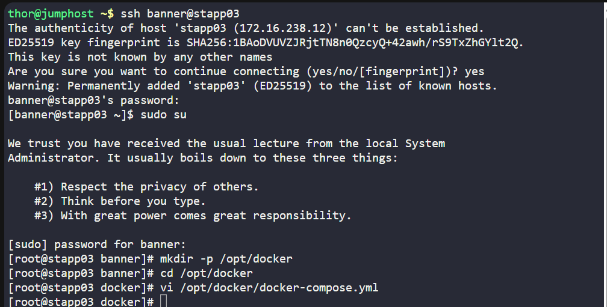
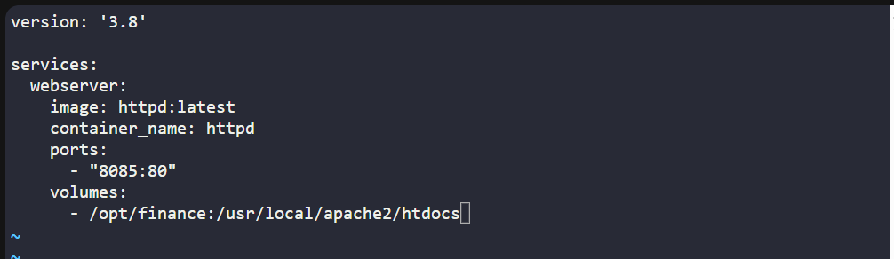
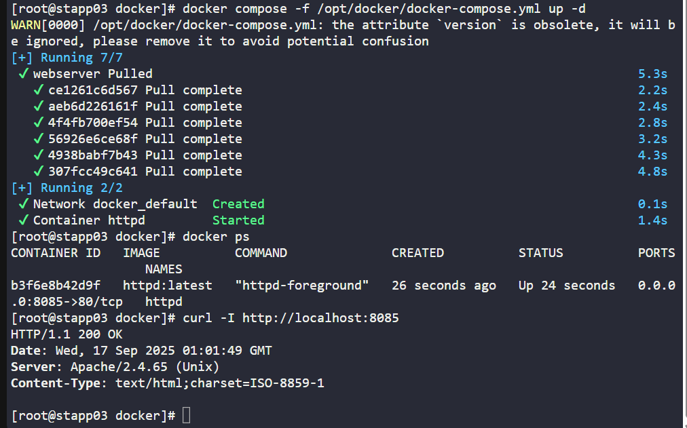

# 🧪 100 Days of DevOps – Day 44
## ✅ Task: Write a Docker Compose File

```text
The Nautilus application development team shared static website content that needs to be hosted on the httpd web server using a containerised platform.
The team has shared details with the DevOps team, and we need to set up an environment according to those guidelines. Below are the details:

a. On App Server 3 in Stratos DC create a container named httpd using a docker compose file /opt/docker/docker-compose.yml (please use the exact name for file).
b. Use httpd (preferably latest tag) image for container and make sure container is named as httpd; you can use any name for service.
c. Map 80 number port of container with port 8085 of docker host.
d. Map container's /usr/local/apache2/htdocs volume with /opt/finance volume of docker host which is already there. (please do not modify any data within these locations).
```

---

Task 

- Create container named `httpd` via `/opt/docker/docker-compose.yml`.
- Use `httpd:latest` image (preferred).
- Map host port `8085` → container port `80`.
- Mount `/opt/finance` (host) → `/usr/local/apache2/htdocs` (container).

---

### 🔁 Step 1: SSH into App Server 3
```bash
ssh banner@stapp03
```

password
```bash
BigGr33n
```

then login as super user
```bash
sudo su
```

---

### 🔁 Step 2: Create Directory for Compose File

```bash
mkdir -p /opt/docker
cd /opt/docker
```



---

### 🔁 Step 3: Create docker-compose.yml

```bash
vi /opt/docker/docker-compose.yml
```

save this inside:
```yaml
version: '3.8'

services:
  webserver:
    image: httpd:latest
    container_name: httpd
    ports:
      - "8085:80"
    volumes:
      - /opt/finance:/usr/local/apache2/htdocs
```



---

### 🔁 Step 4: Start the Container
```bash
docker compose -f /opt/docker/docker-compose.yml up -d
```
- `-f /opt/docker/docker-compose.yml` → tells Docker Compose which YAML file to use.
- `up` → creates and starts the containers defined in the file.
- `-d` → runs containers in detached mode (background).

---

### 🔁 Step 5: Verify

Check running container:
```bash
docker ps
```

Output:
```nginx
CONTAINER ID   IMAGE          COMMAND              CREATED          STATUS          PORTS                  NAMES
b3f6e8b42d9f   httpd:latest   "httpd-foreground"   26 seconds ago   Up 24 seconds   0.0.0.0:8085->80/tcp   httpd
```
> successfully created httpd container using the httpd:latest image.

---

### 🔁 Step 6: Test Website
```bash
curl -I http://localhost:8085
```

output:
```nginx
HTTP/1.1 200 OK
Date: Wed, 17 Sep 2025 01:01:49 GMT
```
> It is now running.



---

### 🗝️ Explanation of Key Commands – Docker Compose (httpd Web Server)

| Command                                                  | Description                                                                                           |
| -------------------------------------------------------- | ----------------------------------------------------------------------------------------------------- |
| `ssh banner@stapp03`                                     | Connects to **App Server 3** in Stratos Datacenter.                                                   |
| `sudo su`                                                | Switches to the **root user** for elevated privileges.                                                |
| `mkdir -p /opt/docker`                                   | Creates the `/opt/docker` directory (with `-p` ensuring parent dirs exist).                           |
| `cd /opt/docker`                                         | Navigates into the directory where the Compose file will be created.                                  |
| `vi /opt/docker/docker-compose.yml`                      | Opens `vi` editor to create/edit the Docker Compose configuration file.                               |
| `docker compose -f /opt/docker/docker-compose.yml up -d` | Uses the specified Compose file to start the defined service(s) in **detached mode**.                 |
| `docker ps`                                              | Lists running containers and verifies the `httpd` container is active and mapped to the correct port. |
| `curl -I http://localhost:8085`                          | Sends an HTTP request to check if the `httpd` web server is running and serving content.              |

---

### ✅ Task Completed
- `httpd` container created with Docker Compose
- Runs on http://<AppServer3-IP>:8085
- Serves static content from /opt/finance

