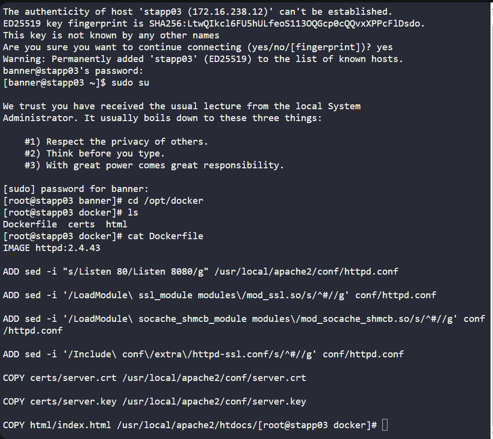
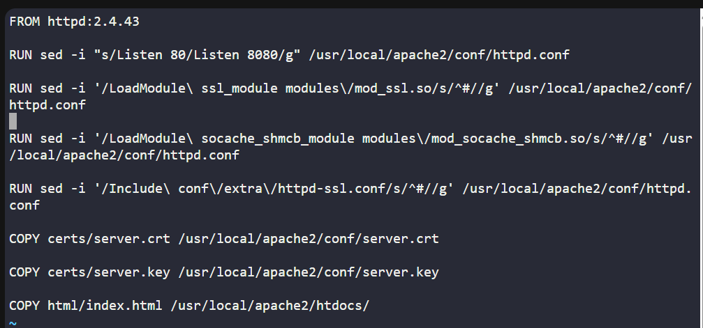
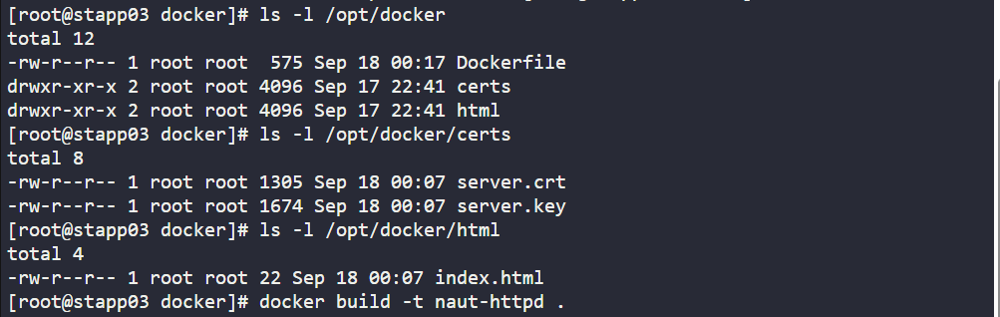
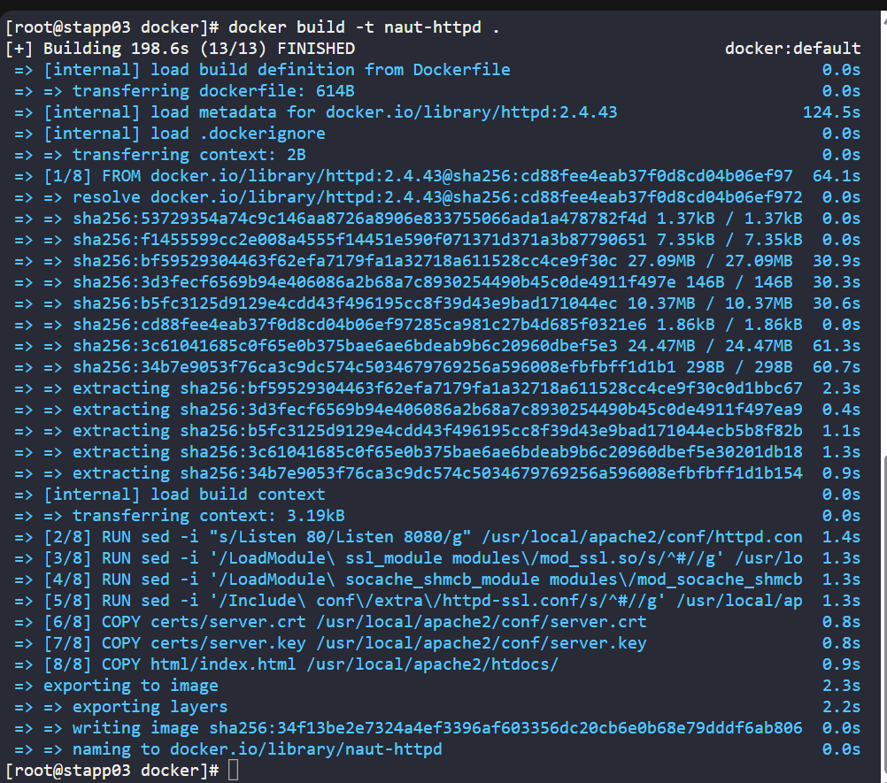

# 🐳 100 Days of DevOps – Day 45
## ✅ Task: Fix and Build Dockerfile

```text
The Nautilus DevOps team is working to create new images per requirements shared by the development team.
One of the team members is working to create a Dockerfile on App Server 3 in Stratos DC.
While working on it she ran into issues in which the docker build is failing and displaying errors.
Look into the issue and fix it to build an image as per details mentioned below:

a. The Dockerfile is placed on App Server 3 under /opt/docker directory.
b. Fix the issues with this file and make sure it is able to build the image.
c. Do not change base image, any other valid configuration within Dockerfile, or any of the data been used — for example, index.html.

Note: Please note that once you click on FINISH button all the existing containers will be destroyed and new image will be built from your Dockerfile.
```

---

📝 Task List
- SSH into App Server 3
- Inspect Dockerfile under /opt/docker
- Fix invalid paths and COPY sources
- Build Docker image from the Dockerfile

---

### 🔁 Step 1: SSH into App Server 2
```bash
ssh banner@stapp03
```

password
```bash
BigGr33n
```

root user:
```bash
sudo su
```

---

### 🔁 Step 2: Inspect Dockerfile

Navigate to /opt/docker
```bash
cd /opt/docker
```

verify if Dockerfile is present in the directory
```bash
ls
```
> Dockerfile is present

check the Dockerfile
```Bash
cat Dockerfile
```

Output:
```nginx
IMAGE httpd:2.4.43

ADD sed -i "s/Listen 80/Listen 8080/g" /usr/local/apache2/conf/httpd.conf

ADD sed -i '/LoadModule\ ssl_module modules\/mod_ssl.so/s/^#//g' conf/httpd.conf

ADD sed -i '/LoadModule\ socache_shmcb_module modules\/mod_socache_shmcb.so/s/^#//g' conf/httpd.conf

ADD sed -i '/Include\ conf\/extra\/httpd-ssl.conf/s/^#//g' conf/httpd.conf

COPY certs/server.crt /usr/local/apache2/conf/server.crt

COPY certs/server.key /usr/local/apache2/conf/server.key

COPY html/index.html /usr/local/apache2/htdocs/
```

Issues Found:
- Wrong keyword: `IMAGE`
    - Dockerfiles must start with: `FROM`
- Misuse of ADD
    - ADD is only for copying files (like COPY), not for executing commands.
    - To run sed, you must use `RUN`.
- Mixing relative paths:
    - Some commands use conf.d/httpd.conf (relative), but inside the container you should always use the absolute path `/usr/local/apache2/conf/httpd.conf`.



---

### 🔁 Step 3: Fix Dockerfile

Edit file:
```bash
vi Dockerfile
```

Use this Correct Version:
```dockerfile
FROM httpd:2.4.43
RUN sed -i "s/Listen 80/Listen 8080/g" /usr/local/apache2/conf/httpd.conf
RUN sed -i '/LoadModule\ ssl_module modules\/mod_ssl.so/s/^#//g' /usr/local/apache2/conf/httpd.conf
RUN sed -i '/LoadModule\ socache_shmcb_module modules\/mod_socache_shmcb.so/s/^#//g' /usr/local/apache2/conf/httpd.conf
RUN sed -i '/Include\ conf\/extra\/httpd-ssl.conf/s/^#//g' /usr/local/apache2/conf/httpd.conf
COPY certs/server.crt /usr/local/apache2/conf/server.crt
COPY certs/server.key /usr/local/apache2/conf/server.key
COPY html/index.html /usr/local/apache2/htdocs/
```

save and exit




---

### 🔁 Step 4: Build the Image

Ensure first files are in place:
```bash
ls -l /opt/docker
ls -l /opt/docker/certs
ls -l /opt/docker/html
```



then run container:
```bash
docker build -t naut-httpd .
```



> If error encountered: => ERROR [internal] load metadata for docker.io/library/httpd:2.4.43              61.0s

just try to build again until it succeed:
```bash
docker build -t naut-httpd .
```

---

## ✅ Task Completed
- Fixed Dockerfile under /opt/docker on App Server 2.
- Built image successfully (naut-httpd).
