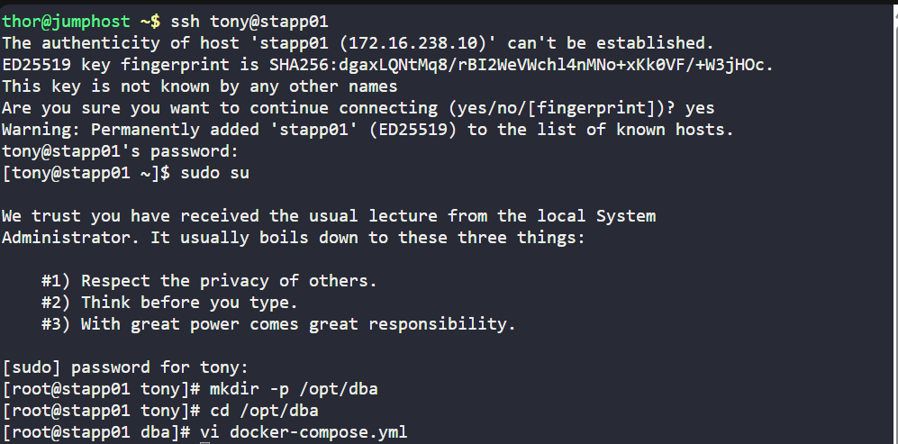
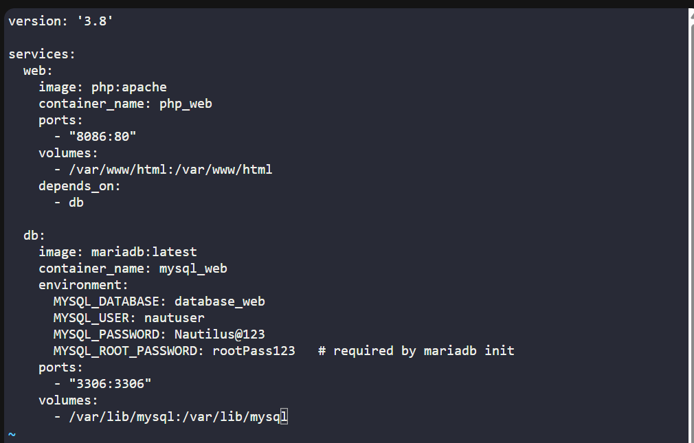
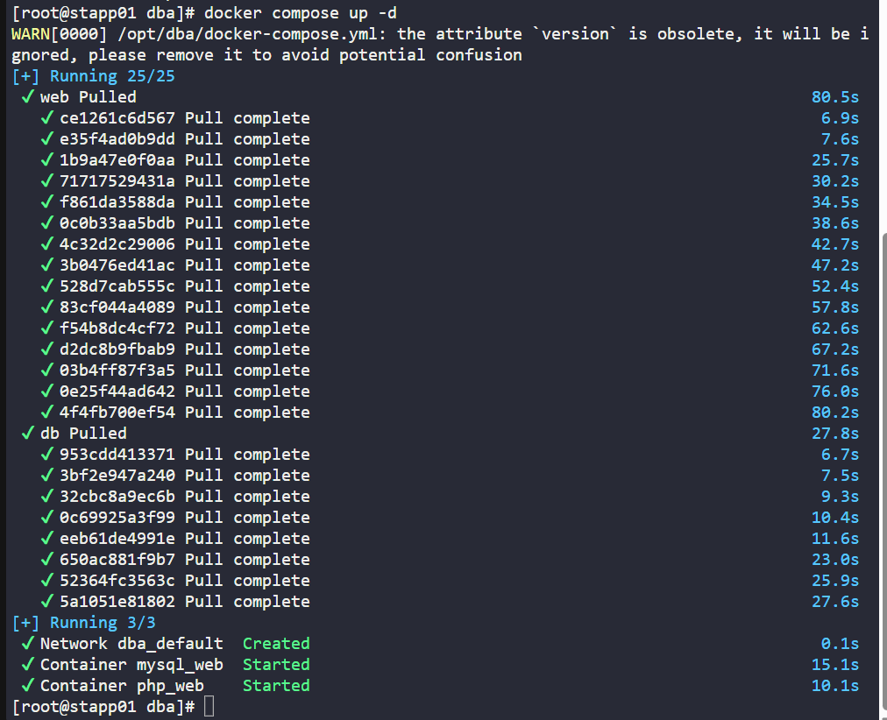
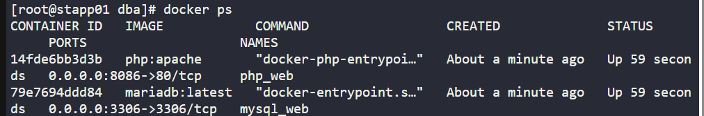
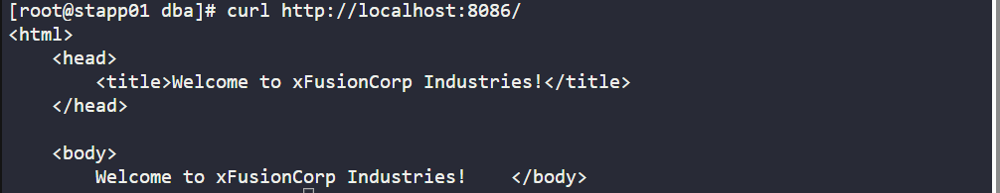

# 🐳 100 Days of DevOps – Day 46
## ✅ Task: Deploy an App on Docker Containers

```text
The Nautilus Application development team recently finished development of one of the apps that they want to deploy on a containerized platform.
The Nautilus Application development and DevOps teams met to discuss some of the basic pre-requisites and requirements to complete the deployment.
The team wants to test the deployment on one of the app servers before going live and set up a complete containerized stack using a docker compose fie.
Below are the details of the task:

    1. On App Server 1 in Stratos Datacenter create a docker compose file /opt/dba/docker-compose.yml (should be named exactly).
    2. The compose should deploy two services (web and DB), and each service should deploy a container as per details below:

    For web service:
      a. Container name must be php_web.
      b. Use image php with any apache tag. Check here for more details.
      c. Map php_web container's port 80 with host port 8086
      d. Map php_web container's /var/www/html volume with host volume /var/www/html.

    For DB service:
      a. Container name must be mysql_web.
      b. Use image mariadb with any tag (preferably latest). Check here for more details.
      c. Map mysql_web container's port 3306 with host port 3306
      d. Map mysql_web container's /var/lib/mysql volume with host volume /var/lib/mysql.
      e. Set MYSQL_DATABASE=database_web and use any custom user ( except root ) with some complex password for DB connections.

    3. After running docker-compose up you can access the app with curl command curl <server-ip or hostname>:8086/

Note: Once you click on FINISH button, all currently running/stopped containers will be destroyed and stack will be deployed again using your compose file.
```

---

📝 Task List
- SSH into App Server 1
- Create directory /opt/dba
- Write docker-compose.yml with correct services
- Run docker-compose up -d
- Test with curl on port 8086

---

### 🔁 Step 1: SSH into App Server 1
```bash
ssh tony@stapp01
```

password:
```bash
Ir0nM@n
```

become root:
```bash
sudo su
```

---

🔁 Step 2: Create Compose File

Make sure directory exists:
```bash
mkdir -p /opt/dba
```

navigate to the created directory
```bash
cd /opt/dba
```

Create the docker-compose file:
```bash
vi docker-compose.yml
```



Paste this content:
```yaml
version: '3.8'

services:
  web:
    image: php:apache
    container_name: php_web
    ports:
      - "8086:80"
    volumes:
      - /var/www/html:/var/www/html
    depends_on:
      - db

  db:
    image: mariadb:latest
    container_name: mysql_web
    environment:
      MYSQL_DATABASE: database_web
      MYSQL_USER: nautuser
      MYSQL_PASSWORD: Nautilus@123
      MYSQL_ROOT_PASSWORD: rootPass123   # required by mariadb init
    ports:
      - "3306:3306"
    volumes:
      - /var/lib/mysql:/var/lib/mysql
```

save and exit (:wq!)



---

### 🔁 Step 3: Start Stack

From /opt/dba:
```bash
docker compose up -d
```


Check running containers:
```bash
docker ps
```

output:
```nginx
CONTAINER ID   IMAGE            COMMAND                  CREATED              STATUS          PORTS                    NAMES
14fde6bb3d3b   php:apache       "docker-php-entrypoi…"   About a minute ago   Up 59 seconds   0.0.0.0:8086->80/tcp     php_web
79e7694ddd84   mariadb:latest   "docker-entrypoint.s…"   About a minute ago   Up 59 seconds   0.0.0.0:3306->3306/tcp   mysql_web
```

> successfully created php_web & mysql_web container



---

### 🔁 Step 4: Verify

```bash
curl http://localhost:8086/
```
> it returns PHP/Apache test page/app content from /var/www/html.



---

## ✅ Task Completed
- Created /opt/dba/docker-compose.yml.
- Configured php_web and mysql_web services.
- Verified containers are up and accessible via curl localhost:8086.

