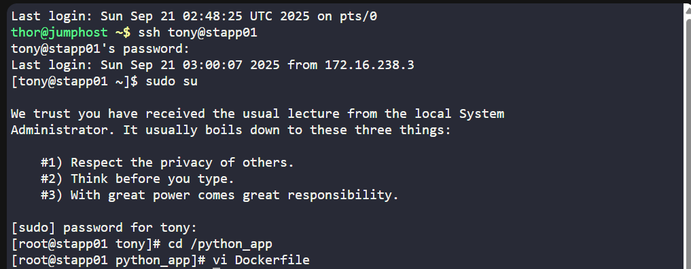
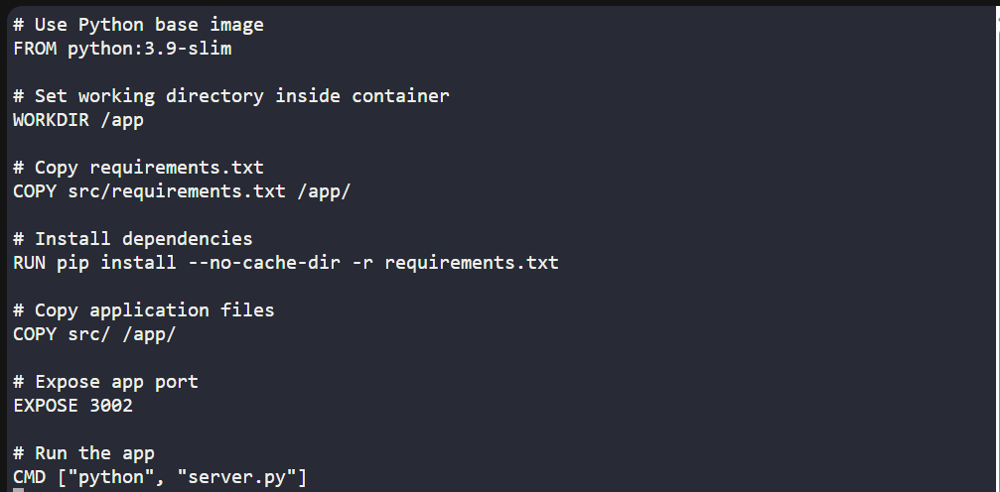
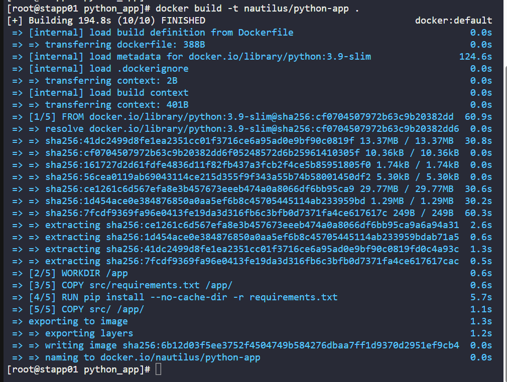
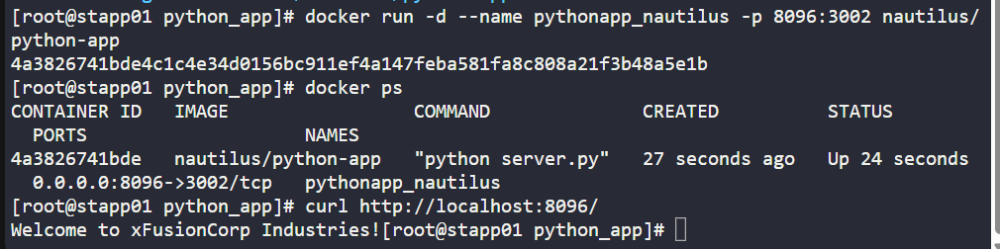

## 🐳 100 Days of DevOps – Day 46
# ✅ Task: Docker Python App

```text
A python app needed to be Dockerized, and then it needs to be deployed on App Server 1.
We have already copied a requirements.txt file (having the app dependencies)
under /python_app/src/ directory on App Server 1.
Further complete this task as per details mentioned below:

1. Create a Dockerfile under /python_app directory:
    - Use any python image as the base image
    - Install the dependencies using requirements.txt file.
    - Expose the port 3002.
    - Run the server.py script using CMD.

2. Build an image named nautilus/python-app using this Dockerfile.

3. Once image is built, create a container named pythonapp_nautilus:
   - Map port 3002 of the container to the host port 8096.

4. Once deployed, you can test the app using curl command on App Server 1.
```

---

📝 Task List

- SSH into App Server 1
- Create Dockerfile under /python_app
- Write proper instructions inside Dockerfile
- Build the image nautilus/python-app
- Run container pythonapp_nautilus with port mapping
- Verify with curl on port 8096

---

### 🔁 Step 1: SSH into App Server 1
```bash
ssh tony@stapp01
```

password:
```bash
Ir0nM@n
```

become root:
```bash
sudo su
```

---

### 🔁 Step 2: Create Dockerfile

Navigate to /python_app:
```bash
cd /python_app
```

Create Dockerfile:
```bash
vi Dockerfile
```



Insert the following:
```dockerfile
# Use Python base image
FROM python:3.9-slim

# Set working directory inside container
WORKDIR /app

# Copy requirements.txt
COPY src/requirements.txt /app/

# Install dependencies
RUN pip install --no-cache-dir -r requirements.txt

# Copy application files
COPY src/ /app/

# Expose app port
EXPOSE 3002

# Run the app
CMD ["python", "server.py"]
```

Save & exit.



---

### 🔁 Step 3: Build Docker Image

From /python_app:
```bash
docker build -t nautilus/python-app .
```

---

### 🔁 Step 4: Run Container

```bash
docker run -d --name pythonapp_nautilus -p 8096:3002 nautilus/python-app
```



check container:
```bash
docker ps
```

output:
```nginx
CONTAINER ID   IMAGE                 COMMAND              CREATED          STATUS          PORTS                    NAMES
4a3826741bde   nautilus/python-app   "python server.py"   27 seconds ago   Up 24 seconds   0.0.0.0:8096->3002/tcp   pythonapp_nautilus
```
> successfully created container named `pythonapp_nautilus`

---

### 🔁 Step 5: Verify
```bash
curl http://localhost:8096/
```
> return the app’s response (from server.py).



---

## 🗝️ Explanation of Key Commands – Docker Python App

| Command                                                                    | Description                                                                                                             |
| -------------------------------------------------------------------------- | ----------------------------------------------------------------------------------------------------------------------- |
| `ssh tony@stapp01`                                                         | Connects to **App Server 1** in Stratos Datacenter with user `tony`.                                                    |
| `sudo su`                                                                  | Switches to **root user** for elevated privileges.                                                                      |
| `cd /python_app`                                                           | Navigates into the directory where the Dockerfile will be created.                                                      |
| `vi Dockerfile`                                                            | Opens an editor to create the Dockerfile with instructions for building the Python app image.                           |
| `docker build -t nautilus/python-app .`                                    | Builds a new Docker image from the Dockerfile in the current directory, tagging it as `nautilus/python-app`.            |
| `docker run -d --name pythonapp_nautilus -p 8096:3002 nautilus/python-app` | Runs a container named **pythonapp\_nautilus** in detached mode, mapping **host port 8096** to **container port 3002**. |
| `docker ps`                                                                | Lists running containers, confirming that the Python app container is active and exposing the correct port.             |
| `curl http://localhost:8096/`                                              | Sends an HTTP request to test if the Python app is responding via port 8096 on the host.                                |


---

## ✅ Task Completed
- Dockerfile created under /python_app.
- Image nautilus/python-app built.
- Container pythonapp_nautilus deployed on port 8096 → 3002.
- Verified app is accessible via curl.
