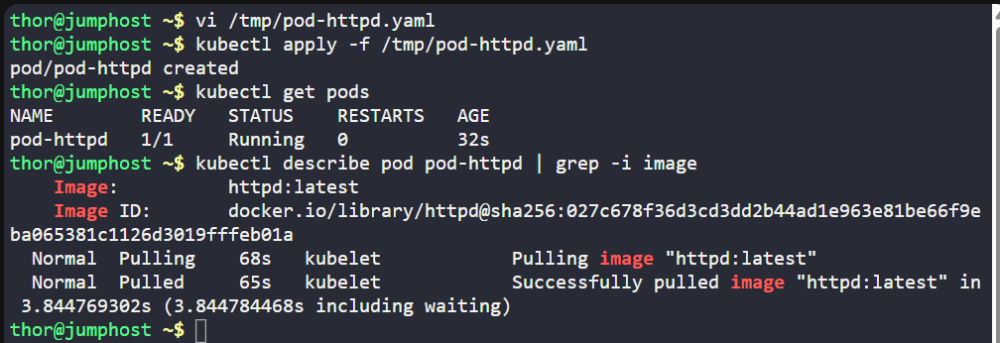
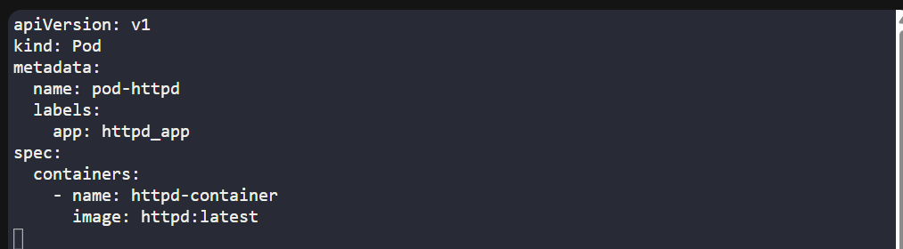

# ☸️ 100 Days of DevOps – Day 48
## ✅ Task: Deploy Pods in Kubernetes Cluster

```text
The Nautilus DevOps team is diving into Kubernetes for application management.
One team member has a task to create a pod according to the details below:

1. Create a pod named pod-httpd using the httpd image with the latest tag. Ensure to specify the tag as httpd:latest.
2. Set the app label to httpd_app, and name the container as httpd-container.

Note: The kubectl utility on jump_host is configured to operate with the Kubernetes cluster.
```

---

📝 Task List

- Go to jump host
- Create YAML manifest /tmp/pod-httpd.yaml
- Apply manifest with kubectl
- Verify pod & label

---

## 🔁 Step 1: Create Pod YAML
On the jump host:
```bash
vi /tmp/pod-httpd.yaml
```

Insert the following:
```yaml
apiVersion: v1
kind: Pod
metadata:
  name: pod-httpd
  labels:
    app: httpd_app
spec:
  containers:
    - name: httpd-container
      image: httpd:latest
```

Save & exit (:wq!)

---

### 🔁 Step 2: Deploy Pod
```bash
kubectl apply -f /tmp/pod-httpd.yaml
```

---

### 🔁 Step 3: Verify
Check pod status:
```bash
kubectl get pods
```

output: 
```nginx
NAME        READY   STATUS    RESTARTS   AGE
pod-httpd   1/1     Running   0          32s
```

Check container inside pod:
```bash
kubectl describe pod pod-httpd | grep -i image
```

Output:
```nginx
Image:          httpd:latest
```




---

## 🗝️ Explanation of Key Commands – Kubernetes Pod Deployment

| Command                                           | Description                                                                                                  |
| ------------------------------------------------- | ------------------------------------------------------------------------------------------------------------ |
| `vi /tmp/pod-httpd.yaml`                          | Opens a YAML manifest file where the Pod configuration is written.                                           |
| `kubectl apply -f /tmp/pod-httpd.yaml`            | Applies the manifest to the Kubernetes cluster, creating the Pod as defined.                                 |
| `kubectl get pods`                                | Lists all Pods in the current namespace with their status, age, and restarts.                                |
| `kubectl describe pod pod-httpd`                  | Shows detailed information about the Pod, including container image, labels, events, and networking details. |
| `kubectl describe pod pod-httpd \| grep -i image` | Filters the Pod description to confirm the **image** being used (`httpd:latest`).                            |


---

## ✅ Task Completed
- Pod pod-httpd created
- Container httpd-container runs httpd:latest
- Label app=httpd_app applied
