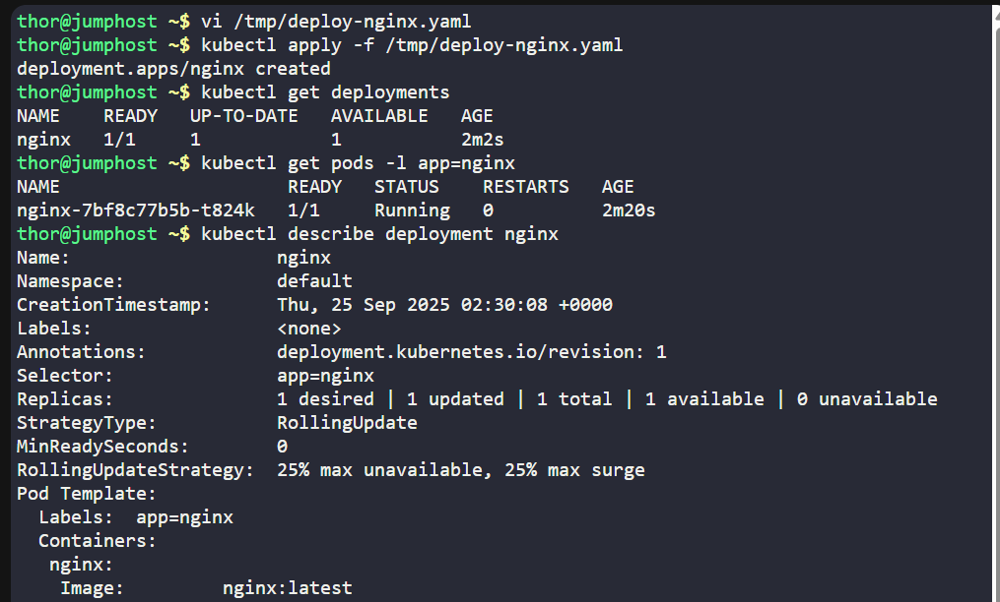
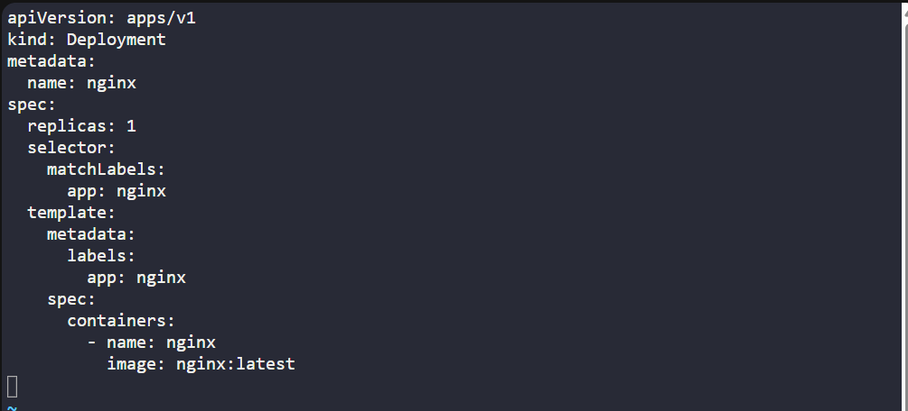

# ☸️ 100 Days of DevOps – Day 49
## ✅ Task: Deploy Applications with Kubernetes Deployments

```text
The Nautilus DevOps team is delving into Kubernetes for app management. One team member needs to create a deployment following these details:

Create a deployment named nginx to deploy the application nginx using the image nginx:latest (ensure to specify the tag)

Note: The kubectl utility on jump_host is set up to interact with the Kubernetes cluster.
```

---

📝 Task List
- Write a deployment manifest file (YAML).
- Apply it using kubectl.
- Verify deployment and pods.

---

### 🔁 Step 1: Create Deployment YAML

On the jump host:
```bash
vi /tmp/deploy-nginx.yaml
```

Insert the following:
```yaml
apiVersion: apps/v1
kind: Deployment
metadata:
  name: nginx
spec:
  replicas: 1
  selector:
    matchLabels:
      app: nginx
  template:
    metadata:
      labels:
        app: nginx
    spec:
      containers:
        - name: nginx
          image: nginx:latest
```

Save & exit. (:wq!)

---

### 🔁 Step 2: Deploy Pod
```bash
kubectl apply -f /tmp/deploy-nginx.yaml
```
- `-f` = "filename"

---

### 🔁 Step 3: Verify

Check pod status:
```bash
kubectl get deployments
```

Check pods created:
```bash
kubectl get pods -l app=nginx
```

output:
```nginx
NAME                     READY   STATUS    RESTARTS   AGE
nginx-7bf8c77b5b-t824k   1/1     Running   0          2m20s
```
> successfully created nginx

Check container inside pod:
```bash
kubectl describe deployment nginx
```
> verified image used =  nginx:latest

---




---

## 🗝️ Explanation of Key Commands – Kubernetes Deployment

| Command                                              | Description                                                                     |
| ---------------------------------------------------- | ------------------------------------------------------------------------------- |
| `vi /tmp/deploy-nginx.yaml`                          | Opens a file where you define the Deployment manifest for nginx.                |
| `kubectl apply -f /tmp/deploy-nginx.yaml`            | Creates or updates the Deployment in the cluster as per the YAML file.          |
| `kubectl get deployments`                            | Lists all Deployments, showing replica count, availability, and status.         |
| `kubectl get pods -l app=nginx`                      | Filters and shows only Pods with the label `app=nginx` (from the Deployment).   |
| `kubectl describe deployment nginx \| grep -i image` | Confirms the container image being used inside the Deployment (`nginx:latest`). |


---

## ✅ Task Completed
- Deployment named nginx exists.
- At least 1 pod runs with image nginx:latest.


