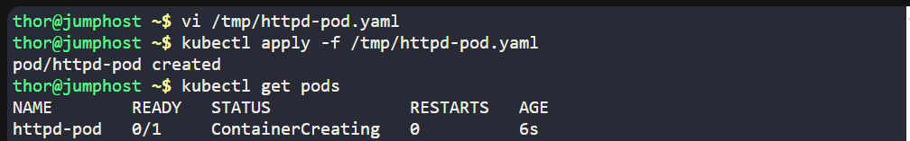
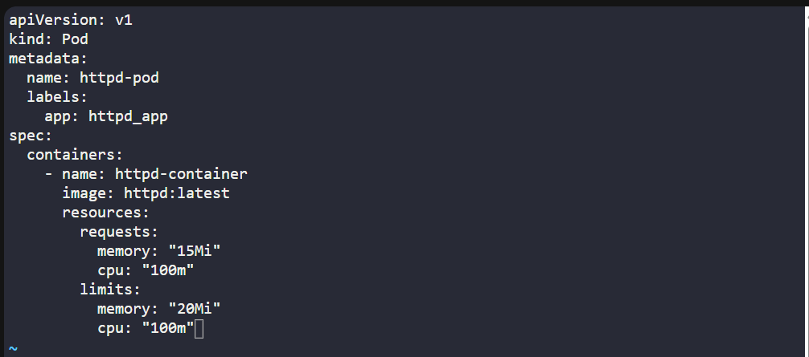
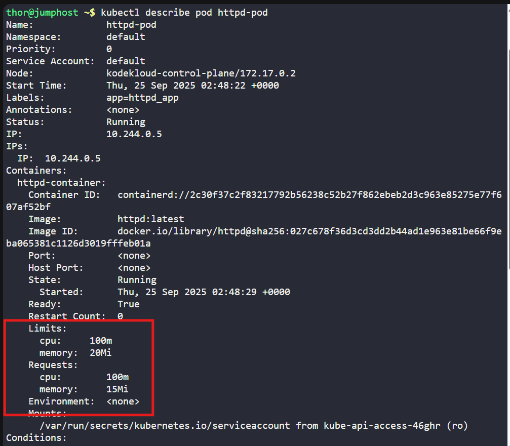

# ☸️ 100 Days of DevOps – Day 50
## ✅ Task: Set Resource Limits in Kubernetes Pods

```text
The Nautilus DevOps team has noticed performance issues in some Kubernetes-hosted applications due to resource constraints.
To address this, they plan to set limits on resource utilization. Here are the details:

Create a pod named httpd-pod with a container named httpd-container. Use the httpd image with the latest tag (specify as httpd:latest).
Set the following resource limits:

- Requests: Memory: 15Mi, CPU: 100m
- Limits: Memory: 20Mi, CPU: 100m

Note: The kubectl utility on jump_host is configured to operate with the Kubernetes cluster
```

---

Task
- Write a Pod manifest file (YAML).
- Apply it using kubectl.
- Verify pod creation and resource settings.

---

### 🔁 Step 1: Create YAML definition
On jump host, create file:
```bash
vi /tmp/httpd-pod.yaml
```

Paste the following:
```yaml
apiVersion: v1
kind: Pod
metadata:
  name: httpd-pod
  labels:
    app: httpd_app
spec:
  containers:
    - name: httpd-container
      image: httpd:latest
      resources:
        requests:
          memory: "15Mi"
          cpu: "100m"
        limits:
          memory: "20Mi"
          cpu: "100m"
```

Save & exit (:wq!)

---

### 🔁 Step 2: Apply Pod
```bash
kubectl apply -f /tmp/httpd-pod.yaml
```

---

### 🔁 Step 3: Verify Pod
Check pod status:
```bash
kubectl get pods
```

Describe pod to confirm resource settings:
```bash
kubectl describe pod httpd-pod
```

---





---

## 🗝️ Explanation of Key Commands – Kubernetes Pod with Resources

| Command                                | Description                                                               |
| -------------------------------------- | ------------------------------------------------------------------------- |
| `vi /tmp/httpd-pod.yaml`               | Opens a file to define the Pod manifest with resources.                   |
| `kubectl apply -f /tmp/httpd-pod.yaml` | Creates the Pod in the cluster according to the YAML definition.          |
| `kubectl get pods`                     | Lists Pods to confirm if `httpd-pod` is running.                          |
| `kubectl describe pod httpd-pod`       | Shows detailed configuration, including resource requests and limits set. |

---
✅ Task Completed
- Pod httpd-pod created.
- Container httpd-container uses httpd:latest.
- Resource requests and limits are properly enforced.
