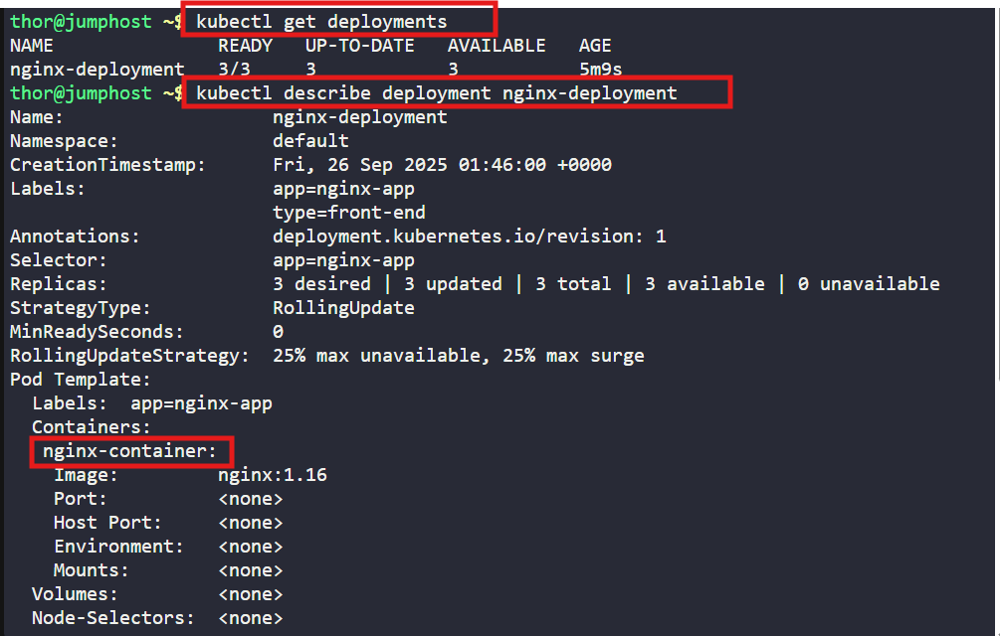
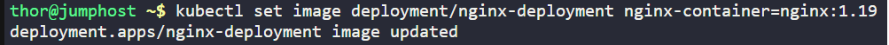
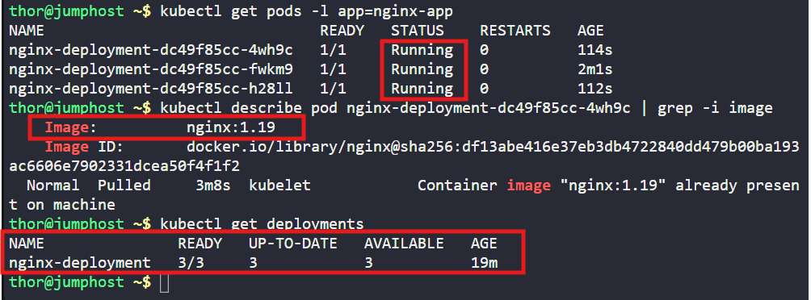

# ☸️ 100 Days of DevOps – Day 51
## ✅ Task: Execute Rolling Updates in Kubernetes

```text
An application currently running on the Kubernetes cluster employs the nginx web server.
The Nautilus application development team has introduced some recent changes that need deployment.
They've crafted an image nginx:1.19 with the latest updates.

Execute a rolling update for this application, integrating the nginx:1.19 image. The deployment is named nginx-deployment.

Ensure all pods are operational post-update.

Note: The kubectl utility on jump_host is set up to operate with the Kubernetes cluster
```

---

📝 Task List
- Check existing deployment and pods.
- Perform rolling update to nginx:1.19.
- Verify pods status and image version.

---

### 🔁 Step 1: Check Current Deployment

```bash
kubectl get deployments
```

output:
```nginx
NAME               READY   UP-TO-DATE   AVAILABLE   AGE
nginx-deployment   3/3     3            3           2m15s
```
> nginx is present

```bash
kubectl describe deployment nginx-deployment
```
> name of deployment is `nginx-container`
> app label = `nginx-app`

---

### 🔁 Step 2: Perform Rolling Update
Update the deployment image:
```bash
kubectl set image deployment/nginx-deployment nginx-container=nginx:1.19
```

- `deployment/nginx-deployment` → target deployment
- `nginx-container=nginx:1.19` → container name = new image



---

### 🔁 Step 3: Verify Rollout
Check rollout status:
```bash
kubectl rollout status deployment/nginx-deployment
```
> output: `deployment "nginx-deployment" successfully rolled out`



List pods:
```bash
kubectl get pods -l app=nginx-app
```
> All pods are running

Describe one pod to confirm image:
```bash
kubectl describe pod nginx-deployment-dc49f85cc-4wh9c | grep -i image
```
> Image = nginx:1.19

---

### 🔁 Step 4: Confirm All Pods Running
```bash
kubectl get deployments
```
> Output: All 3 pods are available



---

## 🗝️ Explanation of Key Commands – Kubernetes Rolling Update

| Command                                                                    | Description                                                                   |
| -------------------------------------------------------------------------- | ----------------------------------------------------------------------------- |
| `kubectl get deployments`                                                  | Lists all deployments, showing replicas, updated pods, and availability.      |
| `kubectl describe deployment nginx-deployment`                             | Provides detailed info about the deployment (containers, labels, strategies). |
| `kubectl set image deployment/nginx-deployment nginx-container=nginx:1.19` | Updates the container image inside the deployment to `nginx:1.19`.            |
| `kubectl rollout status deployment/nginx-deployment`                       | Tracks progress of the rolling update until it’s successfully completed.      |
| `kubectl get pods -l app=nginx-app`                                        | Shows all pods with label `app=nginx-app` (to confirm new pods are running).  |
| `kubectl describe pod <pod-name> \| grep -i image`                         | Confirms the exact image version running inside the pod (`nginx:1.19`).       |

---

✅ Task Completed
- Performed rolling update on nginx-deployment.
- All pods updated to use nginx:1.19.
- Verified pods are running and available.

