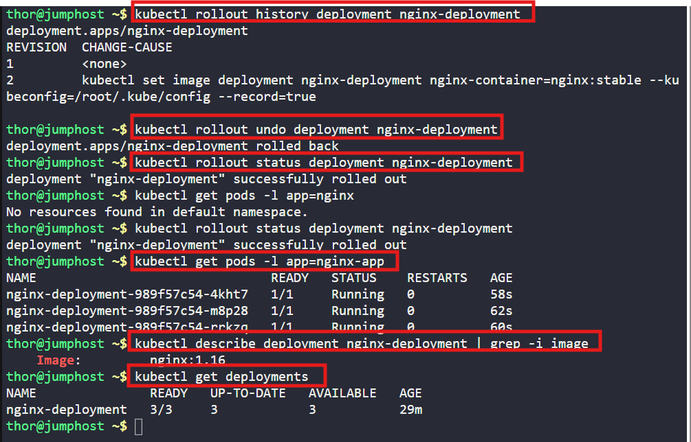

# ☸️ 100 Days of DevOps – Day 52
## ✅ Task: Rollback Kubernetes Deployment

```text
Earlier today, the Nautilus DevOps team deployed a new release for an application.
However, a customer has reported a bug related to this recent release.
Consequently, the team aims to revert to the previous version.

There exists a deployment named nginx-deployment; initiate a rollback to the previous revision.

Note: The kubectl utility on jump_host is configured to interact with the Kubernetes cluster.
```

---

📝 Task List
- Check current rollout history.
- Rollback deployment to previous revision.
- Verify pods and confirm rollback.

---

### 🔁 Step 1: Check Deployment History

```bash
kubectl rollout history deployment nginx-deployment
```

output:
```nginx
deployment.apps/nginx-deployment 
REVISION  CHANGE-CAUSE
1         <none>
2         kubectl set image deployment nginx-deployment nginx-container=nginx:stable --kubeconfig=/root/.kube/config --record=true
```

---

### 🔁 Step 2: Rollback to Previous Revision
```bash
kubectl rollout undo deployment nginx-deployment
```

If you want to rollback to a specific revision:
```bash
kubectl rollout undo deployment nginx-deployment --to-revision=1
```

---

### 🔁 Step 3: Verify Rollout
```bash
kubectl rollout status deployment nginx-deployment
kubectl get pods -l app=nginx
```

Check image version used by pods:
```bash
kubectl describe deployment nginx-deployment | grep -i image
```
> Compare the image version before rollback to now version

---

### 🔁 Step 4: Confirm
```bash
kubectl get deployments
```

---



---

## 🗝️ Key Commands – Rollback

| Command                                                      | Description                                          |
| ------------------------------------------------------------ | ---------------------------------------------------- |
| `kubectl rollout history deployment nginx-deployment`        | Shows history of revisions for the deployment.       |
| `kubectl rollout undo deployment nginx-deployment`           | Rolls back deployment to the previous revision.      |
| `kubectl rollout undo --to-revision=<n>`                     | Rolls back deployment to a specific revision.        |
| `kubectl rollout status deployment nginx-deployment`         | Monitors the rollback until completion.              |
| `kubectl describe deployment nginx-deployment \| grep image` | Confirms the container image version after rollback. |

---

## ✅ Task Completed
- Rolled back nginx-deployment to the previous version.
- Verified pods are running with the old stable image.
- Confirmed the application is reverted successfully.
