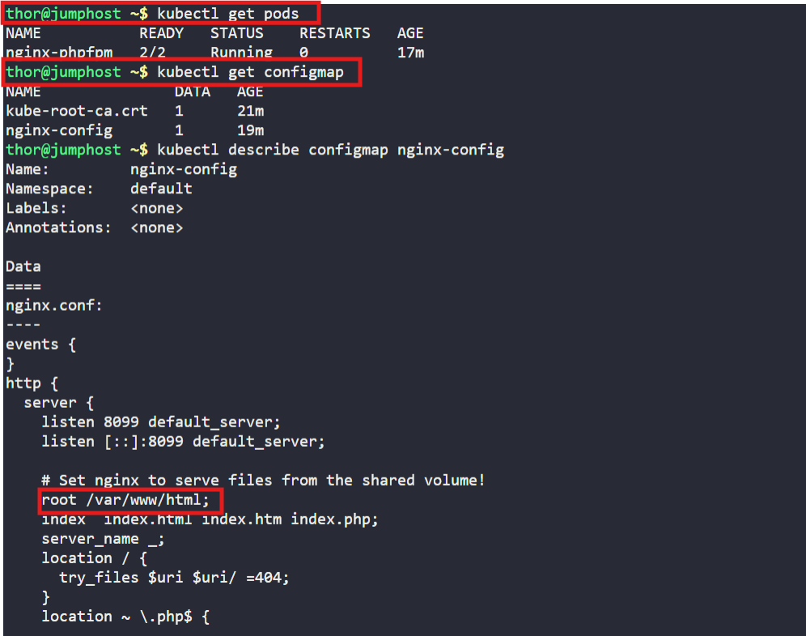
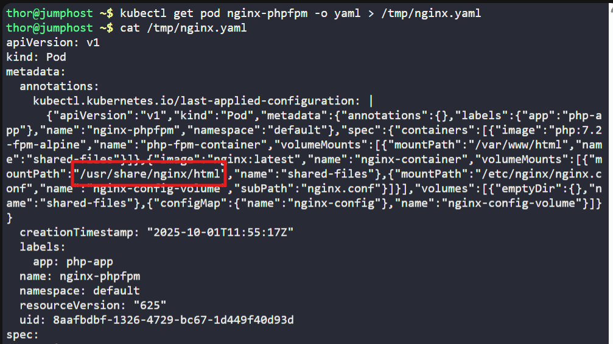
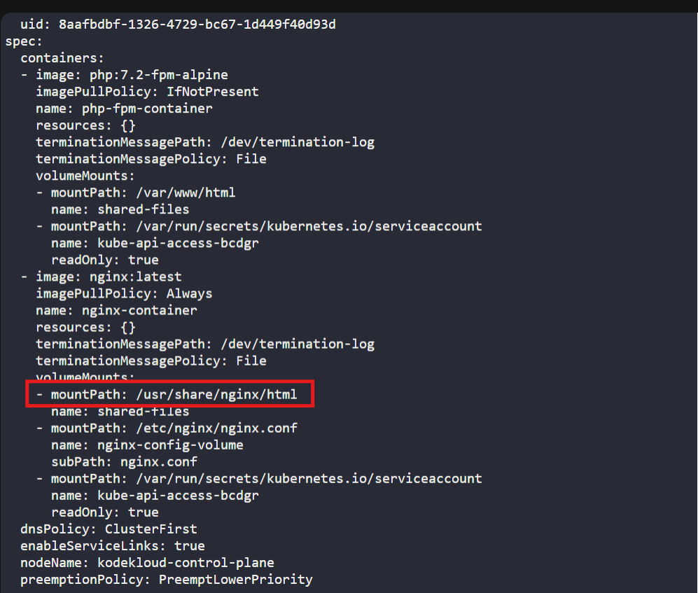
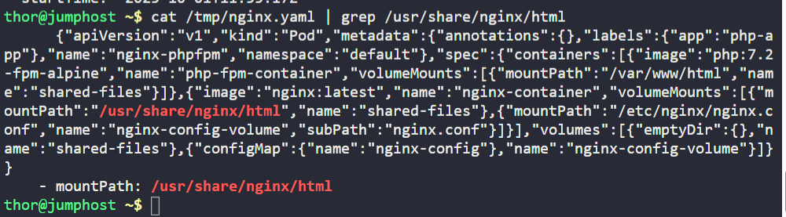
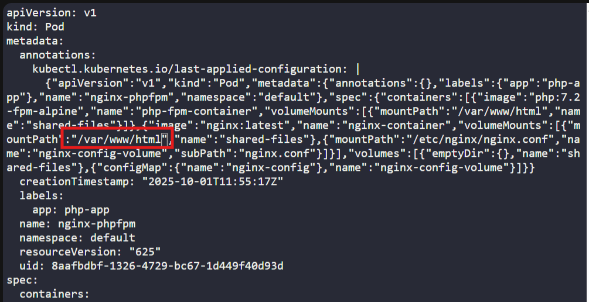
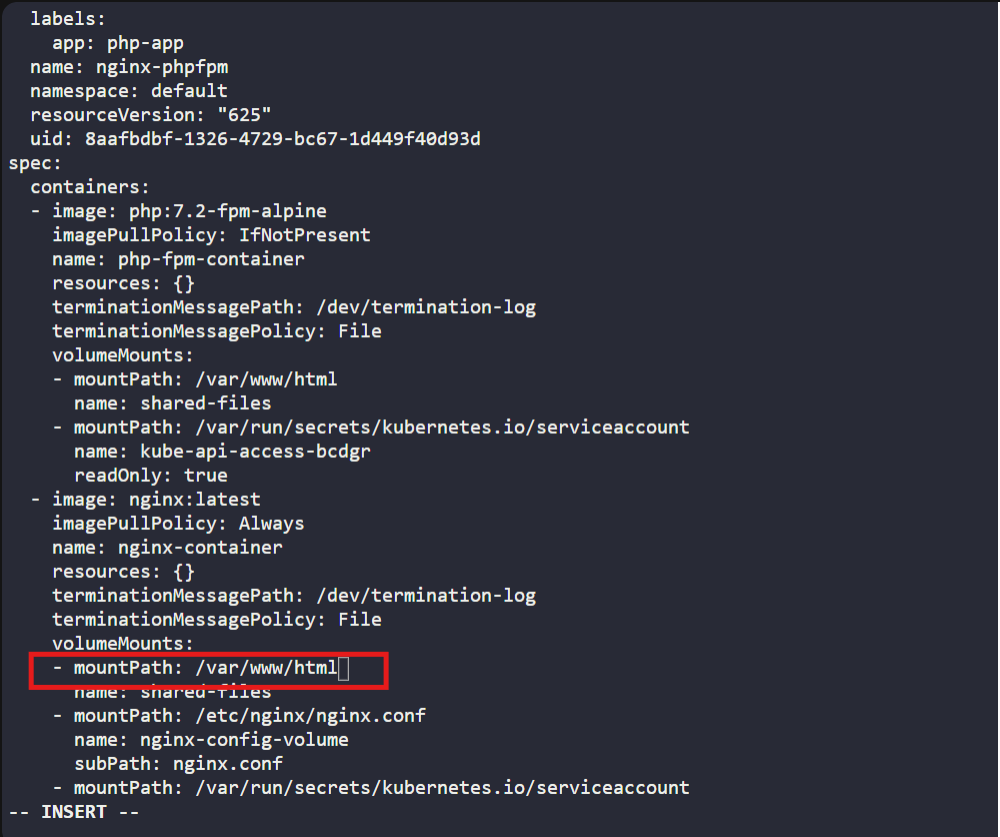
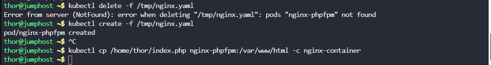
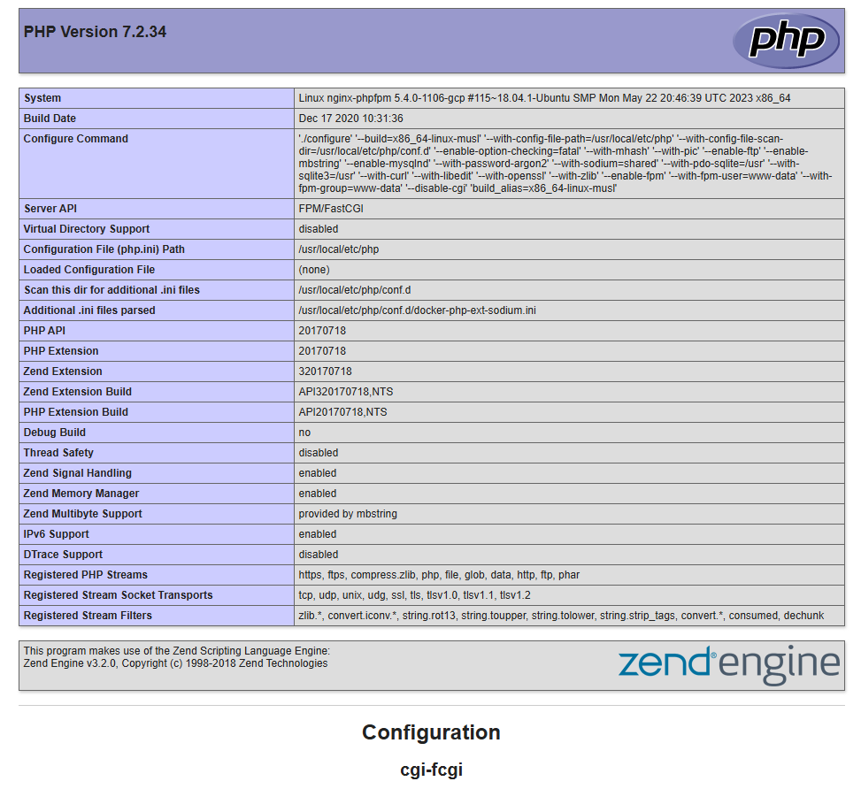

# ☸️ 100 Days of DevOps – Day 53
## ✅ Task: Resolve VolumeMounts Issue in Kubernetes

```text
We encountered an issue with our Nginx and PHP-FPM setup on the Kubernetes cluster this morning,
which halted its functionality. Investigate and rectify the issue:

The pod name is nginx-phpfpm and configmap name is nginx-config. Identify and fix the problem.

Once resolved, copy /home/thor/index.php file from the jump host to the nginx-container within the nginx document root.
After this, you should be able to access the website using Website button on the top bar.

Note: The kubectl utility on jump_host is configured to operate with the Kubernetes cluster.
```

---

📝 Task List

- Inspect the existing nginx-config ConfigMap.
- Fix configuration issues (wrong port/root path).
- Recreate the nginx-phpfpm pod to pick up changes.
- Copy the index.php file into the nginx container’s docroot.
- Verify access via the Website button.

---

### 🔁 Step 1: Check Running Pods

```bash
kubectl get pods
```
> `nginx-phpfpm` is running

---

### 🔁 Step 2: Inspect ConfigMap

check first if nginx-config is present
```bash
kubectl get configmap
```
> `nginx-config` is present

then inspect
```bash
kubectl describe configmap nginx-config
```
> We can see that there is a comment “Set nginx to serve files from the shared volume!” , so the configuration file indicates that the root directory is “/var/www/html”



---

### 🔁 Step 3: Check nginx-phpfpm definition into a YAML File

```bash
kubectl get pod nginx-phpfpm -o yaml > /tmp/nginx.yaml
```

then check the yml file
```bash
cat definition.yml
```
> the volume mount of the nginx-container is `/usr/share/nginx/html`, change that to `/var/www/html`. There are two `/usr/share/nginx/html` that need to be changed.





---

### 🔁 Step 4: Edit the nginx.yaml file

```bash
vi definition.yml
```




---

### 🔁 Step 5: Post changes in the running pod
delete first
```bash
kubectl delete -f /tmp/nginx.yaml
```

then create
```bash
kubectl create -f /tmp/nginx.yaml
```



---

### 🔁 Step 6: Copy the file “/home/thor/index.php” to the “nginx-container”

```bash
kubectl cp /home/thor/index.php nginx-phpfpm:/var/www/html -c nginx-container
```

---

### 🔁 Step 7: Check the Website using the Website Button



---

## 🗝️ Explanation of Key Commands – VolumeMounts Issue Fix
| Command                                                                         | Description                                                                    |
| ------------------------------------------------------------------------------- | ------------------------------------------------------------------------------ |
| `kubectl get pods`                                                              | Lists all pods in the current namespace to check if `nginx-phpfpm` is running. |
| `kubectl get configmap`                                                         | Lists available ConfigMaps to confirm `nginx-config` exists.                   |
| `kubectl describe configmap nginx-config`                                       | Shows details of `nginx-config` including the misconfigured Nginx root path.   |
| `kubectl get pod nginx-phpfpm -o yaml > /tmp/nginx.yaml`                        | Exports the pod manifest to YAML for inspection and editing.                   |
| `vi /tmp/nginx.yaml`                                                            | Opens the manifest so you can update the wrong volume mount path.              |
| `kubectl delete -f /tmp/nginx.yaml`                                             | Removes the old pod before applying the corrected YAML.                        |
| `kubectl create -f /tmp/nginx.yaml`                                             | Recreates the pod with fixed volume mount configuration.                       |
| `kubectl cp /home/thor/index.php nginx-phpfpm:/var/www/html -c nginx-container` | Copies `index.php` from the jump host into the correct Nginx document root.    |

---

## ✅ Task Completed
- Fixed ConfigMap for nginx-phpfpm.
- Recreated pod to load new config.
- Deployed index.php into nginx container.
- Website now works successfully.
