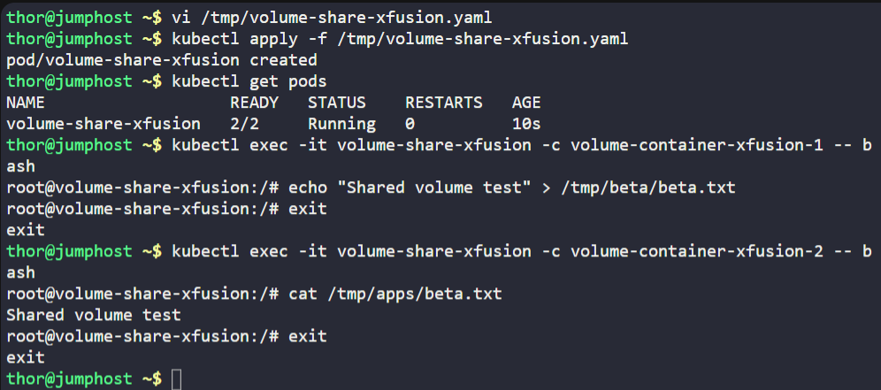
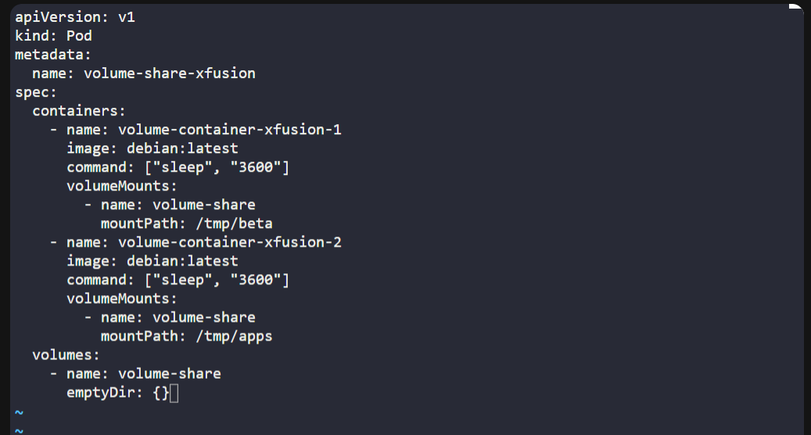

# ☸️ 100 Days of DevOps – Day 54
## ✅ Task: Kubernetes Shared Volumes

```text
We are working on an application that will be deployed on multiple containers within a pod on Kubernetes cluster.
There is a requirement to share a volume among the containers to save some temporary data.
The Nautilus DevOps team is developing a similar template to replicate the scenario. Below you can find more details about it.

1. Create a pod named volume-share-xfusion.

2. For the first container, use image debian with latest tag only and remember to mention the
tag i.e debian:latest, container should be named as volume-container-xfusion-1, and run a sleep
command for it so that it remains in running state. Volume volume-share should be mounted at path /tmp/beta.

3. For the second container, use image debian with the latest tag only and remember to mention the
tag i.e debian:latest, container should be named as volume-container-xfusion-2,
and again run a sleep command for it so that it remains in running state. Volume volume-share should be mounted at path /tmp/apps.

4. Volume name should be volume-share of type emptyDir.

5. After creating the pod, exec into the first container i.e volume-container-xfusion-1,
and just for testing create a file beta.txt with any content under the mounted path of first container i.e /tmp/beta.

6. The file beta.txt should be present under the mounted path /tmp/apps on the second container volume-container-xfusion-2 as well, since they are using a shared volume.

Note: The kubectl utility on jump_host has been configured to work with the kubernetes cluster.
```

---

📝 Tasks
- Create the Pod manifest
- Apply the manifest
- Test file creation in first container
- Verify file in second container
- Confirm shared volume works

---

### 🔁 Step 1: Create Pod YAML
On the jump host:
```bash
vi /tmp/volume-share-xfusion.yaml
```

Insert the following:
```yaml
apiVersion: v1
kind: Pod
metadata:
  name: volume-share-xfusion
spec:
  containers:
    - name: volume-container-xfusion-1
      image: debian:latest
      command: ["sleep", "3600"]
      volumeMounts:
        - name: volume-share
          mountPath: /tmp/beta
    - name: volume-container-xfusion-2
      image: debian:latest
      command: ["sleep", "3600"]
      volumeMounts:
        - name: volume-share
          mountPath: /tmp/apps
  volumes:
    - name: volume-share
      emptyDir: {}
```

Save & exit. (:wq!)

---

### 🔁 Step 2: Deploy Pod

Deploy the pod
```bash
kubectl apply -f /tmp/volume-share-xfusion.yaml
```

then verify if pod is running
```bash
kubectl get pods
```

output:
```nginx
NAME                   READY   STATUS    RESTARTS   AGE
volume-share-xfusion   2/2     Running   0          10s
```

---

### 🔁 Step 3: Create File in First Container
```bash
kubectl exec -it volume-share-xfusion -c volume-container-xfusion-1 -- bash
```

then
```bash
echo "Shared volume test" > /tmp/beta/beta.txt
```

and exit
```bash
exit
```

---

### 🔁 Step 4: Verify in Second Container
```bash
kubectl exec -it volume-share-xfusion -c volume-container-xfusion-2 -- bash
```

then
```bash
cat /tmp/apps/beta.txt
```
> output: `Shared volume test`. File created in container 1 is visible in container 2 via shared volume.

and exit
```bash
exit
```




---

---

## 🗝️ Key Commands – Shared Volumes
| Command                                                                       | Description                                                                                   |
| ----------------------------------------------------------------------------- | --------------------------------------------------------------------------------------------- |
| `vi /tmp/volume-share-xfusion.yaml`                                           | Opens a new file where you define the Pod manifest (two containers + volume).                 |
| `kubectl apply -f /tmp/volume-share-xfusion.yaml`                             | Creates the Pod in the cluster using the YAML definition.                                     |
| `kubectl get pods`                                                            | Lists all Pods and shows their status. Here we verify both containers are running (`2/2`).    |
| `kubectl exec -it volume-share-xfusion -c volume-container-xfusion-1 -- bash` | Opens an interactive shell inside the **first container** of the Pod.                         |
| `echo "Shared volume test" > /tmp/beta/beta.txt`                              | Creates a file named `beta.txt` with text inside the shared volume path `/tmp/beta`.          |
| `exit`                                                                        | Exits the container shell.                                                                    |
| `kubectl exec -it volume-share-xfusion -c volume-container-xfusion-2 -- bash` | Opens an interactive shell inside the **second container** of the Pod.                        |
| `cat /tmp/apps/beta.txt`                                                      | Displays the contents of the `beta.txt` file from the shared volume (mounted in `/tmp/apps`). |
| `exit`                                                                        | Exits the second container shell.                                                             |


---

## ✅ Task Completed
- Pod with two containers created.
- Shared emptyDir volume mounted at /tmp/beta and /tmp/apps.
- File successfully shared between containers.
