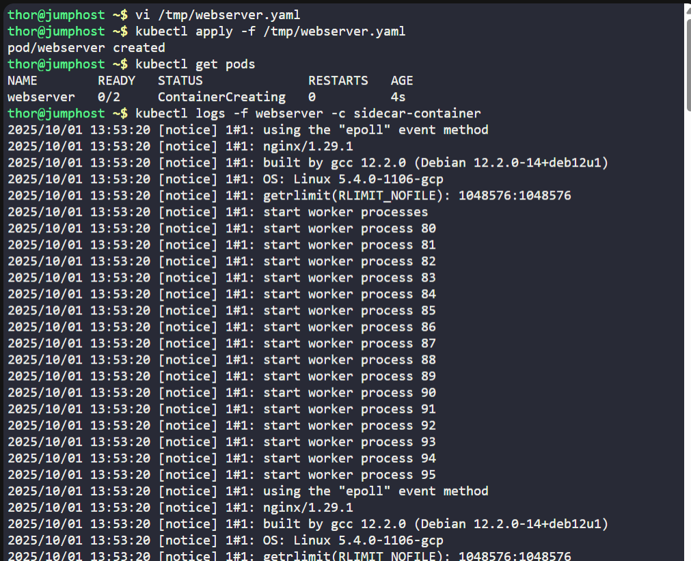
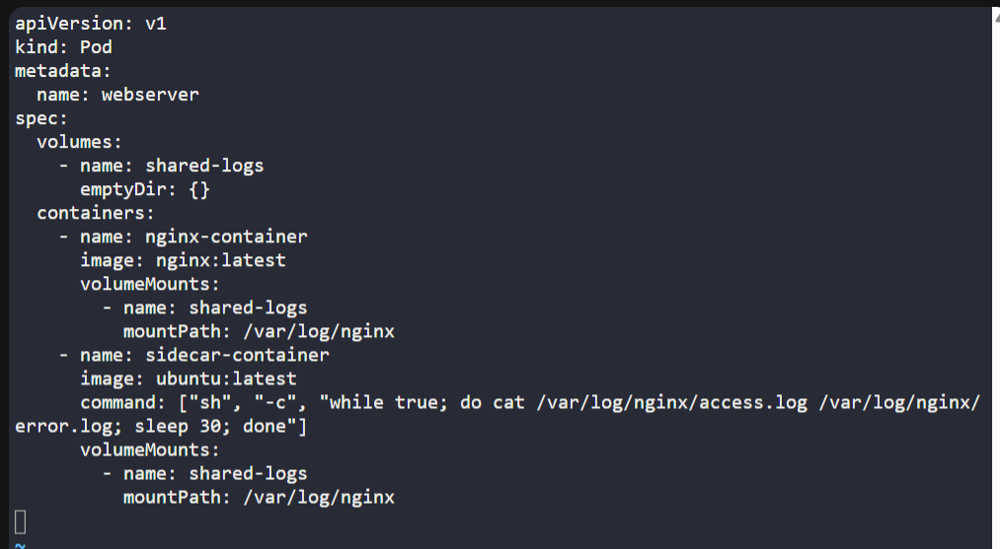

# ☸️ 100 Days of DevOps – Day 54
## ✅ Task: Kubernetes Sidecar Containers

```text
We have a web server container running the nginx image. The access and error logs generated by the web server are not critical enough to be
placed on a persistent volume. However, Nautilus developers need access to the last 24 hours of logs so that they can trace issues and bugs.
Therefore, we need to ship the access and error logs for the web server to a log-aggregation service.
Following the separation of concerns principle, we implement the Sidecar pattern by deploying a second container that ships the error and access logs from nginx.
Nginx does one thing, and it does it well—serving web pages. The second container also specializes in its task—shipping logs. Since containers are running on the same Pod,
we can use a shared emptyDir volume to read and write logs.

1. Create a pod named webserver.
2. Create an emptyDir volume shared-logs.
3. Create two containers from nginx and ubuntu images with latest tag only and remember to mention tag i.e nginx:latest,
nginx container name should be nginx-container and ubuntu container name should be sidecar-container on webserver pod.
4. Add command on sidecar-container "sh","-c","while true; do cat /var/log/nginx/access.log /var/log/nginx/error.log; sleep 30; done"
5. Mount the volume shared-logs on both containers at location /var/log/nginx, all containers should be up and running.

Note: The kubectl utility on jump_host has been configured to work with the kubernetes cluster.
```

---

📝 Task List

- Define a Pod with two containers: nginx-container and sidecar-container.
- Use nginx:latest and ubuntu:latest images.
- Mount a shared emptyDir volume at /var/log/nginx.
- Add a log-shipping command in the sidecar container.
- Verify pod creation and logs.

---

### 🔁 Step 1: Create Pod Manifest
```bash
vi /tmp/webserver.yaml
```

Insert the following:
```yaml
apiVersion: v1
kind: Pod
metadata:
  name: webserver
spec:
  volumes:
    - name: shared-logs
      emptyDir: {}
  containers:
    - name: nginx-container
      image: nginx:latest
      volumeMounts:
        - name: shared-logs
          mountPath: /var/log/nginx
    - name: sidecar-container
      image: ubuntu:latest
      command: ["sh", "-c", "while true; do cat /var/log/nginx/access.log /var/log/nginx/error.log; sleep 30; done"]
      volumeMounts:
        - name: shared-logs
          mountPath: /var/log/nginx
```

Save & exit. (:wq!)

---

### 🔁 Step 2: Deploy Pod
```bash
kubectl apply -f /tmp/webserver.yaml
```

Check pod status:
```bash
kubectl get pods
```

output:
```nginx
NAME        READY   STATUS              RESTARTS   AGE
webserver   0/2     ContainerCreating   0          4s
```

---

### 🔁 Step 3: Verify Logs

Check logs of sidecar container:
```bash
kubectl logs -f webserver -c sidecar-container
```
> access and error logs from nginx

---




---

## 🗝️ Key Commands – Sidecar Pattern

| Command                                          | Description                                           |
| ------------------------------------------------ | ----------------------------------------------------- |
| `kubectl apply -f /tmp/webserver.yaml`           | Creates the pod with two containers and shared volume |
| `kubectl get pods`                               | Verifies pod is running                               |
| `kubectl logs -f webserver -c sidecar-container` | Streams logs shipped from the sidecar container       |
| `emptyDir`                                       | Provides temporary shared storage within the pod      |

---

## ✅ Task Completed

- Pod webserver created with nginx and sidecar containers.
- Shared emptyDir volume mounted at /var/log/nginx.
- Sidecar continuously outputs nginx access and error logs.
